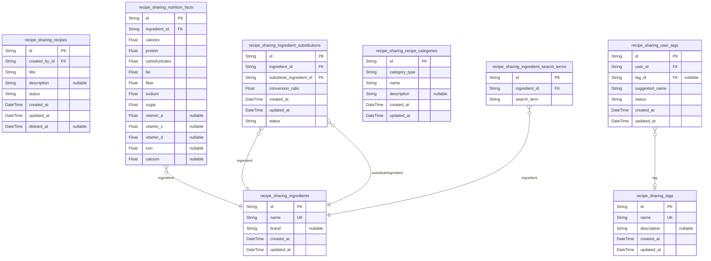
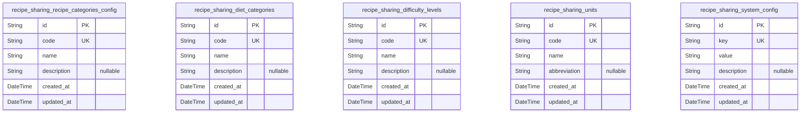

# Prisma Markdown

> Generated by [`prisma-markdown`](https://github.com/samchon/prisma-markdown)

- [Identity](#identity)
- [Recipes](#recipes)
- [Social](#social)
- [RatingsReviews](#ratingsreviews)
- [MealPlanningCollections](#mealplanningcollections)
- [ShoppingListsCostTracking](#shoppinglistscosttracking)
- [SystematicConfig](#systematicconfig)
- [Moderation](#moderation)

## Identity

### `recipe_sharing_regularusers`

Stores data for regular users of the recipe sharing platform. Includes
identity, authentication details, and timestamps. Used for login and
role-based access. No direct foreign keys. Supports soft deletion and
audit timestamps.

Properties as follows:

- `id`: Primary Key.
- `email`: User's unique email address used for login and communication.
- `password_hash`
  > Hashed password for user authentication. Stored securely, never plain
  > text.
- `username`: Unique username chosen by the user for platform identification.
- `created_at`: Timestamp when the user record was created.
- `updated_at`: Timestamp when the user record was last updated.
- `deleted_at`: Timestamp when the user account was soft deleted, if applicable.

### `recipe_sharing_premiumusers`

Stores data for premium users with enhanced access to advanced meal
planning and cost tracking features. Extends regular user data with
premium account flags and timestamps, supporting authentication and soft
deletion.

Properties as follows:

- `id`: Primary Key.
- `email`: Premium user's unique email address for login and communication.
- `password_hash`: Hashed password for authentication. Stored securely.
- `username`: Unique username for premium user identification.
- `premium_since`
  > Timestamp marking when the user became premium. Used to track
  > subscription duration.
- `created_at`: Timestamp when the premium user record was created.
- `updated_at`: Timestamp when the premium user record was last updated.
- `deleted_at`: Timestamp for soft deletion of premium user account.

### `recipe_sharing_moderators`

Stores moderator user data responsible for content moderation, flag
reviews, and category approvals. Identity and authentication details with
audit timestamps and soft delete support.

Properties as follows:

- `id`: Primary Key.
- `email`: Moderator's unique email address used for login.
- `password_hash`: Hashed password for authentication.
- `username`: Unique username for moderator identification.
- `created_at`: Record creation timestamp.
- `updated_at`: Timestamp for last update.
- `deleted_at`: Soft deletion timestamp if applicable.

## Recipes

### `recipe_sharing_recipes`

Stores user-created recipes including basic details, status, and
timestamps. Related to users through existing tables and linked to
categories and tags. Supports soft delete for recovery.

Properties as follows:

- `id`: Primary Key.
- `created_by_id`: Belonged user's [recipe_sharing_regularusers.id](#recipe_sharing_regularusers).
- `title`: Unique recipe title per user.
- `description`: Detailed description of the recipe.
- `status`: Current workflow status of the recipe (e.g., draft, published).
- `created_at`: Creation timestamp.
- `updated_at`: Last update timestamp.
- `deleted_at`: Timestamp for soft deletion.

### `recipe_sharing_ingredients`

Master list of ingredients used in recipes, including optional brand
information and timestamps for audit.

Properties as follows:

- `id`: Primary Key.
- `name`: Name of the ingredient.
- `brand`: Optional brand information for the ingredient.
- `created_at`: Creation timestamp.
- `updated_at`: Last update timestamp.

### `recipe_sharing_nutrition_facts`

Detailed nutritional information associated with ingredients or recipes.
Supports calories, macros, fiber, sodium, sugar, vitamins, and minerals.

Properties as follows:

- `id`: Primary Key.
- `ingredient_id`: Linked ingredient [recipe_sharing_ingredients.id](#recipe_sharing_ingredients).
- `calories`: Calories per serving or unit.
- `protein`: Protein content in grams.
- `carbohydrates`: Carbohydrates in grams.
- `fat`: Fat content in grams.
- `fiber`: Fiber content in grams.
- `sodium`: Sodium content in milligrams.
- `sugar`: Sugar content in grams.
- `vitamin_a`: Vitamin A content in micrograms.
- `vitamin_c`: Vitamin C content in milligrams.
- `vitamin_d`: Vitamin D content in micrograms.
- `iron`: Iron content in milligrams.
- `calcium`: Calcium content in milligrams.

### `recipe_sharing_ingredient_substitutions`

Supports ingredient substitutions with conversion ratios. Allows 3-5
substitutes per ingredient, tracks audit timestamps, and status for
moderation.

Properties as follows:

- `id`: Primary Key.
- `ingredient_id`: Original ingredient [recipe_sharing_ingredients.id](#recipe_sharing_ingredients).
- `substitute_ingredient_id`: Ingredient substitute [recipe_sharing_ingredients.id](#recipe_sharing_ingredients).
- `conversion_ratio`: Conversion ratio from original to substitute ingredient.
- `created_at`: Creation timestamp.
- `updated_at`: Last update timestamp.
- `status`: Moderation status of substitution (e.g., pending, approved, rejected).

### `recipe_sharing_recipe_categories`

Predefined recipe categories such as cuisine, diet, and difficulty
levels. Managed for tagging recipes appropriately.

Properties as follows:

- `id`: Primary Key.
- `category_type`: Type of category (e.g., cuisine, diet, difficulty).
- `name`: Category name.
- `description`: Detailed description of the category.
- `created_at`: Creation timestamp.
- `updated_at`: Last update timestamp.

### `recipe_sharing_tags`

Master tag list used for categorizing or labeling recipes. Tags may be
user or system generated.

Properties as follows:

- `id`: Primary Key.
- `name`: Tag name for labeling recipes.
- `description`: Optional description of the tag.
- `created_at`: Creation timestamp.
- `updated_at`: Last update timestamp.

### `recipe_sharing_user_tags`

User suggested tags pending moderator approval for public use. Supports
audit information and moderation status.

Properties as follows:

- `id`: Primary Key.
- `user_id`: Submitting user [recipe_sharing_regularusers.id](#recipe_sharing_regularusers).
- `tag_id`: Referenced approved tag [recipe_sharing_tags.id](#recipe_sharing_tags).
- `suggested_name`: Suggested tag name by user.
- `status`: Moderation status (pending, approved, rejected).
- `created_at`: Record creation timestamp.
- `updated_at`: Record last update timestamp.

### `recipe_sharing_ingredient_search_terms`

Search terms for ingredients to facilitate ingredient-based search and
partial matching.

Properties as follows:

- `id`: Primary Key.
- `ingredient_id`: Linked ingredient [recipe_sharing_ingredients.id](#recipe_sharing_ingredients).
- `search_term`
  > Search term variant for the ingredient to support partial and fuzzy
  > matching.

## Social

### `recipe_sharing_user_followers`

Table representing user following relationships in the Recipe Sharing
platform social domain. Each record denotes a follower-followee
connection between two users. This model references existing user tables
for follower and followee identities. Supports soft delete and auditing
with timestamps.

Properties as follows:

- `id`: Primary Key.
- `follower_user_id`
  > ID of the user who is the follower. References
  > recipe_sharing_regularusers.id or recipe_sharing_premiumusers.id or
  > recipe_sharing_moderators.id.
- `followee_user_id`
  > ID of the user being followed. References recipe_sharing_regularusers.id
  > or recipe_sharing_premiumusers.id or recipe_sharing_moderators.id.
- `created_at`: Timestamp when the following relationship was created.
- `updated_at`: Timestamp when the following relationship was last updated.
- `deleted_at`: Timestamp indicating soft deletion of the following relationship.

### `recipe_sharing_personalized_feeds`

Stores personalized feed entries for users in the Recipe Sharing
platform. This table contains references to the user, recipe, and
originator of the recipe (usually the recipe creator), enabling dynamic
feed content delivery. Timestamps support feed generation and
maintenance.

Properties as follows:

- `id`: Primary Key.
- `user_id`
  > ID of the user owning the personalized feed entry. References
  > recipe_sharing_regularusers.id or recipe_sharing_premiumusers.id.
- `recipe_id`
  > ID of the recipe shown in the personalized feed. References
  > recipe_sharing_recipes.id.
- `originator_user_id`
  > ID of the user who created the recipe shown in the feed. References
  > recipe_sharing_regularusers.id or recipe_sharing_premiumusers.id.
- `created_at`: Timestamp when the feed entry was created.
- `updated_at`: Timestamp when the feed entry was last updated.

## RatingsReviews

### `recipe_sharing_ratings`

Stores user ratings for recipes. Each rating is uniquely identified by
user and recipe combination to prevent duplicate ratings. Ratings use a
5-star scale. Tracks creation and update timestamps.

Properties as follows:

- `id`: Primary Key.
- `recipe_sharing_user_id`
  > Belonged user's recipe_sharing_regularusers.id or
  > recipe_sharing_premiumusers.id
- `recipe_sharing_recipe_id`: Belonged recipe's recipe_sharing_recipes.id
- `rating`: Star rating from 1 to 5.
- `created_at`: Timestamp when the rating was created.
- `updated_at`: Timestamp when the rating was last updated.

### `recipe_sharing_reviews`

Captures detailed text reviews submitted by users for recipes. Review
text supports up to 2000 characters. Allows edits and soft deletes.
Linked to the authoring user and the reviewed recipe.

Properties as follows:

- `id`: Primary Key.
- `recipe_sharing_user_id`: Authoring user, can be regular or premium recipe_sharing_regularusers.id
- `recipe_sharing_recipe_id`: Reviewed recipe's recipe_sharing_recipes.id
- `review_text`: Detailed review text up to 2000 characters.
- `created_at`: Timestamp when the review was created.
- `updated_at`: Timestamp when the review was last updated.
- `deleted_at`: Soft delete timestamp for reviews removed by users or moderators.

### `recipe_sharing_review_votes`

Submissions of helpfulness votes on reviews by users. Each user can vote
once per review and can change their vote. Votes are binary: helpful or
not helpful.

Properties as follows:

- `id`: Primary Key.
- `recipe_sharing_user_id`: Voting user from recipe_sharing_regularusers.id
- `recipe_sharing_review_id`: Targeted review recipe_sharing_reviews.id
- `helpful`: Whether the vote marks the review as helpful or not.
- `created_at`: Timestamp when the vote was created.
- `updated_at`: Timestamp when the vote was last updated.

### `recipe_sharing_review_flags`

Flags raised by users on reviews for inappropriate content. Each flag
records the user who flagged, the review flagged, the reason, and
timestamp. Facilitates moderation queues.

Properties as follows:

- `id`: Primary Key.
- `recipe_sharing_user_id`: User who flagged the review recipe_sharing_regularusers.id
- `recipe_sharing_review_id`: Flagged review recipe_sharing_reviews.id
- `reason`: Reason selected by the user for flagging (e.g., spam, offensive language).
- `created_at`: Timestamp when the flag was created.

### `recipe_sharing_moderation_logs`

Audit trail logging all moderation actions taken on flagged reviews,
including hides, unhides, moderator identity, timestamp, and comments.
Essential for compliance and transparency.

Properties as follows:

- `id`: Primary Key.
- `recipe_sharing_review_id`: Reviewed flagged content recipe_sharing_reviews.id
- `recipe_sharing_moderator_id`: Moderator who performed action recipe_sharing_moderators.id
- `action`: Moderation action taken (e.g., hide, unhide).
- `comment`: Optional comment explaining the moderation decision.
- `created_at`: Timestamp when moderation action was logged.

## MealPlanningCollections

### `recipe_sharing_collections`

User-created collections to organize and categorize recipes. Collections
belong to a user (owner_user_id), support soft deletion, and temporal
auditing fields.

Properties as follows:

- `id`: Primary Key.
- `owner_user_id`
  > Owning user ID referencing recipe_sharing_regularusers.id or
  > recipe_sharing_premiumusers.id.
- `name`: Name of the collection for display and organization.
- `description`: Optional textual description of the collection.
- `created_at`: Record creation timestamp.
- `updated_at`: Record last update timestamp.
- `deleted_at`: Soft deletion timestamp; null if active.

### `recipe_sharing_meal_plans`

User-managed meal plans scheduling recipes to dates and meals. Owned by
users, supporting soft deletion, temporal fields, and optional
description.

Properties as follows:

- `id`: Primary Key.
- `owner_user_id`
  > Owning user ID referencing recipe_sharing_regularusers.id or
  > recipe_sharing_premiumusers.id.
- `name`: Name of the meal plan for identification.
- `description`: Optional description of the meal plan.
- `created_at`: Creation timestamp.
- `updated_at`: Last update timestamp.
- `deleted_at`: Soft delete timestamp; null if active.

### `recipe_sharing_meal_plan_entries`

Entries of specific recipes assigned to meal plans at particular dates
and meal slots. Entries belong to one meal plan and recipe. Supports
quantity and soft deletion with timestamps.

Properties as follows:

- `id`: Primary Key.
- `meal_plan_id`: References the associated meal plan. [recipe_sharing_meal_plans.id](#recipe_sharing_meal_plans)
- `recipe_id`: Assigned recipe reference. [recipe_sharing_recipes.id](#recipe_sharing_recipes)
- `quantity`: Number of servings or repetitions for this entry.
- `planned_date`: The date this recipe is planned for.
- `meal_slot`: Designation of meal slot (e.g., breakfast, lunch, dinner).
- `created_at`: Entry creation timestamp.
- `updated_at`: Last update timestamp.
- `deleted_at`: Soft delete timestamp, null if active.

### `recipe_sharing_recurring_meal_plans`

Configurations for recurring meal plans allowing repeated scheduling.
Owned by users with recurrence pattern and active periods. Supports soft
delete and temporal auditing.

Properties as follows:

- `id`: Primary Key.
- `owner_user_id`
  > Owning user ID referencing recipe_sharing_regularusers.id or
  > recipe_sharing_premiumusers.id.
- `name`: Name of the recurring meal plan.
- `description`: Optional textual description.
- `recurrence_pattern`: Recurrence schedule pattern such as 'weekly', 'biweekly', or 'monthly'.
- `start_date`: Start date of the recurrence.
- `end_date`: End date of the recurrence; null if ongoing indefinitely.
- `created_at`: Timestamp when record was created.
- `updated_at`: Timestamp last updated.
- `deleted_at`: Soft delete timestamp; null if active.

## ShoppingListsCostTracking

### `recipe_sharing_shopping_lists`

Shopping lists created by users for meal planning and grocery shopping,
linking to the owning user and containing multiple items. Supports soft
deletion and audit timestamps for lifecycle management.

Properties as follows:

- `id`: Primary Key.
- `user_id`
  > Owning user who created the shopping list. {@link
  > recipe_sharing_regularusers.id}
- `name`: User-defined name of the shopping list.
- `created_at`: Timestamp when the shopping list was created.
- `updated_at`: Timestamp of last update to the shopping list.
- `deleted_at`: Soft delete timestamp; null if active.

### `recipe_sharing_shopping_list_items`

Items included in a shopping list, typically representing ingredients and
quantities needed. Managed as subsidiary to shopping lists for CRUD
consistency.

Properties as follows:

- `id`: Primary Key.
- `shopping_list_id`: Parent shopping list. [recipe_sharing_shopping_lists.id](#recipe_sharing_shopping_lists)
- `ingredient_id`: Referenced ingredient. [recipe_sharing_ingredients.id](#recipe_sharing_ingredients)
- `quantity`: Quantity of the ingredient to purchase.
- `unit`: Unit of measure for the quantity, e.g., grams, cups.
- `notes`: Optional notes such as brand preference or substitution hints.
- `created_at`: Timestamp when the item was added to the shopping list.
- `updated_at`: Timestamp when the item was last updated.

### `recipe_sharing_grocery_stores`

Grocery stores where ingredient prices and availability are tracked.
Maintains store contact and web information for integration.

Properties as follows:

- `id`: Primary Key.
- `name`: Store name.
- `address`: Physical address of the grocery store.
- `phone`: Contact phone number for the store.
- `website_url`: Store website URL.
- `created_at`: Record creation timestamp.
- `updated_at`: Record last update timestamp.

### `recipe_sharing_store_ingredient_prices`

Price and availability information of ingredients at specific grocery
stores. Supports audit timestamps for tracking updates.

Properties as follows:

- `id`: Primary Key.
- `grocery_store_id`: Referenced grocery store. [recipe_sharing_grocery_stores.id](#recipe_sharing_grocery_stores)
- `ingredient_id`: Referenced ingredient. [recipe_sharing_ingredients.id](#recipe_sharing_ingredients)
- `price`: Price of ingredient at the store in local currency.
- `available`: Availability status of the ingredient at the store.
- `last_updated`: Timestamp of last price and availability update.
- `created_at`: Record creation timestamp.
- `updated_at`: Record last update timestamp.

### `recipe_sharing_price_update_logs`

Historical logs of ingredient price changes at grocery stores for audit
and trend analysis. Append-only with timestamped entries.

Properties as follows:

- `id`: Primary Key.
- `store_ingredient_price_id`: Referenced price record. [recipe_sharing_store_ingredient_prices.id](#recipe_sharing_store_ingredient_prices)
- `price_before`: Previous price before update.
- `price_after`: New price after update.
- `updated_at`: Timestamp of price update.

## SystematicConfig

### `recipe_sharing_recipe_categories_config`

Represents predefined recipe category configurations used for tagging and
classification in the recipe sharing platform. Enables structured
cuisine-type categorization such as Italian, Mexican, Asian, and supports
hierarchical grouping for easy management and user selection.

Properties as follows:

- `id`: Primary Key.
- `code`: Unique code identifier for the recipe category.
- `name`: Human-readable name of the recipe category.
- `description`: Optional detailed description of the recipe category.
- `created_at`: Record creation timestamp.
- `updated_at`: Record last update timestamp.

### `recipe_sharing_diet_categories`

Defines dietary preference categories such as vegan, keto, gluten-free,
and paleo. This table supports classification of recipes and user dietary
preferences for filtering and substitution prioritization.

Properties as follows:

- `id`: Primary Key.
- `code`: Unique code for the diet category.
- `name`: Name of the diet category.
- `description`: Optional description providing details about the diet category.
- `created_at`: Record creation timestamp.
- `updated_at`: Record last update timestamp.

### `recipe_sharing_difficulty_levels`

Lists levels of difficulty for recipes to classify user effort and skill
required, ranging from beginner to advanced. Used for filtering and
guidance in meal planning and recipe selection.

Properties as follows:

- `id`: Primary Key.
- `code`: Unique difficulty level code.
- `name`: Name describing the difficulty level.
- `description`: Optional detailed description of the difficulty level.
- `created_at`: Creation timestamp for the difficulty level record.
- `updated_at`: Last updated timestamp for the difficulty level record.

### `recipe_sharing_units`

Stores units of measure applicable to ingredients such as cups, grams,
tablespoons, including standardized abbreviations for display
consistency.

Properties as follows:

- `id`: Primary Key.
- `code`: Unique unit code, e.g., 'cups' or 'g'.
- `name`: Full descriptive name of the unit.
- `abbreviation`: Optional abbreviated symbol for the unit.
- `created_at`: Timestamp for when the unit record was created.
- `updated_at`: Timestamp for last update of the unit record.

### `recipe_sharing_system_config`

Contains global system-wide configuration data for the recipe sharing
platform, including key-value pairs for configurable settings and
application flags.

Properties as follows:

- `id`: Primary Key.
- `key`: Unique configuration key identifier.
- `value`: Associated value for the configuration key.
- `description`: Optional explanation or notes about the configuration setting.
- `created_at`: Timestamp of when the configuration entry was created.
- `updated_at`: Timestamp of the last update to the configuration entry.

## Moderation

### `recipe_sharing_flag_queues`

Queue for flags on recipe reviews submitted by users for moderation
processing. Supports workflow status tracking, reporter identification,
and reason for flagging. Enables moderators to triage and respond to user
reports of inappropriate content.

Properties as follows:

- `id`: Primary Key.
- `recipe_sharing_review_id`: The flagged review's identifier. [recipe_sharing_reviews.id](#recipe_sharing_reviews)
- `reported_by_user_id`
  > Identifier of the user who reported the content. {@link
  > recipe_sharing_regularusers.id} or [recipe_sharing_premiumusers.id](#recipe_sharing_premiumusers)
- `flag_reason`: Reason for flagging such as spam, offensive language, or personal attacks.
- `status`: Current review flag status: pending, in_review, resolved, or dismissed.
- `created_at`: Flag creation timestamp.
- `updated_at`: Timestamp when the flag record was last updated.
- `deleted_at`: Soft deletion timestamp if the flag entry is removed.

### `recipe_sharing_moderator_actions`

Audit records of moderator operations on flagged content and category
approvals. Each action records moderator identity, action type, target
entity, timestamp, and optional comments to maintain accountability and
history.

Properties as follows:

- `id`: Primary Key.
- `moderator_id`
  > Identifier of moderator performing the action. {@link
  > recipe_sharing_moderators.id}
- `action_type`
  > The moderation action type such as hide_review, unhide_review,
  > approve_category, reject_category.
- `target_id`
  > ID of the entity affected by the moderator action (review, category
  > approval, etc.).
- `action_timestamp`: Timestamp when the moderation action was performed.
- `comments`: Optional moderator comments on the action taken.
- `created_at`: Record creation timestamp.
- `updated_at`: Record update timestamp.
- `deleted_at`: Soft deletion time if the record is removed.

### `recipe_sharing_category_approvals`

Tracks user-submitted categories or tags pending moderator approval.
Includes submitting user reference, category name, approval status,
timestamps for submission and review, and auditing fields.

Properties as follows:

- `id`: Primary Key.
- `submitted_by_user_id`
  > The user who submitted the category or tag. {@link
  > recipe_sharing_regularusers.id} or [recipe_sharing_premiumusers.id](#recipe_sharing_premiumusers)
- `category_name`: Name of the category or tag submitted by the user for approval.
- `approval_status`: Approval status of the submitted category: pending, approved, rejected.
- `submitted_at`: Timestamp when the submission was created.
- `reviewed_at`: Timestamp when the category submission was reviewed by a moderator.
- `created_at`: Record creation time.
- `updated_at`: Record update time.
- `deleted_at`: Soft deletion time if record was removed.
