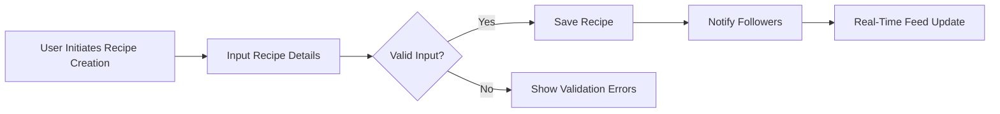

# Recipe Sharing Backend - Requirements Specification

## 1. Introduction and Business Model

### Why This Service Exists
The recipe sharing backend addresses a growing market need for a dynamic and personalized cooking platform. Many existing services offer static recipes without adaptations for dietary restrictions, ingredient substitutions, or budget considerations. Users demand a community-driven platform that supports creating, sharing, and modifying recipes with nutritional awareness and cost optimization.

### Revenue Strategy
The primary revenue model is a freemium subscription. Regular users access core recipe sharing and social features, while premium users unlock advanced meal planning, ingredient cost tracking, and personalized recommendations.

### Growth Plan
Growth relies on social engagement through following users, rating and reviewing recipes, and personalized feeds driving retention. Expanding grocery store integrations and enhancing substitution logic will attract and retain users.

### Success Metrics
- Monthly Active Users (MAU)
- Subscription conversion rate
- Number of recipes created
- Accuracy and usage of ingredient substitution
- Engagement in ratings and reviews

## 2. User Roles and Authentication

### Roles Description
- Regular Users: Create, edit, share recipes; rate, review recipes; follow others; manage collections and meal plans.
- Premium Users: Regular user capabilities plus advanced meal planning, cost tracking.
- Moderators: Manage flagged content, review moderation, approve user-suggested categories.

### Authentication Flow
- User registration with email/password.
- Email verification mandatory before full access.
- Secure login/logout.
- Password reset and change.
- Session management with JWT tokens; access tokens expire in 15 minutes; refresh tokens last 14 days.

### Permission Matrix
| Action | Regular User | Premium User | Moderator |
|----------------------------|--------------|--------------|-----------|
| Create and share recipes | ✅ | ✅ | ❌ |
| Rate and review recipes | ✅ | ✅ | ✅ (moderate) |
| Follow other users | ✅ | ✅ | ❌ |
| Manage collections and meal plans | ✅ | ✅ | ❌ |
| Advanced meal planning and cost tracking | ❌ | ✅ | ❌ |
| Moderate flagged content | ❌ | ❌ | ✅ |
| Approve user-generated categories | ❌ | ❌ | ✅ |

## 3. Recipe Management

### Recipe Creation
WHEN a user creates a recipe, THE system SHALL accept title, description, ingredients with quantities and units, steps, nutritional info.
Ingredients SHALL include optional brand info to enhance cost tracking.

WHEN a recipe is saved, THE system SHALL validate all required fields, uniqueness of recipe name per user, and positive numeric ingredient quantities.

### Editing and Deletion
Users can update or delete only their own recipes.

## 4. Tagging and Categories

THE system SHALL provide predefined categories for cuisine, diet, and difficulty.
Users MAY suggest new categories, which require moderator approval before becoming public.

## 5. Rating and Reviews

THE system SHALL provide a 5-star rating scale and detailed text reviews.
Users SHALL be able to vote on review helpfulness and flag reviews.
Moderators SHALL review flags, hide inappropriate reviews, and maintain audit logs.

## 6. Social Features: Following and Feed

Users SHALL follow/unfollow others to receive personalized feeds.
THE feed SHALL contain 60% recent recipes from followed users, 25% trending in preferred categories, and 15% recommendations based on interactions.
Feed updates SHALL propagate in real-time.

## 7. Ingredient Search

Users SHALL search by entering available ingredients.
THE search SHALL return recipes containing any of the ingredients with partial matching.
Results SHALL be ranked by percent of matched ingredients.

## 8. Personal Collections and Meal Planning

Users SHALL create personal named collections and meal plans.
Meal plans SHALL associate recipes to calendar dates and meal slots via drag-and-drop.
Recurring meal plans SHALL be supported.
Weekly shopping lists SHALL be generated.

## 9. Ingredient Substitutions and Nutritional Adjustments

THE system SHALL store 3-5 substitutes per ingredient with conversion ratios.
WHEN substitutions are applied, nutritional info SHALL be recalculated automatically.
Substitutions SHALL be prioritized based on user dietary preferences.

## 10. Shopping Lists and Cost Tracking

Shopping lists SHALL consolidate ingredient quantities.
Ingredient costs SHALL be tracked from three major grocery chains with weekly price updates.
Availability SHALL be checked via mock store APIs.
Cost optimization SHALL suggest alternative brands or stores.

## 11. Error Handling and Performance

IF missing required fields, THEN THE system SHALL return detailed error messages.
IF unauthorized, THEN access shall be denied with clear messages.
Searches SHALL respond within 2 seconds.
Feed updates SHALL occur within 5 seconds.
Moderation SHALL maintain audit logs.

## 12. Mermaid Diagrams

### Recipe Creation Workflow

### Ingredient Substitution Logic

---

This document provides business requirements only.
All technical implementation decisions including architecture, APIs, and database design are left to the development team.
Developers have full autonomy over how to build the system fulfilling these requirements.