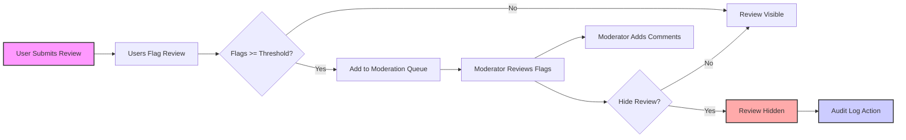

# Rating and Review Functional Requirements for Recipe Sharing Backend

## 1. Introduction
This document specifies the business and functional requirements for the rating and review features of the recipe sharing backend platform. It covers submission, editing, moderation, helpfulness voting, and reporting flagged content. The aim is to enable backend developers to build a robust, auditable, efficient rating and review system tailored to the roles and workflows of the platform.

**Note:** This document focuses exclusively on business requirements and behavior, omitting implementation specifics such as APIs or database design.

## 2. Rating System

### 2.1 Rating Scale and Calculation
- THE system SHALL use a 5-star rating scale, allowing users to rate recipes from 1 to 5 stars.
- WHEN a user submits or updates a rating for a recipe, THE system SHALL recalculate the average rating and total number of ratings for that recipe immediately.
- WHEN calculating average ratings, THE system SHALL round values to one decimal place.
- IF a user deletes their rating, THEN THE system SHALL adjust the average rating accordingly.

### 2.2 Rating Submission and Update
- WHEN an authenticated Regular User or Premium User submits a rating, THE system SHALL accept one rating per user per recipe.
- WHEN a user updates their rating, THEN THE system SHALL overwrite the previous rating for that recipe by the user.
- IF a user attempts to rate the same recipe multiple times without updating, THEN THE system SHALL reject subsequent rating attempts with an appropriate error.

## 3. Review Submission

### 3.1 Review Content Specification
- THE system SHALL allow users to submit detailed text reviews accompanying their star rating.
- THE review text SHALL support up to 2000 characters.
- THE system SHALL store and associate each review with the corresponding user and recipe.

### 3.2 Input Validation Rules
- WHEN a user submits a review, THE system SHALL validate that the review text is not empty and does not exceed 2000 characters.
- IF validation fails, THEN THE system SHALL reject the submission and provide an informative error message.

### 3.3 Review Editing and Deletion
- WHILE a review is active and not moderated, THE system SHALL allow users to edit or delete their own reviews within 24 hours of submission.
- AFTER 24 hours, users SHALL be prevented from editing or deleting their reviews.
- WHEN a review is deleted by the user, THEN THE system SHALL mark the review as deleted, removing it from public display but retaining it in the audit logs.

## 4. Review Moderation

### 4.1 Flags and Reporting
- THE system SHALL allow Regular and Premium Users to flag reviews as inappropriate.
- THE system SHALL record each flag with the user who flagged it, timestamp, and reason.

### 4.2 Moderator Review Workflow
- WHEN a review accumulates flags exceeding a threshold (default 3 flags), THE system SHALL notify Moderators for review.
- Moderators SHALL have a queue of flagged reviews pending action.
- Moderators SHALL be able to review flags, read the review content, and make decisions.

### 4.3 Hiding and Unhiding Reviews
- WHEN a Moderator decides a review is inappropriate, THEN THE system SHALL hide the review from public view.
- Moderators SHALL be able to unhide reviews if a mistake was made.
- THE system SHALL retain hidden reviews in the database with status "hidden" for audit purposes.

### 4.4 Audit Logging
- THE system SHALL keep an immutable audit trail of all review moderation actions including hiding/unhiding, date/time, moderator identity, and reason.

## 5. Helpfulness Voting

### 5.1 Voting Mechanism
- THE system SHALL allow all authenticated users to vote on the helpfulness of each review with a binary choice: helpful or not helpful.
- THE system SHALL store and aggregate helpfulness votes per review.

### 5.2 Voting Restrictions
- WHEN a user votes for a review's helpfulness, THE system SHALL allow only one vote per user per review.
- Users SHALL be allowed to change their vote.

### 5.3 Aggregation and Display
- THE system SHALL calculate the total helpful votes and total votes per review.
- THESE metrics SHALL be accessible via backend for frontend display.

## 6. Flagging and Reporting Inappropriate Content

### 6.1 Flag Types
- THE system SHALL support flagging reasons including but not limited to: spam, offensive language, irrelevant content, and personal attacks.

### 6.2 User Reporting Flow
- WHEN a user flags a review, THE system SHALL require them to select a reason from predefined options.
- THE system SHALL prevent users from flagging the same review multiple times for the same reason.

### 6.3 Moderator Actions
- Moderators SHALL review flags and decide to hide or leave reviews visible.
- THE system SHALL record moderation decisions and allow moderators to add optional comments.

## 7. Error Handling
- IF users submit invalid ratings (e.g., out of range star values), THEN THE system SHALL reject the submission with clear error messages.
- IF review text exceeds length limits or is empty, THE system SHALL reject with appropriate feedback.
- IF moderation queue encounters system errors, THEN alerts shall be sent to system administrators.

## 8. Performance Requirements
- THE system SHALL process rating submissions and recalculate averages within 2 seconds.
- Review submissions and moderation actions SHALL be recorded and reflected within 3 seconds.
- Helpfulness votes SHALL be updated in real-time with low latency.

## 9. Roles and Permissions

| Role         | Permissions                                                                                       |
|--------------|-------------------------------------------------------------------------------------------------|
| Regular User | Submit, edit (within 24h), delete (within 24h) ratings and reviews; flag reviews; vote helpfulness|
| Premium User | All Regular User permissions plus any advanced features outside this scope                       |
| Moderator    | Access moderation queue; flag review management: hide/unhide reviews; review flags; audit review |

## 10. Summary
This document comprehensively defines the rating and review requirements ensuring clarity for developers to implement:
- 5-star rating system with single rating per user per recipe
- Detailed text reviews with editing and deletion restrictions
- Moderation tools for flagged content including audit trails
- Helpfulness voting with one vote per user per review
- Robust flagging system with predefined reasons
- Clear error handling and performance targets

---

### Mermaid Diagram: Review Moderation Workflow

---

This document provides **business requirements only**. Implementation decisions on architecture, APIs, and data storage are left to the development team. The developers have full autonomy over how to build the functionalities described herein.