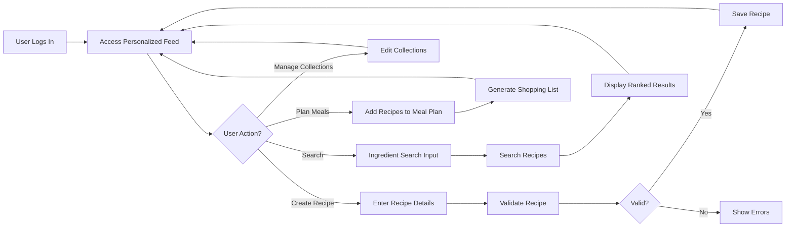
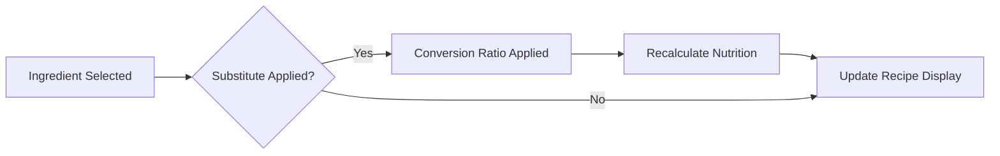

# Recipe Sharing Backend: Comprehensive Business and Functional Requirements

## 1. Introduction
The Recipe Sharing Backend supports a dynamic platform where users create, share, and personalize recipes while managing ingredient substitutions, nutrition, and costs. The system fosters community engagement through ratings, reviews, and social features like following. This document outlines precise business rules and functional requirements to guide backend developers in building a robust and user-friendly service.

## 2. Business Model

### 2.1 Why This Service Exists
There is a significant market demand for personalized recipe management systems that help users adapt to dietary restrictions, ingredient availability, and budget constraints. Current platforms often lack intelligent substitution, cost tracking, and personalized meal planning.

### 2.2 Revenue and Growth Strategy
The platform generates revenue through premium subscriptions offering advanced meal planning and cost tracking. Growth relies on social engagement, personalized feeds, and continuous feature expansion with partner integrations.

### 2.3 Success Metrics
- Monthly Active Users (MAU)
- Premium conversion rate
- Average recipes created and shared
- User retention rate
- Accuracy of nutritional and cost calculations

## 3. User Roles and Authentication

### 3.1 Role Descriptions
- Regular Users can create, share, rate, review recipes, follow others, and manage collections and standard meal plans.
- Premium Users have all Regular User permissions plus advanced features like recurring meal plans and ingredient cost tracking.
- Moderators manage flagged content, reported reviews, and user-generated category approval.

### 3.2 Authentication Flows
WHEN a user registers, THE system SHALL validate input, send verification email, and require verification before enabling content creation.
WHEN a user logs in, THE system SHALL validate credentials and establish a secure session with JWT tokens.
WHEN a user logs out, THE system SHALL invalidate the session.
WHEN a user requests password reset, THE system SHALL provide secure token via email.

### 3.3 Permission Matrix
| Action                         | Regular User | Premium User | Moderator |
|-------------------------------|--------------|--------------|-----------|
| Create and share recipes       | ✅           | ✅           | ❌        |
| Rate and review recipes        | ✅           | ✅           | ✅ (moderate) |
| Follow users                  | ✅           | ✅           | ❌        |
| Manage collections and meal plans | ✅           | ✅           | ❌        |
| Advanced meal planning         | ❌           | ✅           | ❌        |
| Ingredient cost tracking       | ❌           | ✅           | ❌        |
| Review and moderate content    | ❌           | ❌           | ✅        |
| Approve user-generated tags    | ❌           | ❌           | ✅        |

## 4. Recipe Management

WHEN a user creates a recipe, THE system SHALL capture title, description, ingredients with quantities and units, preparation steps, and comprehensive nutrition details (calories, macros, fiber, sodium, sugar, vitamins A/C/D, iron, calcium).
THE system SHALL allow editing and deletion of user-owned recipes.
IF recipe data is incomplete or invalid, THEN THE system SHALL reject submission with descriptive errors.

Users MAY tag recipes with predefined categories (cuisine types, diets, difficulty levels) and suggest additional tags subject to moderator approval.

## 5. Ingredient Substitution

THE system SHALL maintain 3-5 substitute ingredients per original ingredient, each with specified conversion ratios.
WHEN users substitute ingredients, THE system SHALL automatically adjust nutritional calculations to reflect the substitution.
THE system SHALL consider stored user dietary preferences to suggest substitutions aligned with restrictions.
Ingredient cost tracking against three major grocery stores SHALL update costs weekly and adjust recipe estimates accordingly.

## 6. Rating and Reviews

THE system SHALL provide a 5-star rating scale with one rating per user per recipe.
Users SHALL submit text reviews up to 2000 characters, editable and deletable within 24 hours.
Users SHALL vote on review helpfulness once per review with option to change vote.
Users SHALL flag inappropriate reviews which enter moderator queues after 3 flags.
Moderators SHALL hide inappropriate reviews and maintain audit logs of all moderation actions.

## 7. Social Features

Users SHALL follow others, enabling personalized recipe feeds composed 60% of followed users' newest recipes, 25% trending in preferred categories, and 15% personalized recommendations based on past behavior.
Feed updates SHALL propagate in real-time upon new recipe posts.

## 8. Search Functionality

Users SHALL search by listing available ingredients, with the system matching any recipes containing those ingredients.
Partial matching SHALL be supported (e.g., 'almond' matches 'almond milk').
Search results SHALL be ranked by percentage of user-owned ingredients matching recipe requirements.

## 9. Personal Collections and Meal Planning

Users SHALL create and name recipe collections.
Meal plans SHALL be built by dragging recipes onto calendar meals and dates, with support for recurring schedules.
Weekly shopping lists SHALL consolidate ingredient quantities and include substitutions.

## 10. Shopping List and Cost Tracking

Shopping lists SHALL consolidate identical ingredients from multiple recipes, sum quantities, and convert units appropriately.
Ingredient cost data from three major grocery stores SHALL inform cost estimates.
Availability SHALL be checked via mock APIs for preferred stores.
The system SHALL suggest alternative stores or substitutes to optimize costs respecting dietary preferences.
Price data SHALL update weekly and notify premium users of significant changes.

## 11. Error Handling

IF users submit invalid or incomplete recipe or ingredient data, THEN clear, actionable error messages SHALL be returned.
IF subscription data missing for substitutions, THEN users SHALL be informed and original ingredients used.
IF store availability APIs fail, THEN cached data SHALL be used with user notifications.
All moderation actions SHALL be logged for audit.

## 12. Performance Requirements

Searches SHALL return results within 2 seconds.
Feed updates SHALL propagate within 3 seconds.
Recipe creation, editing, and review handling SHALL complete within 2 seconds.
Shopping list generation SHALL finish within 5 seconds.

## 13. Diagrams

## Compliance
This document defines business requirements only; technical implementation including APIs and database design is at developer discretion. This specification focuses on WHAT the system should do, enabling developers to implement a comprehensive recipe sharing backend with emphasis on ingredient substitution and personalized meal planning.