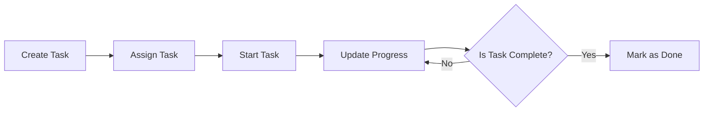

# Functional Requirements for Task Management Backend API

## 1. Introduction
This document defines the complete business and functional requirements for the Task Management Backend API service. The service enables project managers, technical project managers, project management officers, developers, designers, and quality assurance professionals to collaboratively manage, assign, and track tasks within projects and teams.

This document explicitly provides business requirements only; all technical implementations, including architecture, API designs, and database schemas, are at the discretion of the development team.

## 2. Business Model

### Why This Service Exists
Modern software development and projects require effective task management tools that enable clear assignment, tracking, and collaboration. Existing solutions like Trello have proven the value of visual task boards, statuses, and team notifications. This backend service aims to provide an enterprise-grade task management backend that supports such capabilities tailored for diverse project roles.

### Revenue Strategy
While the initial scope is focused on delivering robust task management features for internal or client use, future monetization may include subscription plans, integration services, or premium features.

### Growth Plan
User acquisition will target project-oriented teams in technology companies, with plans for scaling through integrations and API offerings.

### Success Metrics
Key indicators include active user count, task throughput, assignment rates, and notification delivery success.

## 3. User Roles and Permissions
The service supports the following roles, each with specific permissions:

| Role      | Description                                                                                     | Core Permissions                                             |
|-----------|-------------------------------------------------------------------------------------------------|--------------------------------------------------------------|
| TPM       | Technical Project Manager overseeing development projects and deadlines                         | Create/update/delete tasks, assign tasks, manage boards      |
| PM        | Project Manager responsible for planning, executing, and communicating project status          | Create/update/delete tasks, assign tasks, manage boards      |
| PMO       | Project Management Officer setting standards and compliance                                    | Manage all tasks and boards, view reports, configure settings|
| Developer | Individual contributor writing code and fixing bugs                                            | View tasks, update task status, comment                       |
| Designer  | Creates UI/UX designs and prototypes                                                           | View tasks, update progress, comment                          |
| QA        | Tests software quality and reports issues                                                      | View tasks, update status, report bugs                        |

### Authentication
Authentication shall use JWT tokens containing user ID, role, and permissions. Access tokens expire after 30 minutes; refresh tokens after 14 days.

### Permission Matrix
| Action                  | TPM | PM | PMO | Developer | Designer | QA |
|-------------------------|-----|----|-----|-----------|----------|----|
| Create Task             | ✅  | ✅ | ✅  | ❌        | ❌       | ❌ |
| Update Task             | ✅  | ✅ | ✅  | ✅        | ✅       | ✅ |
| Delete Task             | ✅  | ✅ | ✅  | ❌        | ❌       | ❌ |
| Assign Task             | ✅  | ✅ | ✅  | ❌        | ❌       | ❌ |
| Change Task Status      | ✅  | ✅ | ✅  | ✅        | ✅       | ✅ |
| View All Tasks          | ✅  | ✅ | ✅  | ✅        | ✅       | ✅ |
| Manage Boards/Projects  | ✅  | ✅ | ✅  | ❌        | ❌       | ❌ |

## 4. Functional Requirements

### 4.1 Task Management
- WHEN a user with create permissions submits task details, THE system SHALL create a new task with status 'To Do'.
- THE task SHALL include these data fields: Title (string, required), Description (string, optional), Creator (user reference), Assignees (list of user references), Status (enum: To Do, In Progress, Done), Priority (enum: Low, Medium, High), Due Date (ISO 8601 date-time, optional), Creation Date (timestamp), Last Updated Date (timestamp).
- WHEN a user updates task properties, THE system SHALL validate and persist the changes.
- WHEN a user deletes a task and has delete permission, THE system SHALL remove the task.

### 4.2 Task Assignment
- WHEN a user with assignment rights assigns a task to one or more users, THE system SHALL update the assignee list of the task accordingly.
- WHEN a task is assigned or unassigned, THE system SHALL generate a notification to relevant users.

### 4.3 Task Organization (Boards and Projects)
- THE system SHALL support grouping tasks into Boards and Projects.
- THE Board SHALL represent a collection of related tasks.
- WHEN a user creates a project or board, THE system SHALL persist it with owner and members.
- TASKS SHALL be able to be moved between boards.

### 4.4 Notifications
- WHEN tasks are assigned, updated, or status changed, THE system SHALL send notifications to assignees and relevant users.
- Notifications can be real-time or batched depending on system design.

### 4.5 Due Dates and Deadlines
- THE system SHALL accept optional due dates for tasks.
- WHEN the current date exceeds the due date and task is not Done, THEN the system SHALL flag the task as overdue.
- THE system SHALL allow querying for overdue tasks.

## 5. Business Rules

- ALL tasks MUST have a non-empty title.
- Status must be one of the predefined enum values.
- Assignment is only possible to existing users.
- ONLY users with appropriate roles can create, delete, or assign tasks.
- Due dates, if specified, must be valid ISO 8601 dates, not in the past when creating tasks.
- Notifications SHALL be delivered within 5 seconds of triggering events.

## 6. User Scenarios and Workflows

### Scenario: Creating a Task
1. PM logs in and accesses the task creation endpoint.
2. PM provides task title, optional description, priority, and due date.
3. PM submits task.
4. System creates task with status 'To Do' and timestamps.
5. System sends confirmation response.

### Scenario: Assigning a Task
1. TPM views existing tasks.
2. TPM selects a task and assigns it to one or multiple developers.
3. System updates task assignees.
4. System sends notifications to newly assigned users.

### Scenario: Updating Task Status
1. Developer begins work on a task and changes status from 'To Do' to 'In Progress'.
2. System records status change and timestamp.
3. System notifies PM and TPM of status change.

### Scenario: Overdue Task Notification
1. System runs periodic checks.
2. Tasks with due dates before current date and not marked 'Done' are flagged.
3. Notifications sent to assignees and project managers.

## 7. Error Handling and Validation

- IF task creation data is invalid (e.g., missing title), THEN the system SHALL return an error with descriptive message.
- IF unauthorized user attempts task modification, THEN the system SHALL deny the action with appropriate error.
- IF assigning to non-existent users, THEN the system SHALL reject assignment and return error.
- IF due date is invalid format or in past, THEN the system SHALL reject task creation/update.

## 8. Performance Requirements

- THE system SHALL respond to task creation, update, and assignment requests within 500 milliseconds under normal load.
- Notifications SHALL be sent within 5 seconds of triggering event.
- Task listing and filtering SHALL return results within 1 second for user queries with up to 1000 tasks.

## 9. Glossary

- TPM: Technical Project Manager
- PM: Project Manager
- PMO: Project Management Officer
- Task: A single unit of work
- Board: A collection of related tasks, analogous to a project or workspace
- Assignee: User assigned responsibility for a task
- Status: The current stage of a task, e.g., To Do, In Progress, Done

## Mermaid Diagram: Task Lifecycle

---

This document defines business requirements only. All technical implementation decisions, architecture, APIs, and database design are at the discretion of the development team. The document specifies WHAT the system must do, not HOW it should be built.