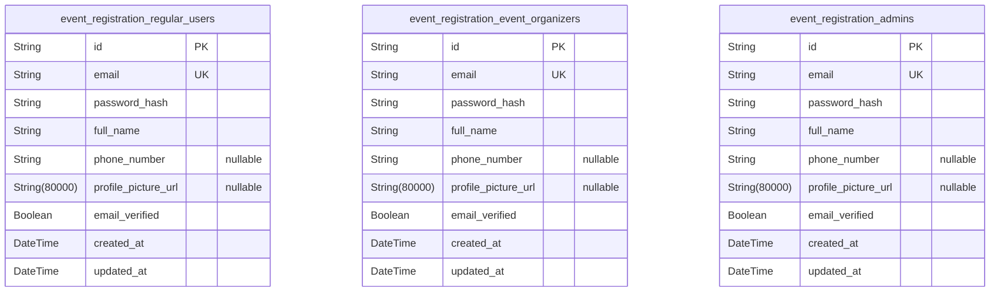
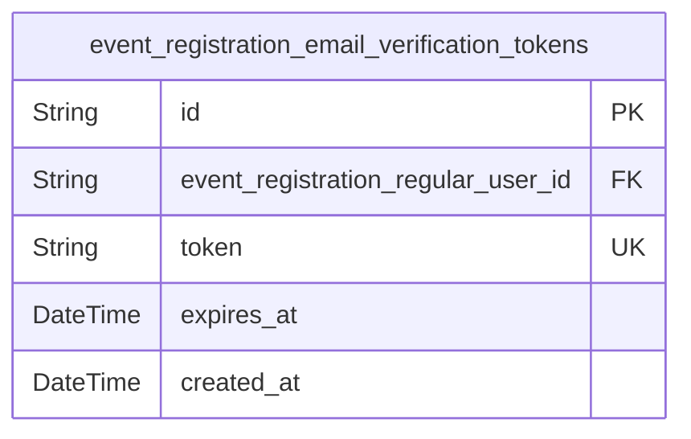
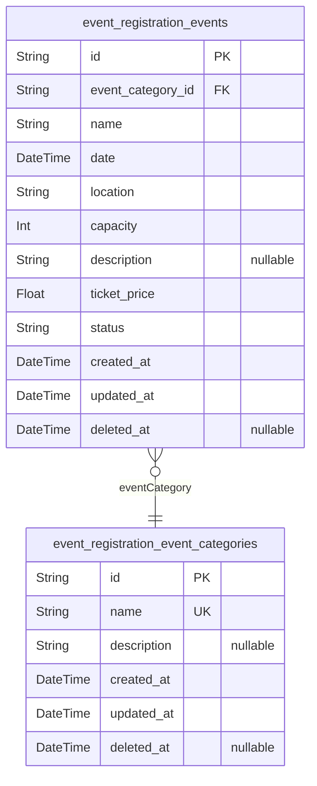
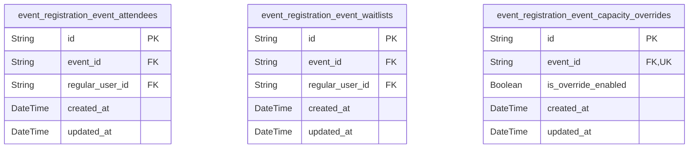
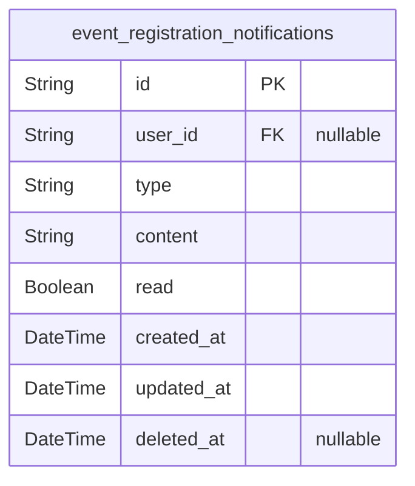
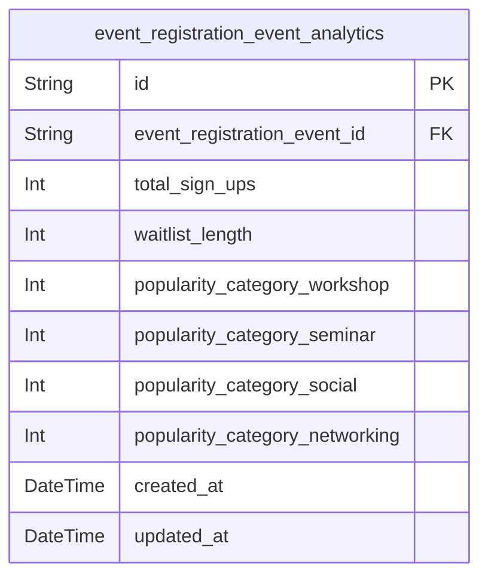
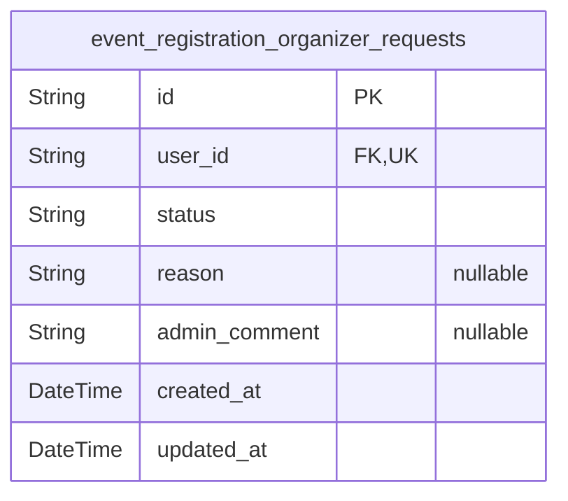

# Prisma Markdown

> Generated by [`prisma-markdown`](https://github.com/samchon/prisma-markdown)

- [Identity](#identity)
- [EmailVerification](#emailverification)
- [Events](#events)
- [Signups](#signups)
- [Notifications](#notifications)
- [Analytics](#analytics)
- [AdminControls](#admincontrols)

## Identity

### `event_registration_regular_users`

Regular users who register with email and password, including profile
information. They must verify email before signing up for events. Holds
authentication-related data such as email (unique) and password_hash,
plus personal details like full name, phone number, and profile picture
URL. Timestamps track creation and updates for audit purposes.

Properties as follows:

- `id`: Primary Key.
- `email`: User's unique email address used for login authentication.
- `password_hash`: Hashed password for secure authentication; never store plain passwords.
- `full_name`: User's full legal or preferred name.
- `phone_number`: User's phone number, optional but useful for contacting.
- `profile_picture_url`: URL of user's profile picture, optional.
- `email_verified`: Flag indicating if user has verified their email address.
- `created_at`: Timestamp when the user record was created.
- `updated_at`: Timestamp when the user record was last updated.

### `event_registration_event_organizers`

Event organizers who can create and manage their own events after admin
approval. Stores authentication credentials plus contact details and
profile information such as full name, phone number, and profile picture
URL. Email must be unique. Tracks email verification status and
timestamps for creation and updates.

Properties as follows:

- `id`: Primary Key.
- `email`: Event organizer's unique email address for authentication.
- `password_hash`: Hashed password for secure authentication.
- `full_name`: Full name of the event organizer.
- `phone_number`: Contact phone number of the event organizer, optional.
- `profile_picture_url`: URL for profile picture of the organizer, optional.
- `email_verified`: Indicator whether the organizer has verified their email.
- `created_at`: Timestamp when the organizer record was created.
- `updated_at`: Timestamp when the organizer record was last updated.

### `event_registration_admins`

Administrators with global system privileges capable of managing users,
events, and approving organizer requests. Holds unique email
authentication data and profile information. Tracks email verification
and audit timestamps indicating creation and last update.

Properties as follows:

- `id`: Primary Key.
- `email`: Administrator's unique email address for login.
- `password_hash`: Hashed password for authentication security.
- `full_name`: Admin's full name for identification.
- `phone_number`: Optional phone number for admin contact.
- `profile_picture_url`: Optional profile picture URL for admin users.
- `email_verified`: Flag indicating if admin's email has been verified.
- `created_at`: Record creation timestamp for audit purposes.
- `updated_at`: Record last update timestamp for audit purposes.

## EmailVerification

### `event_registration_email_verification_tokens`

Storage of email verification tokens associated with user accounts. This
table manages the lifecycle of unique tokens used for verifying user
email addresses, referencing the users securely. Ensures auditability and
data integrity through created timestamps and unique token constraints.

Properties as follows:

- `id`: Primary Key.
- `event_registration_regular_user_id`
  > Belonged regular user that owns this token. {@link
  > event_registration_regular_users.id}.
- `token`: Unique verification token for email validation.
- `expires_at`: Expiration timestamp of the token, after which it is invalid.
- `created_at`: Timestamp when the token was created.

## Events

### `event_registration_events`

Table storing detailed data about individual events including name, date,
location, capacity, description, price, category reference, status, and
temporal fields. Managed by event organizers and admins. Supports soft
deletion and state tracking via timestamps.

Properties as follows:

- `id`: Primary Key.
- `event_category_id`
  > Foreign key to the event category {@link
  > event_registration_event_categories.id}.
- `name`: The name of the event.
- `date`: The scheduled start date and time of the event in ISO 8601 format.
- `location`: The location where the event will take place.
- `capacity`: The maximum number of attendees allowed for the event.
- `description`: Detailed description of the event; optional field.
- `ticket_price`: The ticket price for entry; zero indicates a free event.
- `status`: The current status of the event: scheduled, cancelled, or completed.
- `created_at`: Timestamp when the event record was created.
- `updated_at`: Timestamp when the event record was last updated.
- `deleted_at`: Timestamp for soft deletion; null if the event is active.

### `event_registration_event_categories`

Categories classification table for events, e.g., workshop, seminar,
social, and networking. This table allows efficient categorization and
filtering of events. Managed independently by admins and organizers.

Properties as follows:

- `id`: Primary Key.
- `name`: Unique name of the event category, such as workshop or seminar.
- `description`: Optional detailed description for the category.
- `created_at`: Timestamp when the category record was created.
- `updated_at`: Timestamp when the category record was last updated.
- `deleted_at`: Timestamp for soft deletion; null if active.

## Signups

### `event_registration_event_attendees`

Represents confirmed attendees registered for events. Each record
associates a regular user with an event they attend. This prevents
duplicate registrations and supports attendance tracking and audit
logging.

Properties as follows:

- `id`: Primary Key.
- `event_id`: References the [event_registration_events.id](#event_registration_events) of the attended event.
- `regular_user_id`
  > References the [event_registration_regular_users.id](#event_registration_regular_users) of the
  > attendee.
- `created_at`: Timestamp when the attendee registered.
- `updated_at`: Timestamp when the attendee registration was last updated.

### `event_registration_event_waitlists`

Represents the waitlist for events that have reached full capacity. Each
record links a regular user waiting for a spot in a specific event. The
creation timestamp manages the FIFO order of the waitlist. This supports
automated waitlist promotion and audit logging.

Properties as follows:

- `id`: Primary Key.
- `event_id`
  > References the [event_registration_events.id](#event_registration_events) of the event being
  > waited for.
- `regular_user_id`
  > References the [event_registration_regular_users.id](#event_registration_regular_users) of the
  > waitlisted user.
- `created_at`: Timestamp when this waitlist entry was created, defining FIFO order.
- `updated_at`: Timestamp when this waitlist entry was last updated.

### `event_registration_event_capacity_overrides`

Stores administrative overrides for the event capacity adjustments
feature. Admins can enable or disable automatic capacity adjustments for
specific events. This table enforces a unique one-to-one relationship
with events. Tracks creation and update timestamps for audit and
operational history.

Properties as follows:

- `id`: Primary Key.
- `event_id`
  > References the [event_registration_events.id](#event_registration_events) of the event for this
  > capacity override.
- `is_override_enabled`: Indicates if automatic capacity adjustments are overridden for this event.
- `created_at`: Timestamp when this capacity override record was created.
- `updated_at`: Timestamp when this capacity override record was last updated.

## Notifications

### `event_registration_notifications`

Records notifications generated by system and users related to event
registration activities. Includes registrations, waitlist promotions,
capacity changes, and other system or user-targeted notifications.
Supports soft deletion and timestamps for audit trail. References the
user who receives or triggers the notification, if applicable.

Properties as follows:

- `id`: Primary Key.
- `user_id`
  > Belonged user's [event_registration_regular_users.id](#event_registration_regular_users) who receives
  > or triggers the notification. Nullable because some notifications may be
  > system-wide.
- `type`
  > Type of notification, e.g., registration confirmation, waitlist
  > promotion, event schedule change, capacity adjustment.
- `content`: Detailed notification content describing the event or action.
- `read`: Flag indicating whether the notification has been read by the user.
- `created_at`: Timestamp when the notification was created.
- `updated_at`: Timestamp when the notification was last updated.
- `deleted_at`: Timestamp when the notification was soft deleted; null if not deleted.

## Analytics

### `event_registration_event_analytics`

Aggregated analytical data for event registrations, including total
sign-ups, waitlist size, and category-wise sign-up counts for workshops,
seminars, social, and networking events. This table captures temporal
snapshots of event metrics that support reporting, trend analysis, and
decision making by organizers and admins. It references the base event to
link metrics contextually.

Properties as follows:

- `id`: Primary Key.
- `event_registration_event_id`: Belonged event's [event_registration_events.id](#event_registration_events).
- `total_sign_ups`: Total confirmed event sign-ups at the snapshot time.
- `waitlist_length`: Number of users currently on the waitlist at the snapshot time.
- `popularity_category_workshop`: Number of sign-ups to events categorized as 'workshop' at this snapshot.
- `popularity_category_seminar`: Number of sign-ups to events categorized as 'seminar' at this snapshot.
- `popularity_category_social`: Number of sign-ups to events categorized as 'social' at this snapshot.
- `popularity_category_networking`: Number of sign-ups to events categorized as 'networking' at this snapshot.
- `created_at`: Record creation timestamp.
- `updated_at`: Record last updated timestamp.

## AdminControls

### `event_registration_organizer_requests`

Event organizer requests submitted by regular users seeking elevated
organizer privileges. This table records the requesting user's ID,
current status of the request (pending, approved, rejected), optional
reason provided by the user, optional admin comments for approvals or
rejections, and timestamps for creation and last update. This entity is
crucial for admin workflows managing organizer approvals.

Properties as follows:

- `id`: Primary Key.
- `user_id`: Requesting user's [event_registration_regular_users.id](#event_registration_regular_users).
- `status`
  > Current status of the organizer request: 'pending', 'approved', or
  > 'rejected'.
- `reason`: Optional reason provided by the user for requesting organizer status.
- `admin_comment`
  > Optional admin comment on the request, e.g., reasons for approval or
  > rejection.
- `created_at`: Timestamp when the request was created.
- `updated_at`: Timestamp when the request was last updated.
