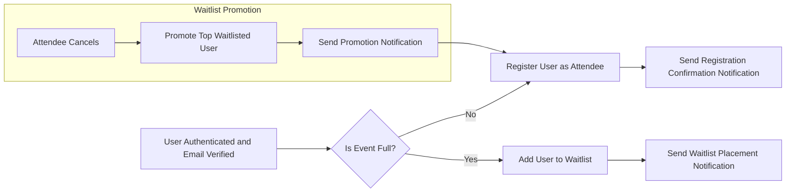

# Functional Requirements Specification for Event Registration Platform

## 1. Introduction
This document specifies the detailed functional requirements for the Event Registration platform, designed to facilitate user registrations, event creation, attendee sign-ups, waitlist management, notifications, analytics, and email verification processes.

## 2. Business Model Summary
### Why This Service Exists
The platform addresses the need for a streamlined, digital event registration system that supports both attendees and organizers with comprehensive management features, including dynamic capacity and waitlist handling. It fills a niche for flexible event management with robust verification and analytics.

### Revenue Strategy
Potential for monetization through premium organizer features or transaction fees on paid events.

### Growth Plan
User acquisition through invitation and requests for organizer status, with admin-controlled validation to ensure quality.

### Success Metrics
Number of signed-up users, event creation rates, event attendance, waitlist activations, and organizer engagement metrics.

---

## 3. User Roles and Permissions
### 3.1 Roles Overview
- **Regular Users**: Register with email/password, verify email, browse events, sign up for events, request organizer status.
- **Event Organizers**: Create/manage own events, view attendee/waitlist lists, view analytics for owned events.
- **Admins**: Manage users, approve organizer requests, manage all events, override capacities, view global analytics.

### 3.2 Permissions Summary
| Action                                | Regular User | Event Organizer | Admin |
|-------------------------------------|--------------|-----------------|-------|
| Register account                    | ✅           | ✅              | ✅    |
| Verify email                       | ✅           | ✅              | ✅    |
| Request organizer status           | ✅           | N/A             | N/A   |
| Approve organizer requests          | ❌           | ❌              | ✅    |
| Create events                     | ❌           | ✅              | ✅    |
| Update/Delete own events            | ❌           | ✅              | ✅    |
| Manage attendee/waitlist lists      | ❌           | ✅              | ✅    |
| Override capacity adjustments       | ❌           | ❌              | ✅    |
| View event analytics                | ❌           | ✅ (own events)  | ✅ (all) |
| Manage all users and events globally| ❌           | ❌              | ✅    |

---

## 4. Event Registration Workflows
### 4.1 User Registration
WHEN a new user registers with email and password, THE system SHALL create a user account with email_verified set to false and generate a verification token.

### 4.2 Email Verification
WHEN the user accesses /verify-email/{token}, THE system SHALL confirm the token, mark email_verified as true, and allow event sign-ups.

### 4.3 Organizer Status Request
WHEN a regular user requests organizer status, THE system SHALL save this request as pending and notify admins.

### 4.4 Organizer Approval
WHEN an admin approves an organizer request, THE system SHALL update the user's role to eventOrganizer.

### 4.5 Event Browsing
THE system SHALL allow all users (verified or not) to browse scheduled events.

### 4.6 Event Sign-up
WHEN a verified user signs up for an event:
- IF event capacity is not reached, THEN THE system SHALL register the user as an attendee.
- IF event is full, THEN THE system SHALL place the user on the waitlist in FIFO order.

### 4.7 Cancellations and Waitlist Promotion
WHEN a registered attendee cancels, THEN THE system SHALL promote the top waitlisted user to attendee and log a notification.

---

## 5. User Management
### 5.1 User Profiles
THE system SHALL store email, password (hashed), full name, phone number, profile picture URL, email verification status, and user role.

### 5.2 Authentication
Users SHALL authenticate via email and password.

### 5.3 Email Verification Token
THE system SHALL generate unique verification tokens and store them until used or expired.

### 5.4 Organizer Request
Users SHALL be able to request organizer status via API.

### 5.5 Admin Controls
Admins SHALL be able to manually verify emails, approve organizer requests, and manage users.

---

## 6. Event Creation and Management
### 6.1 Event Fields
Events SHALL have name, date (ISO 8601 format), location, capacity (positive integer), description, ticket price (zero or positive number), category (one of workshop, seminar, social, networking), and status (scheduled, cancelled, completed).

### 6.2 Event Lifecycle
Organizers can create, update, cancel, and complete their events.

### 6.3 Event Status
WHEN an event status is changed, THEN THE system SHALL notify attendees and log notifications.

### 6.4 Admin Control
Admins SHALL be able to manage all events and override capacity adjustments.

---

## 7. Sign-up and Waitlist Handling
### 7.1 Capacity Validation
WHEN users sign up, THE system SHALL check capacity constraints.

### 7.2 Waitlist Logic
IF event capacity is full, THE system SHALL add new sign-ups to the waitlist ordered by sign-up time.

### 7.3 Waitlist Promotion
WHEN spots open due to cancellations, THE system SHALL automatically move the top waitlisted user to attendee status and log the promotion notification.

### 7.4 Dynamic Capacity Adjustment
- IF the waitlist reaches 50% of capacity, THEN THE system SHALL increase capacity by 10% unless overridden by admin.
- IF the waitlist drops below 10% of capacity, THEN THE system SHALL decrease capacity by 10% unless overridden by admin.

---

## 8. Email Verification Process
### 8.1 Registration
WHEN users register, THE system SHALL create accounts with email_verified set to false.

### 8.2 Verification Email (Simulated)
THE system SHALL create verification tokens linked to users but NOT send real emails.

### 8.3 Verification Endpoint
WHEN users call /verify-email/{token}, THE system SHALL validate tokens and update email_verified status.

### 8.4 Restrictions
Users SHALL NOT be allowed to sign up for events before email verification.

---

## 9. Dynamic Capacity Adjustment
### 9.1 Adjust Up
WHEN the waitlist size reaches or exceeds 50% of event capacity, THE system SHALL increase event capacity by 10%, unless an admin has overridden this behavior.

### 9.2 Adjust Down
WHEN the waitlist size drops below 10% of event capacity, THE system SHALL decrease event capacity by 10%, unless overridden by admin.

### 9.3 Admin Override
Admins SHALL be able to manually set capacity and disable automatic adjustments.

---

## 10. Notification Logging
### 10.1 Notification Types
The system SHALL log notifications for:
- Registration confirmations
- Waitlist promotions
- Event schedule changes
- Capacity adjustments

### 10.2 Storage and Access
Notifications SHALL be stored per user and accessible via their dashboard.

### 10.3 Admin and Organizer Views
Admins and organizers SHALL have access to notifications relevant to their scope.

---

## 11. Analytics and Reporting
### 11.1 Metrics Tracked
- Total sign-ups per event
- Peak registration times
- Waitlist length trends
- Event popularity by category

### 11.2 Access Control
Organizers SHALL access analytics for their own events only, while admins SHALL access global analytics.

### 11.3 Data Presentation
Analytics data SHALL be aggregated and filtered according to role permissions.

---

## 12. Error Handling and Recovery
### 12.1 Email Verification Errors
IF an invalid or expired token is used, THEN THE system SHALL notify the user and allow token regeneration.

### 12.2 Sign-up Errors
IF user tries to sign up before email verification, THEN THE system SHALL deny sign-up.

### 12.3 Capacity Violations
IF event capacity is exceeded due to concurrency, THEN THE system SHALL place user on waitlist and notify.

### 12.4 Permission Denials
IF unauthorized actions are attempted based on roles, THEN THE system SHALL return appropriate access-denied messages.

---

## 13. Performance Requirements
### 13.1 Responsiveness
THE system SHALL respond to all user actions (registration, sign-up, verification) within 2 seconds under normal load.

### 13.2 Scaling
THE system SHALL handle concurrent registrations and waitlist promotions without data integrity issues.

### 13.3 Data Consistency
THE system SHALL maintain consistency in attendee lists, waitlists, and capacity counts even under concurrent updates.

---

## Mermaid Diagram: Event Sign-up Flow

This completes the comprehensive functional requirements for the Event Registration platform. This document shall be used by backend developers to implement all business logic, user workflows, permissions, dynamic behaviors, and performance criteria needed for a successful deployment.