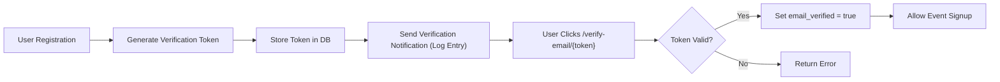
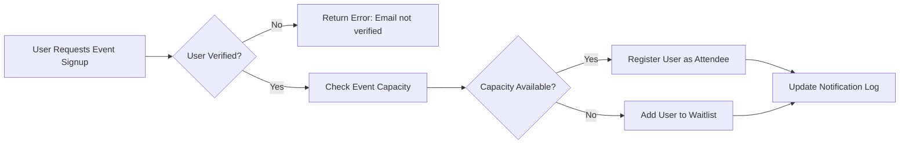

# API and Interface Specifications for Event Registration Platform

This document provides comprehensive business requirements for the API endpoints and administrative interfaces of the Event Registration platform. It specifies what the system should do to support user registration, event management, email verification, notifications, and analytics, focusing exclusively on business logic and role-based access requirements. All technical implementation decisions are left to the development team.

---

## 1. Public API Endpoints

### 1.1 Overview

The platform exposes a set of public API endpoints to support:
- User registration, email verification, authentication, and profile management.
- Browsing events filtered by categories, status, and other criteria.
- Signing up for events and managing signups.

Access to endpoints is controlled by user authentication and roles (Regular User, Event Organizer, Admin).

### 1.2 User Registration and Authentication APIs

- **Registration:** Users provide email and password to create accounts with `email_verified` defaulting to false. Additional profile fields: full name, phone number, profile picture URL.
- **Email Verification:** Upon registration, a verification token is generated and stored. Users verify via `/verify-email/{token}` endpoint.
- **Login/logout:** Standard authentication flows allowing login with email/password.
- **Profile Management:** Users can update their profile except for email (email change requires re-verification).
- **Request Organizer Role:** Registered users may submit requests to become Event Organizers, which require approval by Admins.

### 1.3 Event Browsing APIs

- List events with filters by category, status (scheduled, cancelled, completed), date range, and location.
- Include event details: name, date, location, capacity, description, ticket price, categories, and status.
- Pagination and sorting options must be available.

### 1.4 Event Signup and Management APIs

- **Signup:** Verified users can sign up for events.
- **Waitlist Handling:** If an event reaches capacity, users are added to a waitlist.
- **Cancellation:** Users can cancel signups and free their spots.
- **Capacity Adjustment:** System automatically adjusts event capacity by ±10% based on waitlist usage; Admins can override capacity manually.

### 1.5 Access Rules

- Only verified users can signup or cancel event registrations.
- Organizers can manage their created events and view attendee and waitlist lists.
- Admins have full access system-wide, including user and event management.

---

## 2. Admin Dashboard Interface

### 2.1 Capabilities

Admins have access to a dashboard that lets them:

- Manage all users and their roles.
- Approve or reject requests from users to become Event Organizers.
- View and manage all events across the platform.
- Override automatic event capacity adjustments.
- Perform manual email verification for users.
- View global analytics across all events and categories.

### 2.2 User and Event Management

Admins can update user roles, reset passwords, deactivate accounts, and manage events including canceling or rescheduling.

### 2.3 Analytics

Admins have access to comprehensive analytics including total sign-ups per event, peak registration times, waitlist trends, and event popularity by category.

---

## 3. Organizer Dashboard Interface

### 3.1 Event Creation and Management

Event Organizers can create new events with the following details:
- Name
- Date
- Location
- Capacity
- Description
- Ticket price (including free events option)
- Categories (workshop, seminar, social, networking)
- Status (scheduled, cancelled, completed)

They can update, cancel, or complete events.

### 3.2 Attendee and Waitlist Management

Organizers can view attendee lists and waitlists for their events and manage signups.

### 3.3 Analytics

Organizers can access analytics related only to their own events, including sign-up counts, waitlist lengths, and category popularity.

---

## 4. Email Verification Endpoint

### 4.1 Token Generation and Storage

- When a user registers, the system generates a unique verification token linked to the user.
- Tokens are stored securely in the database with expiration policy.

### 4.2 Verification Workflow

- Users verify their email by accessing the `/verify-email/{token}` endpoint.
- Upon verification, the `email_verified` flag on the user account is set to true.
- Unverified users cannot perform event sign-ups or request organizer status.

### 4.3 Manual Verification

Admins can manually verify user emails via the admin dashboard or API calls.

---

## 5. Notification Management

### 5.1 Notification Types

The system logs notifications for the following events:
- Registration confirmations for events.
- Waitlist promotions when users are moved from the waitlist to confirmed attendees.
- Event schedule changes such as cancellations or updates.
- Capacity changes, including automatic adjustments and manual overrides.

### 5.2 Notification Logs

- Notifications are stored in the database with timestamp, type, content, and recipient user.

### 5.3 User and Organizer Access

- Users and Event Organizers can view their notification history on their respective dashboards.
- Notifications are read-only and sorted by most recent first.

---

## Business Rules Summary

- Users must verify their email before signing up for events.
- Organizer status must be approved by an Admin.
- Event capacity adjusts dynamically when waitlist usage crosses thresholds.
- Admin overrides take precedence over automatic capacity adjustments.
- Waitlist promotions happen automatically upon cancellations.
- Notification logs capture all key user and system-triggered events.

---

## Performance Expectations

- Verification responses and signup operations SHALL complete within 2 seconds under normal load.
- Analytics queries SHALL filter data based on user roles and return results within 3 seconds.
- Notification logs SHALL be consistent and visible immediately after triggering events.

---

## Mermaid Diagram: Email Verification Workflow

## Mermaid Diagram: Event Signup and Waitlist Management

---

This document provides business requirements only. All technical implementation decisions including API specification details, database schema design, and infrastructure are at the discretion of the development team. The document focuses on WHAT the system must do from a business perspective, not HOW to implement it.
