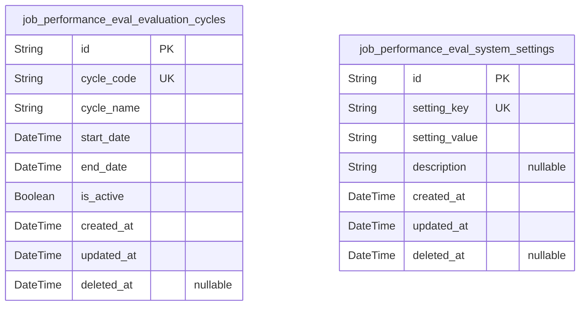
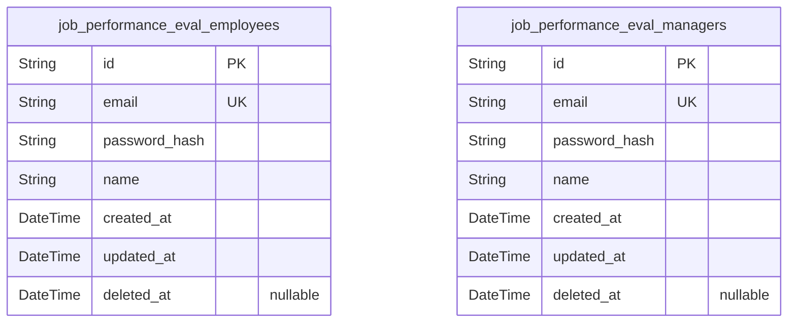
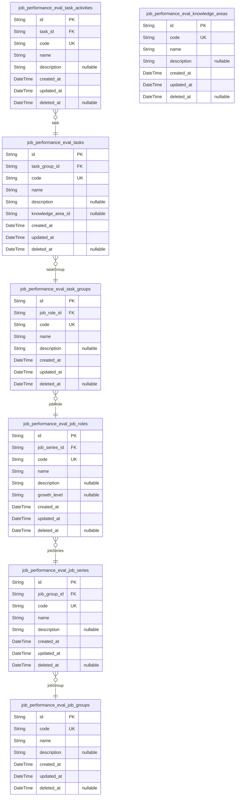
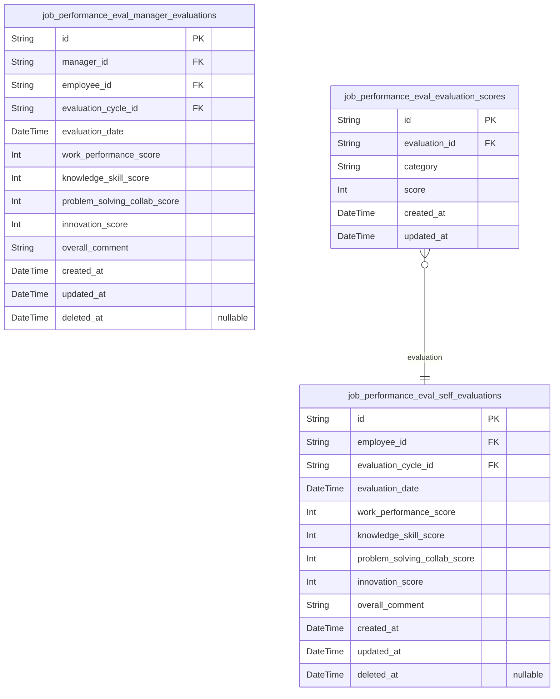
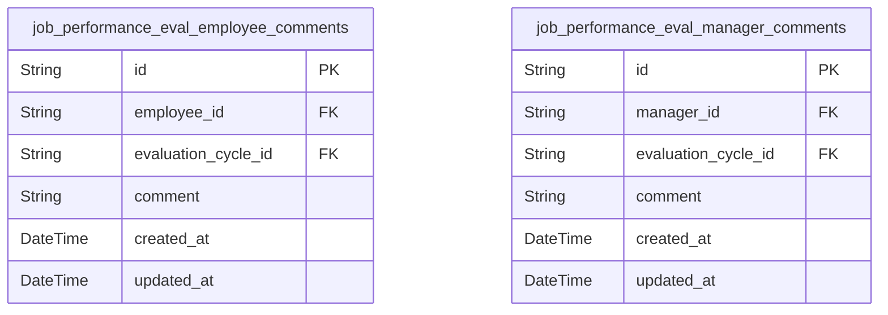
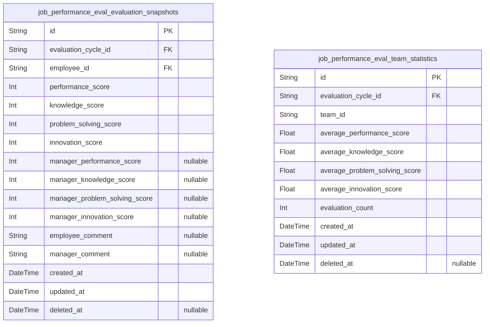

# Prisma Markdown

> Generated by [`prisma-markdown`](https://github.com/samchon/prisma-markdown)

- [Systematic](#systematic)
- [Actors](#actors)
- [Jobs](#jobs)
- [Evaluations](#evaluations)
- [Comments](#comments)
- [Reports](#reports)

## Systematic

### `job_performance_eval_evaluation_cycles`

This table stores information about evaluation cycles used in the Job
Performance Evaluation system. Each cycle defines a period for
evaluations, including names, start and end dates, and implementation
status. It includes timestamps for audit and supports soft deletion.

Properties as follows:

- `id`: Primary Key.
- `cycle_code`: Unique code representing the evaluation cycle.
- `cycle_name`: Descriptive name of the evaluation cycle.
- `start_date`: Starting datetime of the evaluation cycle period.
- `end_date`: Ending datetime of the evaluation cycle period.
- `is_active`: Flag indicating whether this evaluation cycle is currently active.
- `created_at`: Record creation timestamp.
- `updated_at`: Record last update timestamp.
- `deleted_at`: Soft delete timestamp, null if not deleted.

### `job_performance_eval_system_settings`

This table holds global system settings for the Job Performance
Evaluation service, including parameters that control general behaviors
and configurations. It tracks key-value pairs with descriptions and
timestamps for auditing and soft deletion.

Properties as follows:

- `id`: Primary Key.
- `setting_key`: Unique key identifying the system setting.
- `setting_value`: Value corresponding to the system setting key.
- `description`: Description providing context or notes about the system setting.
- `created_at`: Record creation timestamp.
- `updated_at`: Record last update timestamp.
- `deleted_at`: Soft delete timestamp, null if not deleted.

## Actors

### `job_performance_eval_employees`

Employee identity and authentication information for the Job Performance
Evaluation service. Includes email, password hash for login, personal
name, and temporal audit fields. Unique email ensures no duplicates. Soft
delete support via deleted_at to enable account recovery or deactivation.
This table represents primary business entity for employees accessing the
evaluation system.

Properties as follows:

- `id`: Primary Key.
- `email`: Employee's unique email address used for login and notifications.
- `password_hash`: Hashed password for authentication. Never store plaintext passwords.
- `name`: Employee's full name.
- `created_at`: Record creation timestamp.
- `updated_at`: Record last update timestamp.
- `deleted_at`: Timestamp when record was soft deleted, NULL if active.

### `job_performance_eval_managers`

Manager identity and authentication information for the Job Performance
Evaluation service. Includes email, password hash for login, full name,
and temporal audit fields. Unique email ensures distinct manager
accounts. Supports soft delete with deleted_at. This table is a primary
business entity for manager users who supervise employees.

Properties as follows:

- `id`: Primary Key.
- `email`: Manager's unique email address used for login and notifications.
- `password_hash`
  > Hashed password for authentication. Passwords are never stored in
  > plaintext.
- `name`: Manager's full name.
- `created_at`: Record creation timestamp.
- `updated_at`: Record last update timestamp.
- `deleted_at`: Soft delete timestamp; if null, record is active.

## Jobs

### `job_performance_eval_job_groups`

Job Group represents the top-level job classification in the
organizational hierarchy. It categorizes broad job families to organize
job roles systematically. This model serves as the parent entity for job
series and is fundamental for job architecture management.

Properties as follows:

- `id`: Primary Key.
- `code`: Unique code identifying the job group.
- `name`: Name of the job group.
- `description`: Detailed description of the job group.
- `created_at`: Record creation timestamp.
- `updated_at`: Record last update timestamp.
- `deleted_at`: Soft deletion timestamp, if applicable.

### `job_performance_eval_job_series`

Job Series represents the mid-level job classification under a job group.
It helps segment job roles into more specific clusters. This model
references the parent job group and is essential for maintaining job
hierarchy.

Properties as follows:

- `id`: Primary Key.
- `job_group_id`: Parent job group's [job_performance_eval_job_groups.id](#job_performance_eval_job_groups).
- `code`: Unique code identifying the job series.
- `name`: Name of the job series.
- `description`: Detailed description of the job series.
- `created_at`: Record creation timestamp.
- `updated_at`: Record last update timestamp.
- `deleted_at`: Soft deletion timestamp, if applicable.

### `job_performance_eval_job_roles`

Job Role represents the specific job function within a job series. It
encapsulates roles employees occupy and links to job series for
hierarchical clarity. This model is the base for assignments and
evaluations.

Properties as follows:

- `id`: Primary Key.
- `job_series_id`: Parent job series' [job_performance_eval_job_series.id](#job_performance_eval_job_series).
- `code`: Unique code identifying the job role.
- `name`: Name of the job role.
- `description`: Detailed description of the job role.
- `growth_level`: Growth Level classification associated with this job role.
- `created_at`: Record creation timestamp.
- `updated_at`: Record last update timestamp.
- `deleted_at`: Soft deletion timestamp, if applicable.

### `job_performance_eval_task_groups`

Task Group organizes related tasks under job roles for better management
and categorization. It groups tasks logically and serves as a parent for
tasks.

Properties as follows:

- `id`: Primary Key.
- `job_role_id`: Belonged job role's [job_performance_eval_job_roles.id](#job_performance_eval_job_roles).
- `code`: Unique code identifying the task group.
- `name`: Name of the task group.
- `description`: Detailed description of the task group.
- `created_at`: Record creation timestamp.
- `updated_at`: Record last update timestamp.
- `deleted_at`: Soft deletion timestamp, if applicable.

### `job_performance_eval_tasks`

Task represents the detailed work activities under a task group. It
specifies tasks employees perform as part of their job role
responsibilities.

Properties as follows:

- `id`: Primary Key.
- `task_group_id`: Parent task group's [job_performance_eval_task_groups.id](#job_performance_eval_task_groups).
- `code`: Unique code identifying the task.
- `name`: Name of the task.
- `description`: Detailed description of the task.
- `knowledge_area_id`
  > Associated knowledge area's {@link
  > job_performance_eval_knowledge_areas.id}.
- `created_at`: Record creation timestamp.
- `updated_at`: Record last update timestamp.
- `deleted_at`: Soft deletion timestamp, if applicable.

### `job_performance_eval_task_activities`

Task Activity specifies detailed actionable activities within tasks. It
breaks down tasks into finer units for precise evaluation and tracking.

Properties as follows:

- `id`: Primary Key.
- `task_id`: Parent task's [job_performance_eval_tasks.id](#job_performance_eval_tasks).
- `code`: Unique code identifying the task activity.
- `name`: Name of the task activity.
- `description`: Detailed description of the task activity.
- `created_at`: Record creation timestamp.
- `updated_at`: Record last update timestamp.
- `deleted_at`: Soft deletion timestamp, if applicable.

### `job_performance_eval_knowledge_areas`

Knowledge Area represents domains of expertise or knowledge relevant to
job tasks. It categorizes knowledge areas to support task and skill
mappings.

Properties as follows:

- `id`: Primary Key.
- `code`: Unique code identifying the knowledge area.
- `name`: Name of the knowledge area.
- `description`: Detailed description of the knowledge area.
- `created_at`: Record creation timestamp.
- `updated_at`: Record last update timestamp.
- `deleted_at`: Soft deletion timestamp, if applicable.

## Evaluations

### `job_performance_eval_self_evaluations`

This table captures self-evaluation data submitted by employees for each
evaluation cycle. It stores scores for different evaluation categories
and a mandatory comprehensive comment. It references the employee
performing the evaluation and the specific evaluation cycle. Includes
temporal fields for auditing and supports soft deletion for data
lifecycle management.

Properties as follows:

- `id`: Primary Key.
- `employee_id`
  > The employee who submits the self-evaluation. {@link
  > job_performance_eval_employees.id}.
- `evaluation_cycle_id`
  > The evaluation cycle to which this self-evaluation belongs. {@link
  > job_performance_eval_evaluation_cycles.id}.
- `evaluation_date`: The date when the self-evaluation is performed.
- `work_performance_score`: Score for Work Performance Level evaluation, in scale 1-5.
- `knowledge_skill_score`: Score for Knowledge/Skill evaluation, in scale 1-5.
- `problem_solving_collab_score`: Score for Problem Solving and Collaboration evaluation, in scale 1-5.
- `innovation_score`: Score for Innovation evaluation, in scale 1-5.
- `overall_comment`: Comprehensive comment by the employee on the evaluation.
- `created_at`: Creation timestamp of the record.
- `updated_at`: Last update timestamp of the record.
- `deleted_at`: Soft delete timestamp for the record.

### `job_performance_eval_manager_evaluations`

This table records evaluations made by managers for employees in each
evaluation cycle. It stores evaluation scores for various categories
which may differ from self-evaluations, and includes a comprehensive
comment by the manager. It references the manager, employee, and
evaluation cycle. It supports auditing and soft deletion.

Properties as follows:

- `id`: Primary Key.
- `manager_id`
  > The manager who performs the evaluation. {@link
  > job_performance_eval_managers.id}.
- `employee_id`: The employee evaluated. [job_performance_eval_employees.id](#job_performance_eval_employees).
- `evaluation_cycle_id`
  > The evaluation cycle to which this manager evaluation belongs. {@link
  > job_performance_eval_evaluation_cycles.id}.
- `evaluation_date`: The date when the manager evaluation is performed.
- `work_performance_score`: Manager's score for Work Performance Level evaluation, scale 1-5.
- `knowledge_skill_score`: Manager's score for Knowledge/Skill evaluation, scale 1-5.
- `problem_solving_collab_score`
  > Manager's score for Problem Solving and Collaboration evaluation, scale
  > 1-5.
- `innovation_score`: Manager's score for Innovation evaluation, scale 1-5.
- `overall_comment`: Comprehensive comment by the manager on the evaluation.
- `created_at`: Record creation timestamp.
- `updated_at`: Last update timestamp of the record.
- `deleted_at`: Soft delete timestamp.

### `job_performance_eval_evaluation_scores`

This table aggregates detailed evaluation scores for each evaluation
entry, linking to either self-evaluation or manager evaluation records
and storing individual category scores. This design supports flexible
score management and historical tracking per cycle.

Properties as follows:

- `id`: Primary Key.
- `evaluation_id`
  > Reference to evaluation record. Could be either self or manager
  > evaluation. [job_performance_eval_self_evaluations.id](#job_performance_eval_self_evaluations) or {@link
  > job_performance_eval_manager_evaluations.id}.
- `category`
  > The evaluation category name, e.g., 'work_performance',
  > 'knowledge_skill', 'problem_solving_collab', 'innovation'.
- `score`: The score given for the category, scale 1-5.
- `created_at`: Record creation timestamp.
- `updated_at`: Last update timestamp.

## Comments

### `job_performance_eval_employee_comments`

Employee comments on their own performance evaluations, capturing
qualitative feedback distinct from numeric scores. Linked to the employee
making the comment and to the evaluation cycle. Provides contextual
insights into employee perceptions and subjective assessment. Includes
timestamps for creation and update tracking. This table is a primary
business entity for independent CRUD operations on employee comments.

Properties as follows:

- `id`: Primary Key.
- `employee_id`
  > Belonged employee who authored the comment. {@link
  > job_performance_eval_employees.id}.
- `evaluation_cycle_id`
  > Related evaluation cycle of the comment. {@link
  > job_performance_eval_evaluation_cycles.id}.
- `comment`: Content of the employee's comment on their evaluation.
- `created_at`: Timestamp of when the comment was created.
- `updated_at`: Timestamp of when the comment was last updated.

### `job_performance_eval_manager_comments`

Manager comments on employee performance evaluations, providing
qualitative feedback separate from numeric evaluation scores. Linked to
the manager who authored the comment and the specific evaluation cycle.
Enables managerial insights and contextual remarks. Includes creation and
update timestamps for audit and tracking. This table is a primary
business entity allowing independent management of manager comments.

Properties as follows:

- `id`: Primary Key.
- `manager_id`
  > Manager who authored the comment. {@link
  > job_performance_eval_managers.id}.
- `evaluation_cycle_id`
  > Linked evaluation cycle for the comment. {@link
  > job_performance_eval_evaluation_cycles.id}.
- `comment`: Content of the manager's comment on the employee's evaluation.
- `created_at`: Timestamp marking when the comment was created.
- `updated_at`: Timestamp marking last update time of the comment.

## Reports

### `job_performance_eval_evaluation_snapshots`

Historical snapshots of job performance evaluations capturing both
employee self-evaluation and manager evaluation data for audit trail and
reporting purposes. References evaluation cycles and employees, stores
scores and comments point-in-time data with created and updated
timestamps. Immutable snapshot data used for historical queries and
analysis.

Properties as follows:

- `id`: Primary Key.
- `evaluation_cycle_id`
  > Referenced evaluation cycle's {@link
  > job_performance_eval_evaluation_cycles.id}.
- `employee_id`: Referenced employee's [job_performance_eval_employees.id](#job_performance_eval_employees).
- `performance_score`: Employee's self-evaluated job performance score (1-5 scale).
- `knowledge_score`: Employee's self-evaluated knowledge and skills score (1-5 scale).
- `problem_solving_score`
  > Employee's self-evaluated problem solving and collaboration score (1-5
  > scale).
- `innovation_score`: Employee's self-evaluated innovation score (1-5 scale).
- `manager_performance_score`: Manager's evaluation of job performance score (1-5 scale).
- `manager_knowledge_score`: Manager's evaluation of knowledge and skills score (1-5 scale).
- `manager_problem_solving_score`
  > Manager's evaluation of problem solving and collaboration score (1-5
  > scale).
- `manager_innovation_score`: Manager's evaluation of innovation score (1-5 scale).
- `employee_comment`: Employee's comprehensive comment about the evaluation.
- `manager_comment`: Manager's comprehensive comment about the employee's evaluation.
- `created_at`: Snapshot creation timestamp.
- `updated_at`: Snapshot last update timestamp.
- `deleted_at`: Soft deletion timestamp for logical record removal.

### `job_performance_eval_team_statistics`

Aggregated team-level statistics summarizing job performance evaluation
results per evaluation cycle and organizational team unit. Supports
reporting and analytics for management reviews and HR insights. Maintains
counts, averages, and score distributions with temporal metadata.

Properties as follows:

- `id`: Primary Key.
- `evaluation_cycle_id`
  > Referenced evaluation cycle's {@link
  > job_performance_eval_evaluation_cycles.id}.
- `team_id`: Organizational team identifier referenced from team master data.
- `average_performance_score`: Average job performance score for the team during the evaluation cycle.
- `average_knowledge_score`
  > Average knowledge and skills score for the team during the evaluation
  > cycle.
- `average_problem_solving_score`
  > Average problem solving and collaboration score for the team during the
  > evaluation cycle.
- `average_innovation_score`: Average innovation score for the team during the evaluation cycle.
- `evaluation_count`: Number of individual evaluations included in the team's statistics.
- `created_at`: Record creation timestamp.
- `updated_at`: Record last update timestamp.
- `deleted_at`: Soft deletion timestamp for logical record removal.
