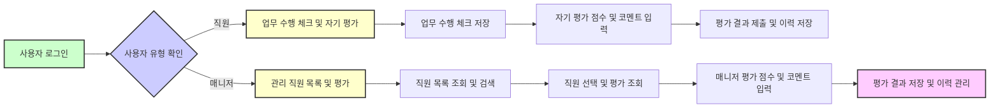

# Job Performance Evaluation 서비스 요구 분석서

## 1. 개요
Job Performance Evaluation 서비스는 직원과 매니저가 연 2회 업무 수행 여부 체크 및 전문성 수준 진단을 진행하여 구성원의 역량을 객관적으로 평가하고 성장 방향을 제시하는 인사관리 시스템이다.

## 2. 사용자 역할 및 권한

### 2.1 직원 (Employee)
- 이메일과 비밀번호로 로그인한다.
- 본인의 직무에 속한 Task와 Activity에 대해 수행 여부를 체크한다.
- 업무 수행 수준, 지식/기술 평가, 문제해결 및 협업, 혁신성 4가지 항목에 대해 5단계 척도로 자기 평가한다.
- 자기 평가 완료 후 종합 코멘트를 필수 입력한다.
- 본인의 평가 이력과 결과를 조회할 수 있다.

### 2.2 매니저 (Manager)
- 이메일과 비밀번호로 로그인한다.
- 관리하는 직원 목록을 조회하고, 이름 및 조직별로 검색 및 필터가 가능하다.
- 직원선택 후 해당 직원의 자기평가 결과를 열람한다.
- 업무 수행 수준, 지식/기술, 문제해결 및 협업, 혁신성 항목에 대해 평가 점수를 입력 및 수정할 수 있다.
- 직원과 매니저 평가 결과가 다를 경우 두 평가 모두 별도로 저장한다.
- 종합 코멘트를 입력한다.
- 평가 결과 및 이력을 조회할 수 있다.

## 3. 데이터 관리
- 직군-직렬-직무 체계 관리
- Task-Activity-세부 내용 및 지식/기술 설명 포함 직무기술서 관리
- 직원 정보(사번, 조직, 직무, Growth Level, 매니저 정보, 이메일 등) 관리
- 평가 척도는 각 평가별 상이한 5단계 스케일을 사용하며, 결과는 연 2회 누적 저장 및 이력 관리

## 4. 기능 요구사항

### 4.1 로그인 및 인증
- 이메일과 비밀번호를 사용한 인증을 지원한다.
- 로그인 실패 시 명확한 오류 메시지를 제공한다.
- JWT 토큰을 사용하여 세션을 관리한다.
- 역할별(직원/매니저) 권한에 따라 접근 가능한 화면과 기능이 다르다.

### 4.2 업무 수행 체크 및 자기 평가
- 직원은 자신의 수행 직무에서 해당 Task 및 Activity별로 현재 수행 여부를 체크한다. 체크된 수행 여부는 평가 주기의 기준일과 함께 저장된다.
- 직원은 4가지 평가 항목에 대해 5단계 척도로 자기 평가를 입력한다.
- 자기 평가 완료 시 필수로 종합 코멘트를 작성해야 한다.
- 매니저는 직원의 자기 평가 결과를 검토하고, 각 평가 항목별로 평가 점수를 입력 및 수정할 수 있다.
- 평가 점수와 코멘트는 직원 자체 평가와 매니저 평가로 구분되어 저장된다.
- 평가 점수 및 코멘트는 평가 주기별로 누적 관리된다.

## 5. 평가 척도 상세

### 5.1 업무수행 수준 진단
| 레벨 | 명칭             | 설명                             |
|-------|-----------------|---------------------------------|
| 1     | Unsatisfactory  | 수행 능력이 현저히 부족하여 기대에 크게 못 미침 |
| 2     | Need Improvement| 수행 능력 부족하여 개선 필요     |
| 3     | Average         | 평균 수준으로 기본적 기대 충족   |
| 4     | Good            | 수행 능력이 우수하며 기대 이상의 성과 창출 |
| 5     | Excellent       | 수행 능력이 매우 뛰어나며 탁월한 성과를 지속적으로 창출 |

### 5.2 지식/기술 평가
| 레벨 | 명칭      | 설명                            |
|-------|----------|--------------------------------|
| 1     | Acquired | 기본적인 지식, 기술을 습득      |
| 2     | Applied  | 습득한 지식, 기술을 실제 상황에 적용 가능 |
| 3     | Proficient| 기술적인 능력에 능숙하며 다양한 상황에서 효과적으로 활용 |
| 4     | Expert   | 높은 수준의 숙련도를 갖추고 있으며 창의적이고 혁신적인 응용 가능 |
| 5     | Mastered | 최고의 수준에 도달했으며 분야 내에서 인정받는 전문가 |

### 5.3 문제해결 및 협업, 혁신성
| 레벨 | 명칭             | 설명                             |
|-------|-----------------|---------------------------------|
| 1     | Unsatisfactory  | 수행 능력이 현저히 부족하여 기대에 크게 못 미침 |
| 2     | Need Improvement| 수행 능력 부족하여 개선 필요     |
| 3     | Average         | 평균 수준으로 기본적 기대 충족   |
| 4     | Good            | 수행 능력이 우수하며 기대 이상의 성과 창출 |
| 5     | Excellent       | 수행 능력이 매우 뛰어나며 탁월한 성과를 지속적으로 창출 |

## 6. 업무 프로세스

## 7. 오류 처리

- 로그인 실패 시 HTTP 401 응답 및 메시지 표시
- 권한 없는 접근 시 HTTP 403 및 알림 제공
- 평가 기간 외 데이터 입력 불가 및 메시지
- 필수 입력 누락 시 제출 차단 및 오류 메시지 제공

## 8. 성능 요구사항

- 로그인 인증 2초 이내
- 평가 데이터 저장 3초 이내
- 직원 목록 조회 3초 이내

## 9. 통계 및 리포트

- 평가 결과 팀 및 조직 단위 집계, 변화 추이 분석 및 시각화
- 관리자 및 HR 권한에 따른 접근 제어

---

This document provides business requirements only.
All technical implementation decisions belong to developers.
Developers have full autonomy over architecture, APIs, and database design.
The document describes WHAT the system should do, not HOW to build it.