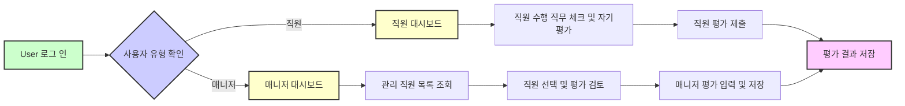

# Job Performance Evaluation 시스템 기능 요구사항

## 1. 개요
본 시스템은 직원과 매니저가 연 2회에 걸쳐 직무 수행 여부 체크 및 전문성 평가를 통해 구성원의 역량과 성장 단계를 체계적으로 관리할 수 있도록 지원한다.

## 2. 비즈니스 모델
- 조직은 구성원의 역량을 정기적으로 측정하여 적재적소에 인재를 배치하고, 교육 및 육성 계획을 세울 필요가 있다.
- 본 시스템은 객관적인 평가 프로세스를 자동화하여 인사 운영의 투명성과 효율성을 높인다.

## 3. 사용자 역할 및 권한
### 3.1 직원(employee)
- 이메일과 비밀번호로 로그인한다.
- 본인의 직무별 Task와 Activity 수행 여부를 연 2회 평가 기간 내 체크한다.
- 업무수행 수준 진단, 지식/기술 평가, 문제해결 및 협업, 혁신성 등에 대해 5단계 척도로 자기평가를 실시한다.
- 자기평가 완료 후 "종합 코멘트(본인)"를 반드시 작성한다.
- 자기 평가 결과와 과거 평가 이력을 조회할 수 있다.

### 3.2 매니저(manager)
- 이메일과 비밀번호로 로그인한다.
- 자신이 관리하는 직원 목록을 검색하거나 필터링할 수 있다.
- 직원의 자기평가 결과를 확인하고 수정하거나 인정할 수 있다.
- 평가 점수 차이가 있을 경우 직원 평가와 매니저 평가 결과를 구분하여 저장한다.
- "종합 코멘트(팀장)"를 입력할 수 있다.
- 평가 결과와 이력을 조회할 수 있다.

## 4. 인증 및 권한 관리
- 이메일과 비밀번호 기반 로그인.
- JWT 기반 세션 관리, 토큰 만료 및 갱신 정책 포함.
- 역할별 접근 권한 구분으로 직원과 매니저 화면 및 기능 분기.
- 인증 실패 시 오류 코드 및 메시지 반환.

## 5. 데이터 모델
- 직무 체계(직군-직렬-직무)와 직무기술서(Task, Activity, 세부내용, 지식/기술 포함).
- 직원 정보(사번, 조직, 직무, Growth Level, 매니저 정보, 이메일 등).
- 평가 결과(직원 자기평가, 매니저 평가 차별화, 1년에 2회 실시, 이력 관리).

## 6. 기능 요구사항
### 6.1 로그인 및 세션 관리
- 사용자는 이메일 및 비밀번호로 로그인할 수 있어야 한다.
- 로그인 성공 시 JWT 토큰이 발급되어야 하며, 토큰은 역할별 권한을 포함한다.
- 로그인 실패 시 HTTP 401 오류와 상세 오류 메시지를 반환해야 한다.

### 6.2 직원 자기평가 및 수행 직무 체크
- 직원은 평가 기간 동안 본인의 수행 Task-Activity 목록을 조회 및 수행 여부 체크할 수 있어야 한다.
- 수행 여부 체크 시 평가 기간에 해당하는 기준일이 기록되어야 한다.
- 직원은 업무수행 수준 진단, 지식/기술 평가, 문제해결 및 협업, 혁신성 항목에 대해 5단계로 평가하고, 평가 완료 후 종합 코멘트를 입력해야 한다.
- 평가 완료 후에도 평가 기간 내 수정이 가능해야 한다.

### 6.3 매니저 평가
- 매니저는 관리 직원 목록을 조회하고 검색 및 필터링 기능을 사용할 수 있어야 한다.
- 매니저가 특정 직원을 선택하면 해당 직원의 자기평가 결과 및 수행 직무 체크 현황이 보여야 한다.
- 매니저는 업무수행 수준 진단, 지식/기술 평가, 문제해결 및 협업, 혁신성 항목에 대해 별도의 5단계 평가를 입력하거나 직원 평가를 인정할 수 있어야 한다.
- 매니저 평가와 직원 자기평가 결과가 다를 경우 두 평가 결과 모두 구분 저장되어야 한다.
- 매니저는 종합 코멘트를 입력할 수 있어야 한다.

### 6.4 직무 체계 및 직무기술서 관리
- 직군, 직렬, 직무에 대해 CRUD와 엑셀을 통한 대량 업로드 기능이 있어야 한다.
- 직무기술서(Task, Activity, 세부내용, 지식/기술 및 세부내용)에 대해서도 CRUD와 엑셀 업로드 기능이 있어야 한다.

### 6.5 평가 주기 및 이력 관리
- 평가 주기는 연 2회이며, 각 평가 주기에 대한 입력 내용은 별도로 누적 저장되어야 한다.
- 평가 주기에 따른 이력 조회 기능이 제공되어야 한다.

### 6.6 통계 및 보고서
- 조직, 직무, 평가 기간별 평균 점수, 평가 분포, 변화 추이 등의 통계 데이터를 생성하고 보고서를 제공해야 한다.
- 보고서는 PDF 또는 Excel 등으로 다운로드 가능해야 한다.

## 7. 비즈니스 규칙 및 데이터 검증
- 직원과 매니저는 자신과 관리하는 직원의 평가 이외에는 접근할 수 없다.
- 평가 입력 및 수정은 평가 기간 내에만 가능하다.
- 평가 점수는 각 항목별 정의된 5단계 척도 내의 값이어야 하며, 코멘트 작성은 필수이다.
- 수행 여부 체크 시 평가 기간에 맞는 기준일이 포함되어야 한다.
- 매니저가 직원 평가를 수정할 경우, 직원 평가와 매니저 평가를 명확하게 구분하여 저장한다.

## 8. 오류 처리
- 로그인 실패 시 명확한 오류 메시지 및 HTTP 401 코드를 반환해야 한다.
- 평가 기간 외 수정 시 오류 메시지를 반환하고, 입력을 차단해야 한다.
- 권한 없는 접근 시 HTTP 403 코드와 오류 메시지를 반환해야 한다.

## 9. 성능 및 보안 요구사항
- 로그인 처리 응답 시간은 2초 이내여야 한다.
- 평가 데이터 저장 및 조회는 3초 이내에 완료되어야 한다.
- 시스템은 JWT로 세션을 관리하며, 토큰의 유효 기간과 갱신 정책을 엄격히 준수해야 한다.
- 개인 정보는 암호화하여 저장하고 접근 권한을 엄격히 통제해야 한다.

## 10. 사용자 흐름 다이어그램

