# Job Performance Evaluation Service - Business Rules and Validation Logic

## 1. Introduction

This document specifies the business rules, validation logic, constraints, and compliance requirements for the Job Performance Evaluation service. It ensures that the backend system maintains data integrity, enforces role-based permissions, and manages evaluation cycles correctly.

## 2. Data Validation Rules

### 2.1 Employee Information Validation
- THE system SHALL require each employee record to have a unique employee ID.
- THE system SHALL ensure "organization" and "job role" fields comply with existing job hierarchy data.
- THE system SHALL validate email addresses to confirm proper business email format.
- THE system SHALL restrict Growth Level values to predefined levels: GL1, GL2, GL3, GL4, GL5.
- THE system SHALL verify that manager information matches an active user with manager role.

### 2.2 Job Duty and Task Validation
- THE system SHALL enforce hierarchical integrity among job group, series, and role.
- WHEN an employee marks a task activity as currently performing, THE system SHALL record the modification date.
- THE system SHALL ensure that the total task activity execution percentages marked as performing within an evaluation period sum to 100% or less.

### 2.3 Evaluation Input Validation
- WHEN evaluations are submitted, THE system SHALL require:
  - Reference to employee ID and evaluation period.
  - Evaluation type identifier (Self-Evaluation or Manager Evaluation).
  - Score values MUST be integers 1 through 5, according to the specific evaluation scale.
  - Optional comment fields SHALL NOT exceed 1000 characters.

## 3. Evaluation Scoring Rules

### 3.1 Scoring Scale Definitions

"업무수행 수준 진단" scale:
| Score | Name           | Description                                   |
|-------|----------------|-----------------------------------------------|
| 1     | Unsatisfactory | 수행 능력이 현저히 부족하여 기대에 크게 못 미침 |
| 2     | Need Improvement | 수행 능력 부족하여 개선 필요                      |
| 3     | Average        | 평균 수준으로 기본적 기대 충족                    |
| 4     | Good           | 수행 능력이 우수하며, 기대 이상의 성과 창출         |
| 5     | Excellent      | 수행 능력이 매우 뛰어나며, 탁월한 성과를 지속적으로 창출 |

"지식/기술 평가" scale:
| Score | Name     | Description                                                      |
|-------|----------|------------------------------------------------------------------|
| 1     | Acquired | 기본적인 지식, 기술을 습득                                          |
| 2     | Applied  | 습득한 지식, 기술을 실제 상황에 적용 가능                              |
| 3     | Proficient | 기술적인 능력에 능숙하며, 다양한 상황에서 효과적으로 활용              |
| 4     | Expert   | 높은 수준의 숙련도를 갖추고 있으며, 창의적이고 혁신적인 응용 가능         |
| 5     | Mastered | 최고의 수준에 도달했으며, 분야 내에서 인정받는 전문가                   |

"문제해결 및 협업" 및 "혁신성" 평가 scale:
Same scale as "업무수행 수준 진단".

### 3.2 Differentiated Scoring
- THE system SHALL store self-evaluation scores separately from manager evaluation scores.
- WHEN a manager modifies scores, THE system SHALL store both original and modified scores distinctly.
- THE system SHALL preserve source information indicating whether scores originated from the employee or manager.

### 3.3 Discrepancy Handling
- THE system SHALL display both employee's and manager's evaluation scores for each category.
- THE system SHALL allow manager overrides only after reviewing employee self-evaluation.

## 4. Role-Based Constraints

### 4.1 Employee Permissions
- Employees SHALL be able to update their task execution status only within active evaluation periods.
- Employees SHALL submit self-evaluations and self-comments for each evaluation period.
- Employees SHALL NOT access or edit other employees’ data.

### 4.2 Manager Permissions
- Managers SHALL be able to view and search their assigned staff using filters.
- Managers SHALL review employees’ self-evaluations before submitting their own evaluations.
- Managers SHALL submit evaluations and comments, which may differ from employee self-evaluations.
- Managers SHALL NOT alter employee personal information or other managers’ evaluation data.

### 4.3 Authentication and Authorization
- THE system SHALL authenticate users via email and password credentials.
- THE system SHALL enforce access control based on user roles (employee or manager).

## 5. Evaluation Period Rules

### 5.1 Frequency and Timing
- Evaluations SHALL be conducted twice yearly.
- THE system SHALL define and enforce evaluation windows during which data input/modification is allowed.

### 5.2 Versioning and History
- THE system SHALL timestamp each evaluation record.
- THE system SHALL retain all previous evaluation versions indefinitely for auditing and reporting.

## 6. Data Retention and History

### 6.1 Permanent Storage
- THE system SHALL store all evaluation data indefinitely to support trend analysis and audits.

### 6.2 Access
- Employees SHALL view their complete evaluation history.
- Managers SHALL view evaluation histories of employees under their supervision.

## 7. Error Handling and Performance

- THE system SHALL reject invalid data submissions with clear, user-friendly error messages.
- THE system SHALL respond to login and evaluation-related requests within 2 seconds under normal operation.

## 8. Glossary

- Employee: Authenticated user conducting self-assessment.
- Manager: Authenticated user supervising employees and conducting evaluations.
- Evaluation Period: Twice-yearly defined timeframe for evaluations.
- Task/Activity: Defined work components linked to roles.
- Self-Evaluation: Employee's own assessment and comments.
- Manager Evaluation: Manager's assessment and comments.

---

## Evaluation Process Flow Diagram

```mermaid
graph LR
  A["Employee Login"] --> B["View & Update Task Execution"]
  B --> C["Submit Self-Evaluation Scores & Comment"]
  C --> D["Manager Login"]
  D --> E["View Managed Employees"]
  E --> F["Select Employee"]
  F --> G["View Employee Self-Evaluation"]
  G --> H["Enter Manager Evaluation Scores & Comment"]
  H --> I["Save Manager Evaluation"]
  I --> J["Version & Store Evaluation Data"]
  J --> K["Generate Reports & Historical Data"]
```

> This document provides business rules and validation logic only. All technical implementation decisions including API design, database schema, and architecture are the responsibility of the development team. The document specifies what the system must do to ensure data integrity, role-based access, and compliance with evaluation cycles.