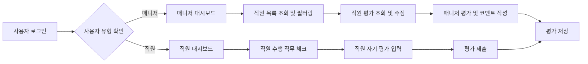

# 직무 평가용 시스템 요구사항 – 완성된 문서

## 1. 개요

이 시스템은 직원의 직무 수행 여부 및 전문성 평가를 통해 구성원의 역량 강화와 조직의 목표 달성을 지원하는 것을 목적으로 한다.

## 2. 사용자 역할 및 인증

- 직원과 매니저는 이메일과 비밀번호를 통해 로그인한다.
- 직원은 자신의 수행 직무 체크와 자기 평가를 연 2회 수행한다.
- 매니저는 관리 직원 목록에서 직원별 평가를 조회 및 수정하고 종합 코멘트를 작성한다.

## 3. 업무 흐름

- 직원은 평가 기간 내에 자기 직무의 Task 및 Activity 수행 여부를 체크한다.
- 직원은 4가지 평가 항목(업무 수행 수준 진단, 지식/기술 평가, 문제해결 및 협업, 혁신성)에 대해 5단계 척도로 점수를 입력 후 종합 코멘트를 작성한다.
- 매니저는 해당 직원의 평가 결과를 보고 수정하거나 인정할 수 있으며, 점수 차이는 별도로 저장된다.
- 모든 평가는 연 2회 시행되고 평가 이력으로 저장되어 조회할 수 있다.

## 4. 평가 척도

- 업무 수행 수준 진단, 문제해결 및 협업, 혁신성의 척도는 동일하며 5단계로 세부 정의된다.
- 지식/기술 평가는 별도의 척도로 세분화되어 있다.
- 평가는 구분하여 직원 자기 평가와 매니저 평가 결과가 관리된다.

## 5. 오류 처리 및 성능 요구사항

- 로그인 실패, 권한 오류, 평가 기간 외 데이터 입력 시 명확한 오류 메시지 제공.
- 로그인 응답 시간 2초 이내, 평가 데이터 처리 3초 이내.

## 6. Mermaid 흐름도

## 7. 결론

본 문서는 직무 수행 및 평가 시스템 구현에 필요한 완전한 요구사항 명세를 담고 있으며, 기술적 구현 세부사항은 개발팀에 위임됨을 명확히 한다.
