# Prisma Markdown

> Generated by [`prisma-markdown`](https://github.com/samchon/prisma-markdown)

- [Systematic](#systematic)
- [Actors](#actors)
- [ContentManagement](#contentmanagement)
- [LearningPath](#learningpath)
- [AssessmentAnalytics](#assessmentanalytics)
- [Communication](#communication)
- [BusinessRules](#businessrules)
- [IntegrationNonFunctional](#integrationnonfunctional)

## Systematic

### `enterprise_lms_tenants`

Tenant organizations representing distinct enterprise customers with
isolated data and configurations. Serves as the core multi-tenant entity
governing data isolation and customization.

Properties as follows:

- `id`: Primary Key.
- `code`: Unique tenant code used as business identifier for the organization.
- `name`: Full name of the tenant organization.
- `created_at`: Timestamp when the tenant was registered.
- `updated_at`: Timestamp when the tenant last updated information.
- `deleted_at`: Soft deletion timestamp, null means active.

### `enterprise_lms_tenant_settings`

Configuration and branding settings specific to each tenant organization.
Includes branding, CSS overrides, custom domains, and localization.

Properties as follows:

- `id`: Primary Key.
- `enterprise_lms_tenant_id`: Belonged tenant organization. [enterprise_lms_tenants.id](#enterprise_lms_tenants)
- `branding_logo_uri`: URI to the tenant's custom branding logo image.
- `branding_color_primary`: Primary branding color in HEX format.
- `branding_color_secondary`: Secondary branding color in HEX format.
- `custom_domain`: Custom domain name for the tenant organization.
- `css_overrides`: Raw CSS overrides applied for tenant-specific branding.
- `created_at`: Timestamp when the settings were created.
- `updated_at`: Timestamp when the settings were last updated.

### `enterprise_lms_system_configurations`

Global system configuration settings affecting all tenants and
platform-wide behavior. Includes feature flags, maintenance modes, and
integrations.

Properties as follows:

- `id`: Primary Key.
- `key`: Configuration key identifier.
- `value`: Serialized value of the configuration setting.
- `description`: Description explaining the meaning and usage of this configuration.
- `created_at`: Timestamp when the configuration was created.
- `updated_at`: Timestamp when the configuration was last updated.

### `enterprise_lms_audit_logs`

Audit logs capturing system-wide events and user activities for
compliance and traceability. Supports multi-tenant event tracking with
detailed metadata.

Properties as follows:

- `id`: Primary Key.
- `enterprise_lms_tenant_id`: Associated tenant organization, if any. [enterprise_lms_tenants.id](#enterprise_lms_tenants)
- `action`: Action performed, such as login, content_upload, enrollment.
- `description`: Detailed description or metadata of the event.
- `user_id`: User who performed the action, if applicable.
- `created_at`: Timestamp when the event occurred.

### `enterprise_lms_sessions`

Tracks active user sessions for authentication, authorization, and audit.
Includes session tokens, expiry, and device metadata.

Properties as follows:

- `id`: Primary Key.
- `enterprise_lms_tenant_id`: Tenant to which the session belongs. [enterprise_lms_tenants.id](#enterprise_lms_tenants)
- `user_id`: User who owns the session.
- `session_token`: Secure opaque session token.
- `ip_address`: IP address of the client.
- `device_info`: Device and browser information.
- `created_at`: Session creation timestamp.
- `updated_at`: Session last updated timestamp.
- `expires_at`: Session expiry timestamp.

### `enterprise_lms_role_permissions`

Role-based permission settings defining access rights for system roles.
Enables granular control over operations and API authorization.

Properties as follows:

- `id`: Primary Key.
- `role_id`: ID of the associated role.
- `permission_key`: Unique key identifying the permission.
- `description`: Human-readable description of the permission.
- `is_allowed`: Flag indicating if the permission is granted (true) or denied (false).
- `created_at`: Creation timestamp.
- `updated_at`: Last update timestamp.

## Actors

```mermaid
erDiagram
"enterprise_lms_systemadmin" {
  String id PK
  String tenant_id FK
  String email UK
  String password_hash
  String first_name
  String last_name
  String status
  DateTime created_at
  DateTime updated_at
  DateTime deleted_at "nullable"
}
"enterprise_lms_organizationadmin" {
  String id PK
  String tenant_id FK
  String email UK
  String password_hash
  String first_name
  String last_name
  String status
  DateTime created_at
  DateTime updated_at
  DateTime deleted_at "nullable"
}
"enterprise_lms_departmentmanager" {
  String id PK
  String tenant_id FK
  String email UK
  String password_hash
  String first_name
  String last_name
  String status
  DateTime created_at
  DateTime updated_at
  DateTime deleted_at "nullable"
}
"enterprise_lms_contentcreatorinstructor" {
  String id PK
  String tenant_id FK
  String email UK
  String password_hash
  String first_name
  String last_name
  String status
  DateTime created_at
  DateTime updated_at
  DateTime deleted_at "nullable"
}
"enterprise_lms_corporatelearner" {
  String id PK
  String tenant_id FK
  String email UK
  String password_hash
  String first_name
  String last_name
  String status
  DateTime created_at
  DateTime updated_at
  DateTime deleted_at "nullable"
}
"enterprise_lms_externallearner" {
  String id PK
  String tenant_id FK
  String email UK
  String password_hash
  String first_name
  String last_name
  String status
  DateTime created_at
  DateTime updated_at
  DateTime deleted_at "nullable"
}
"enterprise_lms_guest" {
  String id PK
  String tenant_id FK
  String email UK
  String password_hash
  String first_name
  String last_name
  String status
  DateTime created_at
  DateTime updated_at
  DateTime deleted_at "nullable"
}
```

### `enterprise_lms_systemadmin`

System Administrator users with full access across all organizations
including system maintenance, global analytics, integrations, and API
administration. Tenant-aware for multi-tenant data isolation.

Properties as follows:

- `id`: Primary Key.
- `tenant_id`: Tenant organization identifier. [enterprise_lms_tenants.id](#enterprise_lms_tenants).
- `email`: Unique email address for login and communications.
- `password_hash`: Hashed password for authentication.
- `first_name`: First name of the system administrator.
- `last_name`: Last name of the system administrator.
- `status`
  > Current status of the system administrator account (e.g., active,
  > suspended).
- `created_at`: Record creation timestamp.
- `updated_at`: Record last update timestamp.
- `deleted_at`: Optional soft delete timestamp.

### `enterprise_lms_organizationadmin`

Organization Administrator users who manage users, roles, content
approvals, configurations, and billing within their own organization.
Tenant-isolated for data security.

Properties as follows:

- `id`: Primary Key.
- `tenant_id`: Tenant organization identifier. [enterprise_lms_tenants.id](#enterprise_lms_tenants).
- `email`: Unique email address for login and communications.
- `password_hash`: Hashed password for authentication.
- `first_name`: First name of the organization administrator.
- `last_name`: Last name of the organization administrator.
- `status`
  > Current status of the organization administrator account (e.g., active,
  > suspended).
- `created_at`: Record creation timestamp.
- `updated_at`: Record last update timestamp.
- `deleted_at`: Optional soft delete timestamp.

### `enterprise_lms_departmentmanager`

Department Manager users who manage users, content assignments, and
budgets within their department. Tenant-aware with departmental scope.

Properties as follows:

- `id`: Primary Key.
- `tenant_id`: Tenant organization identifier. [enterprise_lms_tenants.id](#enterprise_lms_tenants).
- `email`: Unique email address for login and communications.
- `password_hash`: Hashed password for authentication.
- `first_name`: First name of the department manager.
- `last_name`: Last name of the department manager.
- `status`
  > Current status of the department manager account (e.g., active,
  > suspended).
- `created_at`: Record creation timestamp.
- `updated_at`: Record last update timestamp.
- `deleted_at`: Optional soft delete timestamp.

### `enterprise_lms_contentcreatorinstructor`

Content Creator / Instructor users who create and manage course content
and learner progress. Tenant-isolated and limited to owned content scope.

Properties as follows:

- `id`: Primary Key.
- `tenant_id`: Tenant organization identifier. [enterprise_lms_tenants.id](#enterprise_lms_tenants).
- `email`: Unique email address for login and communications.
- `password_hash`: Hashed password for authentication.
- `first_name`: First name of the content creator or instructor.
- `last_name`: Last name of the content creator or instructor.
- `status`
  > Current status of the content creator/instructor account (e.g., active,
  > suspended).
- `created_at`: Record creation timestamp.
- `updated_at`: Record last update timestamp.
- `deleted_at`: Optional soft delete timestamp.

### `enterprise_lms_corporatelearner`

Corporate Learner users who enroll and complete courses, track progress,
and access dashboards. Tenant-isolated and limited in permissions.

Properties as follows:

- `id`: Primary Key.
- `tenant_id`: Tenant organization identifier. [enterprise_lms_tenants.id](#enterprise_lms_tenants).
- `email`: Unique email address for login and communications.
- `password_hash`: Hashed password for authentication.
- `first_name`: First name of the corporate learner.
- `last_name`: Last name of the corporate learner.
- `status`: Current status of the corporate learner account (e.g., active, suspended).
- `created_at`: Record creation timestamp.
- `updated_at`: Record last update timestamp.
- `deleted_at`: Optional soft delete timestamp.

### `enterprise_lms_externallearner`

External Learner users with access to public and paid courses, payment
processing, and community features. Tenant-isolated for data security.

Properties as follows:

- `id`: Primary Key.
- `tenant_id`: Tenant organization identifier. [enterprise_lms_tenants.id](#enterprise_lms_tenants).
- `email`: Unique email address for login and communications.
- `password_hash`: Hashed password for authentication.
- `first_name`: First name of the external learner.
- `last_name`: Last name of the external learner.
- `status`: Current status of the external learner account (e.g., active, suspended).
- `created_at`: Record creation timestamp.
- `updated_at`: Record last update timestamp.
- `deleted_at`: Optional soft delete timestamp.

### `enterprise_lms_guest`

Guest users with browse-only access to public course catalogs. Limited
permissions, tenant-aware for data isolation. No enrollment or creation
rights.

Properties as follows:

- `id`: Primary Key.
- `tenant_id`: Tenant organization identifier. [enterprise_lms_tenants.id](#enterprise_lms_tenants).
- `email`
  > Unique email address for identification and communication. No enrollment
  > rights.
- `password_hash`: Hashed password for guest authentication. Even guests require login.
- `first_name`: First name of the guest user.
- `last_name`: Last name of the guest user.
- `status`: Current status of the guest account (e.g., active, suspended).
- `created_at`: Record creation timestamp.
- `updated_at`: Record last update timestamp.
- `deleted_at`: Optional soft delete timestamp.

## ContentManagement

### `enterprise_lms_contents`

Main content entity managing diverse types of training content (video,
documents, SCORM, xAPI). Supports tenant isolation, approval workflow
status, lifecycle state, soft deletion, and auditing with timestamps.
Connected to content versions, localizations, and approval workflows.

Properties as follows:

- `id`: Primary Key.
- `tenant_id`: Tenant organization owning this content. [enterprise_lms_tenants.id](#enterprise_lms_tenants)
- `title`: Content title for identification and display.
- `description`: Brief description or overview of the content.
- `content_type`: Content format/type, e.g., video, document, SCORM, xAPI.
- `status`: Approval workflow status: draft, pending, approved, rejected.
- `business_status`: Lifecycle state: active, archived, deprecated.
- `created_at`: Creation timestamp of the content record.
- `updated_at`: Latest update timestamp to content metadata.
- `deleted_at`: Soft delete timestamp, null means not deleted.

### `enterprise_lms_content_versions`

Snapshots of content states representing historical versions for audit,
rollback, and compliance. Stores full content metadata at snapshot time
and version ordering. Related to primary content entity.

Properties as follows:

- `id`: Primary Key.
- `content_id`: Reference to primary content entity. [enterprise_lms_contents.id](#enterprise_lms_contents)
- `version_number`: Sequenced version number of this snapshot.
- `title`: Title snapshot at version creation.
- `description`: Description snapshot for this version.
- `content_type`: Content format/type at version time.
- `status`: Approval status snapshot.
- `business_status`: Business lifecycle state snapshot.
- `created_at`: Timestamp when this version snapshot was created.

### `enterprise_lms_content_approval_workflows`

Approval workflow steps linked to content capturing review stages,
reviewer roles, status flags, comments, and timestamps. Enables
multi-stage approval process tracking and compliance audit workflow.

Properties as follows:

- `id`: Primary Key.
- `content_id`: Associated content entity. [enterprise_lms_contents.id](#enterprise_lms_contents)
- `step_number`: Sequential approval step number.
- `reviewer_role`
  > Role of reviewer responsible for this step, e.g., organizationAdmin,
  > contentCreatorInstructor.
- `status`: Status for this approval step: pending, approved, rejected.
- `comments`: Optional reviewer comments on this approval step.
- `created_at`: Creation timestamp for this approval step record.
- `updated_at`: Last updated timestamp for this approval step record.

### `enterprise_lms_content_localizations`

Localized content properties supporting multi-language content
management. Stores translations and locale-specific metadata per content
item. Tied to primary content entries.

Properties as follows:

- `id`: Primary Key.
- `content_id`: Reference to primary content entity. [enterprise_lms_contents.id](#enterprise_lms_contents)
- `language_code`: ISO 639-1 language code, e.g., 'en' for English, 'fr' for French.
- `localized_title`: Localized version of the content title.
- `localized_description`: Localized description specific to language.
- `created_at`: Timestamp when localization was created.
- `updated_at`: Timestamp when localization was last updated.

### `enterprise_lms_content_tags`

Tags to classify and organize content materials. Tags are primary
business entities with unique codes, descriptive names, and optional
descriptions facilitating content discovery and filtering.

Properties as follows:

- `id`: Primary Key.
- `code`: Unique identifying code for the tag.
- `name`: Display name of the tag.
- `description`: Optional descriptive information about the tag's purpose.

### `enterprise_lms_content_tag_hierarchy`

Defines parent-child relationships between tags to form hierarchical tag
structures. Enables tag inheritance and structured browsing. Supports
administrative management of tag hierarchy.

Properties as follows:

- `id`: Primary Key.
- `parent_tag_id`: Reference to the parent tag entity. [enterprise_lms_content_tags.id](#enterprise_lms_content_tags)
- `child_tag_id`: Reference to the child tag entity. [enterprise_lms_content_tags.id](#enterprise_lms_content_tags)
- `created_at`: Timestamp when the parent-child relation was established.

## LearningPath

### `enterprise_lms_learning_paths`

Represents an enterprise learning path defining a sequence of training
modules or courses for learners within a tenant organization. Organizes
learning experiences and manages lifecycle states.

Properties as follows:

- `id`: Primary Key.
- `tenant_id`
  > Tenant organization this learning path belongs to. {@link
  > enterprise_lms_tenants.id}.
- `code`: Unique code identifying this learning path within the tenant.
- `title`: Title of the learning path.
- `description`: Optional detailed description of the learning path.
- `status`
  > Current lifecycle status of the learning path (e.g., active, inactive,
  > archived).
- `created_at`: Timestamp when the learning path record was created.
- `updated_at`: Timestamp when the learning path was last updated.
- `deleted_at`: Timestamp marking soft deletion of the record.

### `enterprise_lms_learning_path_items`

Modules or content items assigned within a learning path, sequencing
training components to guide learner progress. Managed through the parent
learning path.

Properties as follows:

- `id`: Primary Key.
- `learning_path_id`
  > The parent learning path this item belongs to. {@link
  > enterprise_lms_learning_paths.id}.
- `item_type`: The type of the item (e.g., course, module, assessment).
- `item_id`: The identifier of the actual content or assessment this item references.
- `sequence_order`: The position of this item within the learning path sequence.
- `created_at`: Timestamp when the learning path item was created.
- `updated_at`: Timestamp when the learning path item was last updated.
- `deleted_at`: Timestamp for soft deletion of the learning path item.

### `enterprise_lms_prerequisites`

Defines prerequisite relationships between learning path items, enforcing
learner progression constraints and enrollment requirements.

Properties as follows:

- `id`: Primary Key.
- `from_item_id`
  > The prerequisite item that must be completed before the dependent item.
  > [enterprise_lms_learning_path_items.id](#enterprise_lms_learning_path_items).
- `to_item_id`
  > The dependent item that requires the prerequisite completion. {@link
  > enterprise_lms_learning_path_items.id}.
- `created_at`: Timestamp when this prerequisite relationship was created.
- `updated_at`: Timestamp when this prerequisite relationship was last updated.

### `enterprise_lms_certifications`

Represents certifications offered to learners, with associated metadata
and lifecycle management within a tenant organization.

Properties as follows:

- `id`: Primary Key.
- `tenant_id`
  > Tenant organization this certification belongs to. {@link
  > enterprise_lms_tenants.id}.
- `code`: Unique code for this certification within the tenant.
- `name`: Name of the certification program.
- `description`: Detailed description about the certification.
- `status`: Lifecycle status of the certification (e.g., active, deprecated, retired).
- `created_at`: Timestamp this certification record was created.
- `updated_at`: Timestamp this certification record was last updated.
- `deleted_at`: Soft deletion timestamp.

### `enterprise_lms_certification_expirations`

Stores expiration and renewal policies for certifications, enabling
compliance enforcement.

Properties as follows:

- `id`: Primary Key.
- `certification_id`
  > Certification associated with this expiration policy. {@link
  > enterprise_lms_certifications.id}.
- `expiration_period_days`
  > Number of days after certification issuance when the certification will
  > expire.
- `renewal_required`: Indicates if renewal is required after certification expires.
- `notification_period_days`
  > Number of days prior to expiration when notifications should be sent to
  > learners and administrators.
- `created_at`: Timestamp when this expiration policy was created.
- `updated_at`: Timestamp when this expiration policy was last updated.

### `enterprise_lms_competencies`

Defines competencies and skill sets linked to learning objectives and
certifications within the tenant context.

Properties as follows:

- `id`: Primary Key.
- `tenant_id`
  > Tenant organization this competency belongs to. {@link
  > enterprise_lms_tenants.id}.
- `code`: Unique code identifying this competency within the tenant.
- `name`: Name of the competency skill or capability.
- `description`: Detailed explanation of the competency.
- `created_at`: Timestamp the competency was created.
- `updated_at`: Timestamp the competency was last updated.
- `deleted_at`: Soft deletion timestamp.

### `enterprise_lms_blended_learning_sessions`

Represents blended learning sessions which may combine online and offline
instructional activities with scheduling and status tracking in tenant
context.

Properties as follows:

- `id`: Primary Key.
- `tenant_id`
  > Tenant organization owning this session. {@link
  > enterprise_lms_tenants.id}.
- `session_type`: Type of session (e.g., online, offline, hybrid).
- `title`: Title or name of the blended learning session.
- `description`: Detailed description of session activities and purpose.
- `status`: Current status of the session (e.g., scheduled, completed, cancelled).
- `scheduled_start_at`: Scheduled start date and time of the session.
- `scheduled_end_at`: Scheduled end date and time, if known.
- `actual_start_at`: Actual start date and time.
- `actual_end_at`: Actual end date and time.
- `created_at`: Timestamp when the record was created.
- `updated_at`: Timestamp when the record was last updated.
- `deleted_at`: Soft deletion timestamp.

## AssessmentAnalytics

### `enterprise_lms_assessments`

Represents the main assessment entity in the LMS, containing metadata
about quizzes, surveys, peer reviews, and other assessment types. This
table links to the tenant organizational context via tenant_id (existing
table). It holds lifecycle and status information for assessment
management, scheduling, and tracking. Related to questions ({@link
enterprise_lms_assessment_questions}) and results ({@link
enterprise_lms_assessment_results}).

Properties as follows:

- `id`: Primary Key.
- `tenant_id`
  > Tenant organization owning this assessment. {@link
  > enterprise_lms_tenants.id}
- `code`: Unique business code identifying the assessment.
- `title`: Title of the assessment.
- `description`: Detailed description of the assessment content and purpose.
- `assessment_type`: Type of assessment, e.g., quiz, survey, peer review, practical assignment.
- `max_score`: Maximum achievable score for this assessment.
- `passing_score`: Minimum score required to pass this assessment.
- `scheduled_start_at`: Scheduled start datetime for the assessment.
- `scheduled_end_at`: Scheduled end datetime for the assessment.
- `status`
  > Current status of the assessment such as planned, active, completed, or
  > cancelled.
- `created_at`: Record creation timestamp.
- `updated_at`: Record last update timestamp.
- `deleted_at`: Soft deletion timestamp, null if not deleted.

### `enterprise_lms_assessment_questions`

Stores individual questions belonging to assessments, supporting
different question types and text content. It relates to the parent
assessment ([enterprise_lms_assessments](#enterprise_lms_assessments)) and can support question
weighting and scoring.

Properties as follows:

- `id`: Primary Key.
- `assessment_id`: Parent assessment reference. [enterprise_lms_assessments.id](#enterprise_lms_assessments)
- `question_text`: Text content of the question for display to learners.
- `question_type`: Type of question such as multiple choice, true/false, essay, practical.
- `weight`: Weight or points this question contributes to total assessment score.
- `created_at`: Record creation timestamp.
- `updated_at`: Record last update timestamp.
- `deleted_at`: Soft deletion timestamp, null if not deleted.

### `enterprise_lms_assessment_results`

Captures the results of learner attempts on assessments, recording
scores, completion timestamps, and status. Links to the assessment
attempted and the learner (existing corporate learners table).

Properties as follows:

- `id`: Primary Key.
- `assessment_id`: Referenced assessment. [enterprise_lms_assessments.id](#enterprise_lms_assessments)
- `learner_id`
  > Learner who took the assessment. {@link
  > enterprise_lms_corporatelearner.id}
- `score`: Score achieved in this assessment attempt.
- `completed_at`: Timestamp when assessment was completed.
- `status`: Status of the attempt, e.g., pending, completed, failed.
- `created_at`: Record creation timestamp.
- `updated_at`: Record last update timestamp.
- `deleted_at`: Soft deletion timestamp if applicable.

### `enterprise_lms_proctored_exams`

Represents proctored exams integrated via third-party proctoring
platforms, linked to assessments and scheduling details. Includes exam
session details, proctor identifiers, and status.

Properties as follows:

- `id`: Primary Key.
- `assessment_id`
  > Linked assessment for this proctored exam. {@link
  > enterprise_lms_assessments.id}
- `exam_session_id`
  > Unique identifier for the proctored exam session from the third-party
  > provider.
- `proctor_id`: Identifier for the proctor overseeing the exam, if applicable.
- `scheduled_at`: Scheduled timestamp for the proctored exam.
- `status`
  > Current status of the proctored exam, e.g., scheduled, in_progress,
  > completed, cancelled.
- `created_at`: Record creation timestamp.
- `updated_at`: Record last update timestamp.
- `deleted_at`: Soft deletion timestamp if applicable.

### `enterprise_lms_analytics_reports`

Stores precomputed analytics reports and summaries related to assessments
and learner performance for efficient dashboard rendering and compliance
reporting. Linked to tenant organizational context for scoped reporting.

Properties as follows:

- `id`: Primary Key.
- `tenant_id`
  > Tenant organization associated with this analytics report. {@link
  > enterprise_lms_tenants.id}
- `report_name`: Descriptive name of the analytics report.
- `report_type`: Type of the report, e.g., completion, engagement, compliance.
- `parameters_json`
  > JSON string containing filter and aggregation parameters for the report
  > generation.
- `generated_at`: Timestamp when the report was generated.
- `content_json`: JSON string containing the full report content, data, and metadata.
- `created_at`: Record creation timestamp.
- `updated_at`: Record last update timestamp.
- `deleted_at`: Soft deletion timestamp for the report.

## Communication

### `enterprise_lms_forums`

This model represents discussion forums within the enterprise LMS. Forums
are tenant-scoped containers for discussion threads. Each forum has an
owner (usually the organization or department admin) and supports soft
deletes for archival. Forums enable structured conversations and
community engagement within tenant boundaries.

Properties as follows:

- `id`: Primary Key.
- `tenant_id`: Tenant owning the forum. [enterprise_lms_tenants.id](#enterprise_lms_tenants)
- `owner_id`
  > Owner user of the forum (organization/department admin). {@link
  > enterprise_lms_organizationadmin.id}
- `name`: Name of the forum.
- `description`: Optional description of the forum.
- `created_at`: Timestamp when the forum was created.
- `updated_at`: Timestamp when the forum was last updated.
- `deleted_at`: Optional timestamp for soft deletion.

### `enterprise_lms_forum_threads`

Represents discussion threads inside a forum. Threads belong to a forum
and have an author. Threads support soft deletion and track their
creation and update timestamps. This entity enables discussion grouping
under forums.

Properties as follows:

- `id`: Primary Key.
- `forum_id`: Forum to which this thread belongs. [enterprise_lms_forums.id](#enterprise_lms_forums)
- `author_id`
  > User who created the thread (content creator/instructor). {@link
  > enterprise_lms_contentcreatorinstructor.id}
- `title`: Title of the thread.
- `body`: Initial post content or thread description.
- `created_at`: Creation timestamp.
- `updated_at`: Last update timestamp.
- `deleted_at`: Soft delete timestamp.

### `enterprise_lms_forum_posts`

Individual posts within a forum thread. Posts contain the message
content, author information, and support soft deletion. Posts belong to a
forum thread and are ordered by creation time. Enables detailed
conversations at the post level.

Properties as follows:

- `id`: Primary Key.
- `thread_id`: Forum thread containing this post. [enterprise_lms_forum_threads.id](#enterprise_lms_forum_threads)
- `author_id`
  > User who authored the post (corporate learner or instructor). {@link
  > enterprise_lms_corporatelearner.id}
- `body`: Content body of the post.
- `created_at`: Creation timestamp.
- `updated_at`: Last update timestamp.
- `deleted_at`: Soft delete timestamp.

### `enterprise_lms_direct_messages`

Direct private messages exchanged between users. Each message has a
sender, recipient, content, timestamp, and read status. Supports soft
deletion to allow recovery and audit. Messages are tenant-scoped to
ensure strict multi-tenant isolation.

Properties as follows:

- `id`: Primary Key.
- `tenant_id`: Tenant owning the message. [enterprise_lms_tenants.id](#enterprise_lms_tenants)
- `sender_id`
  > User who sent the message (any user role). {@link
  > enterprise_lms_corporatelearner.id}
- `recipient_id`: Message recipient user. [enterprise_lms_corporatelearner.id](#enterprise_lms_corporatelearner)
- `body`: Message content.
- `sent_at`: Timestamp when message was sent.
- `read_at`: Timestamp when message was read.
- `deleted_at`: Soft delete timestamp.

### `enterprise_lms_virtual_classrooms`

Scheduled virtual classroom sessions for live training. Sessions belong
to a tenant and are created by an instructor. Each session has a title,
description, start and end timestamps, and soft delete support. Enables
live, synchronous instruction within the enterprise LMS.

Properties as follows:

- `id`: Primary Key.
- `tenant_id`: Tenant owning the virtual classroom. [enterprise_lms_tenants.id](#enterprise_lms_tenants)
- `instructor_id`
  > Session instructor (content creator/instructor). {@link
  > enterprise_lms_contentcreatorinstructor.id}
- `title`: Title of the virtual classroom session.
- `description`: Optional description of the session.
- `start_at`: Start timestamp of the session.
- `end_at`: End timestamp of the session.
- `created_at`: Creation timestamp.
- `updated_at`: Last update timestamp.
- `deleted_at`: Soft delete timestamp.

### `enterprise_lms_group_projects`

Group project entities representing collaborative workspaces within the
LMS. Projects belong to a tenant and may be owned by single or multiple
users. Each project has a title, description, start and end dates, and
soft delete support. Enables teamwork and collaboration across enterprise
learners.

Properties as follows:

- `id`: Primary Key.
- `tenant_id`: Tenant owning the project. [enterprise_lms_tenants.id](#enterprise_lms_tenants)
- `owner_id`
  > Owner user of the project (corporate learner or instructor). {@link
  > enterprise_lms_corporatelearner.id}
- `title`: Title of the group project.
- `description`: Optional description of the project.
- `start_at`: Project start timestamp.
- `end_at`: Project end timestamp.
- `created_at`: Creation timestamp.
- `updated_at`: Last update timestamp.
- `deleted_at`: Soft delete timestamp.

### `enterprise_lms_announcements`

Announcement messages sent to groups within tenants. Announcements have a
title, body, target audience description, and status tracking including
delivery receipts. They support soft deletion and timestamps for creation
and update. Announcements help communicate important information across
the enterprise LMS ecosystem.

Properties as follows:

- `id`: Primary Key.
- `tenant_id`: Tenant owning the announcement. [enterprise_lms_tenants.id](#enterprise_lms_tenants)
- `creator_id`
  > User who created the announcement (organization/department admin). {@link
  > enterprise_lms_organizationadmin.id}
- `title`: Title of the announcement.
- `body`: Content body of the announcement.
- `target_audience_description`: Description of the target audience for the announcement.
- `status`: Current status of the announcement, e.g. 'draft', 'sent', 'archived'.
- `created_at`: Creation timestamp.
- `updated_at`: Last update timestamp.
- `deleted_at`: Soft delete timestamp.

## BusinessRules

### `enterprise_lms_enrollments`

This table records enrollment information for learners in courses and
programs within the LMS. It links learners to learning paths or courses,
enforcing prerequisite validations and status tracking. Includes soft
deletion support, creation, and update timestamps.

Properties as follows:

- `id`: Primary Key.
- `learner_id`: Belonged learner's enterprise_lms_corporatelearner.id.
- `learning_path_id`: Belonged learning path's enterprise_lms_learning_paths.id.
- `status`: Current enrollment status such as 'active', 'completed', 'cancelled'.
- `business_status`: Business workflow state for enrollment approvals or special states.
- `created_at`: Record creation timestamp.
- `updated_at`: Record last update timestamp.
- `deleted_at`: Soft delete timestamp; null means active.

### `enterprise_lms_enrollment_prerequisites`

This subsidiary table defines the prerequisite relationships between
enrollments and the courses or modules that must be completed beforehand.
It supports prerequisite enforcement and audit trails.

Properties as follows:

- `id`: Primary Key.
- `enrollment_id`: Belonged enrollment's enterprise_lms_enrollments.id.
- `prerequisite_course_id`
  > Prerequisite course's enterprise_lms_contents.id to be completed before
  > enrollment.
- `created_at`: Creation time for this prerequisite link.
- `updated_at`: Last update time for this record.

### `enterprise_lms_certificate_issuances`

Tracks issuance of certificates to learners upon successful course or
certification track completion including validation of passing scores and
expiration. Includes status and soft delete.

Properties as follows:

- `id`: Primary Key.
- `learner_id`: Belonged learner's enterprise_lms_corporatelearner.id.
- `certification_id`: Belonged certification's enterprise_lms_certifications.id.
- `issue_date`: Date when certificate was issued.
- `expiration_date`: Certificate expiration date, if any.
- `status`: Certificate status such as 'valid', 'expired', 'revoked'.
- `business_status`: Business state for certificate workflow, e.g., renewal process.
- `created_at`: Record creation timestamp.
- `updated_at`: Record last update timestamp.
- `deleted_at`: Soft delete timestamp; null means active.

### `enterprise_lms_content_access_controls`

Defines content access control rules assigning visibility and permissions
to learners and user roles. It restricts content access by tenant,
department, role, and individual learner with auditing timestamps.

Properties as follows:

- `id`: Primary Key.
- `content_id`: Belonged content's enterprise_lms_contents.id.
- `tenant_id`: Belonged tenant's enterprise_lms_tenants.id.
- `allowed_roles`: Comma-separated allowed roles like 'corporateLearner,externalLearner'.
- `allowed_learners`: Comma-separated specific learner IDs allowed.
- `created_at`: Creation timestamp.
- `updated_at`: Last update timestamp.

### `enterprise_lms_progress_tracking`

Stores detailed learner progress including time spent, assessment
attempts, and engagement metrics per content item. Supports soft deletion
and consistent timestamps.

Properties as follows:

- `id`: Primary Key.
- `learner_id`: Belonged learner's enterprise_lms_corporatelearner.id.
- `content_id`: Belonged content's enterprise_lms_contents.id.
- `time_spent_seconds`: Total time spent on content in seconds.
- `assessment_attempts`: Number of assessment attempts made.
- `engagement_score`: Engagement level metric.
- `created_at`: Record creation time.
- `updated_at`: Last update time.
- `deleted_at`: Soft delete timestamp.

### `enterprise_lms_compliance_records`

Records compliance audit logs and regulatory training validations for
learners across tenants. Contains detailed tracking data and timestamps
for audit and reporting purposes.

Properties as follows:

- `id`: Primary Key.
- `learner_id`: Belonged learner's enterprise_lms_corporatelearner.id.
- `tenant_id`: Belonged tenant's enterprise_lms_tenants.id.
- `compliance_type`
  > Type of compliance such as 'regulatory', 'internal audit',
  > 'certification'.
- `compliance_status`: Current status of compliance like 'passed', 'failed', 'pending'.
- `details`: Detailed compliance data and notes.
- `created_at`: Record creation timestamp.
- `updated_at`: Record update timestamp.

## IntegrationNonFunctional

### `enterprise_lms_payment_transactions`

Records of payment processing transactions related to course purchases,
subscriptions, and certifications within the Enterprise LMS. This model
captures details including transaction amounts, currencies, methods,
statuses, timestamps, and relevant references to external payment
gateways and users. It supports auditing and financial reconciliation
workflows, ensuring traceability and regulatory compliance.

Properties as follows:

- `id`: Primary Key.
- `tenant_id`
  > Tenant organization owning this transaction. {@link
  > enterprise_lms_tenants.id}.
- `user_id`
  > User who performed or authorized this transaction. {@link
  > enterprise_lms_corporatelearner.id}.
- `transaction_code`
  > Unique code identifying this payment transaction for tracking and
  > reconciliation.
- `amount`: Transaction amount in the specified currency.
- `currency`: ISO 4217 currency code for the transaction, e.g., USD, EUR.
- `payment_method`: Method used for payment, such as credit card, PayPal, bank transfer.
- `status`: Current status of the transaction, e.g., pending, completed, failed.
- `gateway_reference`: Reference code from the payment gateway or processor.
- `created_at`: Record creation timestamp.
- `updated_at`: Record last update timestamp.
- `deleted_at`: Soft delete timestamp indicating logical deletion.

### `enterprise_lms_notification_logs`

Logs of notifications sent by the LMS system including email, SMS, and
in-app alerts. This table records notification types, recipient
identifiers, message contents, delivery statuses, timestamps, and related
tenant context to support auditing and tracking communication efficacy.

Properties as follows:

- `id`: Primary Key.
- `tenant_id`
  > Tenant organization associated with this notification. {@link
  > enterprise_lms_tenants.id}.
- `notification_type`: Type of notification, e.g., email, sms, push.
- `recipient_identifier`: Recipient identifier such as email address, phone number, or device token.
- `message_body`: Content of the notification message.
- `delivery_status`: Current delivery status such as sent, failed, queued.
- `sent_at`: Timestamp when notification was sent.
- `created_at`: Record creation timestamp.
- `updated_at`: Record last update timestamp.

### `enterprise_lms_integration_settings`

Configuration settings for external integrations used by the Enterprise
LMS, including API keys, endpoints, credentials, and toggles related to
third-party platforms such as payment gateways, notification services,
analytics providers, and security services. Supports multi-tenant
customization and secure storage of sensitive integration data.

Properties as follows:

- `id`: Primary Key.
- `tenant_id`
  > Tenant organization owning this configuration. {@link
  > enterprise_lms_tenants.id}.
- `integration_name`
  > Name of the external integration platform or service, e.g., Stripe,
  > SendGrid, Mixpanel.
- `config_key`: Key or identifier for this configuration entry.
- `config_value`: Configuration value, which may contain encrypted secrets or URLs.
- `enabled`: Flag indicating whether this integration config is active.
- `created_at`: Timestamp when this configuration was created.
- `updated_at`: Timestamp when this configuration was last updated.

### `enterprise_lms_performance_metrics`

Performance metrics records collected periodically capturing system CPU
usage, memory, request rates, error rates, and latency statistics.
Metrics cover per-tenant and global system levels to enable monitoring,
alerting, and capacity planning.

Properties as follows:

- `id`: Primary Key.
- `tenant_id`
  > Tenant organization this metric belongs to (nullable for global metrics).
  > [enterprise_lms_tenants.id](#enterprise_lms_tenants).
- `metric_name`: Name of the performance metric, e.g., cpu_usage_percent, request_rate.
- `metric_value`: Value of the metric at the recorded time.
- `recorded_at`: Timestamp when the metric was recorded.
- `created_at`: Record creation timestamp.
- `updated_at`: Record last update timestamp.

### `enterprise_lms_security_audit_logs`

Audit log entries capturing security-related events such as login
attempts, permission changes, configuration modifications, and access
violations. Supports compliance regulations and forensic investigations
across multiple tenants.

Properties as follows:

- `id`: Primary Key.
- `tenant_id`
  > Tenant organization related to this event. {@link
  > enterprise_lms_tenants.id}.
- `user_id`
  > User who triggered or was affected by this security event. {@link
  > enterprise_lms_corporatelearner.id}.
- `event_type`
  > Type of security event, e.g., login_success, permission_change,
  > access_denied.
- `event_details`: Detailed description or JSON payload of the event.
- `occurred_at`: Timestamp when the event occurred.
- `created_at`: Record creation timestamp.
- `updated_at`: Record last update timestamp.

### `enterprise_lms_backup_records`

Records of system backup snapshots including timestamps, backup types,
storage locations, sizes, and status. Supports disaster recovery,
compliance auditing, and operational transparency across the multi-tenant
LMS platform.

Properties as follows:

- `id`: Primary Key.
- `backup_timestamp`: Timestamp when the backup was taken.
- `backup_type`: Type of backup such as full, incremental, differential.
- `storage_location`: Storage path or URL where the backup is stored.
- `backup_size_bytes`: Size of the backup in bytes.
- `status`: Current status of the backup, e.g., completed, failed, in_progress.
- `created_at`: Record creation timestamp.
- `updated_at`: Record last update timestamp.
