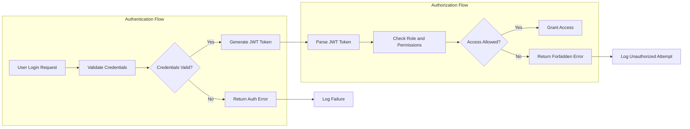

# Enterprise Learning Management System (LMS) User Roles and Authentication Requirements

## 1. Introduction

### 1.1 Purpose and Scope
This document defines the complete set of user roles, permissions, and authentication requirements necessary for the Enterprise LMS platform. It aligns with the multi-tenant architecture and complex hierarchical roles to ensure secure, scalable, and customizable user access. This document serves backend developers building the authentication and authorization components.

### 1.2 Overview of Enterprise LMS
The LMS is designed for enterprise training across multiple organizations with isolated data and configuration. It supports advanced role management, AI-powered personalization, compliance tracking, and multi-format content management.

## 2. Authentication Overview

### 2.1 Authentication Methods
- Users MUST be able to authenticate via traditional credentials (email/username and password).
- THE system SHALL support registration, login, logout, password reset, and email verification.
- THE system SHALL maintain secure user sessions.

### 2.2 Single Sign-On (SSO) Integration
- THE system SHALL integrate with enterprise identity providers using SAML 2.0, OAuth 2.0, and LDAP protocols.
- THE system SHALL support configuration of SSO per organization tenant.

### 2.3 Session Management
- THE system SHALL expire user sessions after 30 days of inactivity.
- THE system SHALL allow users to revoke active sessions from all devices.

## 3. User Role Structure

### 3.1 Multi-tenant Architecture
- THE system SHALL implement a shared database schema with tenant identifiers isolating organization data.
- THE system SHALL store tenant-specific branding and settings securely.

### 3.2 Role Hierarchy Overview
The system SHALL support the following roles:
- System Administrator
- Organization Administrator
- Department Manager
- Content Creator/Instructor
- Corporate Learner
- External Learner
- Guest

Each role has defined permissions and limitations.

## 4. Role Descriptions and Permissions

### 4.1 System Administrator
- Full system access across all organizations.
- Server configuration and maintenance.
- Access global analytics and all reports.
- Manage integrations and API keys.

### 4.2 Organization Administrator
- Control within their organization.
- Manage users and assign roles.
- Approve content and modify organization settings.
- View financial reporting and billing.

### 4.3 Department Manager
- Manage users within their department only.
- Assign content and track departmental progress.
- Approve budgets for paid content.
- Access department-level analytics.

### 4.4 Content Creator/Instructor
- Create and upload courses and content.
- Monitor student progress and provide grading.
- Access limited analytics for owned content.

### 4.5 Corporate Learner
- Enroll and complete courses assigned.
- Track progress and download certificates.
- Participate in discussions and peer interactions.
- Access personal learning dashboards.

### 4.6 External Learner
- Browse and access public courses with limited rights.
- Process payments for paid content.
- Basic progress tracking.
- Participate in community features.

### 4.7 Guest
- Browse public course catalogs only.
- No enrollment capabilities.
- Anonymous analytics tracking permitted.

## 5. Dynamic Permissions Matrix

### 5.1 Role-Based Access Control (RBAC)
- THE system SHALL enforce a set of permissions predefined for each role.

### 5.2 Attribute-Based Access Control (ABAC)
- THE system SHALL restrict permissions based on resource context (e.g., content creator can edit only their content).

### 5.3 Context-Aware Permissions
- THE system SHALL allow department managers to see users and content only within their department.

### 5.4 Customization by Organization Admins
- Organization Admins SHALL be able to customize the permissions matrix within their organization while respecting minimum global security constraints imposed by the system.

## 6. JWT Token Management

### 6.1 Token Types and Expiry
- THE system SHALL use JSON Web Tokens (JWT) for user authentication and authorization.
- Access tokens SHALL expire after 15 to 30 minutes.
- Refresh tokens SHALL expire between 7 to 30 days.

### 6.2 JWT Payload Structure
- Tokens SHALL include claims for userId, role, permissions array, tenantId (organization identifier), and expiration.

### 6.3 Token Revocation and Refresh
- THE system SHALL allow token revocation on logout or security events.
- THE system SHALL support token refresh workflows to obtain new access tokens via valid refresh tokens.

## 7. Permission Matrix

| Action                         | System Admin | Org Admin | Dept Manager | Instructor | Corp Learner | Ext Learner | Guest |
|--------------------------------|--------------|-----------|--------------|------------|--------------|-------------|-------|
| Manage all organizations data  | ✅           | ❌        | ❌           | ❌         | ❌           | ❌          | ❌    |
| Configure server and system     | ✅           | ❌        | ❌           | ❌         | ❌           | ❌          | ❌    |
| Manage users across system      | ✅           | ❌        | ❌           | ❌         | ❌           | ❌          | ❌    |
| Manage users in organization    | ✅           | ✅        | ❌           | ❌         | ❌           | ❌          | ❌    |
| Manage users in department      | ✅           | ✅        | ✅           | ❌         | ❌           | ❌          | ❌    |
| Create, edit own content        | ✅           | ✅        | ❌           | ✅         | ❌           | ❌          | ❌    |
| Approve content                 | ✅           | ✅        | ❌           | ❌         | ❌           | ❌          | ❌    |
| View global analytics           | ✅           | ❌        | ❌           | ❌         | ❌           | ❌          | ❌    |
| View organization analytics    | ✅           | ✅        | ❌           | ❌         | ❌           | ❌          | ❌    |
| View department analytics      | ✅           | ✅        | ✅           | ❌         | ❌           | ❌          | ❌    |
| Enroll in courses              | ❌           | ❌        | ❌           | ❌         | ✅           | ✅          | ❌    |
| Complete courses               | ❌           | ❌        | ❌           | ❌         | ✅           | ✅          | ❌    |
| Access public courses          | ❌           | ❌        | ❌           | ❌         | ❌           | ✅          | ✅    |
| Payment for courses            | ❌           | ❌        | ❌           | ❌         | ❌           | ✅          | ❌    |
| Participate in discussions    | ❌           | ❌        | ❌           | ❌         | ✅           | ✅          | ✅    |

## 8. Error Handling and Security Considerations

### 8.1 Authentication Failures
- IF authentication fails due to invalid credentials, THEN THE system SHALL return error code AUTH_INVALID_CREDENTIALS with HTTP 401 status.
- IF token is expired or invalid, THEN THE system SHALL prompt re-authentication.

### 8.2 Unauthorized Access Attempts
- IF a user attempts to access resources beyond their permission, THEN THE system SHALL return HTTP 403 Forbidden with an appropriate error message.

### 8.3 Audit Trails and Compliance
- THE system SHALL log all authentication and authorization events with user ID, timestamp, action, and outcome.
- Audit logs SHALL be immutable and retained according to compliance rules.

## 9. Summary and Developer Autonomy Note
This document strictly specifies business requirements for authentication, user roles, and permissions within the Enterprise LMS. All technical choices regarding architecture, implementation technologies, data storage, and security mechanisms are at the full discretion of the development team. Developers have complete autonomy in designing the system to meet these functional requirements.

---

