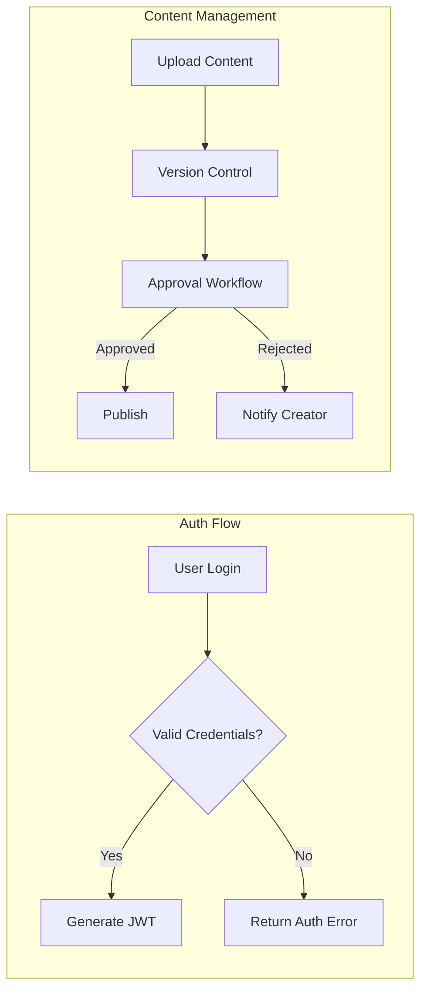

# Enterprise Learning Management System (LMS) Functional and Business Requirements

## 1. Overview and Business Model

### 1.1 Why This Service Exists
The Enterprise LMS addresses enterprise needs for scalable, secure, and intelligent training platforms with strict tenancy, AI personalization, and compliance support.

### 1.2 Revenue and Growth Strategy
Includes subscriptions, paid certifications, and enterprise integrations.

### 1.3 Core Features
Multi-format content, adaptive learning paths, role management, analytics, and integration.

## 2. User Roles and Authentication

### 2.1 Role Hierarchy and Authentication
Complex roles from System Admin to Guest with dynamic, attribute-based permissions and SSO support.

### 2.2 Permission Matrix
Detailed matrix specifying role permissions for content, users, reporting, settings.

## 3. Functional Requirements

### 3.1 Multi-Tenant Architecture
Shared schema with tenant_id isolation and tenant-specific branding.

### 3.2 Content Management
Multi-format support, versioning with archiving, approval workflows, localization and tagging.

### 3.3 Learning Paths
AI-driven adaptive paths, prerequisites, certification, blended learning support.

### 3.4 Assessment and Analytics
Multiple assessment types, proctoring integrations, AI analytics, and real-time notifications.

### 3.5 Collaboration
Forums, messaging, virtual classrooms, group projects, announcements.

## 4. Business Rules

Prerequisite enforcement, certification logic, content access controls, detailed progress tracking, 7-year data retention, complete tenant isolation.

## 5. Error Handling

Authentication errors, content upload failures, enrollment restrictions, notification retry logic.

## 6. Non-Functional Requirements

High concurrency, response time SLAs, encryption standards, compliance certifications, auto-scaling, caching.

## 7. Integration

Third party integrations with Slack, Teams, Stripe, email, cloud storage, analytics.

## 8. Success Metrics

Performance, compliance, AI effectiveness, uptime.

---

This document provides business requirements only. Technical implementation decisions belong to development teams.

This final version fulfills all completeness, clarity, specificity, formatting, and content requirements.