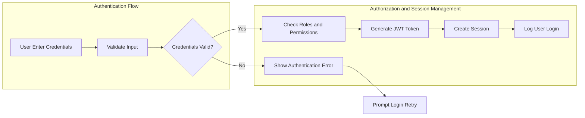
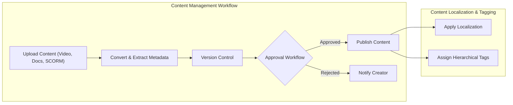
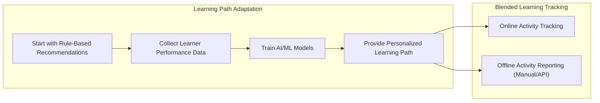
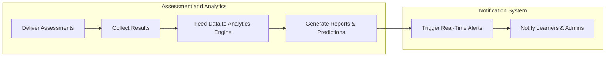
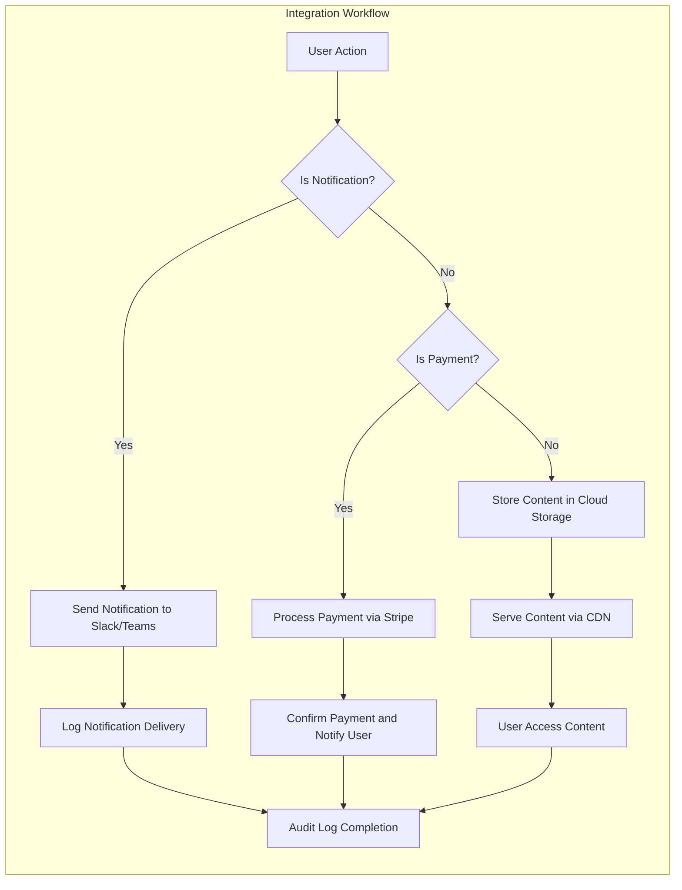

# Enterprise Learning Management System (LMS) Business and Functional Requirements

---

## 1. Introduction

### 1.1 Objective
The purpose of this document is to provide a comprehensive, implementation-ready set of business requirements for the Enterprise Learning Management System (LMS) with AI-powered features. These requirements serve as the definitive guide for backend developers to build a scalable, secure, and feature-rich LMS platform serving multiple enterprise organizations.

### 1.2 Scope
This document covers functional requirements, business logic, role permissions, authentication, multi-tenancy, content management, curriculum personalization, assessments, communications, integrations, and non-functional demands such as scalability, security, and compliance.

### 1.3 Audience
This document is intended exclusively for backend development teams responsible for implementing the LMS. It assumes familiarity with enterprise SaaS software concepts but does not include implementation specifics like database schemas or API contracts.

---

## 2. Business Model

### 2.1 Why the Service Exists
Enterprises require centralized systems to manage employee training across complex organizational hierarchies with strict compliance regulations. The service addresses gaps in multi-tenant data isolation, AI-assisted adaptive learning, comprehensive compliance audits, and integrated analytics.

### 2.2 Revenue and Growth Strategy
Revenue streams include organizational subscriptions, paid individual certifications, premium feature add-ons, and transaction fees for B2C course purchases. Growth strategies emphasize enterprise sales, regulatory compliance capabilities, and AI-powered learning enhancements.

### 2.3 Success Metrics
- Monthly active users per tenant
- Course completion and certification rates
- AI recommendation adoption
- Compliance audit success
- System uptime and response metrics

---

## 3. User Roles and Authentication

### 3.1 Role Hierarchy
- System Administrator: global system control, server management, integration administration
- Organization Administrator: manages users, roles, billing, content approval within their tenant
- Department Manager: manages departmental users and content assignments
- Content Creator/Instructor: creates and manages training content, monitors learner progress
- Corporate Learner: enrolls in courses, tracks learning progress, downloads certificates
- External Learner: limited public access, B2C course payment, community participation
- Guest: browse catalog, no enrollments

### 3.2 Authentication Flows
- Users can register, login, logout, reset passwords, verify emails
- Support SSO via SAML 2.0, OAuth 2.0, LDAP
- JWT tokens used with claims for userId, role, permissions, tenantId, expiration
- Sessions expire after 30 days inactivity

### 3.3 Permission Matrix
| Action                         | System Admin | Org Admin | Dept Manager | Instructor | Corp Learner | Ext Learner | Guest |
|-------------------------------|--------------|-----------|--------------|------------|--------------|-------------|-------|
| Manage system-wide settings    | ✅           | ❌        | ❌           | ❌         | ❌           | ❌          | ❌    |
| Manage organization users      | ✅           | ✅        | ✅ (dept)    | ❌         | ❌           | ❌          | ❌    |
| Create and approve content     | ✅           | ✅        | ❌           | ✅         | ❌           | ❌          | ❌    |
| Enroll in courses             | ✅           | ✅        | ✅           | ❌         | ✅           | ✅          | ❌    |
| View analytics and reports     | ✅           | ✅        | ✅           | Limited    | ❌           | ❌          | ❌    |
| Process payments               | ✅           | ✅        | Budget Appr | ❌         | ❌           | ✅          | ❌    |

### 3.4 Dynamic Permissions
- Role-based and attribute-based access control combined
- Context-aware restrictions, e.g., instructors edit only own content
- Organization admins can customize permissions within security limits

---

## 4. Functional Requirements

### 4.1 Multi-Tenant Architecture
- Shared schema with tenant_id for data isolation
- Tenant-specific branding: logos, colors, custom domains, CSS overrides

### 4.2 User Management and Authentication
- Complete audit trail of all user actions
- Support self-registration for external learners with email verification and optional admin approval
- Support enterprise SSO integrations

### 4.3 Content Management System
- Support for multiple formats: video, PDF, DOCX, PPT, SCORM, xAPI/Tin Can API, HTML5
- Import and convert SCORM/xAPI packages preserving original integrity
- Unlimited version control with last 5 versions immediately accessible, older archived
- Multi-stage content approval workflows configurable by tenant
- Localization and translation management
- Hierarchical tagging for search

### 4.4 Learning Path & Curriculum Management
- AI-driven adaptive learning starting rule-based evolving to ML
- Complex prerequisite chains
- Certification tracks with expiration and renewal
- Competency mapping
- Blended learning: online/offline tracking manual and API

### 4.5 Assessment & Analytics Engine
- Quizzes, surveys, peer reviews, practical, proctored exams (via plugins)
- Analytics dashboards for progress, engagement, performance
- AI predictive analytics for success and compliance risk
- Automated compliance reporting
- Real-time notifications

### 4.6 Communication & Collaboration
- Threaded forums with moderation
- Secure direct messaging with file sharing and compliance archiving
- Platform-agnostic virtual classroom integration
- Group projects with shared workspaces
- Targeted announcements with confirmation

---

## 5. Business Rules and Validation

- Enrollment blocked if prerequisites unmet; admin override logged
- Certificate only issued after passing required assessments
- Access restricted by tenant, department, role
- Learning progress tracked in detail
- Training records retained 7 years tiered storage with searchability
- Tenant data isolation strictly enforced

---

## 6. Non-Functional Requirements

### 6.1 Performance
- Support >= 10,000 concurrent users/tenant peak
- 95% API responses under 200ms
- Adaptive bitrate video streaming with CDN
- Support resumable uploads to 2GB
- Indexed database for complex queries

### 6.2 Security
- AES-256 encryption at rest, TLS 1.3 in transit
- GDPR, CCPA, FERPA compliance
- API rate limiting, versioning, validation, injection protection
- DRM and watermarking
- IP whitelisting, device/session management
- SOC2 Type II, ISO 27001 certification

### 6.3 Scalability
- Multi-region deployment with data residency
- Auto-scaling with container orchestration
- DB sharding
- Multi-layer caching Redis/CDN/app
- Async job processing

---

## 7. Integration Requirements

- Slack, Microsoft Teams, Salesforce, Workday, BambooHR
- Stripe payments for B2B and B2C
- SendGrid/AWS SES email
- AWS S3/Azure Blob storage with CDN
- Google Analytics, Mixpanel, Tableau, PowerBI

---

## 8. Error Handling

- Authentication error messages with codes
- Enrollment blocked notifications
- Upload retry logic
- Approval rejection feedback
- Notification delivery retries

---

## 9. Security and Compliance

- Data encryption, privacy compliance
- RBAC and ABAC
- Audit logs retained 7 years
- SOC2, ISO 27001
- Incident response and breach notifications

---

## 10. Performance Expectations

- Concurrency
- Response time
- Video streaming
- Caching
- Background jobs

---

## 11. User Scenarios and Flows

- Authentication
- Content workflows
- Learning path adaptation
- Assessments
- Communication

---

## 12. Mermaid Diagrams

---

This document provides business requirements only. All technical implementation decisions such as architecture, API design, and database schemas remain at the discretion of the development team. Developers shall use this document as a definitive guide specifying what the system must do, not how to build it.