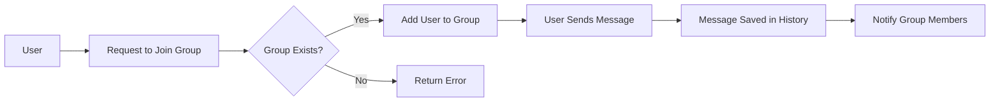

# Chatting Application Requirement Analysis

## 1. Introduction

The chatting application is designed to facilitate communication within community groups by providing a secure, reliable, and user-friendly platform. It enables one-on-one messaging and group chats with multimedia support and social login capabilities, primarily targeting regular users who want to actively engage in their communities.

## 2. Business Model

### Why This Service Exists

Community members need a dedicated, easy-to-use chat platform that supports rich communication including media sharing, group management, and seamless authentication via social logins. The service fills the gap for community-centric messaging solutions that prioritize group collaboration and user engagement.

### Revenue Strategy

Although currently focused on user growth, potential revenue streams may include premium group features or advertisements integrated respectfully.

### Growth Plan

Growth is targeted via social login to minimize onboarding friction, community features that encourage viral adoption, and notification mechanisms to maintain high user engagement.

### Success Metrics

- Monthly Active Users (MAU)
- Daily Active Users (DAU)
- Average message volume per user
- User retention rate
- Group creation and active participation rates

## 3. User Roles and Authentication

### Roles

- Regular User: Authenticated user capable of creating/joining groups, sending messages, and managing group memberships if assigned admin rights.

### Authentication Requirements

- THE system SHALL allow users to authenticate via social login.
- WHEN a user attempts to log in, THE system SHALL support Snapchat as the preferred social login provider.
- THE system SHALL maintain user sessions securely with token-based authentication.

## 4. Functional Requirements

- THE system SHALL enable users to create multiple community groups.
- THE system SHALL allow users to join existing community groups.
- THE system SHALL support one-on-one messaging between users.
- THE system SHALL provide group chat functionality including:
  - Naming the group.
  - Adding or removing members by group admins.
  - Assigning group administrators.
- THE system SHALL allow users to send text messages, images, and videos.
- THE system SHALL persist chat messages to enable history retrieval.
- WHEN a new message is received, THE system SHALL notify the relevant user(s) promptly.

## 5. Business Rules and Validation

- Group administrators have the exclusive authority to rename groups and manage memberships.
- Only group members may send messages within that group.
- Messages SHALL be validated to ensure non-empty content.
- Media files SHALL conform to size and format restrictions.
- THE system SHALL secure all message histories.

## 6. Error Handling

- IF a user tries to join a non-existent group, THEN THE system SHALL return a clear error message.
- IF message sending fails due to network or server issues, THEN THE system SHALL retry sending up to three times.
- IF authentication errors occur, THEN THE system SHALL provide user-friendly error feedback and prompt re-authentication.

## 7. Performance Requirements

- THE system SHALL deliver messages within 2 seconds under normal network conditions.
- THE system SHALL notify users of new messages within 3 seconds.
- THE system SHALL support at least 100 concurrent users in a single group without performance degradation.

## 8. User Scenarios and Workflows

### Scenario 1: Joining and Messaging

A user logs in via Snapchat, searches for and joins a community group, then sends a message with an image attachment.

### Scenario 2: Group Administration

A group admin changes the group name and removes a member, with all actions promptly reflected for all group participants.

### Scenario 3: Offline Notifications and History

A user goes offline, receives notifications for new messages in groups, and upon reconnection accesses all missed chat history seamlessly.

## Mermaid Diagram: Group Chat Member Management

---

This document provides all essential, precise, and actionable requirements written in natural language and EARS format to guide backend developers in building the chatting application. It focuses on the business logic, user roles, functional needs, error handling, and performance targets, ensuring no ambiguity remains about what the system must accomplish.