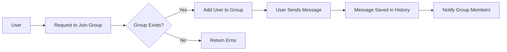
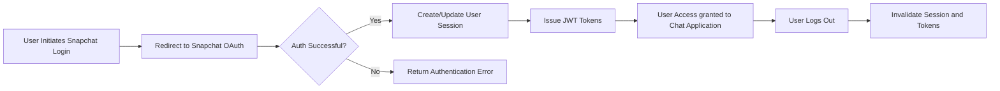

# Chatting Application Backend Business Requirements

## 1. Introduction

This document defines the full business requirements for a chatting application designed to support community groups with regular users authenticated via social login (Snapchat). It focuses on backend business rules, user permissions, chat functionalities, media support, notifications, performance, and security.

## 2. Business Model

### 2.1 Why This Service Exists

Community groups require a dedicated communication platform that supports rich media messaging, group management with admin roles, and seamless social login authentication to foster engagement and collaboration.

### 2.2 Revenue and Growth Strategy

Potential revenue includes premium features and advertising. Growth leverages viral community adoption via social login ease and notification-driven engagement.

## 3. User Roles and Authentication

### 3.1 User Roles

- Regular User: Can participate in chats, create/join groups, and manage groups if assigned admin rights.

### 3.2 Authentication

- WHEN a user logs in through Snapchat social login, THE system SHALL verify credentials using OAuth2.
- WHEN authentication succeeds, THE system SHALL create and maintain a secure JWT session token.
- THE system SHALL allow users to log out and revoke tokens.

### 3.3 Permissions

- Group admins SHALL have rights to rename groups, manage members, and assign admin roles.

## 4. Functional Requirements

- THE system SHALL enable one-on-one messaging with support for text, images, and videos.
- THE system SHALL allow users to create named community groups.
- THE system SHALL allow group admins to add and remove members.
- THE system SHALL save chat history and media content persistently.
- WHEN a new message arrives, THE system SHALL notify relevant users within 3 seconds.

## 5. Business Rules and Validation

- ONLY current group members SHALL be allowed to send messages in that group.
- Messages SHALL not be empty and SHALL be limited to 2000 characters.
- Media files SHALL be restricted to 10MB size and supported formats (JPEG, PNG, MP4).
- All admin actions SHALL verify user permissions before executing.

## 6. Non-Functional Requirements

- THE system SHALL deliver messages within 2 seconds under normal network conditions.
- THE system SHALL support 10,000 concurrent active users with minimal latency.
- THE system SHALL enforce encryption for all data in transit and at rest.

## 7. Error Handling and Recovery

- IF invalid authentication or permissions, THEN THE system SHALL respond with HTTP 401 or 403 errors.
- IF message sending fails due to validation or media errors, THEN THE system SHALL return detailed error messages.
- THE system SHALL retry transient failures up to three times before failing.

## 8. Appendices

### Mermaid Diagram: Group Chat Member Management

### Mermaid Diagram: Authentication Flow

---

This document provides business requirements only. Implementation details such as database design, API specifications, and infrastructure decisions are at developer discretion. It describes WHAT the system SHALL do, not HOW to build it.