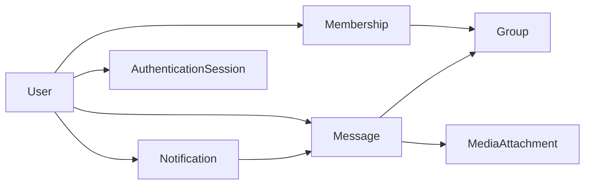

# Chatting Application Database Design

## 1. Introduction
This document specifies the comprehensive database design requirements for the community groups chatting application. It outlines the entities, attributes, relationships, constraints, and access controls necessary to support the application's core functionality including user management, group membership, messaging, media handling, and social login authentication.

## 2. Entities and Relationships
The database SHALL include the following core entities:
- User
- Group
- Membership
- Message
- MediaAttachment
- Notification
- AuthenticationSession

### 2.1 User
- Represents an individual user of the system.
- Attributes include unique UserID, username, profile information, created timestamp.

### 2.2 Group
- Represents a community group.
- Attributes include unique GroupID, group name, creation timestamp, description.

### 2.3 Membership
- Represents a user's membership in a group.
- Attributes include UserID, GroupID, role (member or admin), joined timestamp.

### 2.4 Message
- Represents a single chat message.
- Attributes include MessageID, sender UserID, GroupID or RecipientUserID for one-on-one chats, content, timestamp.

### 2.5 MediaAttachment
- Represents media files attached to messages.
- Attributes include MediaID, MessageID, media type (image/video), file path or URL, upload timestamp.

### 2.6 Notification
- Represents message notifications.
- Attributes include NotificationID, UserID, MessageID, read status, notification timestamp.

### 2.7 AuthenticationSession
- Stores details of user authentication sessions.
- Attributes include SessionID, UserID, token, expiration, created timestamp.

## 3. User and Role Management
- THE system SHALL store user profile details with unique identifiers.
- THE system SHALL support roles at membership level (member or admin) per group.
- THE system SHALL record timestamps of user activity for auditing.

## 4. Group and Membership Management
- THE system SHALL allow users to create multiple groups.
- THE system SHALL record group metadata including unique name and description.
- THE system SHALL allow assigning admins per group via Membership role.
- THE system SHALL reflect membership status (active/removed).

## 5. Messaging and Media Handling
- THE system SHALL store messages with associations to sender and recipient group or user.
- THE system SHALL allow messages to have zero or more media attachments.
- THE system SHALL ensure message content storage can handle text and rich media references.

## 6. Authentication and Social Login
- THE system SHALL store social login identifiers linking users to Snapchat accounts.
- THE system SHALL maintain authentication sessions with token expiration.

## 7. Notifications
- THE system SHALL provide notifications for new messages.
- THE system SHALL track notification read status per user.

## 8. Data Integrity and Constraints
- Usernames and group names SHALL be unique.
- Membership roles SHALL be limited to the allowed set (member, admin).
- Messages SHALL have valid sender and recipient references.
- Media attachments SHALL be linked to valid messages.

## 9. Security and Access Control
- Access to groups, messages, and notifications SHALL be restricted based on membership and roles.
- THE system SHALL enforce access controls at query level.

## 10. ER Diagram

## 11. Conclusion
This database design specification provides a complete and detailed blueprint for backend developers to implement the necessary data structures and relationships for the chatting application. All business logic, data integrity, security, and authentication requirements are addressed to ensure a robust and scalable system.