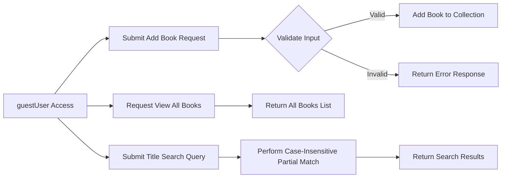

# Functional Requirements for Library Management System

## 1. Introduction

The library management system is an open-access service that allows any user (guestUser role) to add books with title, author, and ISBN attributes, view all books, and search for books by partial title matching. No user authentication or accounts are required.

## 2. Business Model

### 2.1 Business Justification

Libraries, individual readers, and collectors need a simple, accessible system to maintain catalogues of book collections. This system addresses the need for an open, user-friendly platform without access barriers.

### 2.2 Business Goals

- Facilitate simple book addition by anyone.
- Enable quick discovery of books via listing and search.
- Maintain data integrity and prevent duplicates.
- Provide responsive performance for user actions.

## 3. User Roles

### 3.1 guestUser Role

- Role Details: Represents any unauthenticated user accessing the system.
- Permissions:
  - Add new books by submitting title, author, and ISBN.
  - Retrieve and view the full list of books.
  - Perform partial, case-insensitive title searches.
- Restrictions:
  - Cannot delete, update, or modify existing book records.
  - No login or user account is required.

## 4. Functional Requirements

### 4.1 Add Book

WHEN a guestUser submits a request with book information (title, author, ISBN), THE system SHALL validate the input and add the book if valid.

THE system SHALL require:
- The book title to be a non-empty string.
- The book author to be a non-empty string.
- The ISBN to conform to standard ISBN-10 or ISBN-13 format and be unique in the system.

IF any required field is missing or invalid, THEN THE system SHALL reject the request with a descriptive error.

### 4.2 View Books

WHEN a guestUser requests the list of all books, THE system SHALL respond with all books currently stored.

THE response SHALL include each book's title, author, and ISBN.

The list SHALL be ordered by time of addition, newest first.

### 4.3 Search Books by Title

WHEN a guestUser submits a title search query, THE system SHALL find and return all books whose titles contain the query string, ignoring case.

Partial matches SHALL be supported so that substrings anywhere in the title qualify.

IF no books match, THEN THE system SHALL return an empty list.

## 5. Business Rules and Validation

- Book titles and authors SHALL be non-empty strings.
- ISBNs SHALL adhere to standard ISBN-10 or ISBN-13 formats.
- Duplicate ISBNs SHALL not be allowed.
- Title searches SHALL be case-insensitive and perform partial matching.
- The book list SHALL always reflect the current collection state.

## 6. Error Handling

IF a book addition request has missing or invalid fields, THEN THE system SHALL respond with clear error messages specifying the issue and with appropriate HTTP status codes (400 for bad requests, 409 for duplicates).

IF unexpected system errors occur, THEN THE system SHALL respond with a generic error message and HTTP 500 status.

IF a search yields no results, THEN THE system SHALL return an empty list with HTTP 200.

## 7. Performance Requirements

THE system SHALL respond to book addition requests within 2 seconds under normal conditions.

THE system SHALL respond to queries for viewing or searching books within 1 second for collections with up to 10,000 entries.

Search operations SHALL be optimized for instant user experience.

## 8. Workflow Diagram

## 9. Summary and Developer Autonomy

This document provides business requirements only for the library management system. All technical implementation decisions, including architecture, API design, and data storage, are the sole responsibility of the development team. Developers have full autonomy to design and implement the system based on these requirements, with no constraints imposed on the internal technical design.

All requirements use EARS format where applicable, focus exclusively on business functionality, and leave technical details outside the scope of this document.