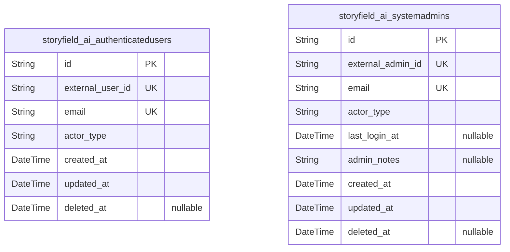
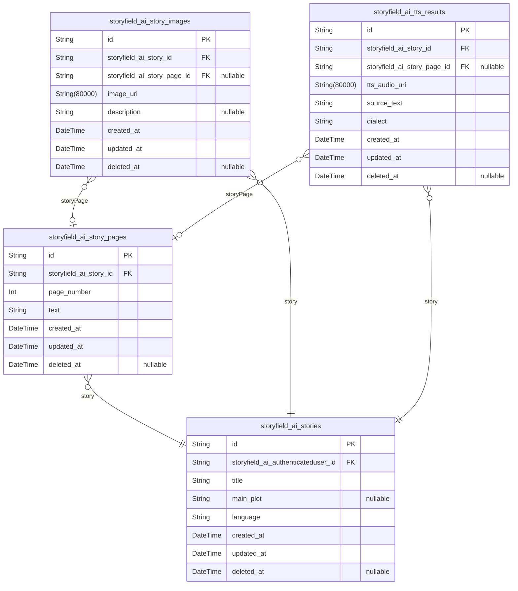
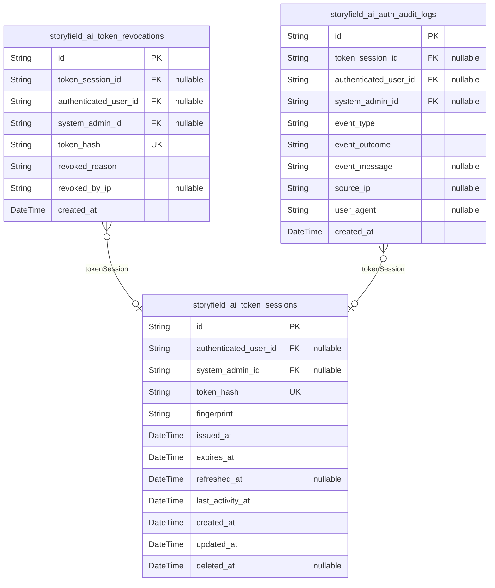
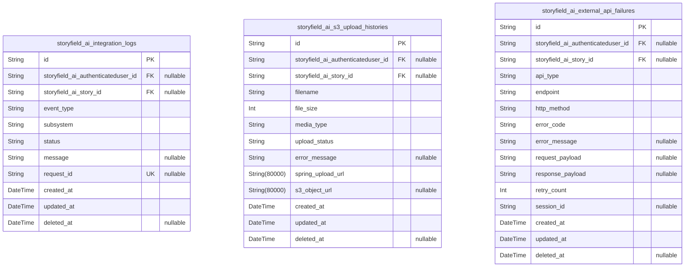
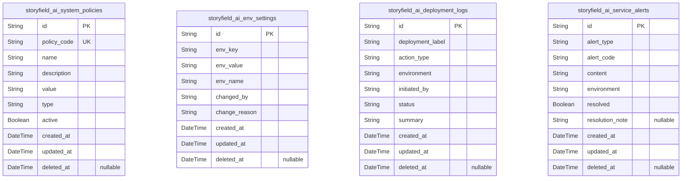

# Prisma Markdown

> Generated by [`prisma-markdown`](https://github.com/samchon/prisma-markdown)

- [Actors](#actors)
- [Stories](#stories)
- [Auth](#auth)
- [Integration](#integration)
- [Systematic](#systematic)

## Actors

### `storyfield_ai_authenticatedusers`

Holds registered authenticated StoryField AI users that have passed
Spring backend verification and possess a valid external user ID. Each
entry maps to a verified, onboarded user authorized to generate content
and access their own data only. Serves as the reference basis for all
user-generated content, TTS, and story traceability. Maintains audit
fields for creation, update, and soft deletion. Stance is primary, as
these users require independent business management, onboarding, and
compliance traceability.

Properties as follows:

- `id`: Primary Key.
- `external_user_id`
  > External user ID issued by Spring backend; unique per authenticated user.
  > Used as a reference key to external identity system.
- `email`
  > Unique email address of authenticated user; must match email used for
  > Spring registration.
- `actor_type`
  > Describes the actor type in the business domain; always
  > "authenticatedUser" for this table.
- `created_at`
  > Timestamp of initial record creation. Used for traceability and
  > compliance.
- `updated_at`: Timestamp of last update to record. For audit tracking.
- `deleted_at`
  > Timestamp when user soft-deleted (deactivated or removed, but not fully
  > purged). Null if active.

### `storyfield_ai_systemadmins`

Records StoryField AI system administrative accounts. Each entry maps to
a separate admin, distinct from standard authenticated users, with
privilege for system oversight, abuse monitoring, and administrative
actions. Tracks audit and compliance fields, as well as last login date
and optional admin notes. Stance is primary due to independent admin
lifecycle management and business impact.

Properties as follows:

- `id`: Primary Key.
- `external_admin_id`
  > External admin ID, mapped from Spring/JWT backend. Uniquely identifies an
  > administrator for credential mapping and traceability.
- `email`
  > Administrative email address, unique per admin and used for
  > login/audit/policy notification.
- `actor_type`: Role descriptor for actor type; always "systemAdmin" for this table.
- `last_login_at`
  > Datetime of the admin's last successful login into the system. For
  > privileged access tracking and compliance audits.
- `admin_notes`
  > Optional notes regarding admin privileges, actions, or incident response
  > logs. Enables enhanced compliance and system audit.
- `created_at`: Timestamp of initial record creation. Audit/investigation baseline.
- `updated_at`
  > Timestamp of last information update or privilege change for this admin
  > account.
- `deleted_at`
  > Timestamp of logical deletion (soft delete) if admin is removed from
  > current oversight, null if active.

## Stories

### `storyfield_ai_stories`

Master table for AI-generated fairy tales. Each record represents a
complete story created by an authenticated user, with metadata such as
title, main plot, language, and creation details. Each story can have
multiple pages ([storyfield_ai_story_pages](#storyfield_ai_story_pages)), images ({@link
storyfield_ai_story_images}), and TTS results ({@link
storyfield_ai_tts_results}). Ownership is tracked by foreign key to
authenticated users. Supports soft deletion and audit trails for content
moderation, copyright disputes, and compliance.

Properties as follows:

- `id`: Primary Key.
- `storyfield_ai_authenticateduser_id`
  > Owner's [storyfield_ai_authenticatedusers.id](#storyfield_ai_authenticatedusers). The user who created
  > this story.
- `title`: Title of the story as provided or generated by the user.
- `main_plot`: The main plot or summary provided as the core input for this story.
- `language`
  > Primary language or dialect option chosen for this story instance (e.g.,
  > Korean, Gyeongsang dialect).
- `created_at`: Record creation timestamp. Required for audit trail and ordering.
- `updated_at`: Record last update time. Required for modification tracking.
- `deleted_at`: Soft deletion time for GDPR and moderation compliance.

### `storyfield_ai_story_pages`

Stores the textual content and ordering for each page within a story.
Pages are independently addressable to allow specific moderation or user
revision (e.g., editing a single page). Connected to its parent story
([storyfield_ai_stories.id](#storyfield_ai_stories)) and may have multiple supporting
images ([storyfield_ai_story_images](#storyfield_ai_story_images)). Page number enforces logical
order. Soft deletion and temporal fields for compliance, moderation, and
granular auditing.

Properties as follows:

- `id`: Primary Key.
- `storyfield_ai_story_id`: Reference to parent story's [storyfield_ai_stories.id](#storyfield_ai_stories).
- `page_number`: The sequential page number within the story. Used for natural ordering.
- `text`: Textual content for the page. AI-generated or user-edited.
- `created_at`: Timestamp when the page was created.
- `updated_at`: Last update time for the page.
- `deleted_at`: Soft deletion for this page, supporting recoverability and compliance.

### `storyfield_ai_story_images`

Stores generated or user-provided images associated with stories or
specific pages. Each image can be tied to a parent story, a specific
page, or both. Used to display illustrations within stories or as
thumbnails. Images references their storage (typically S3) by URI. Only
supporting entity; must always belong to a parent story and optionally a
page. Deleted via soft delete if parent is deleted.

Properties as follows:

- `id`: Primary Key.
- `storyfield_ai_story_id`: Parent story's [storyfield_ai_stories.id](#storyfield_ai_stories).
- `storyfield_ai_story_page_id`
  > Specific page's [storyfield_ai_story_pages.id](#storyfield_ai_story_pages) if image is tied to
  > a page. Nullable for story-overall images.
- `image_uri`: URI (usually S3 URL) of the image storage location.
- `description`: Optional alt text or description for accessibility or search.
- `created_at`: When image was added or generated.
- `updated_at`: Last modification time of image record.
- `deleted_at`: Soft deletion timestamp. Image becomes inaccessible if set.

### `storyfield_ai_tts_results`

Stores results of text-to-speech generation for both entire stories and
specific pages. Each record contains the URI of the audio file, the text
source, and links to the owning story and, if relevant, the specific
page. Used to enable playback for users, accessibility features, and
dialect variation support. Not directly created by users, but is returned
or accessed as business artifacts of story creation. Soft delete
supported for data removal and compliance.

Properties as follows:

- `id`: Primary Key.
- `storyfield_ai_story_id`: Story's [storyfield_ai_stories.id](#storyfield_ai_stories) for which this TTS was produced.
- `storyfield_ai_story_page_id`
  > Story page's [storyfield_ai_story_pages.id](#storyfield_ai_story_pages) if TTS is for a
  > specific page. Nullable for whole-story TTS.
- `tts_audio_uri`: URI of the generated TTS audio file (e.g. S3 pre-signed URL).
- `source_text`: The text from which TTS was generated.
- `dialect`: Dialect or language option used in TTS result.
- `created_at`: When TTS was generated or uploaded.
- `updated_at`: When record was last modified.
- `deleted_at`: Soft deletion for regulatory and content-management purposes.

## Auth

### `storyfield_ai_token_sessions`

Active authentication token/session registry. Tracks each unique issued
token, maps it to the authenticated user (or admin), records
device/fingerprint for session uniqueness, and manages timestamps for
creation, last activity, and (optional) soft-deletion. Used to validate
token presence for the full duration of session's allowed lifetime. Keys
token value hashes (not plain value), user link, and session fingerprint.
Critical for session verification and security audit.

Properties as follows:

- `id`: Primary Key.
- `authenticated_user_id`: Belonged authenticated user's [storyfield_ai_authenticatedusers.id](#storyfield_ai_authenticatedusers).
- `system_admin_id`
  > Belonged system admin's [storyfield_ai_systemadmins.id](#storyfield_ai_systemadmins). Can be
  > null for end-users.
- `token_hash`
  > Hashed authentication token value used for session validation (never raw
  > token).
- `fingerprint`
  > Device or browser fingerprint for session uniqueness and frictioned
  > session control.
- `issued_at`: Timestamp when token was issued.
- `expires_at`: Timestamp when token will expire.
- `refreshed_at`
  > Most recent refresh timestamp for this session, or null if never
  > refreshed.
- `last_activity_at`
  > Timestamp of last activity/proof of life for the session (token usage
  > event).
- `created_at`: Creation timestamp of session record (may match issued_at).
- `updated_at`: Last update timestamp for record lifecycle tracking.
- `deleted_at`
  > Soft delete timestamp, null unless the session is explicitly
  > invalidated/closed prior to expiration.

### `storyfield_ai_token_revocations`

Registry of forcibly-revoked or blacklisted tokens for security response
and audit. Each record logs a revoked token (by hash), context, related
session or user where detectable, and permanent timestamps. Used to deny
reused/compromised/invalid in-flight tokens regardless of their session
status. Non-deletable, immutable audit source.

Properties as follows:

- `id`: Primary Key.
- `token_session_id`
  > Related session's [storyfield_ai_token_sessions.id](#storyfield_ai_token_sessions) if known. Null
  > for external/sessionless revocations.
- `authenticated_user_id`
  > Authenticated user's [storyfield_ai_authenticatedusers.id](#storyfield_ai_authenticatedusers).
  > Nullable for sessionless revocations.
- `system_admin_id`
  > System admin's [storyfield_ai_systemadmins.id](#storyfield_ai_systemadmins). Nullable for
  > userless admin or script-level actions.
- `token_hash`
  > Hash of revoked token (never store plain token) for future match and
  > deny-list operations.
- `revoked_reason`
  > Administrative or automated reason for revocation (compromise, logout,
  > abuse, etc.).
- `revoked_by_ip`: Source IP address from which revocation was requested/executed.
- `created_at`: Time of revocation record creation.

### `storyfield_ai_auth_audit_logs`

Immutable authentication and authorization audit/event log. Records every
major token event (creation, validation attempt, refresh, expiration,
failure, manual revoke, etc.) and includes actor, session, IP, and event
meta context for compliance, forensics, and abuse detection. Append-only,
never edited or deleted. Supports cross-user, cross-session, and
time-range searches.

Properties as follows:

- `id`: Primary Key.
- `token_session_id`
  > Session (if known) whose event is being audited. Nullable for failed or
  > unknown events. References [storyfield_ai_token_sessions.id](#storyfield_ai_token_sessions).
- `authenticated_user_id`
  > User associated with the event if available. Nullable for
  > external/failure events. References {@link
  > storyfield_ai_authenticatedusers.id}.
- `system_admin_id`
  > System admin actor if event is triggered by administrative or automated
  > script action. Nullable otherwise. References {@link
  > storyfield_ai_systemadmins.id}.
- `event_type`
  > High-level type of audit event: issued, validated, refreshed, expired,
  > revoked, denied, etc.
- `event_outcome`: Result of event (success, failure, partial, etc.).
- `event_message`
  > Additional human-readable message or context for event, for compliance
  > review.
- `source_ip`: IP address from which the auth event was triggered.
- `user_agent`: Reported user-agent string or device for the triggering event.
- `created_at`: Timestamp of the authentication/audit event.

## Integration

### `storyfield_ai_integration_logs`

Integration event and audit trail logs for all cross-system actions
within the service. Records essential events such as API calls, connector
triggers, recovery events, and business actions tied to external system
interactions. Enables system-wide monitoring, troubleshooting, and
operational auditing. Standalone independent events reviewed by system
admin and engineering personnel. May reference users or stories via
optional foreign key but is operated as an independent business event
log. Designed for high-throughput insertions and fast event filtering.

Properties as follows:

- `id`: Primary Key.
- `storyfield_ai_authenticateduser_id`
  > Optional reference to the authenticated user associated with this
  > integration event. [storyfield_ai_authenticatedusers.id](#storyfield_ai_authenticatedusers).
- `storyfield_ai_story_id`
  > Optional reference to the story entity associated with this integration
  > event. [storyfield_ai_stories.id](#storyfield_ai_stories).
- `event_type`
  > Type of integration event (ex: API_CALL, CONNECTOR_TRIGGER, RECOVERY,
  > S3_UPLOAD, ERROR, RETRY, etc.). Business event category for filtering and
  > audit.
- `subsystem`
  > Subsystem or third-party connector involved in this event (e.g., s3,
  > spring_backend, openai, tts_engine, etc.).
- `status`
  > Human-friendly description or status code of the integration event
  > outcome (SUCCESS, FAILURE, PARTIAL, etc.).
- `message`
  > Detailed description/message or error context for this event. Can include
  > error messages from external systems, stack traces, or summary
  > information.
- `request_id`
  > Optional: Correlation ID or unique request trace for distributed event
  > linking. Enables cross-system root cause tracing.
- `created_at`: Timestamp of integration event log creation.
- `updated_at`: Timestamp when the log record was last updated.
- `deleted_at`: Timestamp when the log record was soft deleted. Null if not deleted.

### `storyfield_ai_s3_upload_histories`

Records the detailed histories of S3 upload attempts for all integration
uploads performed through the Spring backend. Captures file upload events
required for troubleshooting, SLA measurement, failed upload analysis,
and regulatory audits. Standalone per-attempt, per-file business event
history. Each record holds the filename, size, related resource type,
upload status, error context, and timestamps. Key for tracking
reliability and providing clear root cause analysis of media delivery
failures.

Properties as follows:

- `id`: Primary Key.
- `storyfield_ai_authenticateduser_id`
  > Optional reference to the user who initiated the media upload. {@link
  > storyfield_ai_authenticatedusers.id}.
- `storyfield_ai_story_id`
  > Optional reference to the story associated with this upload. {@link
  > storyfield_ai_stories.id}.
- `filename`: Name of the file being uploaded (original or system-generated filename).
- `file_size`
  > File size in bytes when submitted for upload. Helps audit upload policy
  > enforcement.
- `media_type`
  > The type of media resource being uploaded (e.g., story_image, tts_audio,
  > asr_audio, etc.).
- `upload_status`: Result of the upload attempt (SUCCESS, FAILURE, RETRY, PARTIAL, etc.).
- `error_message`
  > Descriptive error or diagnostic message related to upload failure if any
  > occurred during this upload event.
- `spring_upload_url`
  > Spring backend upload endpoint used in this upload event (full URI for
  > traceability).
- `s3_object_url`
  > Resulting S3 object URL provided by the Spring service, if successful.
  > Null if upload did not return a valid S3 URL.
- `created_at`: Timestamp of the upload record creation.
- `updated_at`: Timestamp of last update to this upload record.
- `deleted_at`: Timestamp if the upload record was soft deleted. Null otherwise.

### `storyfield_ai_external_api_failures`

Tracks integration failures, exceptions, and error events for all
external API communications (ASR, TTS, OpenAI, Spring backend, payment,
etc.). Logs actionable business incidents, API-specific error codes,
exception stack, user/session trace. Each record stands independently for
error review, postmortem analysis, and quality assurance. Helps drive SLA
monitoring, platform reliability, and incident response.

Properties as follows:

- `id`: Primary Key.
- `storyfield_ai_authenticateduser_id`
  > Optional reference to the user involved in the failed request if
  > applicable. [storyfield_ai_authenticatedusers.id](#storyfield_ai_authenticatedusers).
- `storyfield_ai_story_id`
  > Optional reference to the story related to the API failure event if any.
  > [storyfield_ai_stories.id](#storyfield_ai_stories).
- `api_type`
  > Type of external API where the failure was detected (e.g., openai, asr,
  > tts, spring_backend, s3, payment, etc.).
- `endpoint`: API endpoint or resource path that triggered the failure event.
- `http_method`: HTTP method used for the failed request (GET, POST, PUT, DELETE, etc.).
- `error_code`
  > API/system specific error code or HTTP status associated with this
  > failure event.
- `error_message`
  > Detailed description or exception message for analysis. Allows full-text
  > search for troubleshooting.
- `request_payload`
  > Request payload (usually JSON) sent to the API which caused the failure.
  > Can be omitted for privacy/security if not allowed.
- `response_payload`
  > Response body returned with the error/failure. Can be omitted for
  > privacy/security if not allowed.
- `retry_count`
  > How many retries attempted for this failed operation, including the
  > initial request.
- `session_id`
  > Optional business/session group or distributed trace for associating
  > failures across services.
- `created_at`: Timestamp of API failure event record creation.
- `updated_at`: Timestamp of last update to this record.
- `deleted_at`: Null unless the failure record is soft deleted.

## Systematic

### `storyfield_ai_system_policies`

Service-wide system policy registry. Stores all business, technical,
feature toggle, and compliance rules as policy records for the StoryField
AI platform. Provides versioned policy management for runtime enforcement
and auditability. Used by service admin for global settings and
operational toggles. Independent management and change history required.

Properties as follows:

- `id`: Primary Key.
- `policy_code`
  > Unique string code representing the policy for programmatic reference by
  > subsystems (e.g., 'INTEGRATION_TIMEOUT_LIMIT', 'MAINTENANCE_MODE').
- `name`: Human-friendly policy name for admin UI and documentation.
- `description`
  > Full description of the policy's business intent, operational effect, or
  > compliance requirements.
- `value`
  > The policy's current value. Can be stringified JSON for complex types or
  > scalar for simple toggles.
- `type`
  > The policy's data type (e.g., 'boolean', 'int', 'duration', 'json'). For
  > informational/admin validation.
- `active`
  > Whether this policy is currently enforced (true = in effect, false = not
  > enforced; allows for toggling).
- `created_at`: Creation datetime for audit trail.
- `updated_at`: Last updated datetime for policy modification tracking.
- `deleted_at`: Soft delete timestamp. Null unless logically removed.

### `storyfield_ai_env_settings`

Application environment settings audit log. Tracks key=value
configuration for all distinct runtime environments (development,
staging, production). Captures environment variable versioning, change
origin, and historical context. Provides strong traceability for
configuration drift, issue diagnosis, and rollback decisions.

Properties as follows:

- `id`: Primary Key.
- `env_key`
  > Configuration key name. Matches a single environment variable or logical
  > config item (e.g., 'OPENAI_API_KEY').
- `env_value`: Configuration value (mask sensitive data in UI).
- `env_name`: Environment label (e.g., 'local', 'development', 'staging', 'production').
- `changed_by`
  > Identifier (username, email, or adminId) representing the actor who
  > introduced the change.
- `change_reason`
  > Human-facing description of why this change was made (e.g., key rotation,
  > urgent bug fix).
- `created_at`
  > Datetime when this setting entry was created; marks effective date of
  > config.
- `updated_at`: Datetime of last update (for correction or rollover).
- `deleted_at`: Soft delete timestamp for audit log. Null unless deleted logically.

### `storyfield_ai_deployment_logs`

Deployment and rollback event log for system operations. Records all
release, rollback, and hotfix actions for service version control, audit
traceability, and incident response. Enables review of deployment
outcome, initiator, timing, label, and associated summary for postmortems
and compliance review.

Properties as follows:

- `id`: Primary Key.
- `deployment_label`
  > Label identifying the deployment or rollback event. Should match the tag,
  > branch, or semantic version (e.g., 'v1.10.7', 'bugfix-hot-deploy').
- `action_type`
  > Type of deployment action (e.g., 'deploy', 'rollback', 'hotfix',
  > 'config-change').
- `environment`
  > Deployment target environment (e.g., 'production', 'staging',
  > 'development').
- `initiated_by`: Identifier for the initiator (admin handle, CI/CD user, scriptID).
- `status`
  > Outcome status (e.g., 'success', 'failed', 'in-progress', 'aborted'); for
  > workflow tracking and recovery.
- `summary`
  > Free-form summary of the deployment action and impact. Used for
  > compliance audit and operational history.
- `created_at`: Datetime when deployment/rollback started.
- `updated_at`: Datetime of last modification/status update.
- `deleted_at`: Soft delete timestamp. Null unless logically removed from report view.

### `storyfield_ai_service_alerts`

Centralized service alert and event notification log. Stores technical
event alerts (error, warning, info, recovery, anomaly, quota breach,
etc.) for both real-time and historical monitoring. Enables systematic
search by type, environment, resolution status, and content for incident
response and analytics. Independent querying and search required for
system health review.

Properties as follows:

- `id`: Primary Key.
- `alert_type`
  > Categorical alert/event type (e.g., 'error', 'warning', 'info', 'quota',
  > 'incident', 'recovery').
- `alert_code`
  > Optional structured alert code, for business logic and filtering (e.g.,
  > 'AUTH_401_012', 'S3_UPLOAD_FAIL').
- `content`
  > Detailed description of the alert or event for admin review and
  > downstream action. Used for analytics and audit.
- `environment`: Target environment for the alert/event (e.g., 'production', 'staging').
- `resolved`
  > Whether the alert/event has been resolved or closed (true = closed, false
  > = active).
- `resolution_note`
  > Human-facing note explaining how the alert/event was resolved or closed.
  > Null until event is resolved.
- `created_at`: Datetime when alert/event was recorded.
- `updated_at`: Datetime of last update (e.g., resolution).
- `deleted_at`: Soft delete timestamp. Null unless logically removed from view.
