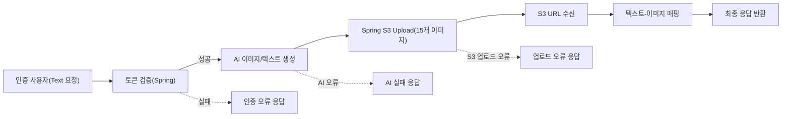
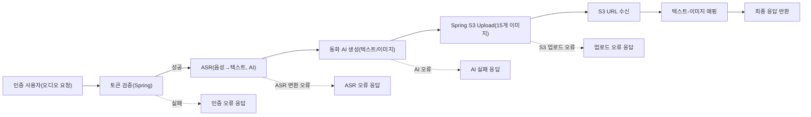
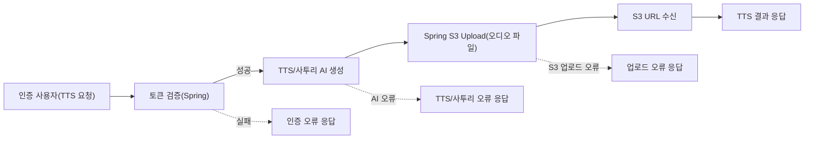

# StoryField AI Server – 핵심 사용자 플로우 및 프로세스 맵

## 1. 개요 및 시스템 상호작용 소개

StoryField AI Server는 인증된 사용자가 입력한 텍스트나 오디오로부터 동화 이미지를 15개, 동화 텍스트를 15개 자동 생성하는 클라우드 기반 AI 서비스입니다. 모든 생성 결과물은 Spring 백엔드를 통해 S3에 업로드된 URL로 전달되며, 이후 동화 읽기(TTS), 사투리 TTS 변환 기능도 제공합니다.

시스템의 모든 코어 기능(동화 생성/TTS/사투리 변환)은 Spring 백엔드에서 발급·검증되는 Access Token을 사용하는 인증된 사용자만 이용 가능합니다. 인증 및 토큰 검증 실패 시 요청은 즉시 거부됩니다.

본 문서는 각 플로우의 단계별 흐름, 인볼브되는 서비스 및 역할, 복구/에러 처리 시나리오까지 체계적으로 제시합니다.

---

## 2. 플로우 1: 텍스트 기반 동화 생성 및 반환

### 단계별 플로우 설명

1. 인증된 사용자가 Access Token을 포함하여 "동화 생성(텍스트)" 요청 제출
2. 시스템은 토큰 유효성(Spring 연동) 검증
3. 유효할 경우, 입력 키워드 및 플롯을 기반으로 AI Text/이미지 생성(외부AI 연동)
4. 생성된 15개 이미지를 Spring 백엔드 S3 Upload API로 전송
5. 획득한 S3 이미지URL을 각각의 동화 텍스트와 매핑하여 응답 반환
6. 모든 실패(토큰 오류, AI 실패, S3 업로드 실패 등)는 적절한 Business Error로 응답/피드백

### 플로우 다이어그램

### 요구사항(EARS 포맷)
- WHEN 인증된 사용자가 텍스트로 동화 생성을 요청하면, THE 시스템 SHALL 입력 데이터(키워드, 플롯)를 검증한다.
- IF 토큰 검증에 실패하면, THEN THE 시스템 SHALL 요청을 거부하며 적절한 오류 메시지를 반환한다.
- WHEN 입력이 유효하면, THE 시스템 SHALL AI API로 텍스트/이미지 15개씩을 생성한다.
- THE 시스템 SHALL 각 이미지를 Spring 백엔드 S3 업로드 API에 파일 형태로 전달한다.
- IF S3 업로드에 실패하면, THEN THE 시스템 SHALL 업로드 오류 메시지를 반환한다.
- WHEN 모든 이미지가 성공적으로 업로드되면, THE 시스템 SHALL S3 반환 URL을 각 동화 텍스트와 함께 클라이언트에 전달한다.

---

## 3. 플로우 2: 오디오 기반 동화 생성 및 반환

### 단계별 플로우 설명
1. 인증 사용자가 오디오 파일과 키워드로 동화 생성을 요청, Access Token 포함
2. 토큰 검증(Spring)에 통과해야 프로세스 진행 가능
3. 시스템은 오디오 파일을 ASR API로 텍스트 변환(외부AI)
4. 변환 텍스트+키워드로 동화, 동화 이미지 모두 15개씩 생성
5. 이미지 15개를 Spring S3 Upload API로 전송 후 URL 확보
6. 모든 요소(텍스트, 이미지URL) 매핑하여 최종 응답 반환
7. 실패 시, 원인별 적절한 오류 피드백 반환

### 플로우 다이어그램

### 요구사항(EARS 포맷)
- WHEN 인증 사용자가 오디오 파일로 동화 생성을 요청하면, THE 시스템 SHALL 오디오 파일을 검증한다.
- IF 토큰 검증에 실패하면, THEN THE 시스템 SHALL 인증 오류를 반환한다.
- WHEN 오디오 파일이 정상이고 토큰도 유효하면, THE 시스템 SHALL 오디오 → 텍스트 변환(ASR)을 수행한다.
- IF ASR 변환이 실패하면, THEN THE 시스템 SHALL 적절한 오류 응답을 반환한다.
- WHEN 텍스트 변환 성공시, THE 시스템 SHALL 동화 텍스트/이미지를 AI API를 통해 생성한다.
- THE 시스템 SHALL 전체 반환 데이터(15개 텍스트, 15개 이미지URL)를 클라이언트에 응답한다.

---

## 4. 플로우 3: TTS 및 사투리 변환

### 단계별 플로우 설명
1. 인증 사용자가 동화 텍스트 혹은 문장, 변환 사투리 옵션과 함께 TTS 요청(Access Token 포함)
2. 토큰 검증(Spring) 통과 시만 처리 가능
3. 시스템은 TTS(TTS만/사투리 변환 포함) AI API로 요청 전송
4. AI에서 생성된 오디오 파일을 Spring S3 Upload API로 전달, S3 URL 확보
5. S3 URL을 응답으로 반환
6. 실패 시, 즉시 오류 메시지 반환

### 플로우 다이어그램

### 요구사항(EARS 포맷)
- WHEN 인증 사용자가 TTS 또는 사투리 변환을 요청하면, THE 시스템 SHALL 요청 데이터(텍스트, 사투리 옵션)를 검증한다.
- IF 토큰 검증에 실패하면, THEN THE 시스템 SHALL 오류 응답을 반환한다.
- WHEN 검증 통과 시, THE 시스템 SHALL 외부AI에 TTS/사투리 요청을 전달한다.
- IF TTS/사투리 AI에 문제가 발생하면, THEN THE 시스템 SHALL 오류 응답을 반환한다.
- WHEN 오디오 파일이 정상적으로 생성되면, THE 시스템 SHALL Spring S3 Upload API를 통해 파일을 전달하고 반환받은 URL을 클라이언트에 반환한다.

---

## 5. 사용자 피드백 및 에러 처리 흐름

- 모든 인가, 생성, 업로드 실패는 즉시 식별 가능한 오류 형태로 응답(EARS)
- IF 예상치 못한 시스템 장애 발생 시, THEN THE 시스템 SHALL 로깅 활성화(오류 유저 메시지 포함), 필요시 재시도 또는 복구 프로세스 안내
- WHEN 정상 처리 시, THE 시스템 SHALL 결과(이미지/텍스트/오디오)를 1회성으로 제공한다. 
- WHEN 장애 복구가 불가능하면, THE 시스템 SHALL 사용자에게 명확하게 안내한다.

---

## 6. 서비스 연계 및 주요 핸드오프

- THE 시스템 SHALL Spring 백엔드의 토큰 인증 API에 대한 의존성을 유지한다.
- THE 시스템 SHALL 외부AI 서비스와의 연결 장애/응답 지연 상태를 예외 처리로 분류한다.
- WHEN S3 업로드가 실패하면, THE 시스템 SHALL 사용자 요청을 롤백하지 않고 부분 성공 정보를 반환/안내할 수 있다.
- 모든 사용자 요청, 파일 업로드, AI 연동 등 데이터 이동 지점 및 책임 경계는 명확하게 Spring, S3, 외부AI 단위 별로 구분되어야 한다.

---

# 결론: 본 문서는 StoryField AI Server 백엔드에서 인증 사용자 기준으로 일어나는 주요 업무 및 예외 플로우를 체계적으로 정리하였음. 모든 요구사항은 EARS 표준에 준하여 명확성, 일관성, 검증 가능성을 확보함. 개발자는 해당 시나리오 기반으로 비즈니스 플로우, 예외 처리, 외부 연계 경계를 설계·구현해야 함.