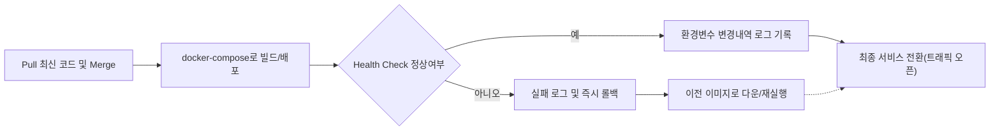

# 환경 및 운영관리 요구사항 명세서

## 1. 환경 분리와 변수 관리

### 1.1 개발/스테이지/운영 환경 정의
WHEN 스토리필드 AI 서버 운영 환경이 요구될 때, THE 서비스 SHALL 각기 구분된 3가지 환경(`development`, `staging`, `production`)을 제공해야 한다.

| 환경명       | 목적                 | 주요 사용 시나리오           |
|--------------|----------------------|--------------------------|
| development  | 개발자 개인/팀 개발   | 신규 기능, 테스트, 로컬 실행    |
| staging      | 실서비스 유사 사전 테스트 | 배포전 통합검증, 실데이터 기반 모의운영 |
| production   | 실제 서비스 운영      | 사용자 대상 실제 트래픽 처리   |

### 1.2 환경간 변수 관리 원칙
THE 서비스 SHALL 환경 별로 별도의 변수 집합을 사용하고, 환경별 `.env.<environment>` 파일을 통해 환경설정을 분리 관리한다.
WHEN 구동 환경이 변경될 때, THE 서비스 SHALL 자동으로 해당 환경의 변수셋을 불러와 사용한다.
IF 변수셋 누락/오적용 발생시, THEN THE 서비스 SHALL 즉시 에러 및 경고를 기록하고, 서비스 기동을 중단한다.

## 2. .env 파일 핸들링 및 비밀 관리

### 2.1 .env 파일 네이밍 및 저장 위치 규정
WHEN 새로운 환경 구성이 필요할 때, THE 운영팀 SHALL 해당 환경에 `.env.<environment>` 파일을 루트 디렉토리에 생성해야 한다.
WHERE 환경별 변수는 다음 표에 따라 구분한다.

| 파일명             | 비고                |
|--------------------|---------------------|
| .env.local         | 로컬 환경(개발자별)   |
| .env.development   | 개발 서버/통합 테스트 |
| .env.staging       | 스테이지 서버        |
| .env.production    | 운영 서버           |

### 2.2 환경변수 정책 및 예시
THE 서비스 SHALL 민감정보·API 키·토큰 등은 반드시 환경변수로만 관리해야 하고, 코드에 하드코딩하지 않는다.
WHEN 개발자가 환경파일을 수정할 때, THE 팀 SHALL 다음 예시를 참고하여 환경명을 명시한다.

| 환경 변수명           | 설명                  | 예시                    |
|----------------------|----------------------|------------------------|
| OPENAI_API_KEY       | 외부 AI API 인증키         | sk-xxx...              |
| SPRING_S3_UPLOAD_URL | Spring S3 업로드 API 엔드포인트 | https://.../s3/upload |
| REDIS_HOST           | Redis 접속 호스트         | redis.example.com      |
| REDIS_PASS           | Redis 인증 비밀번호        | jm2pB67j898...         |

WHERE 비밀·토큰·계정정보 등은 반드시 별도 채널(예: Vault, 1:1 전달)로 공유하며, 코드/레포지토리에 절대 업로드하지 않는다.
IF 환경변수 누출/오적용 사례 발생 시, THEN THE 운영팀 SHALL 즉시 비상조치로 해당 변수 및 연결 계정 비밀번호를 회수 및 갱신하고, 관련 주체 전원 공지한다.

## 3. Docker 및 Docker Compose 운영

### 3.1 Docker 사용 강제 및 명세
THE 서비스 SHALL 반드시 Docker/Docker Compose로 실행되어야 하며, 코드 레포 루트에는 `Dockerfile` 및 `docker-compose.yml`의 존재와 최신성을 보장한다.
WHEN 신규 환경 배포가 필요할 때, THE 운영팀 SHALL 도커 이미지를 빌드 후 각 환경별 `.env.<environment>` 파일을 바인딩한다.
IF 도커 파일/컴포즈 버전 불일치 발견 시, THEN THE 배포는 중단하고, 최신 규격/표준에 맞게 재작성·적용 후 재배포한다.

### 3.2 환경별 도커파일 활용 예시
THE 서비스 SHALL docker-compose 명령어 실행 시 환경별 실제 환경파일을 옵션 또는 볼륨 마운트로 연결해야 하며, 예시는 아래와 같다.

| 환경        | 명령어 예시                                                  |
|-------------|-----------------------------------------------------------|
| 개발(development) | docker-compose --env-file .env.development up -d       |
| 운영(production)  | docker-compose --env-file .env.production up -d        |
| 로컬(local)    | docker-compose --env-file .env.local up --build         |

### 3.3 도커 파일 구조 관리 규정
THE 운영팀 SHALL Dockerfile, docker-compose.yml, 환경파일 등 배포 핵심 구성요소를 git 레포 최상위에 보관하고, 변경 시 Pull Request(혹은 승인절차)로 커밋해야 한다.

## 4. 배포 및 롤백 업무 프로세스

### 4.1 배포 프로세스 단계별 요구사항
THE 서비스 SHALL 다음 배포 과정을 통과해야만 운영 반영이 가능하다.

WHEN 배포 중 Health Check가 통과하지 못할 경우, THE 서비스 SHALL 자동으로 즉시 롤백 프로세스를 개시한다.

### 4.2 롤백 프로세스 및 기준
IF 운영 반영 실패, 신규 빌드 오류, 환경변수 적용 실패 발생 시, THEN THE 운영팀 SHALL 이전 빌드 이미지, 환경설정으로 즉시 재배포를 시행하고 로그를 기록한다.
WHERE 롤백은 운영 전용 Redeploy 스크립트 또는 docker-compose 명령어로 자동화한다.

### 4.3 환경변수 변경 및 핫픽스 처리
WHEN Hotfix나 긴급 배포가 필요할 경우, THE 운영팀 SHALL 환경변수 변경 내역을 Rollback 가능하도록 직전 값 백업, 변경 로그 기록, 해당 변경 내역을 담당자에게 즉시 공유한다.

## 5. 환경설정 변경 거버넌스 및 기록

### 5.1 변수 변경 승인 절차
THE 서비스 SHALL 환경변수, 배포 라벨, 도커파일 등 구성 변경 시 배포관리자의 사전 승인(전자결재, Issue 승인 등) 없이는 변경이 적용되지 않게 한다.
WHEN 변경이 승인될 시, THE 변경인은 배포의 변경요소, 적용 시점, 영향범위 등을 문서화해 변경 히스토리에 남긴다.

### 5.2 운영 변경내역 공지 및 모니터링
WHEN 주요 환경구성 변경이 있을 경우, THE 운영팀 SHALL 내역을 슬랙/구글드라이브/Confluence 등 공식 채널에 요약 공지한다.
THE 운영팀 SHALL 배포 후 일정기간(최소 1시간) 이상 구성값을 모니터링하며, 이탈 징후 발견 시 즉시 이슈로 기록 후 원인 확인 및 조치한다.

## 결론 및 참고
THE 위 규정들은 서비스 운영 품질 일관성 및 재현성을 보장하고, 환경/운영 변경의 투명성 확보를 위한 최소 기준이다. 모든 운영팀/개발팀 인원은 이를 숙지하고, 실제 배포·운영에 100% 적용해야 한다.

[통합 비즈니스 요구사항 명세서](./02-business-requirements.md) 및 관련 운영·보안 정책은 상시 참고할 것.
