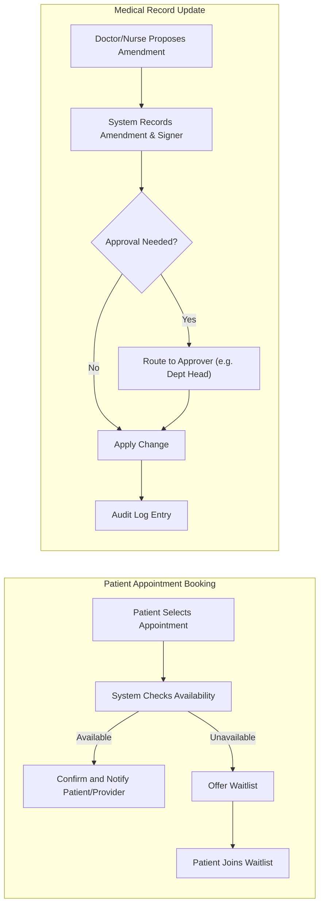

# Functional Requirements Specification – Enterprise Healthcare Management Platform

## 1. System Overview
The healthcarePlatform system is a multi-tenant SaaS platform that enables healthcare organizations (hospitals, clinics, practices) to manage clinical, administrative, and operational workflows in a secure, auditable, and compliant manner. The platform accommodates complex hierarchies, role-based workflows, production-grade data isolation, and regulatory and safety requirements through modular design and comprehensive business rules.

## 2. User Scenario Summaries

The platform serves multiple user personas:
- **System Administrator**: Oversees the full platform, infrastructure, monitoring, security, compliance reporting, and 3rd-party integration maintenance.
- **Organization Administrator**: Manages a specific healthcare organization, including staff provisioning, facility configuration, and compliance.
- **Department Head**: Manages staff, resources, schedules, and analytics within their department (e.g., Cardiology).
- **Medical Doctor**: Delivers patient care, accesses full patient records, orders diagnostics, manages prescriptions, and interacts with audit workflows.
- **Nurse/Medical Staff**: Provides daily patient care, administers medications, records vitals, and communicates with other roles, with scope-limited modification rights.
- **Technician**: Handles medical imaging, diagnostics, and technical data uploading. May annotate and manage DICOM/lab result records.
- **Receptionist**: Manages appointments and patient check-ins/outs through administrative workflows only.
- **Patient**: Accesses their medical information, schedules appointments, manages billing/insurance, and communicates with their care team.

## 3. Module Requirements

### 3.1 User Management & Authentication

- WHEN a new tenant (organization) is onboarded, THE system SHALL create a logically isolated data and resource space ensuring no cross-organization data visibility.
- WHEN a user is created (by admin or self-service portal), THE system SHALL assign the user to an organization and defined role within a strict hierarchy as described in [User Roles and Authentication Guide](./02-user-roles-and-authentication.md).
- THE system SHALL support authentication via SAML 2.0, OAuth 2.0, and Active Directory (configurable by tenant).
- WHERE users are medical professionals, THE system SHALL verify credentials via NPI Registry and state board APIs upon registration and on a schedule (e.g., annual revalidation) for compliance.
- THE system SHALL provide full audit trails of all authentication, login, logout, credential changes, and authorization events, including the source, timestamp, device, reason, and correlating entity.
- WHEN a role is changed or user deactivated, THE system SHALL immediately update permissions and cause all active sessions to be evaluated for compliance; user access to unauthorized areas SHALL be revoked in real-time.
- WHERE multi-factor authentication is enabled by organization policy, THE system SHALL require MFA for all privileged or sensitive actions performed by users in elevated roles.
- THE system SHALL log all failed authentication attempts and trigger alerts for repeated failures as defined under [Non-Functional Requirements](./04-non-functional-requirements.md).

### 3.2 Patient Data & Medical Records Management

- THE system SHALL maintain a complete, version-controlled electronic health record (EHR) for each patient, capturing all clinical history, diagnoses, medications, allergies, and visit logs.
- WHEN a user with amendment rights updates a medical record, THE system SHALL record the change with a digital signature, including user, time, previous value, new value, and reason for change.
- IF an amendment is submitted for restricted record types (e.g., diagnosis, allergy), THEN THE system SHALL require approval according to configurable workflow (Department Head, Doctor, etc.).
- WHILE a record is under review/approval, THE system SHALL enforce a read-only lock to prevent conflicting changes.
- THE system SHALL support uploading, storage, and secure retrieval of DICOM medical images, tied to patient records, with CDN-backed access for efficient delivery.
- WHERE organizational policy enables, THE system SHALL allow annotation of images, with audit trails for each mark/note.
- THE system SHALL integrate with laboratory and diagnostic services, allowing for automated import of results, status tracking, and routing of critical values as alerts to assigned care teams.
- WHEN a lab result meets critical alert thresholds, THE system SHALL notify appropriate users and require explicit acknowledgment within a defined SLA.
- THE system SHALL support patient consent capture and manage privacy flags for sensitive data; record access events SHALL include consent/purpose.
- THE system SHALL enforce soft-deletion for all patient and record entities, marking as deleted but retaining for compliance-appropriate retention, with restore/audit capabilities.

### 3.3 Appointment & Scheduling System

- THE system SHALL provide organizational scheduling with calendars for providers, rooms, and equipment.
- WHEN a patient schedules an appointment, THE system SHALL confirm resource availability before acceptance.
- IF a requested slot is unavailable, THEN THE system SHALL allow the patient to join a waitlist for prioritized notification.
- THE system SHALL trigger automated appointment reminders (via preferred patient method) at configurable intervals (by org policy).
- WHEN an appointment approaches or is missed, THE system SHALL update status (e.g., confirmed, cancelled, no-show, completed), notifying relevant staff in real time.
- WHERE telemedicine consults are booked, THE system SHALL generate a secure join link, schedule time windows, and enable recording/archival if configured by policy.
- THE system SHALL provide role-based views for providers and staff to manage schedule changes, booking conflicts, and cancellations.
- THE system SHALL enforce privacy boundaries—patients may only book/view their own appointments unless explicit proxy granted.

### 3.4 Billing & Insurance Management

- WHEN a patient or provider initiates a billing operation, THE system SHALL estimate charges and insurance eligibility in real time.
- THE system SHALL support submission, validation, and tracking of electronic insurance claims (837P/I), with status feedback for denials, approvals, and appeals.
- WHEN a denial is received, THE system SHALL notify assigned staff, flagging for review and (if configured) auto-initiate an appeal workflow.
- THE system SHALL manage ICD-10 and CPT code libraries, suggesting appropriate codes during documentation and billing workflows.
- THE system SHALL enable patients to view, download, and pay bills securely via the patient portal.
- THE system SHALL track and log all payment activities, insurance status changes, and reconciliation events for full financial auditing.
- WHERE required by local regulation or org policy, THE system SHALL calculate and apply sliding-scale, charity, or self-pay discounts and capture supporting documentation.
- THE system SHALL produce reports on aging, outstanding claims, financial risk, and trends for Org Admins and System Admins.

### 3.5 Clinical Decision Support & Analytics

- WHEN a prescription order is created, THE system SHALL automatically check for known drug interactions and allergies, blocking approval if a conflict is detected and requiring provider override justification with full audit log.
- THE system SHALL trigger best-practice clinical alerts and reminders for evidence-based care (e.g., guideline-compliant vaccinations, health maintenance intervals) as per configured guidelines.
- THE system SHALL aggregate analytics for patient outcomes, provider productivity, operational efficiency, and quality measures, exposing dashboards tailored to each role where applicable.
- THE system SHALL support custom report generation (within security bounds) and schedule regulatory reporting for Org Admins.
- THE system SHALL export/import patient/EHR data in HL7 FHIR R4 and C-CDA formats for integrated organizations.

### 3.6 Integration Requirements

- THE system SHALL provide connectors for external EMRs (Epic, Cerner, AllScripts) using HL7 FHIR R4 and C-CDA standards; initial sync is nightly with architecture prepared for real-time extensions.
- THE system SHALL route lab orders and import lab results from major providers (LabCorp, Quest Diagnostics) via secure APIs.
- THE system SHALL route ePrescribing and medication status updates to/from pharmacy networks using NCPDP and FHIR mediation.
- THE system SHALL provide hooks for medical device data ingestion (e.g., vitals, diagnostics) using HL7 standards.
- THE system SHALL support real-time insurance eligibility checks, submitting/receiving benefit and claim information electronically.
- WHEN third-party integration is unavailable or degraded, THE system SHALL implement a circuit breaker pattern, trigger alerts, and gracefully degrade services while notifying affected users.

## 4. Error Handling Logic

- IF a user attempts to access a resource outside their organization boundary, THEN THE system SHALL deny access and log the attempt for review, notifying Org Admins if configured.
- IF an access attempt fails due to role permission limits, THEN THE system SHALL show a clear message and reference relevant policy.
- IF a clinical or billing validation fails (e.g., missing CPT code, drug interaction detected), THEN THE system SHALL prevent progression, display a remediation path, and log the event.
- IF an external integration fails (e.g., lab API downtime), THEN THE system SHALL retry according to policy, notify users, and offer fallback/manual workflows with visible status markers.
- THE system SHALL log all security violations, abnormal session activity, and repeated authentication failures, escalating per security policy.
- WHERE patient consent is missing, THE system SHALL block access and prompt for consent or flag for staff review.

## 5. Output and Notifications

- THE system SHALL deliver all relevant output and notifications in real time or near real time, respecting user notification preferences (SMS, email, in-app) per organization and role configuration.
- WHEN a critical event (e.g., abnormal lab value, security breach, billing error) occurs, THE system SHALL escalate to the responsible staff/role within policy-defined SLAs with full auditability.
- THE system SHALL allow users to review the history of all notifications sent and require confirmation or acknowledgment for critical alerts.
- THE system SHALL produce downloadable, organization-branded reports, billing statements, and regulatory filings as per requirements.

## 6. Success Criteria

- All business flows and role-based permissions SHALL be enforced strictly, as described above, with complete, reviewable audit trails for every action.
- Every workflow SHALL be compliant with HIPAA and state privacy laws, with enforced boundaries and patient consent management described in [Compliance and Regulations](./11-compliance-and-regulations.md).
- System performance (for all described functions) SHALL align with the [Non-Functional Requirements Document](./04-non-functional-requirements.md) for concurrency, response time, and real-time guarantees.
- All user error scenarios SHALL deliver actionable messages and, where appropriate, guided remediation.

---

---