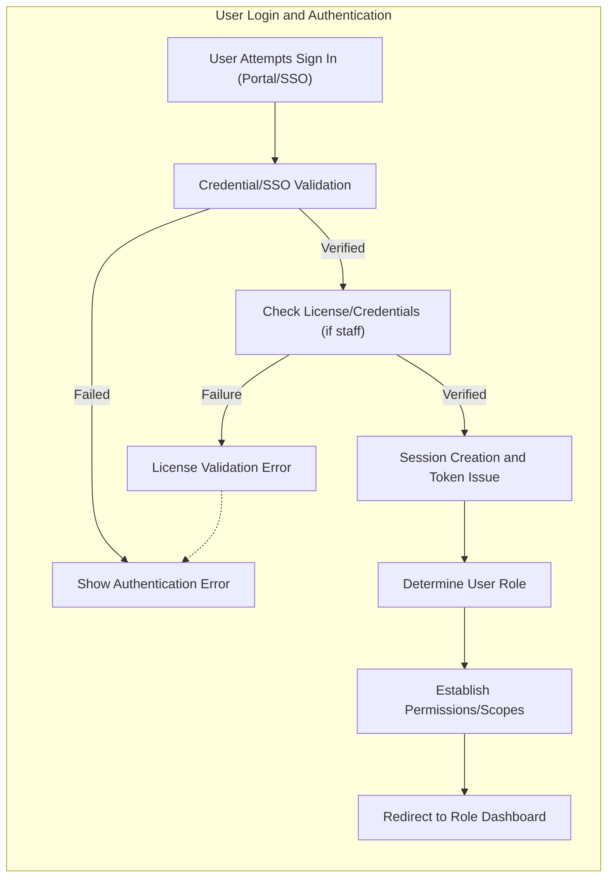

# User Roles and Authentication Requirements: Enterprise Healthcare Platform

## User Roles Overview
The healthcarePlatform service defines a strict, multi-level role structure for secure, compliant, and efficient operations across multiple healthcare organizations. Each role below is characterized in terms of business responsibilities, access, and organizational context:

| Role               | Description                                                                                                           | Organizational Context         |
|--------------------|-----------------------------------------------------------------------------------------------------------------------|-------------------------------|
| System Administrator | Full system access across all organizations. Oversees infrastructure, integrations, analytics, and compliance. Responsible for deployment, security, global audit.                       | Platform-wide/global           |
| Organization Administrator | Administers a given healthcare organization. Manages staff, facilities, billing, regulatory reporting, and all internal workflows for one tenant.                         | Per healthcare organization    |
| Department Head    | Supervises a clinical/operational department (e.g., Cardiology, Emergency) within an organization. Manages staff, schedules, department analytics, and resource allocation.                | Per department/organization    |
| Medical Doctor     | Provides direct patient care. Authorizes prescriptions, views/updates full patient records, orders diagnostics, reviews results, and initiates treatments.                              | Per department/organization    |
| Nurse             | Delivers clinical care, records vitals, administers medication (as directed), coordinates care, and communicates with patients. Limited record modification under approval workflows.       | Per department/organization    |
| Technician         | Executes technical/diagnostic tasks (imaging, labs), uploads and annotates medical data, manages technical workflows, and views relevant orders.                                      | Per department/organization    |
| Receptionist      | Handles appointment scheduling, patient check-in/out, non-clinical patient data entry, and administrative inquiries.                                   | Per organization/department    |
| Patient           | End user who manages their own health records, schedules appointments, communicates securely with care teams, and manages insurance/billing.                                  | Per organization              |

## Authentication Requirements

- THE system SHALL require secure authentication for all users before accessing any non-public functionality.
- WHEN a user initiates login, THE system SHALL support:
    - Email/password authentication with minimum password complexity and lockout on repeated failed logins.
    - SSO integration with SAML 2.0, OAuth 2.0, and Active Directory for enterprise users.
    - Direct verification of medical professionals with NPI Registry and relevant state boards during onboarding and at regular intervals.
- WHEN authentication is successful, THE system SHALL issue a session and access token valid for a business-configured period (default: 30 min, extendable by refresh mechanism up to 7-30 days for ongoing care sessions).
- THE system SHALL enforce session expiration, forced logout after configurable inactivity, and allow revocation of all sessions per user or administrator action.
- WHEN a user requests password reset, THE system SHALL require a secondary form of verification (e.g., email, phone, verified SSO) before granting access.
- WHERE an organization requires, THE system SHALL support multi-factor authentication (MFA) for all staff and administrator roles.
- THE system SHALL support automated and manual deprovisioning of user accounts, with full audit trail for each authentication and session event.

## Role/Permission Matrix

| Action/Business Function                              | System Admin | Org Admin | Dept Head | Doctor | Nurse | Technician | Receptionist | Patient |
|------------------------------------------------------|:------------:|:---------:|:---------:|:------:|:-----:|:----------:|:------------:|:-------:|
| Manage All Orgs/Settings                             |     ✅       |     ❌    |    ❌     |   ❌   |   ❌  |     ❌     |      ❌      |   ❌    |
| Manage Organization Staff & Facilities               |     ✅       |     ✅    |    ❌     |   ❌   |   ❌  |     ❌     |      ❌      |   ❌    |
| Department Staff & Resource Management               |     ✅       |     ✅    |    ✅     |   ❌   |   ❌  |     ❌     |      ❌      |   ❌    |
| View Organization Analytics & Reports                |     ✅       |     ✅    |    ✅     |   ⚠️   |  ⚠️  |    ⚠️     |      ❌      |   ❌    |
| Configure System Integrations                        |     ✅       |     ❌    |    ❌     |   ❌   |   ❌  |     ❌     |      ❌      |   ❌    |
| Patient Record: View                                |     ✅       |     ✅    |    ✅     |   ✅   |   ✅  |    ⚠️     |      ❌      |   ✅    |
| Patient Record: Edit/Amend                          |     ✅       |     ✅    |    ✅     |   ✅   |   ⚠️  |     ❌     |      ❌      |   ⚠️    |
| Patient Record: Approve Amendment                   |     ✅       |     ✅    |    ✅     |   ✅   |   ❌  |     ❌     |      ❌      |   ❌    |
| Medical Imaging: Upload/Annotate                    |     ✅       |     ✅    |    ✅     |   ✅   |   ⚠️  |     ✅     |      ❌      |   ❌    |
| Schedule Appointments                               |     ✅       |     ✅    |    ✅     |   ✅   |   ✅  |     ❌     |      ✅      |   ✅    |
| Prescribe Medication                                |     ✅       |     ✅    |    ✅     |   ✅   |   ❌  |     ❌     |      ❌      |   ❌    |
| Approve Prescription After Drug Interaction Check   |     ✅       |     ✅    |    ✅     |   ✅   |   ❌  |     ❌     |      ❌      |   ❌    |
| Access/Modify Billing/Insurance Info                |     ✅       |     ✅    |    ✅     |   ⚠️   |   ⚠️  |    ❌     |      ✅      |   ✅    |
| Send/Receive Secure Messages                        |     ✅       |     ✅    |    ✅     |   ✅   |   ✅  |    ✅     |      ✅      |   ✅    |
| Emergency Access Override                           |     ✅       |     ✅    |    ✅     |   ✅   |   ✅  |     ✅     |      ✅      |   ❌    |
| Configure Audit/Compliance Settings                 |     ✅       |     ❌    |    ❌     |   ❌   |   ❌  |     ❌     |      ❌      |   ❌    |

⚠️ Limited-privilege or subject to approval workflow.

### EARS Format Requirement Examples
- WHEN a patient requests access to their health data, THE system SHALL verify consent and scope before providing access.
- WHEN a nurse submits an update to a patient record, THE system SHALL require approval from a Medical Doctor or Department Head.
- WHEN a doctor prescribes medication, THE system SHALL trigger drug interaction and allergy checks before allowing prescription completion.
- WHEN a receptionist schedules an appointment, THE system SHALL restrict access to non-clinical patient demographics and approval-required resources.
- WHERE emergency override is triggered, THE system SHALL log all actions and initiate post-incident review by compliance officers.
- IF user attempts to access data outside their permission scope, THEN THE system SHALL deny access and log the attempt for auditing.
- THE system SHALL allow patients to revoke consent for record sharing at any time, with full audit history.

## Access Control Policies

- THE system SHALL enforce absolute data separation between organizations (multi-tenant architecture) such that users, staff, and all resources are visible only to their home organization/department unless explicitly permitted under policy (e.g., cross-organization consultations).
- WHERE cross-organization data sharing is required, THE system SHALL require explicit patient and administrative consent, with clear recording of access scope, reason, and approver identity.
- THE system SHALL ensure that permission elevation (e.g., temporary emergency access, department transfer) requires structured approval and is fully auditable.
- WHEN emergency access is needed (e.g., medical crisis), THE system SHALL allow designated staff to override normal access, log the event in detail, and require a compliance review afterward.
- WHEN a role is removed or user terminated, THE system SHALL immediately revoke all active sessions and remote access points for that user.
- THE system SHALL support organization-specific configuration of feature access, such as limiting patient portal capabilities or messaging by locale or regulatory region.
- WHERE consent management policies apply, THE system SHALL enable patients to grant, restrict, or revoke data sharing/communication at any time via the portal.

## Audit and Compliance Requirements

- WHEN any user accesses, modifies, exports, or shares patient health information (PHI), THE system SHALL record the actor, timestamp, data accessed, action, access reason (where applicable), and consent status in a non-repudiable audit log.
- THE system SHALL provide complete audit trail retrieval by authorized compliance and security personnel, with data retention for at least 10 years and automated archiving after 2 years.
- THE system SHALL support periodic (configurable frequency) compliance reviews, anomaly detection (e.g., failed logins, unusual access patterns), and configurable alerting.
- WHERE possible breaches or policy violations are detected, THE system SHALL notify designated officers immediately and support investigation workflow via the audit log.
- THE system SHALL be designed to meet HIPAA requirements for access control, audit trails, breach notification, and role-based data minimization. The system SHALL be adaptable for future SOC 2 Type II certification.

## User Authentication and Role Flow Diagram

## Business-Driven Error Handling and Compliance

- IF authentication fails, THEN THE system SHALL display an explicit business-relevant error (e.g., "Invalid credentials", "Account suspended", "License verification failed") and log the attempt.
- IF user session or token is expired or revoked, THEN THE system SHALL require re-authentication and show a clear session timeout message.
- IF a user attempts to access functionality beyond their assigned permissions, THEN THE system SHALL present an access denied message and capture the event in the audit trail.
- IF emergency override is triggered, THEN THE system SHALL immediately display prominent notifications to all involved staff and compliance personnel.
- THE system SHALL ensure that audit log entries are immutable, tamper-evident, and accessible only to authorized compliance or audit staff.

## Performance and User Experience Requirements

- WHEN authentication is successful, THE system SHALL allow access to the user dashboard within 2 seconds (p95 across all users/roles).
- THE system SHALL allow high-concurrency (5,000+ users per tenant) without perceptible login or role-based navigation delays.
- IF third-party enterprise identity provider is temporarily unavailable, THEN THE system SHALL display a non-technical, business-relevant error and advise fallback/alternate methods if available.
- THE system SHALL offer zero-downtime maintenance for authentication flows via blue/green deployments or similar strategies (responsibility: System Admins/Developers).

---

This document provides business requirements for user roles, authentication, permissions, access control, auditability, and compliance only. All technical implementation (architecture, API, and database design) decisions are at the discretion of the development team.