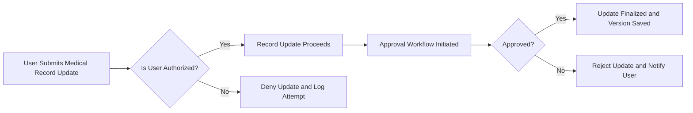
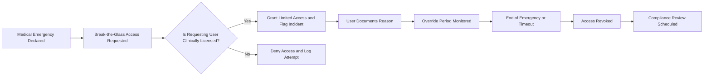

# Business Rules and Validation

## Core Business Rules

- THE healthcarePlatform SHALL enforce complete data isolation between healthcare organizations, with no cross-organization access permitted under any circumstance.
- THE healthcarePlatform SHALL require all actions that read or modify patient health information to be attributable to an authenticated user or automated system function, with full access trails.
- THE healthcarePlatform SHALL use a fine-grained permission model so that each user action is permitted based on their assigned role and organizational scope.
- THE healthcarePlatform SHALL require that permissions for modifying or approving sensitive data (e.g., medical records, prescriptions, billing operations) are limited to users with documented, valid credentials and current clinical or administrative authority.
- THE healthcarePlatform SHALL always log the intent, time, user, affected data, and resulting status for all actions involving protected health information (PHI).
- WHEN any workflow involves regulatory or safety risk (e.g., prescription approval, record change), THE healthcarePlatform SHALL require explicit user consent, digital signature, or approval workflow completion.

## Medical Record Integrity

- THE healthcarePlatform SHALL utilize version control for all electronic medical records, ensuring every modification is historically preserved and auditable.
- WHEN a user modifies a medical record, THE healthcarePlatform SHALL require entry of a reason for change and, where applicable, the digital signature of the modifying user.
- WHEN any critical change (diagnosis, medication, procedure orders) is entered, THE healthcarePlatform SHALL initiate an approval workflow in which an authorized role (per department policy) must review and approve the change.
- THE healthcarePlatform SHALL prevent editing or deletion of records that are under regulatory or legal hold, audit, or ongoing clinical investigation.
- WHEN a non-authorized user attempts to modify protected medical records, IF action is denied, THEN THE healthcarePlatform SHALL log the incident and present an appropriate denial message.
- WHERE data is soft-deleted, THE healthcarePlatform SHALL ensure the data remains fully recoverable, with all previous versions and associated audit trails available for the legally required retention period.

### Mermaid Diagram: Medical Record Update Approval

## Audit and Approval Flows

- THE healthcarePlatform SHALL record a structured audit log for every workflow affecting PHI, including the initiator, all approvers, timestamps, reason for action, and affected data entity.
- WHEN an approval is required for a workflow (e.g., prescription, medical record update, billing adjustment), THE healthcarePlatform SHALL prevent progression until an authorized user provides explicit approval or digital signature.
- THE healthcarePlatform SHALL enforce that all audit logs are immutable and protected against tampering, accidental deletion, or unauthorized access.
- WHERE regulatory reporting is required, THE healthcarePlatform SHALL generate and provide structured reports containing all necessary audit trail details, upon request by properly authorized personnel.
- IF an action is performed on behalf of another user (e.g., delegated authority, emergency override), THEN THE healthcarePlatform SHALL record both the acting and underlying user identities in the audit log.
- THE healthcarePlatform SHALL ensure audit trails are stored in compliance with regulatory requirements for at least 10 years, with automated archival after 2 years and full retrievability during the retention period.

## Compliance and Breach Response

- THE healthcarePlatform SHALL comply with HIPAA, SOC 2 Type II (future), and all relevant state and federal medical data regulations governing traceability, access control, data retention, and breach notification.
- WHEN a breach or unauthorized data access is suspected or detected, THE healthcarePlatform SHALL immediately flag the incident, restrict further access, and log all ongoing activity.
- THE healthcarePlatform SHALL automatically notify designated compliance officers and organization administrators about potential or actual breaches within the legally mandated notification timeframe.
- IF a confirmed security incident is determined to have exposed PHI, THEN THE healthcarePlatform SHALL facilitate the required breach response procedures, including patient notification support and detailed incident documentation suitable for regulatory inquiry.
- WHERE regular compliance audits are mandated, THE healthcarePlatform SHALL support scheduled and ad hoc export of system- and tenant-specific audit logs, with granular filtering and traceability features.
- WHEN processing data for audit, THE healthcarePlatform SHALL ensure only authorized compliance roles may retrieve or review PHI or audit details.

## Emergency and Data Retention Policies

- WHEN a medical emergency is declared, THE healthcarePlatform SHALL offer a 'break-the-glass' override that allows otherwise unauthorized access to patient records by on-duty licensed clinical personnel.
- IF 'break-the-glass' is used, THEN THE healthcarePlatform SHALL record the user, specific data accessed, duration and nature of override, documented reason, and automatically flag the incident for immediate post-event compliance review.
- THE healthcarePlatform SHALL enforce that break-the-glass access only persists for necessary duration and is automatically revoked at the end of the emergency or clinical case.
- THE healthcarePlatform SHALL require all emergency override records to be reviewed by compliance staff within a set timeframe (e.g., 48 hours), with outcomes and corrective actions documented.
- THE healthcarePlatform SHALL comply with jurisdictional requirements for data retention, ensuring PHI and audit records are preserved for at least 10 years (unless overwritten by stricter local rule), are archived after 2 years, and may be expunged only on legitimate, logged legal request.

### Mermaid Diagram: Emergency Access Flow

## Summary Table: Key Business Rules

| Rule Area | Summary |
|-----------|---------|
| Data Isolation | No cross-org access under any condition |
| Permissions | Actions mapped to verified, current roles only |
| Audit Trails | Immutable logs for all access/changes; 10+ years retention |
| Approvals | Sensitive actions require explicit approval/sign-off |
| Medical Integrity | Full version control, reason logging, no silent edits or deletions |
| Break-the-glass | Strict override with automatic review and documentation |
| Compliance | Adherence with HIPAA, SOC 2 Type II, and state/federal law |
| Breach Response | Swift restriction, logging, and notification on incident |
| Retention | 10-year minimum PHI retention, 2-year archival, legal destruction only |

## Output and Notification Expectations

- WHEN user actions are denied by business rules (e.g., lack of permission, attempt to alter retained/locked record), THE healthcarePlatform SHALL present clear messaging with instructions for next steps, appeal, or compliance contact.
- WHERE audit event thresholds or safety warnings are triggered (e.g., multiple failed access attempts, override invoked), THE healthcarePlatform SHALL immediately notify the affected organization’s administrator or compliance contact.
- WHEN any audit review, compliance check, or data retention timeline is reached, THE healthcarePlatform SHALL proactively generate and route notifications or reports as required by organizational or regulatory rules.

---