# Primary User Journeys for Major Roles

## Introduction
Primary user journeys capture the production business workflows for the most important personas in the healthcarePlatform system. Each journey details end-to-end flows, success/failure points, auditability, compliance, and business validation logic for backend implementation. All requirements use EARS format where actionable. Scenarios include cross-role interactions, error handling, escalation, and audit requirements.

## Journey Selection Rationale
Journeys focus on scenarios critical for compliance, value delivery, frequency of use, and operational continuity:
- Patient registration and appointment flows
- Clinical staff consult-to-treatment and coordination
- Department/Org administration (scheduling, compliance, audit)
- Billing/insurance submission and receipt
- Platform-wide administration, incident response, and emergency access override

## Role-Specific Journey Scenarios
### 1. System Administrator: Platform Oversight, Incident Response
- WHEN a platform health warning, incident, or compliance alert occurs, THE system SHALL notify systemAdmins via real-time alert, including unique correlation ID and severity.
- WHEN systemAdmin receives the alert, THE system SHALL provide access to logs, incident dashboards, root-cause analysis tools, and structured event export.
- WHEN a systemAdmin makes configuration or integration changes, THE system SHALL require multi-factor authentication and full audit trail of each action.
- IF an incident degrades tenant/clinical functions, THEN THE system SHALL escalate with clear communication to impacted orgAdmins/departments.
- WHEN incident is resolved, THE system SHALL record closure summary and notify orgAdmins.
- WHILE an incident is open, THE system SHALL restrict further platform config changes to systemAdmins only.
- WHEN emergency override (break-the-glass) is used, THE system SHALL enforce post-incident review for all privileged actions.
- IF audit logs are tampered with or reporting fails, THEN THE system SHALL lock platform configuration and escalate to regulatory contacts.

### 2. Organization Administrator: Staff Management, Compliance
- WHEN an orgAdmin logs in, THE system SHALL display dashboards for compliance status, upcoming tasks, pending approvals, and operational analytics.
- WHEN onboarding new staff, THE system SHALL require role assignment, department mapping, and credential/license verification (with NPI/state API where applicable).
- WHEN promoting to departmentHead or clinicalLead, THE system SHALL validate all permissions, record the justification, and update the audit trail.
- WHEN regulatory reporting deadlines approach, THE system SHALL auto-generate compliance reports and notify orgAdmin for review.
- WHEN orgAdmin deactivates or terminates a user, THE system SHALL transfer or close all open responsibilities, update staff schedules/services, and record all access changes for audit.

### 3. Department Head: Resource Scheduling & Supervision
- WHEN a departmentHead views staffing levels, THE system SHALL display all scheduled shifts, active roles, and highlight unfilled positions.
- WHEN assigning shifts/resources, THE system SHALL check for conflicts, credential validity, and compliance with staff quotas or policy.
- WHEN department performance falls below specified thresholds, THE system SHALL alert departmentHead and present suggested remediation actions.
- IF a critical resource or staff is double-booked, THEN THE system SHALL block the assignment and offer alternatives.
- WHEN department requests override or urgent resource reallocation, THE system SHALL log the event and notify orgAdmin for workflow exception approval.

### 4. Medical Doctor: Patient Encounter, Diagnosis, Prescription
- WHEN medicalDoctor initiates a patient consult, THE system SHALL retrieve and present full EHR, including all historical versions, allergies, meds, and active alerts.
- WHEN documenting diagnosis/order, THE system SHALL require structured input (ICD-10), perform guideline/interaction checks, and log a digital signature.
- WHEN prescribing medication, THE system SHALL check for allergies, interactions, and auto-fill pharmacy e-prescription info. IF interaction or allergy is detected, THEN THE system SHALL block submission and require override with justification signature.
- WHEN ordering labs/imaging, THE system SHALL send order to lab system, monitor result status, and auto-alert medicalDoctor and nurse for abnormal findings.
- WHEN telemedicine appointments are scheduled, THE system SHALL generate secure access and record session outcome in the patient’s record.
- WHEN care is transitioned (handoff), THE system SHALL trigger notifications to the accepting provider/role and log the transfer.

### 5. Nurse/Technician: Patient Monitoring, Diagnostic
- WHEN nurse or technician logs in, THE system SHALL show the shift patient roster and open tasks, including pending vitals, medication admin, or imaging orders.
- WHEN recording vitals or administering medication, THE system SHALL require identity (digital sign-off), timestamp, and confirmation of open order link.
- WHEN critical vital/lab findings are entered, THE system SHALL escalate real-time notification to responsible medicalDoctor and departmentHead.
- WHEN uploading diagnostic images (DICOM), THE system SHALL validate, store and trigger distribution to assigned providers. Annotated images SHALL be attributed and version-controlled.
- IF an entry is rejected during review (e.g., poor image quality, conflicting data), THEN THE system SHALL provide feedback, log the rejection, and allow for re-upload or disposition.

### 6. Receptionist: Appointment & Intake, Admin
- WHEN patient contacts org or logs in, THE system SHALL allow receptionist to search for patient, verify identity, and create/modify/cancel appointments.
- WHEN booking, THE system SHALL show real-time provider/resource availability, validate time-window, and assign location/room if needed.
- WHEN checking in a patient, THE system SHALL prompt for insurance/ID validation, ensure intake forms are completed, and notify provider of arrival.
- IF patient is late or misses the appointment, THEN THE system SHALL update status, offer reschedule, and record no-show for analytics.

### 7. Patient: Access, Self-Service, Records
- WHEN patient logs into the portal, THE system SHALL present the authenticated user with their EHR, current/upcoming appointments, billing summary, and secure message history.
- WHEN patient requests new appointment, THE system SHALL present available slots and confirm preferred notification settings (SMS, email, portal).
- WHEN viewing lab or imaging results, THE system SHALL only show results released by provider and display provider instructions or summaries.
- WHEN making payments or accessing insurance info, THE system SHALL detail all active balances, histories, and downloadable receipts.
- WHEN patient sends secure message, THE system SHALL route to relevant provider or staff, log the event, and require acknowledgement/response within configured SLA.
- IF patient is denied access (restricted content, missing consent, etc.), THEN THE system SHALL display reason and remediation options.

## Key Success and Failure Points
- Success: Seamless workflow handoff, strict permission checks, timely communication/alerts, full audit logging for actions and state changes.
- Failure: Blocked workflows due to role/permission violation, system or integration downtime, missing audit trail, regulatory/compliance error, unaddressed escalations.
- IF incident/error is unrecoverable, THEN THE system SHALL display a clear recovery path and notify responsible staff/patients as soon as possible.

## Cross-Role Interactions Table
| Workflow Step                | SystemAdmin | orgAdmin | deptHead | medicalDoctor | nurse | technician | receptionist | patient |
|------------------------------|:-----------:|:--------:|:--------:|:-------------:|:-----:|:----------:|:------------:|:-------:|
| Platform Monitoring          | ✅          |          |          |               |       |            |              |         |
| Staff Management             |            | ✅       | ✅       |               | ✅    | ✅         | ✅           |         |
| Consult/Treatment            |            |          | ✅       | ✅            | ✅    | ✅         |              | ✅      |
| Scheduling/Intake            |            | ✅       | ✅       | ✅            | ✅    | ✅         | ✅           | ✅      |
| Billing/Claims               |            | ✅       |          |               |       |            |              | ✅      |

## Mermaid Diagram: End-to-End Patient Encounter Workflow

```mermaid
graph LR
  A["Patient Schedules Appointment"] --> B["Receptionist Confirms and Collects Intake"]
  B --> C["Doctor Opens Patient Encounter"]
  C --> D["Doctor Reviews EHR and Documents Diagnosis"]
  D --> E["Doctor Orders Labs/Imaging"]
  E --> F["Technician Completes Lab/Imaging"]
  F --> G["Results Returned to EHR"]
  G --> H["Doctor Reviews Results"]
  H --> I{"Abnormal Results?"}

  I -->|"Yes"| J["Alert Sent to Doctor and Nurse"]
  J --> K["Doctor Updates Care Plan"]
  K --> L["Nurse Administers Medication/Procedure"]
  L --> M["Doctor Closes Encounter and Issues Instructions"]
  M --> N["Patient Accesses Records and Summary"]

  I -->|"No"| K
```

## Production/Performance Requirements
- THE system SHALL deliver all role-based workflow screens and responses in under 2 seconds (p95) at all steps.
- Real-time alerts and notifications (critical labs, incident escalation, patient messages) SHALL be delivered to target roles within 1 minute (sub-second for life-threatening events).
- Workflow logs, audit records, and transaction histories SHALL be searchable by staff and compliance within 5 seconds of event occurrence.
- IF external integration is unavailable, THEN THE system SHALL degrade gracefully, notify users, and persist all workflow changes for later sync.

## Conclusion
Every journey requires strict compliance, actionable audit logs, and user-centric error and communication handling. Requirements herein ensure every workflow is testable, fully supported, and ready for production. For complete business rules and validation, reference [Business Rules and Validation Logic](./05-business-rules-and-validation.md), and for all user and functional roles, see [User Roles and Authentication Requirements](./02-user-roles-and-authentication.md).