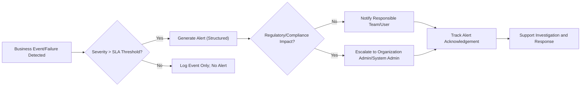
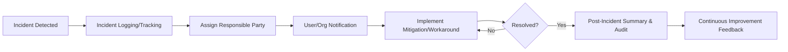

# Observability, Monitoring, and Support Requirements

## 1. Observability Principles

Observability is a core business requirement for the healthcarePlatform, built to guarantee not only performance and uptime but regulatory compliance and defensible auditability. Given the handling of Protected Health Information (PHI), all monitoring and support practices must exceed standard SaaS expectations, demonstrating full traceability, root cause analysis capability, and rapid incident management for both internal and customer-facing systems.

- THE platform SHALL provide real-time and historical visibility into system health, user actions, data changes, and business workflow states.
- THE monitoring system SHALL trace user activity and all requests with correlation IDs across services to ensure end-to-end traceability.
- THE platform SHALL log all critical business, clinical, financial, and security events with structured JSON, including actor identity, action context, affected resources, and audit rationale.

## 2. Monitoring Coverage and Triggers

### 2.1 Requirements for Application, Infrastructure, and Compliance

- THE system SHALL monitor all core application services (user management, EHR, imaging, scheduling, billing, and integrations) for errors, latency, throughput, and anomalous patterns.
- THE monitoring coverage SHALL include supporting infrastructure such as databases, k8s clusters, message queues, caches, storage, and network gateways.
- THE monitoring solution SHALL record health and status checks for all third-party APIs, integrations (EMR, lab, pharmacy, insurance systems), and external dependencies.
- THE platform SHALL collect performance metrics for regulated workflows (e.g., medication orders, lab results, medical imaging retrieval, billing submissions) to ensure business SLAs are verifiable.
- THE system SHALL monitor for data access events involving PHI, financial transactions, record modifications, and emergency access overrides, flagging suspicious or policy-violating behavior.

### 2.2 Failure and Slowdown Triggers

- WHEN a business transaction (e.g., claim submission, e-script, imaging retrieval) fails or is delayed beyond SLA thresholds, THE system SHALL generate a structured event including organization, workflow context, affected user, and error metadata.
- WHEN repeated unauthorized authentication attempts, access to restricted resources, or policy breaches occur, THE monitoring solution SHALL create real-time alerts for compliance and security review.
- WHEN critical infrastructure resources (database, cache, message broker, etc.) experience degraded health (as measured by latency, error rates, or resource exhaustion), THE platform SHALL create actionable error logs and trigger alerting workflows.

### 2.3 Key Monitoring Metrics Table

| Category               | Example Metrics                               |
|------------------------|-----------------------------------------------|
| Application Services   | request latency, HTTP error rates, workflow throughput, user/session counts    |
| Database/Storage       | query response time, slow queries, replication lag, storage utilization        |
| Security & Compliance  | failed logins, rate limit violations, audit log integrity, PHI data access     |
| Integrations           | API response time, error rates, timeout rates, total calls                     |
| System Resources       | CPU, memory, disk, pod/container health, node scheduling availability          |
| Business Operations    | prescription turnaround, claim denial rate, appointment backlog, DICOM delivery|

## 3. Alerting Policies

Alerting must be business-driven, actionable, and support both operational recovery and regulatory notification requirements.

- THE alerting system SHALL generate notifications for all SLA-impacting events, with severity mapped to business impact (downtime, data loss, compliance risk).
- THE system SHALL escalate alerts for repeated errors or impacted workflows to organization-level or system administrators according to role-based escalation policies.
- THE alerting process SHALL integrate circuit breaker and graceful degradation status, so alerts distinguish between recoverable incidents and persistent service failures.
- WHERE a monitored event crosses a regulatory threshold (e.g., multiple failed logins, PHI access anomaly, financial reporting failures), THE system SHALL include audit rationale and user action context with alert dispatches.
- THE platform SHALL support alert delivery via in-system dashboards, email/SMS (per policy), and external operations hooks for 24/7 support visibility.
- WHERE organizational configuration varies (e.g., custom patient portal restrictions), THE alerting system SHALL respect per-organization policy for notification and data disclosure.

#### Example Alert Escalation Pathway (Mermaid Diagram)

## 4. Incident Response and User Communication

Incident management is business critical in healthcare. Regulatory requirements (e.g., HIPAA breach notification, data loss disclosure) mandate clear workflows for incident tracking, assessment, and multilevel communication.

- WHEN an incident impacting PHI, clinical workflows, or SLAs is detected, THE platform SHALL initiate a documented incident response workflow capturing timeline, affected parties, scope, root cause, mitigations, and communication steps.
- THE incident management workflow SHALL support assignment of responsible parties by role (system admin, org admin, department head).
- THE system SHALL log all incident-related actions for auditability, including updates, escalations, and communications.
- THE platform SHALL provide user-facing status updates (e.g., system status page, in-app banners, configurable notification methods) for outage or degradation events affecting patient care, data, or access.
- WHEN an incident is resolved, THE system SHALL capture a post-incident summary including outage duration, affected services, fix timeline, and recommendations for improvement.
- WHERE regulatory notification is required, THE platform SHALL support processes to ensure incident reports are delivered to users, organizations, or authorities per policy, and that record of delivery and receipt is maintained.
- IF incident root cause is linked to external integration or dependency (e.g., EMR sync failure, lab result outage, pharmacy downtime), THEN THE healthcarePlatform SHALL ensure communication and responsibility are coordinated appropriately and policy disclosure rules are followed.

#### Incident Response Lifecycle (Mermaid Diagram)

## 5. Continuous Improvement

Business resiliency in healthcare mandates systematic review and ongoing enhancement of all observability and support practices.

- THE platform SHALL maintain, review, and analyze operational dashboards, incident logs, and alert histories to drive continuous improvement.
- THE business review process SHALL evaluate incident response outcomes, SLA compliance statistics, regulatory audit findings, and stakeholder feedback on a scheduled basis.
- WHEN recurring issues, performance bottlenecks, or audit gaps are identified, THE system SHALL require action plans and progress tracking for operational, technical, or organizational remediation.
- THE platform SHALL support configuration of monitoring and alerting policies over time to adapt to business growth, emerging risks, regulatory changes, and evolving clinical/business workflows.

### Success Metrics for Observability and Support
- Time to detect and respond to incidents (MTTD/MTTR)
- Number and impact of SLA or regulatory breaches over period
- Stakeholder satisfaction with support/communication
- Observable improvements in business outcomes (patient safety, billing cycles, regulatory audit closure)

## References to Related Documents
- For broader non-functional expectations refer to the [Non-Functional Requirements Document](./04-non-functional-requirements.md).
- For full compliance and audit baseline see the [Compliance and Regulations Documentation](./11-compliance-and-regulations.md).
- For business rule alignment see the [Business Rules and Validation Document](./05-business-rules-and-validation.md).
