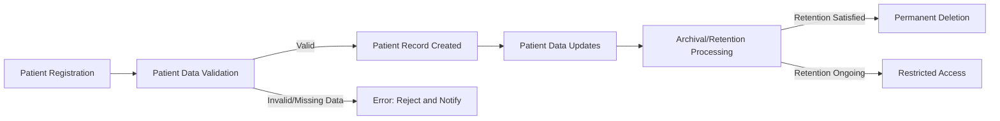
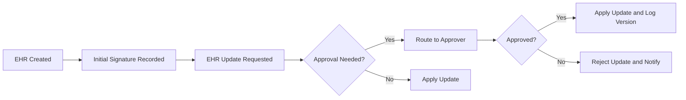
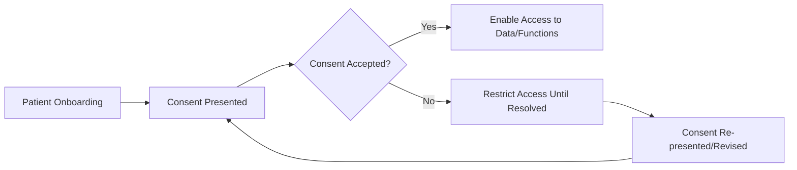

# Patient and Medical Record Flows

## 1. Patient Data Lifecycle

### 1.1 Patient Registration and Onboarding
- WHEN a new patient presents for care, THE healthcarePlatform SHALL allow the receptionist or authorized staff to create a new patient record with required demographic data, consent preferences, and identity verification.
- WHEN a patient self-registers via the portal, THE healthcarePlatform SHALL validate submitted data against duplicate patient checks and verify contact information before activation.
- IF required demographic/identity information is missing or invalid, THEN THE healthcarePlatform SHALL prevent record creation and notify responsible staff.
- WHEN registration is successful, THE healthcarePlatform SHALL assign a globally unique patient ID valid only within the patient’s healthcare organization.

### 1.2 Data Update and Correction
- WHEN authorized staff (receptionist, nurse, doctor, etc.) requests changes to a patient’s profile, THE healthcarePlatform SHALL only allow changes according to role-based permissions (e.g., address, emergency contact by receptionist; medical allergies by nurse; clinical notes by doctor).
- WHEN a patient requests a correction to their data, THE healthcarePlatform SHALL log the request, route it for review, and notify the patient upon completion or rejection.
- IF a patient record is amended, THEN THE healthcarePlatform SHALL record the prior value, change reason, and a digital signature of the approver in an audit log.

### 1.3 Data Deactivation, Archiving, and Retention
- WHEN a patient leaves the organization or requests data erasure (if permitted by regulations), THE healthcarePlatform SHALL begin a formal archival process respecting applicable data retention laws (minimum 7-10 years).
- WHILE a patient record is archived, THE healthcarePlatform SHALL prevent all routine access except by authorized admins for compliance or legal reasons and log all accesses.
- IF the retention period is satisfied and organizational policy/compliance allows, THEN THE healthcarePlatform SHALL permanently delete the patient’s data, logging this event for audit purposes.

## 2. Medical Record Management

### 2.1 EHR Creation and Structure
- WHEN a new clinical encounter occurs (visit, consult, telemedicine), THE healthcarePlatform SHALL create a new EHR entry linked to the patient, encounter type, date, and involved care team members.
- THE healthcarePlatform SHALL store structured clinical information (diagnoses, medications, allergies, procedures, notes, vital signs, orders) in each EHR.
- THE healthcarePlatform SHALL support attaching lab results, diagnostic images, and external documents to each EHR entry.
- WHEN an EHR is created, THE healthcarePlatform SHALL record the responsible physician’s (or relevant provider’s) digital signature and timestamp.

### 2.2 EHR Viewing, Versioning, and Auditability
- WHEN an authorized user accesses an EHR, THE healthcarePlatform SHALL display the complete record, according to the user’s role and consent status.
- WHEN an EHR is modified, THE healthcarePlatform SHALL create a new immutable version of the record, storing prior versions and all change metadata (who, when, what, why).
- WHILE a record is under review or pending approval, THE healthcarePlatform SHALL visually indicate its status to all viewers and restrict further edits to designated roles.
- THE healthcarePlatform SHALL log every read/view access of an EHR with user, purpose, time, and consent validation outcome.
- IF an unauthorized access attempt occurs, THEN THE healthcarePlatform SHALL block access, log the event, and optionally alert compliance staff.

### 2.3 Medical Record Corrections and Amendments
- WHEN a request for amendment is submitted (patient, nurse, doctor), THE healthcarePlatform SHALL route the request for review and approval according to organizational policy and regulatory obligations.
- IF an amendment is approved, THEN THE healthcarePlatform SHALL apply the change to the EHR, record all details (prior value, new value, approver, reason), retain all versions, and communicate the change to appropriate staff and, if required, to the patient.
- IF an amendment is rejected, THEN THE healthcarePlatform SHALL notify the requester and log the justification.

### 2.4 Record Deletion and Emergency Lockdown
- IF a record is flagged for legal hold or investigation, THEN THE healthcarePlatform SHALL lock the record against all modifications and restrict access to authorized personnel only, logging all subsequent accesses and actions.
- IF emergency access (“break-the-glass”) is exercised, THEN THE healthcarePlatform SHALL grant time-limited, purpose-specific access, log all actions, and require post-event review by compliance/admin staff.

## 3. EHR/Imaging Processes

### 3.1 Medical Imaging (DICOM) Lifecycle
- WHEN a diagnostic procedure is ordered, THE healthcarePlatform SHALL allow authorized technicians to upload DICOM images, link them to EHR entries, and annotate as appropriate.
- WHEN an imaging upload is completed, THE healthcarePlatform SHALL validate the image file format, size, and metadata, storing the file in cloud-native storage and distributing access via secure CDN.
- WHEN a user (doctor, technician, or authorized staff) requests a DICOM image, THE healthcarePlatform SHALL deliver images within 3 seconds for current data and within 30 seconds for archived images, showing progressive loading and access controls.
- THE healthcarePlatform SHALL support annotation, measurements, and structured reporting, recording changes as new versions with full audit trails.
- IF an image request is made by an unauthorized user or a user lacking patient consent, THEN THE healthcarePlatform SHALL block delivery and log the incident.

### 3.2 Lab Results and External Document Integration
- WHEN a lab result is received from an integrated system (LabCorp, Quest, etc.), THE healthcarePlatform SHALL auto-link the result to the relevant EHR and generate a notification for the ordering provider.
- IF a lab result contains critical or out-of-range values, THEN THE healthcarePlatform SHALL automatically generate an urgent alert to the responsible provider and escalate to on-call/backup providers if unacknowledged within organizational policy timeframe.
- WHEN external clinical documents (e.g., C-CDA, transfer summaries) are imported, THE healthcarePlatform SHALL parse and attach them to the patient’s medical record with validation of document format and provenance.

## 4. Consent and Privacy Flows

### 4.1 Consent Management (Acquisition, Revocation, Status)
- WHEN a patient is onboarded, THE healthcarePlatform SHALL present required consents (treatment, HIPAA, data use for research, sharing with third parties, etc.) and require explicit acceptance before data is shared or services initiated.
- THE healthcarePlatform SHALL record each consent with patient identity, consent type, timestamp, and method (digital signature, physical, witness).
- WHEN a patient revokes consent for any use, THE healthcarePlatform SHALL immediately update consent status, notify relevant staff, and prevent affected disclosures/access from that point forward.
- WHEN an authorized user attempts to access or share data, THE healthcarePlatform SHALL check and enforce consent policies, denying access or filtering data where required.

### 4.2 Consent-Driven Access Controls
- WHILE patient consent status is “revoked” or “restricted,” THE healthcarePlatform SHALL block all access or sharing attempts not explicitly permitted by law or emergency exception, logging each event.
- IF data access is attempted in violation of consent policy, THEN THE healthcarePlatform SHALL deny access, notify compliance, and present an appropriate explanation to the user.

### 4.3 Consent Logging and Audit
- THE healthcarePlatform SHALL maintain an immutable audit trail of all consent acquisitions, updates, revocations, and access-attempts predicated on consent.
- WHILE audit logs are stored, THE healthcarePlatform SHALL provide only authorized users the ability to view, search, or export these logs for compliance review.

## 5. Role-Based Access and Data Handling

### 5.1 Permissions by Role (Summarized Business Mapping)
| Role                | View EHR | Edit EHR | Approve Amendments | View DICOM | Annotate Images | Upload Labs | Schedule Appointments | View Billing | Access Patient Portal |
|---------------------|----------|----------|--------------------|------------|-----------------|-------------|----------------------|--------------|----------------------|
| systemAdmin         | All      | None     | Yes                | Yes        | None            | None        | Yes                  | Yes          | None                 |
| organizationAdmin   | Org      | None     | Yes                | Org        | None            | None        | Yes                  | Yes          | None                 |
| departmentHead      | Dept     | Dept     | Dept               | Dept       | Dept            | Dept        | Dept                 | Dept         | None                 |
| medicalDoctor       | Assigned | Yes      | Yes                | Assigned   | Assigned        | Yes         | Assigned             | Assigned     | None                 |
| nurse              | Assigned | Vitals   | No                 | Assigned   | None            | Yes         | Assigned             | Assigned     | None                 |
| technician         | Assigned | None     | No                 | Assigned   | Yes             | Yes         | None                 | None         | None                 |
| receptionist       | Minimal  | None     | No                 | None       | None            | None        | Yes                  | Yes          | None                 |
| patient            | Self     | None     | No                 | None       | None            | None        | Self                 | Self         | Yes                  |

*Notes: “Assigned” means within the doctor/nurse/tech's relationship to the patient under their care. “Org”, “Dept” are scoping rules. “Self” means patient self-access only.*

### 5.2 Business Enforcement
- WHEN a user initiates an action on a patient/EHR/data object, THE healthcarePlatform SHALL check role permissions, data scoping (tenant/org/department/assigned/self), and explicit consent before granting access.
- IF a user lacks the correct role, relationship, or consent, THEN THE healthcarePlatform SHALL deny the request, inform the user, and log the attempt for audit.
- WHEN emergency access is triggered, THE healthcarePlatform SHALL bypass normal checks but document all subsequent actions and require admin/compliance review.

## 6. Error Handling and Compliance Scenarios

### 6.1 Common Error Scenarios
- IF a required input (patient identifier, image file, consent, etc.) is missing or unreadable, THEN THE healthcarePlatform SHALL reject the submission and display an actionable, role-appropriate error message.
- IF a data modification violates business rules (e.g., invalid date, conflicting medication, unauthorized edit), THEN THE healthcarePlatform SHALL block the change and indicate which rule was violated.
- IF a third-party integration (lab, pharmacy, EMR) fails to deliver data in required formats, THEN THE healthcarePlatform SHALL log the failure, notify assigned staff, and offer fallback/manual entry mechanisms as appropriate.
- WHEN critical alerts or escalations (lab out-of-range, imaging error) fail to reach the intended recipient within the response window, THE healthcarePlatform SHALL escalate by notifying alternates as per business rules.

### 6.2 Compliance, Audit, and Exception Monitoring
- WHEN suspicious access or data exfiltration patterns are detected (rate limiting, repeated unauthorized attempts), THE healthcarePlatform SHALL trigger an alert to compliance staff and may implement temporary user lockout or CAPTCHA.
- THE healthcarePlatform SHALL provide audit logs and access histories on-demand for compliance, at organizational or patient level, consistent with privacy laws.

## 7. Output, Notifications, and State Diagrams

### 7.1 Outputs and Notifications
- THE healthcarePlatform SHALL generate system notifications for all significant events (record creation, amendment, critical alerts, consent changes, audit triggers), delivering them to appropriate roles via secure internal messaging.
- WHEN persistent errors or workflow-blocking conditions exist, THE healthcarePlatform SHALL escalate to admin/configuration staff for resolution.

### 7.2 Workflow and State Visualization

#### Patient Data Lifecycle (Mermaid)

#### EHR Versioning and Amendment Flow (Mermaid)

#### Consent Capture and Access Flow (Mermaid)

---

This document describes business requirements only. All technical implementation decisions—including architecture, APIs, and database design—are at the discretion of the development team. The document specifies what the system shall do, not how to build it.