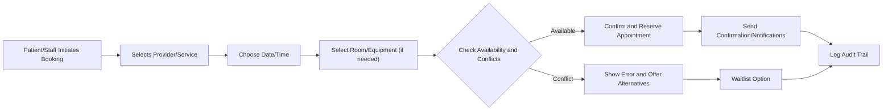
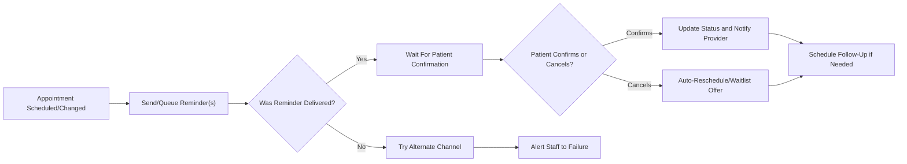

# Appointment and Scheduling Flows for Healthcare Platform

## Scheduling Overview

The healthcarePlatform aims to provide robust, production-grade appointment and scheduling capabilities for multi-tenant healthcare organizations—including hospitals, clinics, and private practices. Scheduling must enable seamless coordination between patients, providers (doctors, nurses, technicians), and resources (rooms, equipment), supporting both in-person and telemedicine appointments. All scheduling processes shall respect organizational isolation, HIPAA compliance, audit trails, and provide a responsive, self-service experience for all user roles as defined in [User Roles and Authentication](./02-user-roles-and-authentication.md).

### Appointment Types and Business Objectives
- Standard provider appointments (in-person/outpatient, consultations, procedures)
- Telemedicine/video consultations with pre-scheduled or on-demand options
- Multi-resource and multi-provider bookings (e.g., surgery teams, equipment, rooms)
- Patient self-service scheduling with real-time availability

### Scheduling Performance Requirements
- THE scheduling module SHALL display real-time availability and booking options to all users with relevant access within 2 seconds of request.
- THE scheduling flows SHALL support 10,000+ concurrent active scheduling sessions without data collision or double-booking.
- THE system SHALL allow patients to view, book, modify, or cancel their appointments through the patient portal, in English or Spanish.
- All scheduling transactions SHALL be logged with full audit trails including timestamp, user, intent, and success/failure outcome.

### Organizational and Compliance Boundaries
- THE platform SHALL ensure complete data isolation when scheduling between different healthcare organizations, departments, and roles.
- IF an unauthorized user attempts to view or book appointments outside their allowed scope, THEN THE system SHALL deny the request and log the event for audit review.

## Resource and Provider Booking

### Coordinate Providers, Rooms, and Equipment
- WHEN a provider, staff member, or patient initiates a new appointment, THE system SHALL present real-time provider and resource availability based on user’s organization and department context.
- THE scheduling module SHALL support concurrent bookings across multiple providers, rooms, and equipment, enforcing organizational, departmental, and resource-level constraints.
- WHEN an appointment is created involving restricted resources (such as surgical rooms or specialized equipment), THE system SHALL enforce proper authorization, approval workflows, and booking window lead times.
- THE system SHALL support complex recurrence rules (e.g., physical therapy sessions every Monday/Wednesday for 6 weeks) and integrate with existing calendar systems for providers.
- WHERE recurring or group appointments are supported, THE system SHALL maintain all instances in synchronization and automatically propagate approved changes.

### Waitlists and No-Shows
- WHEN a requested time slot is unavailable, THE system SHALL offer to add the requestor to a waitlist and notify them if and when a slot becomes available.
- THE no-show process SHALL be managed by marking missed appointments and enabling rescheduling or follow-up workflows as per organizational policy.

### Booking Validation, Conflicts, and Error Handling
- IF a resource becomes unavailable due to an emergency or maintenance, THEN THE system SHALL automatically attempt to re-route appointments, notify stakeholders, and log the incident.
- IF a booking conflict is detected (time/resource/staff overlap), THEN THE system SHALL prevent the booking, display specific validation errors, and offer alternative options.
- THE system SHALL enforce maximum and minimum booking windows, cancellation periods, and reschedule limits as configured by each organization or department.

#### Mermaid Diagram: Appointment/Resource Booking Flow

## Telemedicine Journeys

### Telemedicine Session Setup
- WHEN a telemedicine appointment is requested, THE system SHALL offer video platform selection (in-house or integrated third party per organization policy), secure link generation, and device compatibility checks for both patient and provider.
- THE telemedicine workflow SHALL allow pre-session documentation upload (e.g., symptoms, insurance), virtual check-in process, and secure chat prior to video start.
- WHERE telemedicine sessions require consent (e.g., video recording, digital records), THE system SHALL enforce display and acceptance of proper consent forms before session initiation.
- WHEN the video visit is initiated, THE system SHALL log the entry/exit times, session metadata, participant list, and any technical issues reported.

### Recording, Privacy, and Security
- WHERE organizations enable recording, THE system SHALL implement patient/provider opt-in workflows and clearly communicate the storage duration and access controls for session recordings.
- IF a telemedicine provider cannot join (e.g., network failure), THEN THE system SHALL escalate the case to a backup provider queue or offer immediate patient rescheduling.
- THE platform SHALL ensure all video and chat data transmission is encrypted end-to-end, logged for compliance, and tied to the appointment’s audit log.

#### Mermaid Diagram: Telemedicine Appointment Flow

```mermaid
graph LR
    A["Patient Books Telemedicine Appointment"] --> B["Select/Assign Provider"]
    B --> C["Consent Handling"]
    C --> D["Pre-Session Documentation"]
    D --> E["Provider/Patient Virtual Check-in"]
    E --> F["Video Session Start"]
    F --> G["Session End/Provider Notes"]
    G --> H["Send Summary/Notifications"]
    H --> I["Log Session for Compliance"]
```

## Reminders and Follow-ups

### Automated Reminders
- WHEN an appointment is scheduled, modified, or canceled, THE system SHALL send automated notifications to the patient and provider via configured channels (SMS, email, patient portal messages, with language localization).
- THE system SHALL send reminders at pre-configured intervals (e.g., 24 hours and 2 hours before appointment) as per organizational and patient communication preferences.
- WHERE a patient confirms or cancels an appointment via reminder, THE system SHALL update the appointment status in real time and notify the provider.
- IF a reminder notification fails (e.g., invalid contact), THEN THE system SHALL attempt alternate channels (if enabled), log the event, and present actionable error to the relevant staff.

### Follow-up Scheduling and Workflows
- WHEN an appointment outcome requires a follow-up (e.g., check-up post-surgery, lab results review), THE provider or nurse SHALL be prompted to schedule a recommended follow-up per specialty guidelines.
- THE system SHALL track missed/declined follow-ups and alert care teams for appropriate next steps (e.g., outreach or documentation of patient decline).

#### Mermaid Diagram: Reminder and Follow-Up Workflow

## Business Rules and Validation Logic
- THE system SHALL strictly enforce appointment quotas, overlapping limits, and maximum resource utilization per provider, department, and location.
- ALL changes to schedules (create/update/cancel) SHALL be subject to audit logging with user and timestamp.
- THE appointment system SHALL allow organizational administrators to configure booking windows, lead/cancellation times, allowed appointment types, and notification preferences.
- IF a system-level or integration outage prevents scheduling operations, THEN THE system SHALL gracefully degrade, provide user feedback, and offer to contact staff for manual support.

## Output and Notification Requirements
- All outputs (success, conflict, error, waitlist, reminders) SHALL be presented in the user’s preferred language and time zone context, ensuring compliance with patient privacy and communication best practices.
- THE scheduling module SHALL provide real-time dashboard summaries for providers and admins showing today’s appointments, resource utilization, and exceptions.
- All error responses MUST be actionable, explaining both the cause and the recovery options to the end user or staff.

---

This document specifies business logic, user scenarios, error conditions, and validation rules for appointment and scheduling flows in the healthcarePlatform. Technical details, APIs, and implementation choices are at the discretion of the development team. Please reference related documentation for additional user flows and role-based behaviors.