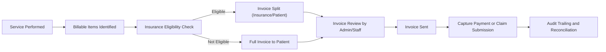
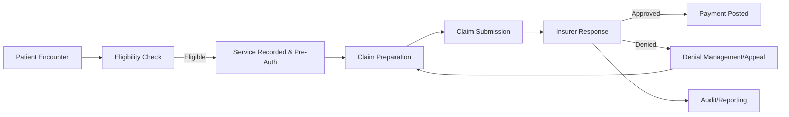
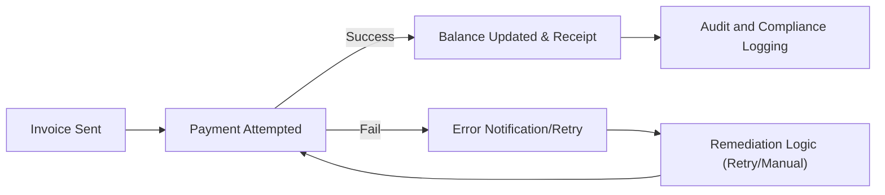

# Billing and Insurance Business Flows for healthcarePlatform

## 1. Introduction
This document details all business requirements and user journeys for the handling of billing, insurance, and revenue management operations on the healthcarePlatform system. It utilizes the EARS requirements pattern to ensure clarity and actionability, and provides comprehensive coverage of workflows, role-based permissions, validation rules, error handling, audit, and compliance critical for backend implementation of production-grade healthcare financial modules.

---

## 2. Billing Business Flows

### 2.1 Overview
Billing in healthcarePlatform involves generating, validating, and tracking patient, insurance, and organizational transactions for all care-related activities, including direct patient billing and third-party insurance claims.

#### Main Billing Scenarios:
- Service encounter to billable item mapping
- Generation of invoices for patients and insurers
- Real-time eligibility verification for insurance coverage
- Application of discounts, write-offs, and adjustments based on business policies
- Handling of patient self-pay, co-insurance, and post-insurance settlements

#### EARS Requirements:
- WHEN a care service is rendered, THE system SHALL itemize all billable services and materials linked to the encounter.
- WHEN a user (medicalDoctor, nurse, technician, receptionist) records a new care event, THE system SHALL generate corresponding billing line items, mapped to ICD-10/CPT or relevant medical codes.
- THE system SHALL support linking of each billing line to its originating clinical record for audit and traceability.
- WHEN an invoice is generated, THE system SHALL present a breakdown with payer allocations (insurance vs. patient share).
- THE system SHALL allow organizationAdmin and authorized billing staff to apply discounts, payment plans, or write-offs per business policy.
- WHEN a billing error is identified, THE system SHALL support annotated adjustments and require audit reason capture prior to modification.
- THE system SHALL restrict billing adjustment actions to roles with explicit permissions (see permission matrix).
- WHEN regulatory requirements dictate, THE system SHALL enforce billing workflows that comply with regional/state/federal healthcare laws.
- THE system SHALL collect structured metadata (timestamps, performing user, correlation IDs) with each billing record for audit.

### 2.2 Billing Process Flow (Mermaid)

---

## 3. Insurance and Claims Handling

### 3.1 Overview
Insurance operations focus on validating coverage, preparing claims, managing denials/appeals, and synchronizing status with payers.

#### Main Insurance Scenarios:
- Real-time plan eligibility verification
- Automated pre-authorization workflows
- Claims preparation, submission, tracking
- Denial analysis and appeal handling
- Import/sync of Explanation of Benefits (EOB)

#### EARS Requirements:
- WHEN a patient encounter is initiated, THE system SHALL perform real-time insurance eligibility verification using payer integrations.
- THE system SHALL record all eligibility check results with full audit trail (who/when/result).
- WHEN a care plan or procedure requires prior authorization, THE system SHALL initiate and track pre-auth workflows with status notifications to relevant staff.
- WHEN a billable event is finalized, THE system SHALL prepare a claim packet with attached supporting documentation.
- WHEN a claim is submitted, THE system SHALL monitor payer response and update both patient and organization records with status changes.
- IF a claim is denied, THEN THE system SHALL notify billing staff for manual intervention and allow recording of appeal workflows.
- THE system SHALL support periodic (nightly, admin-triggered) sync of claim status and EOB with external payers.
- THE system SHALL restrict access to insurance data and claim modification actions to appropriate roles (see Role Matrix).
- WHERE regulatory or payer-specific timelines exist, THE system SHALL enforce timely submission and follow-up actions in the workflows.

### 3.2 Insurance & Claims Flow (Mermaid)

---

## 4. Payment Journeys

### 4.1 Overview
Payments may be received from insurers, patients, or split across multiple parties. The platform must support secure, auditable, and convenient payment acceptance, refunds, settlements, and reconciliation per healthcare industry norms.

#### EARS Requirements:
- WHEN an invoice is sent, THE system SHALL enable multiple payment channels (credit card, bank transfer, payer partners).
- THE system SHALL support payment plan configuration for patients, with clearly defined schedules and compliance notifications.
- WHEN a payment is posted (by payer or patient), THE system SHALL update outstanding balances and provide receipts to all relevant stakeholders.
- IF a payment fails or is disputed, THEN THE system SHALL record the occurrence, notify staff, and enable appropriate remediation (retry, refund, manual override).
- WHERE insurance and patient payments are involved, THE system SHALL maintain distinct records and proper allocation for each party.
- WHEN payments are received, THE system SHALL log all transactions in a manner auditable for compliance.
- WHEN business rules (patient or organization-defined) require, THE system SHALL support refunds, with reason and approval workflows.
- THE system SHALL expose payment status and breakdown transparently to all authorized roles.
- WHERE mandates for retention or PCI/HIPAA compliance apply, THE system SHALL enforce secure encryption and access controls around all payment data.

### 4.2 Payment Process Flow (Mermaid)

---

## 5. Financial Audit Trails

### 5.1 Overview
Auditability is mandatory for all financial transactions, modifications, and access to billing/insurance data, supporting regulatory (HIPAA, SOC 2) compliance and business oversight.

#### EARS Requirements:
- THE system SHALL record all payment, claim, and adjustment actions with performer, timestamp, correlation ID, and context.
- WHEN financial data is accessed, THE system SHALL log who, when, and for what purpose, as visible in audit logs.
- THE system SHALL retain audit logs for a minimum of 10 years, with cold storage after 2 years, as required by business and legal policy.
- IF suspicious or anomalous patterns (e.g., repeated failed logins, high-value adjustments) are detected, THEN THE system SHALL trigger rate limiting and surface alerts to systemAdmin for review.
- WHERE business or compliance policy dictates, THE system SHALL support full audit trail export/query for governance or investigation.
- THE system SHALL restrict access to audit and financial logs to roles with explicit audit or admin privileges (e.g., systemAdmin, organizationAdmin).

---

## 6. Role Responsibilities and Permissions

### 6.1 Overview
All billing and insurance actions are governed by a strict role-based permission model, mapped to user roles:

| Action                                   | systemAdmin | organizationAdmin | departmentHead | medicalDoctor | nurse | technician | receptionist | patient |
|-------------------------------------------|-------------|-------------------|---------------|--------------|-------|------------|-------------|---------|
| View Invoice                             | ✅          | ✅                | ✅            | ✅           | ✅    | ✅         | ✅          | ✅      |
| Create/Modify Invoice                    | ✅          | ✅                | ✅            | ✅           | ❌    | ❌         | ❌          | ❌      |
| Approve Invoice Adjustment               | ✅          | ✅                | ✅            | ❌           | ❌    | ❌         | ❌          | ❌      |
| View Insurance & Claims                  | ✅          | ✅                | ✅            | ✅           | ✅    | ✅         | ✅          | ✅      |
| Submit/Edit Claims                       | ✅          | ✅                | ✅            | ✅           | ❌    | ❌         | ❌          | ❌      |
| Access/Modify Audit Trail                | ✅          | ✅                | ❌            | ❌           | ❌    | ❌         | ❌          | ❌      |
| Record Payment                           | ✅          | ✅                | ✅            | ✅           | ❌    | ❌         | ✅          | ✅      |
| Approve Adjustment >$1000                | ✅          | ✅                | ❌            | ❌           | ❌    | ❌         | ❌          | ❌      |
| Access Payment Reports                   | ✅          | ✅                | ✅            | ✅           | ❌    | ❌         | ✅          | ✅      |
| Configure Billing Rules                  | ✅          | ✅                | ❌            | ❌           | ❌    | ❌         | ❌          | ❌      |
| Configure Payment Plans                  | ✅          | ✅                | ✅            | ❌           | ❌    | ❌         | ❌          | ❌      |
| Initiate Appeals (Claims)                | ✅          | ✅                | ✅            | ✅           | ❌    | ❌         | ❌          | ❌      |

---

## 7. Error Scenarios and Business Rules

### 7.1 Business Rules
- WHEN a billable event is created, THE system SHALL enforce appropriate ICD-10/CPT code usage for regulatory requirements.
- IF payment/claims deadlines (based on payer, regulation, or organizational policy) are not met, THEN THE system SHALL escalate with alerts and required acknowledgment by authorized staff.
- THE system SHALL restrict refund or adjustment actions to staff above configured threshold with multi-step approval.
- WHEN business policies dictate pre-authorization or pre-payment, THE system SHALL enforce required holds before care is rendered or invoiced.

### 7.2 Error Handling
- IF a payer integration disconnects or response times exceed 30 seconds, THEN THE system SHALL surface a user-facing error, log the incident, and allow retry or manual entry.
- IF a payment method is declined or fails, THEN THE system SHALL prompt the patient or staff for alternate method and retain transaction context for audit.
- WHEN insurance/claim submission fails validation with external payers, THE system SHALL display actionable error details to billing staff for correction.
- IF repeated failure patterns are observed (e.g., claims rejected for missing codes), THEN THE system SHALL suggest root cause analytics and guide staff to best practices.
- WHEN a patient or organization attempts to perform unauthorized billing or insurance actions, THE system SHALL log the attempt, block the action, and notify compliance roles if necessary.

---

## 8. Performance Expectations & Output Notifications
- THE billing workflow SHALL complete with entry-to-invoice in under 5 seconds for standard encounters.
- Insurance eligibility checks SHALL respond within 10 seconds for 95% of requests.
- Claims submission and status syncs SHALL reflect external payer responses within 24 hours or escalate if delayed beyond SLA.
- Payment posting, receipt notification, and balance updates SHALL occur instantly following payment confirmation.
- THE system SHALL generate notifications to all affected roles upon significant billing, insurance, claim, or payment events (invoice issued, payment received, claim denied, adjustment made, etc.).

---

## 9. Success Criteria
- 100% traceability and auditability of all billing and insurance-related transactions.
- Role-based access respects all configured permissions and compliance demands.
- All user-facing errors and exceptions offer clear, actionable remediation pathways.
- Compliance with HIPAA, PCI, and relevant insurance/payer guidelines maintained at all times.
- Platform supports scaling to 5,000+ concurrent organizational users without degradation in financial workflow performance.

---