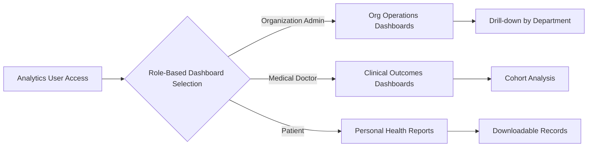
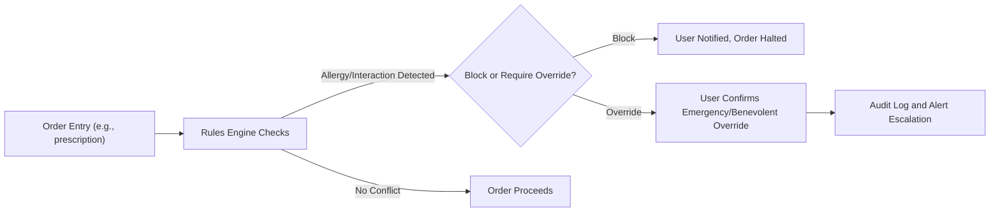

# Analytics and Clinical Decision Support Requirement Analysis

## 1. Introduction
The healthcarePlatform requires robust analytics and clinical decision support systems to achieve outcome-driven improvements for healthcare organizations, providers, and patients. These features must support regulatory obligations (e.g., HIPAA), business intelligence for operational efficiency, and tools to enable safer, evidence-based clinical care. Requirements below ensure the system drives actionable insights while maintaining strict compliance and auditability.

## 2. Analytics Objectives
- THE analytics subsystem SHALL provide real-time and historical insights on patient outcomes, provider performance, resource utilization, billing, compliance, and operational workflows.
- THE system SHALL support configurable visual dashboards for users by role (admin, clinical, patient).
- THE analytics features SHALL support outcome improvement, population health management, and regulatory compliance.
- THE platform SHALL enable trend analysis, cohort comparison, and predictive insights for clinical and operational KPIs.
- THE system SHALL support both aggregate and drill-down (per organization, per department, per user, per patient) analytics.
- THE analytics engine SHALL support exporting reports to standard formats (PDF, CSV, XLSX) per regulatory and audit requirements.
- THE analytics sources SHALL include EHR, imaging, lab, billing, appointment, and SSO/audit subsystems.

## 3. Dashboards and Reports
### Business-Driven Dashboards
- WHEN a user with analytics access role logs in, THE system SHALL display a customizable dashboard relevant to their scope (organization, department, role).
- THE system SHALL include dashboards for:
    - Patient outcomes (readmission rates, infection rates, patient satisfaction)
    - Provider productivity (number of encounters, average handling time, compliance adherence)
    - Appointment utilization (wait times, no-show rates, telehealth adoption)
    - Billing and insurance performance (claim approval rates, denial patterns, outstanding balances)
    - Compliance and audit metrics (access logs, data modification, HIPAA key indicators)
    - Medical imaging and lab turnaround metrics
    - Population health management dashboards (chronic disease rates, preventive care coverage)

#### Standard and Custom Reports
- THE system SHALL support scheduled, ad hoc, and on-demand reporting for all key modules.
- THE report generator SHALL allow authorized users to select scope (organization, department, time window, data type) and report format.
- WHERE regulatory mandates require, THE system SHALL auto-generate and retain reports on clinical outcomes, compliance events, and billing summaries.
- THE system SHALL support report delivery by secure download or (with permission) secure delivery to designated end-users or regulators.

#### Validation and Auditability
- THE system SHALL apply audit trails to all report generation and exports, capturing user, time, scope, and purpose.
- WHERE required, THE system SHALL watermark reports with timestamp and organizational details.
- IF requested data exceeds allowed access (e.g., cross-tenant) or privacy scope, THEN THE system SHALL deny access and log the violation.

#### Typical Dashboard and Report Flow (Example Diagram)

## 4. Clinical Guidance Workflows
### Decision Support Alerts
- WHEN a provider initiates an order (e.g., prescription, imaging, lab), THE system SHALL cross-check for drug interactions, allergies, duplicate orders, and clinical best practice guidelines.
- WHEN critical lab or imaging results are received, THE system SHALL generate configurable, role-based clinical alerts to responsible providers, with escalation if not acknowledged within defined SLAs.
- THE system SHALL provide context-sensitive guidance (clinical pathways, guideline prompts, risk scores) at the point of care.
- THE system SHALL support integration of external clinical guidelines (e.g., HL7 FHIR Clinical Reasoning, drug databases).
- THE clinical decision engine SHALL log all alerts, overrides (including emergency access), user actions, and resolution for audit and quality purposes.

#### Sample Clinical Alert/Decision Support Flow

### Clinical Pathways and Outcome Tracking
- WHERE established clinical pathways exist, THE system SHALL prompt providers to follow guideline-concordant steps, documenting exceptions and rationale.
- THE platform SHALL record key outcome variables at each clinical decision point to enable downstream analytics.
- THE system SHALL enable feedback loops so organizations can improve pathways based on local and global outcome data.

## 5. Outcome-based Improvements
- THE system SHALL support definition and tracking of outcome metrics (e.g., hospital-acquired infection rates, readmission, mortality, patient-reported outcome measures) per organization and condition.
- WHEN dashboards or reports reveal suboptimal trends, THE system SHALL support actionable recommendations, notifications, or workflow prompts to relevant personnel.
- THE platform SHALL allow organizations to benchmark against anonymized de-identified peer averages where permitted.
- THE analytics engine SHALL support root-cause analysis on outcome failures, surfacing contributing workflows/events for targeted quality improvement.

## 6. Core Business Rules and Validation Logic
- THE system SHALL always enforce HIPAA-compliant handling of all analytics and clinical event data.
- IF a user attempts report or dashboard access outside their organization or permitted scope, THEN THE system SHALL deny the request, log the violation, and generate a compliance alert.
- WHEN analytics or decision support features are accessed or used in an emergency override context, THE system SHALL record the event, user, rationale, and outcome for post-incident review.
- THE platform SHALL require all user-driven quality improvement initiatives derived from analytics to be documented, versioned, and auditable.

## 7. Error Handling Scenarios
- IF analytics data is unavailable for any requested dashboard or report, THEN THE system SHALL present a clear error notification and provide alternate contact or retry instructions.
- IF a clinical decision support trigger fails or third-party content is unavailable, THEN THE system SHALL degrade gracefully, notify the user, and log the error for resolution.
- IF report or dashboard generation exceeds time/performance SLAs, THEN THE system SHALL notify the user, log the incident, and provide options for alert subscription on resolution.
- THE system SHALL support automatic error alerts to system administrators for incidents affecting compliance, patient safety, or core clinical workflows.

## 8. Performance and Notification Requirements
- THE analytics subsystem SHALL deliver role-based dashboards within 3 seconds for 95% of interactions under normal operating load.
- Clinical and operational alerts SHALL be delivered in real time (sub-second for critical events, within 1 minute for non-urgent notifications).
- THE reporting subsystem SHALL allow users to schedule, generate, and receive reports within user-configurable SLAs, with built-in retry and alert policies.
- THE system SHALL log and archive all notification and alert delivery events for compliance monitoring.

## 9. Linking to Related Documents
- For functional business flows referenced here, see the [Functional Requirements Document](./03-functional-requirements.md).
- Full set of business validation and compliance rules are captured in [Business Rules and Validation Logic](./05-business-rules-and-validation.md).
- Role-specific analytics and decision support needs are described in [User Personas Documentation](./06-user-personas.md).
- For compliance and regulatory triggers, refer to [Compliance and Regulatory Overview](./11-compliance-and-regulations.md).
