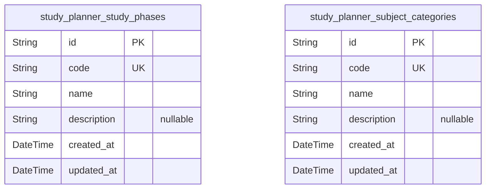
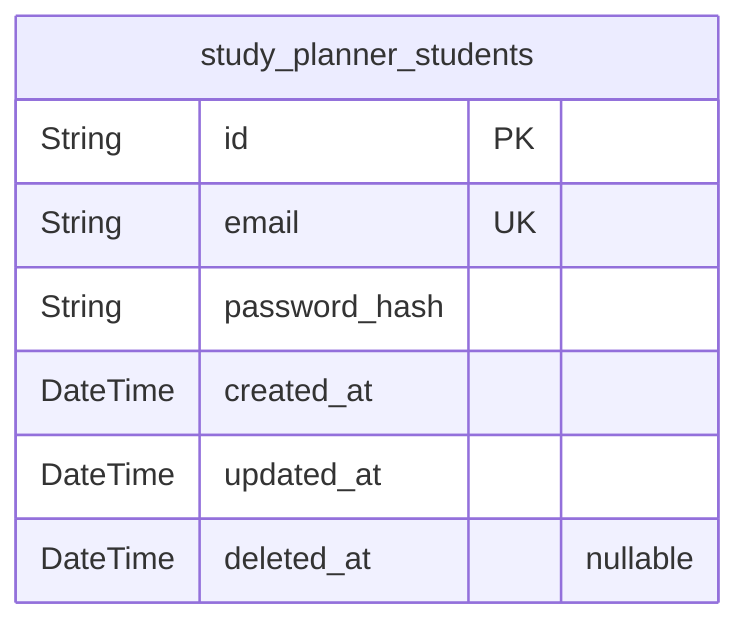
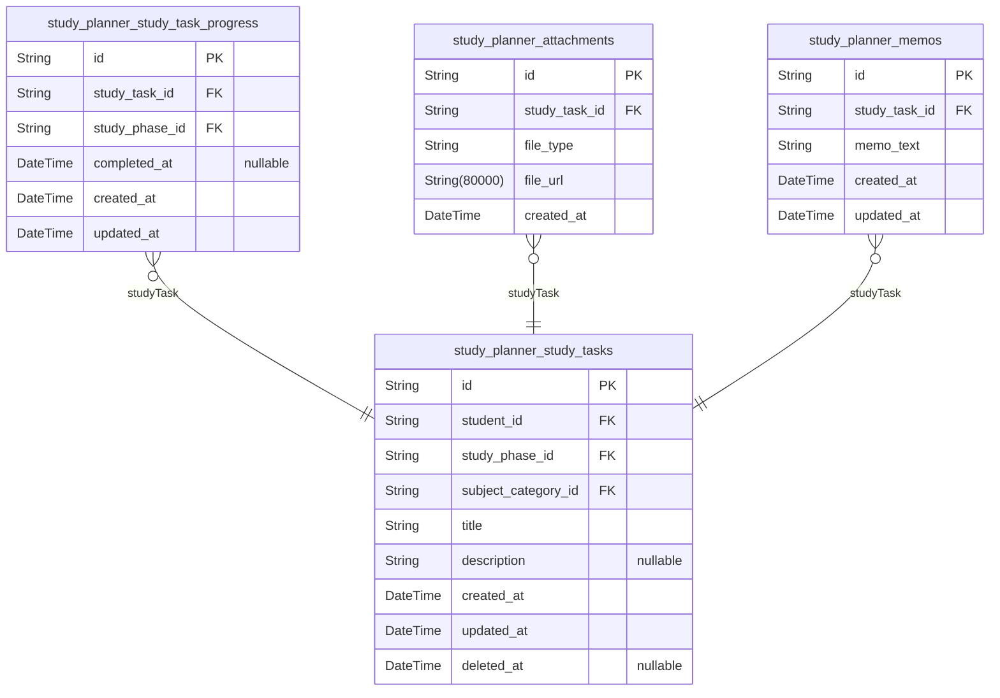
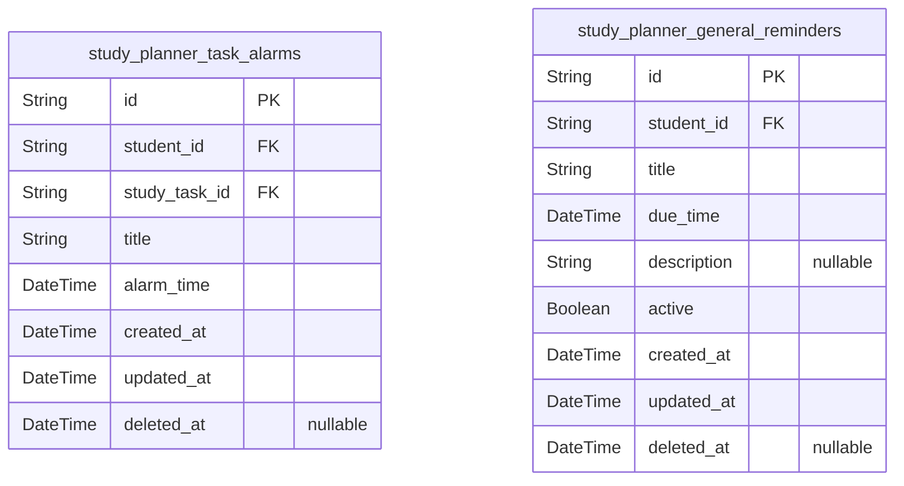
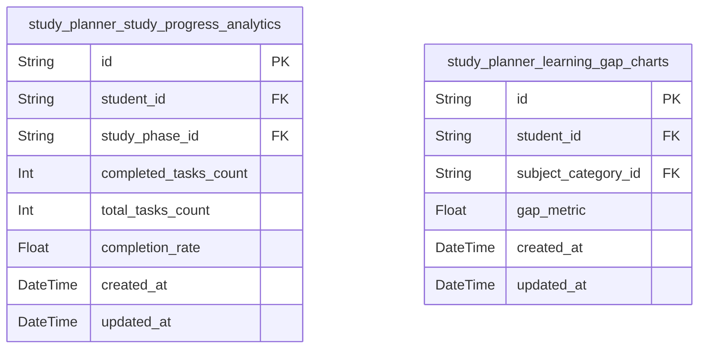

# Prisma Markdown

> Generated by [`prisma-markdown`](https://github.com/samchon/prisma-markdown)

- [Systematic](#systematic)
- [Actors](#actors)
- [Study](#study)
- [Notifications](#notifications)
- [Analytics](#analytics)

## Systematic

### `study_planner_study_phases`

Defines the three distinct study phases available in the study planner
system (preview, main learning, review). These phases categorize study
activities and enable progress tracking by phase.

Properties as follows:

- `id`: Primary Key.
- `code`
  > Unique code identifier of the study phase, e.g., 'preview',
  > 'main_learning', 'review'.
- `name`: Human-readable name of the study phase, e.g., 'Preview'.
- `description`: Optional detailed description of the study phase.
- `created_at`: Record creation timestamp.
- `updated_at`: Record last update timestamp.

### `study_planner_subject_categories`

Stores subject categories used for classifying study tasks, including
hierarchical English language subcategories for grammar, vocabulary,
speaking, and others.

Properties as follows:

- `id`: Primary Key.
- `code`: Unique code identifier of the subject category, e.g., 'english_grammar'.
- `name`: Human-readable name of the subject category, e.g., 'English Grammar'.
- `description`: Optional detailed description of the subject category.
- `created_at`: Record creation timestamp.
- `updated_at`: Record last update timestamp.

## Actors

### `study_planner_students`

This table stores authenticated student user information including login
credentials and audit timestamps. It supports user authentication by
maintaining unique emails and hashed passwords. It includes temporal
fields for creation, update, and potential soft deletion timestamps. As a
primary entity, it allows independent user management and secure
authentication workflows.

Properties as follows:

- `id`: Primary Key.
- `email`: Unique email address used for student login and communication.
- `password_hash`
  > Secure hashed password for authentication purposes. Plain passwords are
  > never stored.
- `created_at`: Timestamp when the student record was created.
- `updated_at`: Timestamp when the student record was last updated.
- `deleted_at`
  > Timestamp indicating when the student record was soft deleted, if
  > applicable.

## Study

### `study_planner_study_tasks`

Core entity representing a student study task managed independently,
linked to a student, study phase, and subject category. Tracks title,
optional description, and soft deletion. Supports creation and update
timestamps for audit trail.

Properties as follows:

- `id`: Primary Key.
- `student_id`: Belonged student's [study_planner_students.id](#study_planner_students)
- `study_phase_id`: Associated study phase [study_planner_study_phases.id](#study_planner_study_phases)
- `subject_category_id`: Linked subject category [study_planner_subject_categories.id](#study_planner_subject_categories)
- `title`: Title of the study task capturing the user's learning goal.
- `description`: Detailed description or notes about the study task.
- `created_at`: Timestamp when the study task was created.
- `updated_at`: Timestamp when the study task was last updated.
- `deleted_at`: Timestamp when the study task was soft deleted; null if not deleted.

### `study_planner_study_task_progress`

Stores progress information per study phase for each study task. Includes
completion timestamps for tracking phase completion states to support
study lifecycle management and analytics. References the main study task
and the study phase.

Properties as follows:

- `id`: Primary Key.
- `study_task_id`: Associated study task [study_planner_study_tasks.id](#study_planner_study_tasks)
- `study_phase_id`: Tracked study phase [study_planner_study_phases.id](#study_planner_study_phases)
- `completed_at`
  > Timestamp when the study phase was completed for this task; null if
  > incomplete.
- `created_at`: Record creation timestamp for progress entry.
- `updated_at`: Last update timestamp for progress entry.

### `study_planner_attachments`

Represents attachment files such as images or PDFs linked to study tasks.
Supports multiple files per task with file metadata including type, URL,
and creation timestamp for content management.

Properties as follows:

- `id`: Primary Key.
- `study_task_id`: Belonged study task [study_planner_study_tasks.id](#study_planner_study_tasks)
- `file_type`: Type of the attachment file, e.g., image/jpeg, application/pdf.
- `file_url`: URI of the stored attachment file for retrieval.
- `created_at`: Timestamp when the attachment was created.

### `study_planner_memos`

Stores memo texts attached to study tasks as notes to support users in
capturing additional information related to their learning activities.
Each memo is associated with a single study task with timestamps for
creation and updates.

Properties as follows:

- `id`: Primary Key.
- `study_task_id`: Belonged study task [study_planner_study_tasks.id](#study_planner_study_tasks)
- `memo_text`: Text content of the memo providing additional details or notes.
- `created_at`: Timestamp when the memo was created.
- `updated_at`: Timestamp when the memo was last updated.

## Notifications

### `study_planner_task_alarms`

This table stores alarms set by authenticated student users for specific
study tasks to trigger PWA notifications at scheduled times. Each alarm
references a study task and the student user who owns it. It supports
auditing via creation and update timestamps and allows soft deletion.
This is a primary table managed independently by users for notification
management.

Properties as follows:

- `id`: Primary Key.
- `student_id`: Belonged student's [study_planner_students.id](#study_planner_students) who owns this alarm.
- `study_task_id`
  > Referenced study task's [study_planner_study_tasks.id](#study_planner_study_tasks) for which
  > the alarm is set.
- `title`: Title or label of the alarm for user identification.
- `alarm_time`: Scheduled time for the alarm to trigger the notification.
- `created_at`: Timestamp of record creation for audit trail.
- `updated_at`: Timestamp of last update for audit trail.
- `deleted_at`: Soft delete timestamp indicating logical removal (nullable).

### `study_planner_general_reminders`

This table contains general reminders created by authenticated student
users which are not tied to specific study tasks. These reminders trigger
PWA notifications to users at scheduled times. It includes fields for
reminder title, scheduled due time, optional description, audit
timestamps, soft deletion, and an active flag to manage reminder status.
This is a primary table managed independently by users.

Properties as follows:

- `id`: Primary Key.
- `student_id`
  > Belonged student's [study_planner_students.id](#study_planner_students) who owns this
  > reminder.
- `title`: Title or label of the general reminder for user identification.
- `due_time`: Scheduled due time for the reminder notification.
- `description`
  > Optional textual description providing additional context for the
  > reminder.
- `active`
  > Flag indicating whether the reminder is currently active and should
  > trigger notifications.
- `created_at`: Timestamp of record creation for audit and history.
- `updated_at`: Timestamp of last update for audit and history.
- `deleted_at`: Soft delete timestamp indicating logical removal (nullable).

## Analytics

### `study_planner_study_progress_analytics`

Aggregated study progress analytics per student and study phase,
providing metrics such as completed tasks count, total tasks count, and
completion rate. Related to students and study phases for tracking
learning progress across phases.

Properties as follows:

- `id`: Primary Key.
- `student_id`: Associated student [study_planner_students.id](#study_planner_students).
- `study_phase_id`: Associated study phase [study_planner_study_phases.id](#study_planner_study_phases).
- `completed_tasks_count`: Number of completed tasks for the student in the given study phase.
- `total_tasks_count`: Total number of tasks assigned to the student in the study phase.
- `completion_rate`: Completion rate computed as completed tasks divided by total tasks.
- `created_at`: Record creation timestamp.
- `updated_at`: Record last update timestamp.

### `study_planner_learning_gap_charts`

Analytics data showing learning gap statistics per student and subject
category, highlighting underperformed areas in study tasks. Links to
students and subject categories to assist targeted improvements and
visualization.

Properties as follows:

- `id`: Primary Key.
- `student_id`: Associated student [study_planner_students.id](#study_planner_students).
- `subject_category_id`
  > Subject category [study_planner_subject_categories.id](#study_planner_subject_categories) representing
  > study topic.
- `gap_metric`: Quantified measure of the learning gap for the subject category.
- `created_at`: Record creation timestamp.
- `updated_at`: Record last update timestamp.
