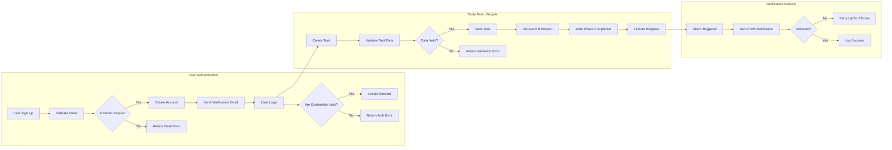

# Study Planner Backend Functional and Business Requirements

## 1. Introduction
The study planner backend enables authenticated student users to plan, manage, and track their learning activities efficiently using a structured approach encompassing three study phases: preview, main learning, and review. This document defines the business requirements to guide backend developers in building a robust system supporting all necessary workflows, validations, notifications, and analytics.

## 2. Business Model
### Why This Service Exists
Students lack structured support to organize their study sessions by phase and track progress effectively. Existing solutions do not address the need for detailed phase-based study management, personalized reminders, and analytics for improvement.

### Core Value Proposition
Provide a backend system offering precise management of learning phases with flexible task management, content support, reminders, and analytic insights which help students study more efficiently.

## 3. User Roles and Authentication
### 3.1 User Role: Student
- THE system SHALL support a single role: authenticated student.
- Students CAN create, update, delete their own study tasks.
- Students CAN attach study contents (images, PDFs) and memos.
- Students CAN set alarms and receive notifications.
- Students CAN view progress and analytics data.

### 3.2 Authentication Requirements
- WHEN a user registers, THE system SHALL validate email uniqueness and store credentials securely.
- WHEN a user logs in, THE system SHALL validate credentials and initiate a session with JWT tokens.
- THE system SHALL support email verification.
- THE system SHALL allow password reset via secure flows.
- THE system SHALL allow users to find their ID.
- THE system SHALL maintain session security, including logout and token expiration.

## 4. Study Activity Management
- THE system SHALL maintain three distinct, mandatory study phases per task: preview, main learning, and review.
- WHEN creating or updating a study task, THE system SHALL require association with a valid phase.
- THE system SHALL allow users to categorize tasks under predefined subjects and categories with detailed English categories: grammar, vocabulary, speaking, others.

## 5. Task Lifecycle Operations
- WHEN a student creates a task, THE system SHALL require a title, phase, category, optional description, attachments, memo, and optional alarm.
- THE system SHALL allow updating or deleting tasks and associated data.
- WHEN a student marks a phase completion, THE system SHALL record the timestamp and update progress.

## 6. Content and Memo Management
- THE system SHALL allow attachment of images (JPEG, PNG) and PDF files.
- THE system SHALL validate file types and size limits (maximum 10 MB per file).
- THE system SHALL store memos as text linked to study tasks.

## 7. Notification and Alarm System
- THE system SHALL allow alarms linked to specific study tasks.
- THE system SHALL support general reminders not tied to any task.
- THE system SHALL send Progressive Web App notifications at scheduled alarm times reliably.

## 8. Progress Tracking and Analytics
- THE system SHALL track completion status and timestamps per study phase and per task.
- THE system SHALL aggregate progress data to identify insufficient learning areas.
- THE system SHALL generate charts breaking down English categories for targeted improvement.

## 9. Business Rules and Validation
- THE system SHALL enforce category and phase validity on task creation or update.
- THE system SHALL reject unsupported file types and oversized attachments.
- THE system SHALL prevent unauthorized access or modification to other users’ data.
- THE system SHALL require authentication for all study task operations.

## 10. Error Handling
- IF authentication fails, THEN THE system SHALL respond with clear error messages and status 401 Unauthorized.
- IF invalid input is received, THEN THE system SHALL respond with status 400 Bad Request and detailed validation errors.
- IF a resource is not found or unauthorized, THEN THE system SHALL respond with 403 or 404 accordingly.
- IF notification delivery fails, THEN THE system SHALL retry up to three times and log failure.

## 11. Performance Requirements
- THE system SHALL respond to all user operations within 2 seconds under typical loads.
- THE system SHALL deliver notifications within 1 minute of the scheduled alarm.

## 12. Diagrams and Workflows

This document provides business requirements only. All technical decisions on architecture, APIs, and database design are at the discretion of the development team. Developers have full autonomy to implement as needed based on these clear and complete requirements.