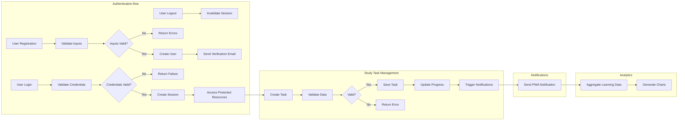

# Study Planner Backend Functional Requirements

## 1. Introduction
The backend system supports a Study Planner service to enable students to efficiently manage their structured learning activities across three defined phases: preview, main learning, and review.

## 2. Business Model
### Why This Service Exists
Students often lack structured ways to organize studying, leading to inefficient learning outcomes. This service provides a backend that facilitates task structuring by learning phases, content management, notifications, and analytics.

### Core Value Proposition
To offer a reliable, scalable backend that enables students to create, categorize, track, and analyze study tasks, receive timely reminders via notifications, and identify learning gaps.

## 3. User Roles and Authentication
### User Role: Student
- Authenticated users with full control over their study tasks.

### Authentication Flow
- WHEN a user registers, THE system SHALL validate their email and password per security standards and create an account.
- WHEN a user logs in, THE system SHALL authenticate credentials and establish a secure session.
- WHEN password reset is requested, THE system SHALL send secure reset links.
- WHEN a user requests to find their user ID, THE system SHALL provide secure retrieval.
- WHEN a user logs out, THE system SHALL invalidate the session.

### Permissions
| Action                      | Student |
|-----------------------------|---------|
| Register                    | ✅      |
| Login                       | ✅      |
| Logout                      | ✅      |
| Manage Study Tasks          | ✅      |
| Attach Content (Images/PDF) | ✅      |
| Add Memos and Alarms        | ✅      |
| View Analytics              | ✅      |
| Password Reset and Recovery | ✅      |

## 4. Learning Phases Management
- THE system SHALL manage preview, main learning, and review phases.
- WHEN tasks are created, THE system SHALL require assignment to exactly one phase.
- THE system SHALL track progress and completion timestamp per phase.

## 5. Study Task Management
- THE system SHALL support CRUD operations for study tasks.
- THE system SHALL require tasks to have categories including English-specific subcategories for grammar, vocabulary, speaking, and others.
- THE system SHALL validate all input promptly and reject invalid data.

## 6. Content Attachment and Memo
- THE system SHALL accept images (JPEG, PNG) and PDFs as attachments.
- THE maximum file size shall be limited to 10 Megabytes per file.
- THE system SHALL store and manage content reliably.
- THE system SHALL allow memo creation and updates associated with tasks.

## 7. Notifications and Alarms
- THE system SHALL allow users to set alarms tied to specific study tasks.
- THE system SHALL support general reminders not linked to tasks.
- WHEN an alarm triggers, THE system SHALL send a PWA notification to the user's device.

## 8. Progress Tracking and Analytics
- THE system SHALL maintain detailed phase completion states.
- THE system SHALL aggregate data to highlight insufficient learning.
- THE system SHALL generate charts showing incomplete phases and study time by category.
- THE system SHALL provide analytics for English categories to assist focused study.

## 9. Business Rules and Validation
- THE system SHALL enforce single-phase assignment per task.
- THE system SHALL restrict attachments to allowed file types.
- THE system SHALL ensure alarms are scheduled for valid future times.
- THE system SHALL require authentication for all user actions.

## 10. Error Handling
- IF authentication fails, THEN THE system SHALL respond with a clear 401 Unauthorized status.
- IF login credentials are invalid, THEN THE system SHALL notify the user.
- IF invalid attachments are uploaded, THEN THE system SHALL reject and notify the user.
- IF unauthorized access is attempted, THEN THE system SHALL return 403 Forbidden.
- IF resources are missing, THEN THE system SHALL return 404 Not Found.

## 11. Performance Requirements
- User operations SHALL respond within 2 seconds.
- Notifications SHALL be sent promptly at scheduled times.

## 12. Diagrams and Workflows

This document provides business requirements only. All technical implementation decisions belong to developers. Developers have full autonomy over architecture, APIs, and database design. The document describes WHAT the system should do, not HOW to build it.