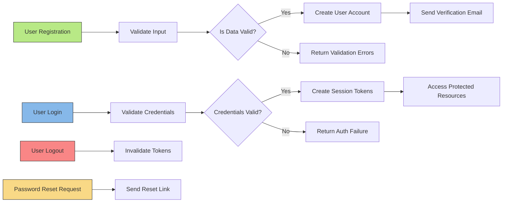

# StudyPlanner User Roles and Authentication Requirements

## 1. Introduction
This document defines the business requirements for user roles, authentication, password management, and permissions in the StudyPlanner backend system. It provides clear and detailed requirements to enable backend developers to implement robust and secure user access control and account management, focusing on the single user role: student.

This document contains only business requirements. All technical implementations—including architecture, API design, and database modeling—are at the discretion of the development team. The purpose is to specify WHAT the system must do.

## 2. User Role Definitions

### 2.1 Student Role
- Description: The student is an authenticated user who can register, log in, log out, and manage their learning activities in the system.
- Permissions:
  - Can register for a new account.
  - Can log in and out of the system securely.
  - Can manage their study tasks including creating, updating, and deleting.
  - Can attach study contents (images, PDFs) and memos to tasks.
  - Can set alarms and receive notifications.
  - Can view analytics related to their study progress.
  - Can reset their password and recover account credentials.

## 3. Authentication Flow

### 3.1 User Registration
WHEN a user submits a registration request with email and password, THE StudyPlanner system SHALL create a new student account after validating the data.
- Email must be unique and follow valid email format.
- Password must meet security criteria (minimum length, complexity).
- System SHALL send a verification email or confirmation flow (implementation detail flexible).

### 3.2 User Login
WHEN a registered user submits login credentials (email and password), THE StudyPlanner system SHALL validate the credentials promptly and create a secure session.
- Invalid credentials SHALL return an authentication failure response immediately.
- System SHALL maintain session securely using JWT tokens with expiration.
- Access tokens SHALL expire within 15 to 30 minutes.
- Refresh tokens SHALL allow users to maintain logged-in state for 7 to 30 days.

### 3.3 User Logout
WHEN a logged-in user initiates logout, THE StudyPlanner system SHALL invalidate the session tokens immediately.

### 3.4 Session Management
WHILE a user session is active, THE StudyPlanner system SHALL validate token authenticity on each request.
- Sessions SHALL expire after a configurable period of inactivity.

## 4. Password Management

### 4.1 Password Reset (Forgot Password)
WHEN a user requests password reset with their registered email, THE StudyPlanner system SHALL send a password reset link or token to the email.
- Password reset links SHALL expire after a specified short duration for security.

### 4.2 Password Change
WHEN a logged-in user submits a password change request, THE StudyPlanner system SHALL validate the current password and update to the new password.
- Password policy for complexity applies.

### 4.3 Account Recovery (Find ID)
WHEN a user requests to find their account ID using identifying information (e.g., registered email), THE StudyPlanner system SHALL provide a secure way to retrieve or remind of their account ID.

## 5. Permission Matrix

| Action                  | Student  |
|-------------------------|----------|
| Register                | ✅       |
| Login                   | ✅       |
| Logout                  | ✅       |
| Manage Study Tasks      | ✅       |
| Attach Study Contents   | ✅       |
| Set Alarms and Memos    | ✅       |
| View Progress Analytics | ✅       |
| Password Reset          | ✅       |
| Account Recovery        | ✅       |

## 6. Security Considerations
- THE system SHALL store user passwords using strong hashing algorithms.
- THE system SHALL protect against common vulnerabilities such as SQL injection, XSS in inputs.
- THE system SHALL ensure all authentication-related communications are encrypted.

## 7. Error Handling and Validation
IF user authentication or authorization fails, THEN THE system SHALL return appropriate error messages and status codes to the client.
- Invalid login credentials SHALL produce a clear "invalid credentials" response.
- Account lockout or throttling mechanisms SHALL be implemented to prevent brute force attempts.

## 8. Performance Requirements
- THE system SHALL respond to authentication requests within 2 seconds.
- Session validation SHALL be instantaneous from the user's perspective.

## Mermaid Diagram: Authentication Flow

This document clearly defines all needed roles, authentication flows, permissions, and security requirements for the StudyPlanner backend to allow backend developers to build a secure and functional user management system.