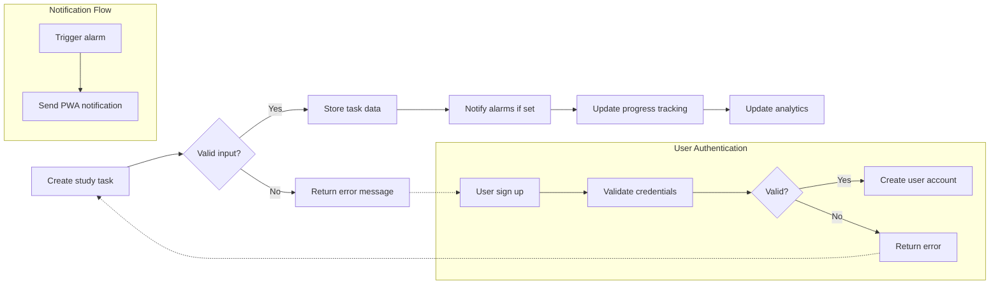

# Study Planner Backend Functional Requirements

## 1. Introduction
This document defines the comprehensive functional requirements for the study planner backend service. The primary purpose of this system is to enable authenticated student users to manage and structure their study activities effectively, focusing on three core learning phases: preview, main learning, and review. This document outlines all business logic, user interactions, and system behavior required for development.

## 2. Study Activity Management
### 2.1 Structure of Learning Phases
- THE study planner system SHALL define three study phases: preview, main learning, and review.
- WHEN a student creates a study task, THE system SHALL require association with at least one of these learning phases.
- WHEN a student marks a specific learning phase as completed for a study task, THE system SHALL record the completion timestamp.

### 2.2 Study Categories and Tagging
- THE system SHALL allow students to categorize their study tasks under subjects or topics.
- THE system SHALL provide predefined categories, including an English language hierarchy with subcategories: grammar, vocabulary, speaking, and others.

## 3. Task Lifecycle Operations
### 3.1 Creation of Study Tasks
- WHEN a student creates a study task, THE system SHALL provide the ability to specify:
  - The study phase(s) to which the task applies (preview, main learning, review).
  - A category or subject tag.
  - A textual title and optional description.
  - Attachments including images and PDF files.
  - A memo field for additional notes.
  - Alarm settings for reminders.

### 3.2 Updating and Deleting Tasks
- WHEN a student updates a study task, THE system SHALL allow modification of any of the task attributes listed in 3.1.
- WHEN a student deletes a study task, THE system SHALL remove the task and all associated data including attachments, memos, progress records, and notifications.

### 3.3 Progress Marking and Completion
- WHEN a student marks a phase of a study task as completed, THE system SHALL update and persist this state.
- WHEN a student modifies the completion status, THE system SHALL update the stored data accordingly.

## 4. Content and Memo Management
### 4.1 Supported Content Types
- THE system SHALL support attaching images (e.g., JPEG, PNG) and PDF documents to study tasks.
- THE system SHALL ensure associated content is stored reliably and retrievable.

### 4.2 Memo Usage
- WHEN a student creates or edits a memo associated with a study task, THE system SHALL save and associate the memo text with the respective task.

## 5. Notification and Alarm System
### 5.1 Alarms Linked to Study Tasks
- WHEN a student sets an alarm for a study task, THE system SHALL trigger a notification at the scheduled time.

### 5.2 General Reminders
- THE system SHALL support general (non-task-specific) reminders configurable by the student.

### 5.3 PWA Notification Integration
- THE system SHALL support sending Progressive Web App notifications triggered by alarms or reminders to the student’s device.

## 6. Progress Tracking and Analytics
### 6.1 Tracking Study Progress
- THE system SHALL track and store the completion state of each study phase per task.

### 6.2 Visual Analytics
- THE system SHALL aggregate study data to identify insufficient learning areas.
- THE system SHALL generate and provide charts visualizing:
  - Number of incomplete study phases
  - Time spent per subject category
  - Success and progress metrics

### 6.3 English Category Details
- THE system SHALL specifically track and report detailed data within the English language category subtopics: grammar, vocabulary, speaking, and others.

## 7. User Authentication and Access Control
### 7.1 Sign Up and Sign In
- THE system SHALL allow students to register (sign up) using a valid email and password.
- THE system SHALL allow students to log in with their email and password.

### 7.2 Password Recovery
- WHEN a student requests account recovery, THE system SHALL provide:
  - Mechanism to find their user ID.
  - Mechanism to reset their password securely.

## 8. Business Rules and Error Handling
- IF a student attempts to attach an unsupported file type, THEN THE system SHALL reject the attachment and notify the user of the allowed file types.
- IF required fields are missing during task creation or update, THEN THE system SHALL reject the operation and return descriptive validation error messages.
- IF a student attempts an action without authorization, THEN THE system SHALL deny the operation with a clear error message.

## 9. Performance Expectations
- WHEN processing any user request, THE system SHALL respond within 2 seconds under normal operating conditions.

---

## Diagrams

---

This document provides business requirements only. All technical implementation decisions belong to developers. Developers have full autonomy over architecture, APIs, and database design. The document describes WHAT the system should do, not HOW to build it.