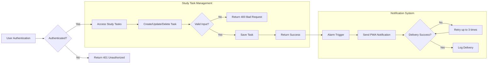

# Business Rules and Error Handling for Study Planner Backend

## 1. Introduction
This document defines the comprehensive business rules, validation requirements, error handling scenarios, and performance expectations for the study planner backend system. The backend supports authenticated student users who manage learning activities structured in three phases: preview, main learning, and review. Users can create, update, and delete study tasks, organize by category, attach study contents (images, PDFs), set memos and alarms, receive PWA notifications, and review progress analytics including charts on insufficient learning.

The goal of this document is to provide backend developers with clear, specific, and measurable requirements to ensure robust, secure, and user-friendly system behaviors.

## 2. Business Rules and Validation

### 2.1 Study Activity Phases Management
- THE system SHALL enforce that every study activity task is assigned exactly one phase of the three: preview, main learning, or review.
- THE system SHALL allow users to assign categories and subcategories to learning tasks, including English categories such as grammar, vocabulary, speaking, and others.
- THE system SHALL maintain progress status per study task phase with these states: not started, in progress, completed.
- WHEN a user marks a phase as completed, THE system SHALL record the completion timestamp and prevent the status from reverting to an earlier state.

### 2.2 Task Lifecycle Rules
- THE system SHALL allow only authenticated students to create, update, and delete their own study tasks.
- THE system SHALL validate that study task titles are non-empty strings with a maximum length of 255 characters.
- THE system SHALL validate that memos attached to tasks are strings with a maximum length of 2000 characters.
- THE system SHALL prevent any unauthorized attempts to modify or delete tasks belonging to other users by returning an authorization error.

### 2.3 Study Content and Attachments
- THE system SHALL allow zero or more attachments per study task.
- THE system SHALL only accept attachment files of type image or PDF.
- WHEN attachments are uploaded, THE system SHALL validate file formats and enforce a size limit, such as a maximum of 10 megabytes per file.
- THE system SHALL securely associate attachments with the corresponding user’s study tasks.

### 2.4 Memo and Alarm Handling
- THE system SHALL allow users to create memos linked to their study tasks.
- THE system SHALL allow users to set alarms/reminders related to specific study tasks or general study sessions.
- THE system SHALL manage scheduling and delivery of push notifications (PWA notifications) triggered by alarms.
- WHEN an alarm time is reached, THE system SHALL deliver a notification via the PWA to the user’s device.

### 2.5 User Authentication and Access Control
- THE system SHALL require user authentication for all actions within the study planner.
- THE system SHALL provide functionality for user registration (sign up), login, ID and password recovery, and secure session management including logout.
- THE system SHALL ensure users can only access and modify their own data and resources.

## 3. Error Handling Scenarios

### 3.1 Authentication Errors
- IF a user accesses any system function without valid authentication, THEN THE system SHALL respond with HTTP status 401 Unauthorized and an informative message.
- IF a user submits invalid login credentials, THEN THE system SHALL respond with HTTP status 401 Unauthorized specifying the authentication failure.

### 3.2 Input Validation Errors
- IF the user submits a request with invalid data such as empty titles, unsupported attachment types, or oversized files, THEN THE system SHALL respond with HTTP status 400 Bad Request and detailed validation error information.

### 3.3 Resource Not Found
- IF a requested study task, memo, or attachment is not found or does not belong to the authenticated user, THEN THE system SHALL respond with HTTP status 404 Not Found.

### 3.4 Permission Denied
- IF a user attempts to perform an action they are not authorized for (e.g., modifying someone else’s data), THEN THE system SHALL respond with HTTP status 403 Forbidden.

### 3.5 Notification Failures
- IF the system fails to deliver a scheduled PWA notification, THEN THE system SHALL retry delivery up to three times.
- IF all retries fail, THEN THE system SHALL log the failure and notify the user on their dashboard or by alternative communication where feasible.

## 4. Performance Expectations
- THE system SHALL respond to user operations such as creating, updating, deleting study tasks, and marking progress within 2 seconds under normal load.
- THE system SHALL deliver scheduled alarms and PWA notifications within 1 minute of their scheduled time.
- THE system SHALL scale to support at least 10,000 concurrent active student users with acceptable performance metrics.

## 5. Appendices

### 5.1 Process Flow Diagram

This document provides backend developers with detailed, unambiguous requirements for business rules, validation logic, error handling scenarios, and performance targets essential for developing a robust and user-centered study planner backend system supporting efficient learning management and interaction.