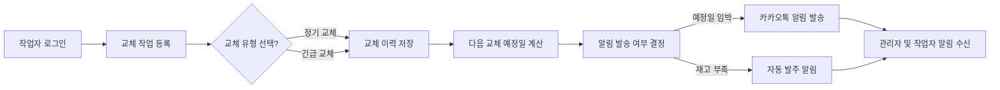

# 제조 공장 설비 보전 관리 시스템 기능 요구사항 분석서

## 1. 개요

이 문서는 24시간 가동되는 제조 공장에서 설비 및 소모품을 체계적으로 관리하고 교체 작업 이력을 기록하기 위한 시스템의 상세 기능 요구사항을 정의한다. 본 시스템은 설비별 부품 및 소모품의 교체 주기 설정, 교체 작업 완료 시 이력 기록, 교체 예정일 자동 계산 및 알림, 긴급 교체와 정기 교체 구분, 부품 재고 관리 및 자동 발주 알림, 그리고 월별/분기별 통계 리포트를 지원한다.

## 2. 설비 및 소모품 관리

### 2.1 공장 정보 관리
- THE 시스템 SHALL 공장명을 등록 가능해야 한다.
- THE 시스템 SHALL 공장 주소, 위치 정보를 입력하고 수정 가능해야 한다.
- THE 시스템 SHALL 공장 사진을 첨부할 수 있어야 한다.
- THE 시스템 SHALL 여러 공장을 등록하고 관리할 수 있어야 하며, 각 공장은 고유해야 한다.

### 2.2 설비 정보 관리
- THE 시스템 SHALL 설비 이름, 모델명, 설치 위치, 구입 시기 정보를 등록하고 수정할 수 있어야 한다.
- THE 시스템 SHALL 설비 사진 첨부 기능을 제공해야 한다.
- THE 시스템 SHALL 각 설비는 하나의 공장에 소속되어야 한다.

### 2.3 소모품 및 부품 정보 관리
- THE 시스템 SHALL 소모품 및 부품명을 등록할 수 있어야 한다.
- THE 시스템 SHALL 시리얼 번호, 배치 번호, 공급업체, 보증 정보 등 부가 정보를 포함해야 한다.
- THE 시스템 SHALL 교체 주기를 분 단위, 시간 단위, 일 단위, 월 단위로 구분하여 설정할 수 있어야 한다.
- THE 시스템 SHALL 공장별로 공통 소모품 리스트를 유지 관리하며, 설비별로 해당 소모품을 선택하여 등록할 수 있어야 한다.
- THE 시스템 SHALL 각 소모품에 대해 최소 재고 수량 및 자동 발주 임계치를 설정할 수 있어야 한다.

## 3. 교체 작업 기록 관리

### 3.1 교체 작업 이력 등록
- WHEN 작업자가 교체 작업 완료를 등록하면 THE 시스템 SHALL 작업자 정보, 교체 시간, 비용을 반드시 저장해야 한다.
- THE 시스템 SHALL 교체 전후 사진을 첨부할 수 있어야 한다.
- THE 시스템 SHALL 작업자가 긴급 교체와 정기 교체 중 하나를 반드시 선택할 수 있어야 한다.

### 3.2 다음 교체 예정일 자동 계산
- THE 시스템 SHALL 마지막 교체 일자와 설정된 교체 주기를 기준으로 다음 교체 예정일을 자동으로 계산해야 한다.
- THE 시스템 SHALL 계산된 다음 교체 예정일을 저장하고, 관련 알림 트리거에 사용해야 한다.

## 4. 알림 시스템

- THE 시스템 SHALL 카카오톡 및 모바일 앱 푸시 알림을 통하여 교체 예정일 임박 알림을 발송해야 한다.
- THE 시스템 SHALL 부품 재고 부족 시 자동 발주 알림을 관리자에게 발송해야 한다.
- THE 시스템 SHALL 알림 발송 실패 시 재시도 로직과 실패 로그 기록 기능을 제공해야 한다.

## 5. 부품 재고 관리

- THE 시스템 SHALL 재고 현황을 실시간으로 관리해야 한다.
- WHEN 부품 재고가 최소 재고 임계치 이하로 떨어지면, THE 시스템 SHALL 자동 발주 알림을 생성해야 한다.
- THE 시스템 SHALL 발주 담당자가 별도의 시스템에서 수동으로 발주를 진행할 수 있도록 알림만 제공한다.

## 6. 월별 및 분기별 통계 및 리포트

- THE 시스템 SHALL 월별 및 분기별 교체 비용 및 교체 횟수 통계를 제공해야 한다.
- THE 시스템 SHALL 설비별, 부품별, 공장별 통계 조회가 가능해야 한다.
- THE 시스템 SHALL 통계 리포트는 PDF 또는 엑셀 파일 등 일반적인 형식으로 출력 가능해야 한다.

## 7. 사용자 역할 및 권한

### 7.1 관리자
- THE 시스템 SHALL 공장, 설비, 소모품 정보를 등록, 수정, 삭제할 수 있어야 한다.
- THE 시스템 SHALL 모든 교체 작업 이력 및 재고 현황을 조회 및 관리할 수 있어야 한다.
- THE 시스템 SHALL 사용자 권한 관리 기능을 제공해야 한다.

### 7.2 현장 작업자
- THE 시스템 SHALL 자신이 소속된 공장 및 설비의 교체 현황을 조회할 수 있어야 한다.
- THE 시스템 SHALL 모바일 앱을 통해 교체 작업 완료 등록이 가능해야 한다.
- THE 시스템 SHALL 긴급 교체와 정기 교체 구분 기능을 포함해야 한다.
- THE 시스템 SHALL 소속 공장 외의 데이터에는 접근할 수 없도록 권한이 제한되어야 한다.

## 8. 오류 처리 및 입력 검증

- IF 필수 입력 항목이 누락되거나 형식이 올바르지 않으면, THEN THE 시스템 SHALL 오류 메시지를 반환하고 요청을 거부해야 한다.
- IF 알림 발송에 실패하면, THEN THE 시스템 SHALL 재시도하며, 실패 시 관리자에게 로그를 통해 보고해야 한다.
- IF 재고 수량 정보가 불일치하거나 누락된 경우, THEN THE 시스템 SHALL 관리자에게 경고 메시지를 표시해야 한다.

## 9. 주요 비즈니스 요구사항 (EARS 형식)

- WHEN 작업자가 교체 작업 완료를 등록할 때, THE 시스템 SHALL 작업 완료 이력을 저장하고 다음 교체 예정일을 자동 계산한다.
- WHEN 교체 예정일이 다가올 때, THE 시스템 SHALL 카카오톡 및 모바일 앱 푸시 알림을 발송한다.
- WHERE 부품 재고가 설정된 임계치 이하일 때, THE 시스템 SHALL 자동으로 발주 알림을 관리자에게 전송한다.
- IF 필수 입력 항목이 누락되거나 형식이 올바르지 않을 때, THEN THE 시스템 SHALL 오류 메시지를 반환하고 교체 작업 등록을 거부한다.

## 10. 설비 보전 관리 주요 프로세스 흐름

> This document provides business requirements only. All technical implementation decisions belong to developers. Developers have full autonomy over architecture, APIs, and database design. The document describes WHAT the system should do, not HOW to build it.
