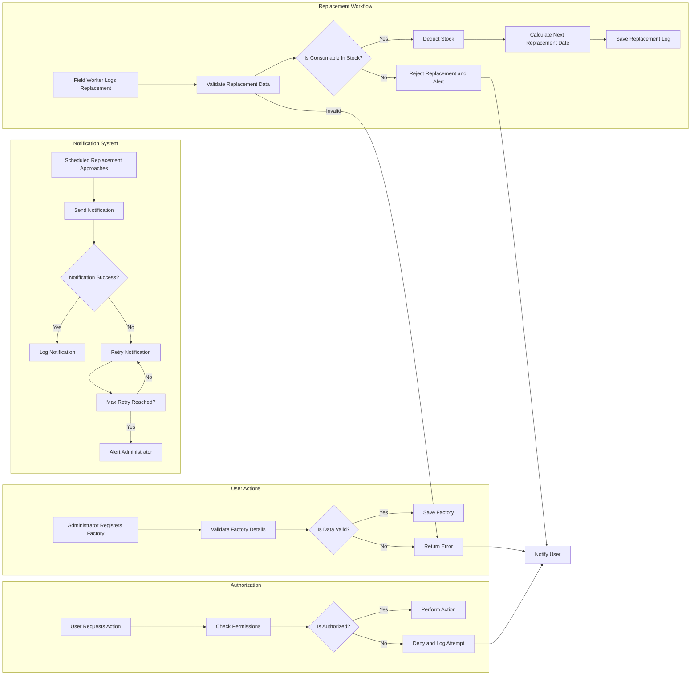

# Business Rules and Error Scenario Handling for Equipment Maintenance System

## 1. Introduction

### 1.1 Purpose of the Document
This document defines the core business rules, validation criteria, error scenarios, and recovery processes for the Equipment Maintenance System designed to manage consumables and parts replacement across multiple manufacturing factories.

### 1.2 Scope
This document covers all mandatory business constraints and rules that must be enforced by the system, including data integrity, event-driven validations, role-based access control, notification rules, error handling policies, and recovery workflows. It serves as the definitive source for backend developers to implement business logic correctly and consistently.

## 2. Core Business Rules

### 2.1 Factory and Equipment Management
- WHEN a new factory is registered, THE system SHALL ensure the factory's address, location, and photo are valid and unique within the database.
- THE system SHALL allow administrators to register multiple factories, each with distinctive details.
- WHEN an equipment is added to a factory, THE system SHALL require equipment name, model number, location within the factory, purchase date, and equipment photo.
- THE system SHALL enforce that each equipment belongs to exactly one factory.

### 2.2 Consumable and Part Management
- THE system SHALL allow administrators to register multiple consumables with attributes including name, serial number, batch number, supplier details, warranty information, and replacement cycle.
- WHEN setting a replacement cycle, THE system SHALL allow specifying the unit as minutes, hours, days, or months.
- THE system SHALL enforce that consumables are registered globally and assigned to equipment from this global list.
- WHEN registering consumables, THE system SHALL require setting minimum stock quantity to trigger automated reorder alerts.

### 2.3 Replacement Work Logging
- WHEN a field worker records a replacement, THE system SHALL require information on equipment, consumable replaced, replacement type (regular or urgent), replacement date and time, worker identity, cost incurred, and photos before and after replacement.
- THE system SHALL calculate the next replacement due date based on the replacement cycle and last replaced date.
- WHEN logging replacement, THE system SHALL distinguish between urgent replacements (marked by the field worker) and scheduled replacements.

### 2.4 Notification and Alert Rules
- THE system SHALL send notifications via KakaoTalk and mobile app push for upcoming replacements based on calculated due dates.
- WHEN the consumable stock falls below set minimum quantity, THE system SHALL trigger an automated reorder alert to the stock manager.
- THE system SHALL send notifications only to users with appropriate permissions (e.g., administrators, stock managers).

### 2.5 Inventory and Automated Reordering Rules
- THE system SHALL maintain current stock quantities of all consumables.
- WHEN a replacement is logged, THE system SHALL deduct the used consumable quantity from inventory.
- THE system SHALL allow administrators to update stock manually.
- THE system SHALL trigger reorder alerts when stock is below predefined thresholds.

### 2.6 User Roles and Permissions
- THE system SHALL define two roles: administrators and field workers.
- THE system SHALL grant administrators full system access including managing factories, equipment, consumables, reports, and user permissions.
- THE system SHALL limit field workers to view only equipment and consumable replacement status within their assigned factories and equipment.
- WHEN a field worker attempts unauthorized access, THE system SHALL deny access and log the incident.

## 3. Validation Rules

### 3.1 Input Validation
- THE system SHALL validate all user inputs for required fields, length, data type, and format.
- THE system SHALL enforce that dates are stored and processed following ISO 8601 format.
- THE system SHALL validate photo attachments are in accepted formats (JPEG, PNG) and within size limits.

### 3.2 Business Logic Validation
- THE system SHALL NOT allow duplicate consumable registration with the same serial and batch numbers.
- WHEN logging a replacement, THE system SHALL verify that the consumable exists and is assigned to the specified equipment.
- THE system SHALL NOT allow replacement logging for equipment that is inactive or decommissioned.

## 4. Error Scenarios

### 4.1 Data Entry Errors
- IF mandatory fields are missing or invalid, THEN THE system SHALL reject the input and provide clear error messages.
- IF photo uploads fail due to unsupported format or size, THEN THE system SHALL notify the user and reject the upload.

### 4.2 Authorization Failures
- IF a user attempts an action outside their permission, THEN THE system SHALL deny the operation and log the attempt.
- IF session expiration occurs, THEN THE system SHALL require re-authentication.

### 4.3 Notification Failures
- IF notification sending fails (due to external service errors), THEN THE system SHALL retry sending up to 3 times with exponential backoff.
- IF notification ultimately fails, THEN THE system SHALL log the failure and alert administrators.

### 4.4 Inventory Shortages
- IF stock quantity is insufficient to cover a logged replacement, THEN THE system SHALL reject the replacement logging and alert the user.

## 5. Recovery Processes

### 5.1 User Error Recovery
- THE system SHALL allow users to correct invalid inputs and resubmit.
- THE system SHALL maintain revision history of replacement logs to allow correction and audit.

### 5.2 System Error Recovery
- THE system SHALL log all system errors with timestamps and context information.
- IN case of service outages, THE system SHALL queue replacements and notifications for later processing.
- THE system SHALL provide administrators with dashboards to monitor error rates and issue warnings.

## 6. Appendix

### 6.1 Glossary
- Administrator: User with full system control.
- Field Worker: User assigned to specific factories and equipment for operational tasks.
- Consumable: Parts/items subject to regular replacement, e.g., filters, oils.

### 6.2 References
- [Functional Requirements Document](./02-functional-requirements.md)
- [User Roles Specification](./03-user-roles.md)
- [System Context and Integrations](./06-system-context.md)
- [Non-Functional Requirements and Security](./07-non-functional-requirements.md)

---

