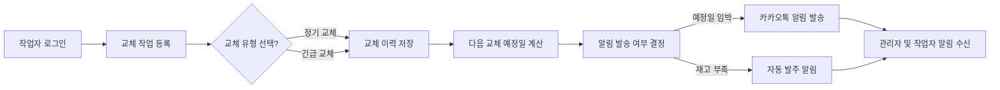

# 제조 공장 설비 보전 관리 시스템 기능 요구사항 분석서

## 1. 개요

본 문서는 24시간 가동되는 제조 공장의 설비 및 소모품 보전 관리를 위한 시스템의 상세 기능 요구사항을 정의한다. 이 시스템은 설비별 부품 교체 주기 관리, 교체 작업 이력 기록, 교체 예정일 자동 알림, 부품 재고 관리 및 발주 알림 등 주요 업무를 지원한다. 또한, 현장 작업자와 관리자의 역할별 접근 제어를 명확히 하여 업무 효율과 정확성을 높이는 것을 목표로 한다.

## 2. 설비 및 소모품 관리

### 2.1 공장 정보 관리
- 공장명, 주소, 위치 정보 등록 및 관리
- 공장 사진 첨부 가능

### 2.2 설비 정보 관리
- 설비명, 모델명, 설치 위치, 장비 사진, 구입 시기 정보 등록 및 관리

### 2.3 소모품 및 부품 정보 관리
- 소모품 및 부품명, 시리얼 번호, 배치 번호, 공급업체, 보증 정보 입력
- 교체 주기 설정: 분 단위, 시간 단위, 일 단위, 월 단위 중 선택 가능
- 공장 공통 소모품 리스트 관리 후 설비별로 선택하여 등록 가능
- 최소 재고 수량 및 자동 발주 임계치 설정 기능 포함

## 3. 교체 작업 기록 관리

### 3.1 교체 작업 이력 등록
- 작업자, 교체 시간, 교체 비용 정보 기록
- 교체 전후 사진 첨부 가능
- 긴급 교체와 정기 교체 구분 (작업자가 직접 선택)

### 3.2 다음 교체 예정일 자동 계산
- 마지막 교체 일자와 교체 주기 기준으로 자동 산출

## 4. 알림 시스템

- 교체 예정일 임박 시 카카오톡 및 모바일 앱 푸시 알림 발송
- 부품 재고 부족 시 자동 발주 알림 발송

## 5. 부품 재고 관리

- 재고 현황 실시간 관리
- 설정된 임계치 이하로 재고 감소 시 알림 트리거
- 발주 담당자는 알림 확인 후 별도 발주 시스템에서 발주 처리

## 6. 월별 및 분기별 통계 및 리포트

- 월별, 분기별 교체 비용 및 교체 횟수 통계
- 설비별/공장별 맞춤 리포트 제공

## 7. 사용자 역할 및 권한

### 7.1 관리자
- 공장, 설비, 소모품 정보 등록 및 수정 권한
- 모든 교체 기록 및 재고 조회 및 관리

### 7.2 현장 작업자
- 소속 공장 및 설비 관련 교체 현황 조회
- 모바일 앱에서 교체 작업 완료 등록 가능
- 그 외 공장 데이터 접근 불가

## 8. 오류 처리 및 입력 검증

- 필수 입력 데이터 유무 및 형식 검증
- 교체 기록 등록 시 필수 항목 누락 시 오류 메시지 반환
- 알림 발송 실패 시 재시도 및 별도 로그 기록

## 9. 주요 비즈니스 요구사항 (EARS 형식)

- WHEN 작업자가 교체 작업 완료를 등록할 때, THE 시스템 SHALL 작업 완료 이력을 저장하고 다음 교체 예정일을 자동 계산한다.
- WHEN 교체 예정일이 다가올 때, THE 시스템 SHALL 카카오톡 및 모바일 앱 푸시로 알림을 발송한다.
- WHERE 부품 재고가 설정된 임계치 이하일 때, THE 시스템 SHALL 자동으로 발주 알림을 관리자에게 전송한다.
- IF 필수 입력 항목이 누락되거나 형식이 올바르지 않을 때, THEN THE 시스템 SHALL 오류 메시지를 반환하고 교체 작업 등록을 거부한다.

## 10. 설비 보전 관리 주요 프로세스 흐름

---

This document provides business requirements only. All technical implementation decisions belong to developers. Developers have full autonomy over architecture, APIs, and database design. The document describes WHAT the system should do, not HOW to build it.