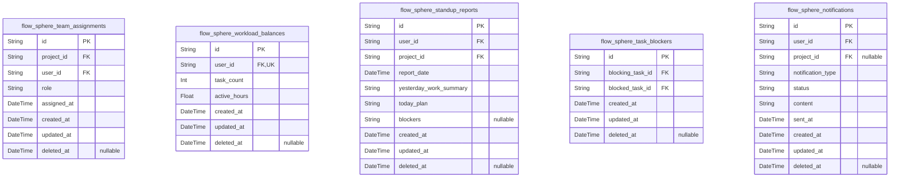

# Prisma Markdown

> Generated by [`prisma-markdown`](https://github.com/samchon/prisma-markdown)

- [Systematic](#systematic)
- [Actors](#actors)
- [Projects](#projects)
- [Documents](#documents)
- [Tasks](#tasks)
- [AIIntegration](#aiintegration)
- [Collaboration](#collaboration)
- [SecurityCompliance](#securitycompliance)
- [ExternalIntegrations](#externalintegrations)

## Systematic

### `flow_sphere_system_configs`

Stores global configuration key-value settings controlling system
behavior. Uniquely identifies settings by config_key with associated
value and description. Supports audit fields and soft deletion to allow
safe update and rollback of system parameters.

Properties as follows:

- `id`: Primary Key.
- `config_key`: Unique configuration key identifying a system setting.
- `config_value`: Value associated with the configuration key.
- `description`: Descriptive explanation of the configuration purpose.
- `created_at`: Timestamp when the configuration was created.
- `updated_at`: Timestamp when the configuration was last updated.
- `deleted_at`: Timestamp indicating if the configuration was soft deleted.

### `flow_sphere_mcp_servers`

Represents MCP servers enabling multi-context protocol communication to
support AI IDE integration. Stores connectivity details such as host,
port, protocol, and optional authentication tokens. Supports audit trails
and soft deletion for server management lifecycle.

Properties as follows:

- `id`: Primary Key.
- `host`: Hostname or IP address of the MCP server.
- `port`: TCP port number the server listens on.
- `protocol`: Communication protocol, e.g., TCP or WebSocket.
- `auth_token`: Optional authentication token for securing connections.
- `description`: Additional notes or description about the MCP server.
- `created_at`: Timestamp when the server record was created.
- `updated_at`: Timestamp when the server record was last updated.
- `deleted_at`: Timestamp indicating soft deletion of the server.

### `flow_sphere_mcp_connections`

Tracks client MCP connections to MCP servers. Contains client
identifiers, connection state, timestamps of connection lifecycle events,
and foreign key reference to associated MCP server. Useful for managing
live sessions and connection history.

Properties as follows:

- `id`: Primary Key.
- `flow_sphere_mcp_server_id`: Associated MCP server [flow_sphere_mcp_servers.id](#flow_sphere_mcp_servers).
- `client_id`: Unique client identifier representing the AI IDE or client session.
- `state`: Current state of the MCP connection, e.g., 'connected', 'disconnected'.
- `connected_at`: Timestamp when the connection was established.
- `disconnected_at`: Timestamp when the connection was terminated.
- `created_at`: Timestamp when the MCP connection record was created.
- `updated_at`: Timestamp when the MCP connection record was last updated.

## Actors

```mermaid
erDiagram
"flow_sphere_guest" {
  String id PK
  DateTime created_at
  DateTime updated_at
  DateTime deleted_at "nullable"
}
"flow_sphere_registered_user" {
  String id PK
  String email UK
  String password_hash
  DateTime created_at
  DateTime updated_at
  DateTime deleted_at "nullable"
}
"flow_sphere_project_manager" {
  String id PK
  String email UK
  String password_hash
  DateTime created_at
  DateTime updated_at
  DateTime deleted_at "nullable"
}
"flow_sphere_frontend_developer" {
  String id PK
  String email UK
  String password_hash
  DateTime created_at
  DateTime updated_at
  DateTime deleted_at "nullable"
}
"flow_sphere_backend_developer" {
  String id PK
  String email UK
  String password_hash
  DateTime created_at
  DateTime updated_at
  DateTime deleted_at "nullable"
}
"flow_sphere_devops_engineer" {
  String id PK
  String email UK
  String password_hash
  DateTime created_at
  DateTime updated_at
  DateTime deleted_at "nullable"
}
"flow_sphere_qa_engineer" {
  String id PK
  String email UK
  String password_hash
  DateTime created_at
  DateTime updated_at
  DateTime deleted_at "nullable"
}
"flow_sphere_ui_ux_designer" {
  String id PK
  String email UK
  String password_hash
  DateTime created_at
  DateTime updated_at
  DateTime deleted_at "nullable"
}
"flow_sphere_ai_specialist" {
  String id PK
  String email UK
  String password_hash
  DateTime created_at
  DateTime updated_at
  DateTime deleted_at "nullable"
}
"flow_sphere_admin" {
  String id PK
  String email UK
  String password_hash
  DateTime created_at
  DateTime updated_at
  DateTime deleted_at "nullable"
}
```

### `flow_sphere_guest`

Guest users with read-only access to public content, no authentication
credentials required. Maintains minimal identity for visit tracking.

Properties as follows:

- `id`: Primary Key.
- `created_at`: Record creation timestamp.
- `updated_at`: Record last update timestamp.
- `deleted_at`: Soft delete timestamp, null if active.

### `flow_sphere_registered_user`

Registered users who can create and manage personal projects, participate
in ideation and tasks. Require authentication credentials.

Properties as follows:

- `id`: Primary Key.
- `email`: User's unique email address for login and notifications.
- `password_hash`: Hashed password for user authentication.
- `created_at`: Record creation timestamp.
- `updated_at`: Record last update timestamp.
- `deleted_at`: Soft delete timestamp, null if active.

### `flow_sphere_project_manager`

Project managers with full control over projects and team assignments.
Have authentication credentials and permissions for project and task
management.

Properties as follows:

- `id`: Primary Key.
- `email`: Project manager's unique email address.
- `password_hash`: Hashed password for authentication.
- `created_at`: Record creation timestamp.
- `updated_at`: Record last update timestamp.
- `deleted_at`: Soft delete timestamp, null if active.

### `flow_sphere_frontend_developer`

Frontend developers responsible for UI-related tasks and code
submissions. Authenticated users with unique email.

Properties as follows:

- `id`: Primary Key.
- `email`: Frontend developer's unique email address.
- `password_hash`: Password hash for authentication.
- `created_at`: Creation time of the record.
- `updated_at`: Last update time of the record.
- `deleted_at`: Soft delete timestamp indicating if the record is active or deleted.

### `flow_sphere_backend_developer`

Backend developers handling server-side logic and API contracts. Require
authentication and unique email addresses.

Properties as follows:

- `id`: Primary Key.
- `email`: Backend developer's unique email.
- `password_hash`: Password hash for authentication.
- `created_at`: Record creation timestamp.
- `updated_at`: Record last update timestamp.
- `deleted_at`: Soft delete timestamp.

### `flow_sphere_devops_engineer`

DevOps engineers responsible for deployments, infrastructure, and
monitoring. Authenticated users with unique emails.

Properties as follows:

- `id`: Primary Key.
- `email`: DevOps engineer's unique email.
- `password_hash`: Password hash for login authentication.
- `created_at`: Record creation timestamp.
- `updated_at`: Record last update timestamp.
- `deleted_at`: Soft delete timestamp.

### `flow_sphere_qa_engineer`

QA engineers planning and executing tests, submitting reports and bug
findings. Require authenticated identity with unique email.

Properties as follows:

- `id`: Primary Key.
- `email`: QA engineer's unique email address.
- `password_hash`: Authentication password hash.
- `created_at`: Record creation timestamp.
- `updated_at`: Record last update timestamp.
- `deleted_at`: Soft delete timestamp.

### `flow_sphere_ui_ux_designer`

UI/UX designers creating design mockups and style guides. Authenticated
with unique email identifier.

Properties as follows:

- `id`: Primary Key.
- `email`: UI/UX designer's unique email address.
- `password_hash`: Password hash for login authentication.
- `created_at`: Creation timestamp.
- `updated_at`: Timestamp of last update.
- `deleted_at`: Soft delete timestamp.

### `flow_sphere_ai_specialist`

AI specialists managing AI IDE integration, prompt engineering, and token
usage. Authenticated users with unique email identifiers.

Properties as follows:

- `id`: Primary Key.
- `email`: AI specialist's unique email address.
- `password_hash`: Authentication hash for password.
- `created_at`: Record creation timestamp.
- `updated_at`: Record last update timestamp.
- `deleted_at`: Optional soft delete timestamp.

### `flow_sphere_admin`

Administrators with full system control, including user and role
management. Authenticated identity with unique email.

Properties as follows:

- `id`: Primary Key.
- `email`: Administrator's unique email address.
- `password_hash`: Password hash for authentication.
- `created_at`: Record creation timestamp.
- `updated_at`: Record last update timestamp.
- `deleted_at`: Soft delete timestamp.

## Projects

### `flow_sphere_projects`

Primary entity representing projects within FlowSphere. Captures
essential information about each project ideation and execution. Linked
with project contexts and states for comprehensive lifecycle management.
Supports statuses and soft deletion to enable business workflows and
recovery.

Properties as follows:

- `id`: Primary Key.
- `owner_user_id`
  > Belonged registered user's [flow_sphere_registered_user.id](#flow_sphere_registered_user) who
  > owns the project.
- `code`: Unique business identifier code for the project.
- `title`: Title or name of the project.
- `description`: Detailed project description and scope.
- `status`: Current lifecycle status of the project indicating progress phase.
- `business_status`: Business process state for workflow purposes.
- `created_at`: Timestamp when the project was created.
- `updated_at`: Timestamp when the project was last updated.
- `deleted_at`: Soft delete timestamp allowing recovery of the project.

### `flow_sphere_project_contexts`

Supporting entity storing persistent context and conversation history for
projects. Managed indirectly through the parent project entity. Ensures
project ideation context is preserved for audit and AI assistance.

Properties as follows:

- `id`: Primary Key.
- `flow_sphere_project_id`: Belonged project's [flow_sphere_projects.id](#flow_sphere_projects) context reference.
- `context_data`: Serialized JSON or other format storing conversation and ideation context.
- `created_at`: Timestamp when this context record was created.
- `updated_at`: Timestamp when this context record was last updated.
- `deleted_at`: Soft delete timestamp allowing recovery of context records.

### `flow_sphere_project_states`

Subsidiary entity tracking project states across the lifecycle for audit
and status management. Supports capturing various state transitions and
history reference. Managed through its parent project.

Properties as follows:

- `id`: Primary Key.
- `flow_sphere_project_id`
  > Belonged project's [flow_sphere_projects.id](#flow_sphere_projects) reference for state
  > auditing.
- `state_code`: Code representing specific state in project lifecycle.
- `description`: Description of the project state for audit purposes.
- `created_at`: Timestamp when this project state was recorded.
- `updated_at`: Timestamp when this state record was last updated.
- `deleted_at`: Soft delete timestamp to allow recovery of state records.

## Documents

### `flow_sphere_documents`

Primary business entity storing metadata for generated documents
associated with projects. Each document is linked to one project and
maintains unique codes for identification. It tracks creation, updates,
and soft deletion for audit purposes.

Properties as follows:

- `id`: Primary Key.
- `flow_sphere_project_id`: Linked project's flow_sphere_projects.id.
- `code`: Unique code identifier for the document within the system.
- `title`: Human-readable title of the document.
- `description`
  > Detailed description providing context about the document's purpose and
  > contents.
- `created_at`: Timestamp when the document record was created.
- `updated_at`: Timestamp when the document record was last updated.
- `deleted_at`: Soft delete timestamp; if set, the document is considered deleted.

### `flow_sphere_document_versions`

Snapshot entity capturing historical versions of documents. Each version
links back to the main document to provide a precise audit trail and
enable rollback to prior states.

Properties as follows:

- `id`: Primary Key.
- `flow_sphere_document_id`: Parent document's flow_sphere_documents.id.
- `version_number`
  > Sequential version number of the document starting from 1 and
  > incrementing by 1 for each new version.
- `content`
  > Full content of the document version, stored as a serialized string
  > (e.g., markdown or JSON).
- `created_at`: Timestamp when this document version was created.

### `flow_sphere_document_exports`

Subsidiary entity tracking export operations performed on documents or
their versions. Records export format, destination, status, and
timestamps associated with export events.

Properties as follows:

- `id`: Primary Key.
- `flow_sphere_document_version_id`: Linked document version's flow_sphere_document_versions.id.
- `export_format`
  > Format of the exported document such as PDF, Markdown, Notion, or
  > Confluence.
- `destination_uri`: URI where the exported document was saved or sent.
- `status`
  > Current status of the export operation such as 'pending', 'completed', or
  > 'failed'.
- `initiated_at`: Timestamp when the export was initiated.
- `completed_at`
  > Timestamp when the export completed successfully, or null if not
  > completed or failed.

## Tasks

### `flow_sphere_task_epics`

Project epics representing major functional modules or large features in
a project. Linked to flow_sphere_projects for project association.
Supports independent management of epics with lifecycle states. Provides
audit timestamps and soft delete support.

Properties as follows:

- `id`: Primary Key.
- `flow_sphere_project_id`: Belonged project's [flow_sphere_projects.id](#flow_sphere_projects).
- `code`: Unique business identifier code for the epic.
- `title`: Epic title describing the major feature/module.
- `description`: Detailed description of the epic.
- `priority`: Priority level of the epic for scheduling.
- `created_at`: Record creation timestamp.
- `updated_at`: Record last update timestamp.
- `deleted_at`: Soft delete timestamp; null if not deleted.

### `flow_sphere_task_tasks`

Tasks within epics, representing features and functional units. Linked to
epics and assigned users in multiple roles. Tracks status, priority, and
audit timestamps.

Properties as follows:

- `id`: Primary Key.
- `flow_sphere_task_epic_id`: Belonged epic's [flow_sphere_task_epics.id](#flow_sphere_task_epics).
- `assigned_frontend_developer_id`: Assigned Frontend Developer [flow_sphere_frontend_developer.id](#flow_sphere_frontend_developer).
- `assigned_backend_developer_id`: Assigned Backend Developer [flow_sphere_backend_developer.id](#flow_sphere_backend_developer).
- `assigned_project_manager_id`: Assigned Project Manager [flow_sphere_project_manager.id](#flow_sphere_project_manager).
- `assigned_ai_specialist_id`: Assigned AI Specialist [flow_sphere_ai_specialist.id](#flow_sphere_ai_specialist).
- `status_id`: Current status [flow_sphere_task_statuses.id](#flow_sphere_task_statuses).
- `code`: Unique business code identifying the task.
- `title`: Title describing the task content.
- `description`: Detailed explanation of the task.
- `priority`: Scheduling priority of the task.
- `created_at`: Timestamp when task was created.
- `updated_at`: Timestamp when task was last updated.
- `deleted_at`: Soft delete timestamp; null if not deleted.

### `flow_sphere_task_mini_tasks`

Mini-tasks as component-level work units under tasks. Linked to tasks,
assigned roles, status, and audit timestamps.

Properties as follows:

- `id`: Primary Key.
- `flow_sphere_task_task_id`: Belonged task [flow_sphere_task_tasks.id](#flow_sphere_task_tasks).
- `assigned_frontend_developer_id`: Assigned Frontend Developer [flow_sphere_frontend_developer.id](#flow_sphere_frontend_developer).
- `assigned_backend_developer_id`: Assigned Backend Developer [flow_sphere_backend_developer.id](#flow_sphere_backend_developer).
- `assigned_project_manager_id`: Assigned Project Manager [flow_sphere_project_manager.id](#flow_sphere_project_manager).
- `assigned_ai_specialist_id`: Assigned AI Specialist [flow_sphere_ai_specialist.id](#flow_sphere_ai_specialist).
- `status_id`: Current status [flow_sphere_task_statuses.id](#flow_sphere_task_statuses).
- `code`: Unique code for the mini-task within the parent task.
- `title`: Title for the mini-task.
- `description`: Elaborate description of mini-task.
- `priority`: Priority for scheduling mini-task.
- `created_at`: Creation timestamp.
- `updated_at`: Last updated timestamp.
- `deleted_at`: Soft delete timestamp.

### `flow_sphere_task_micro_tasks`

Micro-tasks as granular functional units under mini-tasks. Track
assignment, status, and audit timestamps. Designed for AI IDE integration
with task prompts.

Properties as follows:

- `id`: Primary Key.
- `flow_sphere_task_mini_task_id`: Belonged mini-task [flow_sphere_task_mini_tasks.id](#flow_sphere_task_mini_tasks).
- `assigned_frontend_developer_id`: Assigned Frontend Developer [flow_sphere_frontend_developer.id](#flow_sphere_frontend_developer).
- `assigned_backend_developer_id`: Assigned Backend Developer [flow_sphere_backend_developer.id](#flow_sphere_backend_developer).
- `assigned_project_manager_id`: Assigned Project Manager [flow_sphere_project_manager.id](#flow_sphere_project_manager).
- `assigned_ai_specialist_id`: Assigned AI Specialist [flow_sphere_ai_specialist.id](#flow_sphere_ai_specialist).
- `status_id`: Current status [flow_sphere_task_statuses.id](#flow_sphere_task_statuses).
- `code`: Unique code identifying the micro-task.
- `title`: Title describing the micro-task.
- `description`: Detailed micro-task description.
- `priority`: Priority of the micro-task.
- `created_at`: Timestamp when created.
- `updated_at`: Timestamp of last update.
- `deleted_at`: Soft deletion timestamp.

### `flow_sphere_task_atomic_tasks`

Atomic tasks representing minimal code change units under micro-tasks.
Includes assignment to roles, status, detail fields, and audit timestamps
for tracking.

Properties as follows:

- `id`: Primary Key.
- `flow_sphere_task_micro_task_id`: Parent micro-task [flow_sphere_task_micro_tasks.id](#flow_sphere_task_micro_tasks).
- `assigned_frontend_developer_id`: Assigned Frontend Developer [flow_sphere_frontend_developer.id](#flow_sphere_frontend_developer).
- `assigned_backend_developer_id`: Assigned Backend Developer [flow_sphere_backend_developer.id](#flow_sphere_backend_developer).
- `assigned_project_manager_id`: Assigned Project Manager [flow_sphere_project_manager.id](#flow_sphere_project_manager).
- `assigned_ai_specialist_id`: Assigned AI Specialist [flow_sphere_ai_specialist.id](#flow_sphere_ai_specialist).
- `status_id`: Current status [flow_sphere_task_statuses.id](#flow_sphere_task_statuses).
- `code`: Unique identifier code for atomic task.
- `title`: Title of the atomic task.
- `description`: Detailed description.
- `priority`: Priority level for execution.
- `created_at`: Record creation timestamp.
- `updated_at`: Last update time.
- `deleted_at`: Soft deletion timestamp if applicable.

### `flow_sphere_task_statuses`

Defines all possible statuses for tasks across all decomposition levels.
Statuses control lifecycle and workflow states for tasks. Used for
restricting and filtering task views.

Properties as follows:

- `id`: Primary Key.
- `code`: Unique code identifier for the status.
- `label`: Human readable label for the status.
- `description`: Detailed explanation of the status meaning.
- `created_at`: Timestamp when status record created.
- `updated_at`: Timestamp of last update.

### `flow_sphere_task_dependencies`

Task dependencies mapping indicating blocking and dependent relationships
among tasks across all levels. Supports representing task ordering and
prerequisite structures. Enables blocking task tracking and scheduling
management.

Properties as follows:

- `id`: Primary Key.
- `blocker_task_id`: Blocking task [flow_sphere_task_tasks.id](#flow_sphere_task_tasks) or other task level IDs.
- `dependent_task_id`: Dependent task [flow_sphere_task_tasks.id](#flow_sphere_task_tasks) or other task level IDs.
- `created_at`: Dependency creation timestamp.

## AIIntegration

### `flow_sphere_ai_contexts`

AI contexts representing persistent conversational and development state
for projects and tasks within FlowSphere. Enables long-term memory and
context sharing to overcome AI IDE token limits and statelessness. Linked
to project contexts and tasks for unified state management.

Properties as follows:

- `id`: Primary Key.
- `project_context_id`: Belonged project context's [flow_sphere_project_contexts.id](#flow_sphere_project_contexts)
- `task_epic_id`: Belonged epic task's [flow_sphere_task_epics.id](#flow_sphere_task_epics)
- `task_task_id`: Belonged task's [flow_sphere_task_tasks.id](#flow_sphere_task_tasks)
- `task_mini_task_id`: Belonged mini-task's [flow_sphere_task_mini_tasks.id](#flow_sphere_task_mini_tasks)
- `task_micro_task_id`: Belonged micro-task's [flow_sphere_task_micro_tasks.id](#flow_sphere_task_micro_tasks)
- `task_atomic_task_id`: Belonged atomic task's [flow_sphere_task_atomic_tasks.id](#flow_sphere_task_atomic_tasks)
- `context_data`
  > Serialized JSON data storing the AI conversational and state context for
  > the project/task.
- `created_at`: Record creation timestamp for audit purposes.
- `updated_at`: Record last update timestamp for audit purposes.
- `deleted_at`: Soft delete timestamp; marks record as logically deleted.

### `flow_sphere_ai_ides`

Represents AI IDE client states and synchronization information for each
user session connected to the FlowSphere platform. Maintains continuous
IDE context syncing and state tracking for efficient collaboration.

Properties as follows:

- `id`: Primary Key.
- `registered_user_id`: Belonged registered user's [flow_sphere_registered_user.id](#flow_sphere_registered_user)
- `ide_name`: Name of the AI IDE client, e.g., 'Cursor AI', 'Codeium'.
- `ide_version`: Version string of the AI IDE client software.
- `last_synced_at`: Timestamp of the last successful synchronization with the AI IDE.
- `created_at`: Record creation timestamp for audit purposes.
- `updated_at`: Record last update timestamp for audit purposes.
- `deleted_at`: Soft delete timestamp; marks record as logically deleted.

### `flow_sphere_ai_prompts`

Captures history of AI prompt data sent to AI models for project and task
development. Enables auditing and analysis of AI interactions, tracking
prompt creation and usage over time.

Properties as follows:

- `id`: Primary Key.
- `ai_context_id`: Belonged AI context's [flow_sphere_ai_contexts.id](#flow_sphere_ai_contexts)
- `project_id`: Belonged project's [flow_sphere_projects.id](#flow_sphere_projects)
- `task_id`: Belonged task's [flow_sphere_task_tasks.id](#flow_sphere_task_tasks)
- `prompt_text`: The text content of the AI prompt sent to the AI model.
- `prompt_response`: The text content of the AI model's response to the prompt.
- `created_at`: Record creation timestamp for audit purposes.
- `updated_at`: Record last update timestamp for audit purposes.
- `deleted_at`: Soft delete timestamp; marks record as logically deleted.

### `flow_sphere_mcp_sessions`

Represents MCP protocol sessions for managing real-time AI IDE
connections, user sessions, and synchronization states. Critical for
maintaining collaborative state consistency across distributed AI
development environments.

Properties as follows:

- `id`: Primary Key.
- `mcp_server_id`: Belonged MCP server's [flow_sphere_mcp_servers.id](#flow_sphere_mcp_servers)
- `mcp_connection_id`: Belonged MCP connection's [flow_sphere_mcp_connections.id](#flow_sphere_mcp_connections)
- `registered_user_id`: Belonged registered user [flow_sphere_registered_user.id](#flow_sphere_registered_user)
- `session_token`
  > Unique session token string for MCP session authentication and
  > identification.
- `connected_at`: Timestamp when the session was established.
- `disconnected_at`: Timestamp when the session was closed.
- `created_at`: Record creation timestamp for audit purposes.
- `updated_at`: Record last update timestamp for audit purposes.
- `deleted_at`: Soft delete timestamp; marks record as logically deleted.

## Collaboration

### `flow_sphere_team_assignments`

Tracks user assignments to projects with specific roles such as frontend
developer, backend developer, and project manager. Ensures clear
role-based team distribution and workload management through direct CRUD
operations. Includes temporal fields and soft deletion for audit and data
lifecycle management.

Properties as follows:

- `id`: Primary Key.
- `project_id`: Associated project [flow_sphere_projects.id](#flow_sphere_projects).
- `user_id`: Assigned user [flow_sphere_registered_user.id](#flow_sphere_registered_user).
- `role`
  > User role within the project context, e.g., frontend_developer,
  > backend_developer, project_manager.
- `assigned_at`: DateTime when the user was assigned to the role.
- `created_at`: Record creation timestamp for audit.
- `updated_at`: Timestamp when record was last updated.
- `deleted_at`: Soft deletion timestamp; null if not deleted.

### `flow_sphere_workload_balances`

Represents current workload metrics for individual users to balance task
assignments and optimize team productivity. Links workload to specific
users with task counts and active hours. Maintains temporal audit fields
and supports soft deletion.

Properties as follows:

- `id`: Primary Key.
- `user_id`: User [flow_sphere_registered_user.id](#flow_sphere_registered_user) whose workload is monitored.
- `task_count`: Number of tasks assigned to the user.
- `active_hours`: Recorded active working hours for the user.
- `created_at`: Workload record creation timestamp.
- `updated_at`: Timestamp of last workload record update.
- `deleted_at`: Soft deletion timestamp; null if active.

### `flow_sphere_standup_reports`

Daily standup updates submitted by users to summarize previous work,
outline plans, and identify blockers. Associates reports with users and
projects. Supports audit timestamps and soft deletion to allow historical
progress tracking and recovery.

Properties as follows:

- `id`: Primary Key.
- `user_id`: Reporting user [flow_sphere_registered_user.id](#flow_sphere_registered_user).
- `project_id`
  > Project [flow_sphere_projects.id](#flow_sphere_projects) associated with the standup
  > report.
- `report_date`: Date of the standup report with day-level granularity.
- `yesterday_work_summary`: Summary of work completed the previous day.
- `today_plan`: Plan for the current day’s activities.
- `blockers`: Optional description of current blockers or impediments.
- `created_at`: Creation timestamp of the report record.
- `updated_at`: Timestamp when the report was last updated.
- `deleted_at`: Soft deletion timestamp; null if active.

### `flow_sphere_task_blockers`

Tracks blocking relationships between tasks of projects to identify and
manage task dependencies and workflow obstacles. References both blocking
and blocked tasks for project management insight. Maintains audit
timestamps and supports soft deletion for historical traceability.

Properties as follows:

- `id`: Primary Key.
- `blocking_task_id`: Task causing the blockage, referencing [flow_sphere_task_tasks.id](#flow_sphere_task_tasks).
- `blocked_task_id`: Task being blocked, referencing [flow_sphere_task_tasks.id](#flow_sphere_task_tasks).
- `created_at`: Record creation datetime for auditing.
- `updated_at`: Timestamp when this record was last updated.
- `deleted_at`: Soft deletion timestamp; null if not deleted.

### `flow_sphere_notifications`

Logs notifications sent to users regarding project updates, task
statuses, or system events. Contains notification type, status, content,
and timestamps. Supports soft deletion and audit fields for notification
lifecycle management and historical tracking.

Properties as follows:

- `id`: Primary Key.
- `user_id`: User receiving the notification [flow_sphere_registered_user.id](#flow_sphere_registered_user).
- `project_id`
  > Optional project related to the notification {@link
  > flow_sphere_projects.id}.
- `notification_type`: Type of notification, e.g., task_update, daily_reminder, system_alert.
- `status`: Current status of the notification, e.g., sent, read, failed.
- `content`: Details of the notification message content.
- `sent_at`: Timestamp when the notification was sent.
- `created_at`: Creation timestamp of the notification record.
- `updated_at`: Timestamp of the last update to this record.
- `deleted_at`: Soft deletion timestamp; null if active.

## SecurityCompliance

### `flow_sphere_auth_credentials`

Authentication credentials storing user's login details such as email and
password hash, with strict uniqueness on email. Relates to registered
users through external user IDs. Supports secure login authentication and
password reset workflows.

Properties as follows:

- `id`: Primary Key.
- `flow_sphere_registered_user_id`
  > Reference to registered user's [flow_sphere_registered_user.id](#flow_sphere_registered_user)
  > associated with these credentials.
- `email`
  > User's email address used for login; unique and required for
  > authentication.
- `password_hash`: Hashed password for secure authentication.
- `created_at`: Timestamp when credentials were created.
- `updated_at`: Timestamp when credentials were last updated.
- `deleted_at`: Timestamp marking soft deletion if applicable.

### `flow_sphere_auth_sessions`

Active authentication sessions representing user login states. Each
session links to a registered user and credentials, tracking session
tokens, expiration, device metadata, and status for secure session
management and revocation.

Properties as follows:

- `id`: Primary Key.
- `flow_sphere_registered_user_id`
  > Reference to registered user's [flow_sphere_registered_user.id](#flow_sphere_registered_user)
  > owning this session.
- `flow_sphere_auth_credentials_id`
  > Reference to authentication credentials {@link
  > flow_sphere_auth_credentials.id} used to initiate this session.
- `session_token`: Unique identifier for the session token used for authentication.
- `refresh_token`: Token used to refresh the session token; supports secure session renewal.
- `user_agent`: Client user agent string of the device used during login.
- `ip_address`: IP address from which the session was initiated.
- `expires_at`: Expiration timestamp of the session token.
- `status`: Current status of the session, e.g., "active", "revoked", "expired".
- `created_at`: Timestamp when the session was created.
- `updated_at`: Timestamp when the session was last updated.
- `deleted_at`: Timestamp marking soft deletion if applicable.

### `flow_sphere_jwt_tokens`

JWT tokens issued during authentication, linked to sessions for secure
access control. Tokens include issuance and expiration timestamps and
track revocation status for security compliance and auditing.

Properties as follows:

- `id`: Primary Key.
- `flow_sphere_auth_sessions_id`
  > Reference to authentication session [flow_sphere_auth_sessions.id](#flow_sphere_auth_sessions)
  > associated with this token.
- `jwt_token`: JWT token string used for user authentication and authorization.
- `issued_at`: Timestamp when the token was issued.
- `expires_at`: Expiration timestamp of the token.
- `revoked`: Flag indicating if the token has been revoked or invalidated.
- `revoked_reason`: Reason for token revocation, if revoked; null otherwise.
- `created_at`: Timestamp when token record was created.
- `updated_at`: Timestamp when token record was last updated.

### `flow_sphere_access_controls`

Access control rules defining role-based permissions for actions across
resources within FlowSphere. Supports fine-grained authorization
enforcement linked to security policies.

Properties as follows:

- `id`: Primary Key.
- `role`
  > Role name defining a set of permissions, e.g., 'Registered User',
  > 'Project Manager', 'Admin'.
- `resource`
  > Target resource or module this access control entry applies to, e.g.,
  > 'projects', 'tasks'.
- `action`
  > Specific action permitted or denied, e.g., 'create', 'read', 'update',
  > 'delete'.
- `allow`
  > Whether the action is allowed (true) or denied (false) for the role on
  > the resource.
- `created_at`: Record creation timestamp.
- `updated_at`: Record last update timestamp.

### `flow_sphere_audit_logs`

Audit log entries recording critical system and security events such as
login attempts, token revocations, and access violations. Append-only
records for forensic and compliance purposes.

Properties as follows:

- `id`: Primary Key.
- `event_type`
  > Type of event logged, e.g., 'login_success', 'login_failure',
  > 'token_revoked'.
- `user_id`
  > User associated with the event [flow_sphere_registered_user.id](#flow_sphere_registered_user), if
  > applicable.
- `session_id`
  > Session associated with the event [flow_sphere_auth_sessions.id](#flow_sphere_auth_sessions),
  > if applicable.
- `description`: Detailed description of the event and context.
- `created_at`: Timestamp when the event was logged.

## ExternalIntegrations

### `flow_sphere_oauth_providers`

OAuth providers registered in the system for user authentication. This
table stores configuration details for third-party OAuth providers such
as Google, GitHub, and others. It supports client_id, client_secret
storage, redirect URIs, scopes, and authorization URLs. It enables
modular OAuth provider management and integration with user
authentication flow. References to OAuth tokens are made from {@link
flow_sphere_oauth_tokens}.

Properties as follows:

- `id`: Primary Key.
- `name`: Unique name of the OAuth provider (e.g., 'google', 'github').
- `client_id`: Client ID obtained from the OAuth provider.
- `client_secret`: Client secret key obtained from the OAuth provider, stored securely.
- `authorization_url`: URL for initiating OAuth authorization flow.
- `token_url`: URL for OAuth token exchange.
- `redirect_uris`: Comma-separated list of valid redirect URIs for OAuth callbacks.
- `scopes`: Space-separated list of OAuth scopes requested from the provider.
- `created_at`: Timestamp when the OAuth provider configuration was created.
- `updated_at`: Timestamp when the OAuth provider configuration was last updated.
- `deleted_at`: Soft delete timestamp; null means active.

### `flow_sphere_oauth_tokens`

OAuth tokens issued to users for various providers. This table links
individual user OAuth tokens to providers, storing access tokens, refresh
tokens, and expiration times. It enforces referential integrity with the
OAuth providers table [flow_sphere_oauth_providers](#flow_sphere_oauth_providers) and user
entities in the system.

Properties as follows:

- `id`: Primary Key.
- `flow_sphere_oauth_provider_id`: Linked OAuth provider. [flow_sphere_oauth_providers.id](#flow_sphere_oauth_providers)
- `user_id`
  > Linked user identifier from registered users or other user tables in the
  > system. [flow_sphere_registered_user.id](#flow_sphere_registered_user)
- `access_token`: The OAuth access token for API access.
- `refresh_token`: Refresh token used to obtain new access tokens, if applicable.
- `expires_at`: Timestamp indicating when the access token expires.
- `created_at`: Creation timestamp of this token record.
- `updated_at`: Last update timestamp of this token record.
- `deleted_at`: Soft deletion timestamp; null when active.

### `flow_sphere_notification_services`

Notification services registered in FlowSphere. Stores configuration and
authentication details for external notification platforms like email,
Slack, SMS, or other channels. Supports API keys, webhook URLs, and
status tracking. Connected with notification dispatching subsystems.

Properties as follows:

- `id`: Primary Key.
- `name`: Name of the notification service (e.g., 'slack', 'email').
- `service_type`: Type/category of the notification service.
- `api_key`: API key or token required to authenticate with the notification service.
- `webhook_url`: Webhook URL for receiving event callbacks, if applicable.
- `status`: Current operational status of the service (e.g., 'active', 'inactive').
- `created_at`: Timestamp when the notification service was registered.
- `updated_at`: Last update timestamp of the notification service configuration.
- `deleted_at`: Soft delete timestamp; null indicates active.

### `flow_sphere_storage_configs`

Storage configuration details for external storage providers. This
includes cloud storage credentials, connection endpoints, bucket names,
and security settings. Supports modular and secure management of storage
backends separate from system core.

Properties as follows:

- `id`: Primary Key.
- `provider_name`: Name of the storage provider (e.g., 'aws_s3', 'gcp_storage').
- `access_key`: Access key or ID for the storage provider.
- `secret_key`: Secret key or password for the storage provider.
- `endpoint_url`: Optional endpoint URL for storage service.
- `bucket_name`: Bucket or container name.
- `region`: Region where the storage bucket is located.
- `created_at`: Timestamp when the storage configuration was created.
- `updated_at`: Timestamp when the storage configuration was last updated.
- `deleted_at`: Soft deletion timestamp; null if configuration is active.
