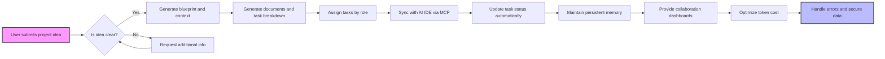

# FlowSphere Functional Requirements and Business Specifications

## 1. Overview
FlowSphere is an AI-powered 360° project management SaaS platform that transforms user ideas into actionable, executable software projects. It enables conversational ideation, automated multi-document generation, detailed task decomposition, AI IDE integration, context persistence, and robust team collaboration. These requirements specify the business processes governing these capabilities to ensure consistent implementation.

### Business Model
- FlowSphere fills an essential market need for AI-native project management that overcomes AI IDE memory loss and costly token usage.
- It targets developers, freelancers, hackathon teams, and enterprises seeking efficient, automated project workflows.

## 2. Project Ideation Workflow

### User Interaction
WHEN a user submits a project idea, THE system SHALL engage in a conversational session to refine and validate the concept.
WHEN ideation begins, THE system SHALL create and store a persistent conversation history linked to the project.

### Business Rules
- THE system SHALL automatically analyze user input to extract key project requirements, technology recommendations, and risk assessments.
- THE system SHALL allow iterative user input refinement through the conversation interface.

### Performance Requirements
- THE system SHALL provide feature extraction results within 5 seconds of input.

## 3. Document Generation Pipeline

### Core Documents
THE system SHALL generate at least the following documents automatically: PRD, MVP, SRS, ADD, TDD, API documentation, DDD, SAD, deployment guides, UXD, UI specifications, test plans, release plans, performance and monitoring plans, business logic documentation, integration specs, and compliance requirements.

### Generation and Updates
- WHEN a project is created or updated, THE system SHALL generate or regenerate requested documents.
- THE system SHALL offer selective document generation per user configuration.
- THE system SHALL maintain version history for all documents with diffs viewable.
- THE system SHALL allow export in PDF, Markdown, Notion, Jira, and Confluence formats.
- THE system SHALL embed autogenerated diagrams such as ERDs and flowcharts.

### Performance Requirements
- THE system SHALL complete full document generation within 30 seconds.

## 4. Task Decomposition Engine

### Task Hierarchy
THE system SHALL decompose projects into hierarchical tasks: Epic, Task, Mini-Task, Micro-Task, and Atomic task levels.

### Task Attributes
- THE system SHALL assign tasks role-specifically (frontend, backend, QA, UI/UX, DevOps, AI specialist).
- THE system SHALL provide estimated effort, task dependencies, acceptance criteria, and AI-IDE optimized prompts.
- THE system SHALL package relevant project context with each task.

### Business Rules
- THE system SHALL update task status automatically from AI IDE feedback and manually by users.
- THE system SHALL visualize dependencies and blockages clearly.

### Performance Requirements
- Task generation and prompt creation SHALL complete within 15 seconds.

## 5. AI IDE Integration

### MCP Server Protocol
THE system SHALL implement context sharing and task synchronization with popular AI IDEs (Cursor AI, Codeium, etc.) through an MCP server protocol.

### Integration Capabilities
- Real-time state synchronization
- Automatic task progress tracking
- Smart task suggestion for developers
- Automated code-quality gating
- Real-time documentation sync
- Team progress notifications

### Performance Requirements
- Sync latency SHALL be under 2 seconds for collaboration experience.

## 6. Context Management

### Persistent Project Memory
THE system SHALL maintain comprehensive conversational histories, design decisions, code changes, bug patterns, and performance metrics.

### Context Compression
- THE system SHALL compress older context to optimize token usage without losing critical details.
- THE system SHALL prioritize context relevance dynamically per task.

### Performance Requirements
- Context loading and compression SHALL execute within 3 seconds.

## 7. Team Collaboration

### Role-Based Assignment
- THE system SHALL assign tasks based on member expertise and workload balance.
- THE system SHALL provide dashboards for managers to monitor timelines, budgets, and risks.

### Collaboration Features
- Automated daily standup report generation
- Dependency visualization for task blockers
- Automated routing of code reviews
- Knowledge sharing and lessons logging

### Business Rules
- THE system SHALL prevent task overallocation.
- THE system SHALL allow authorized manual overrides.

## 8. Cost Optimization

### Token Usage Management
- THE system SHALL reduce token consumption by 60-80% using caching, batching, and incremental updates.
- THE system SHALL select AI models dynamically based on task complexity and cost constraints.

### Development Acceleration
- THE system SHALL auto-generate boilerplate code and test suites.
- THE system SHALL provide refactoring suggestions and performance monitoring.

## 9. Performance Requirements

- The system SHALL serve UI pages within 2 seconds.
- API response times SHALL meet P95 under 200 ms.
- Document generation SHALL complete within 30 seconds.
- Task decomposition updates SHALL be rendered within 15 seconds.

## 10. Error Handling

- IF AI service calls fail, THEN THE system SHALL fallback on cached or curated data.
- IF network latency is high, THEN THE system SHALL provide offline capability with sync queue.
- IF user input fails validation, THEN THE system SHALL display detailed error messages.
- ALL system errors SHALL be logged and monitored.

## 11. Security & Compliance

### Authentication
THE system SHALL support OAuth 2.0 and email-based logins with secure session handling.

### Authorization
THE system SHALL enforce role-based access control strictly.

### Data Protection
- THE system SHALL encrypt data at rest and in transit.
- Data deletion SHALL be performed on user request within 30 days.

### Audit
Activity logging and monitoring SHALL cover security and operational events.

## 12. Summary

FlowSphere's backend business requirements ensure a comprehensive AI-powered project management platform offering automated ideation, documentation, task management, AI IDE integration, team collaboration, and cost-efficient development with robust security and error handling.

---

This document provides business requirements only. All technical implementation decisions belong to developers. Developers have full autonomy over architecture, APIs, and database design. The document describes WHAT the system should do, not HOW to build it.