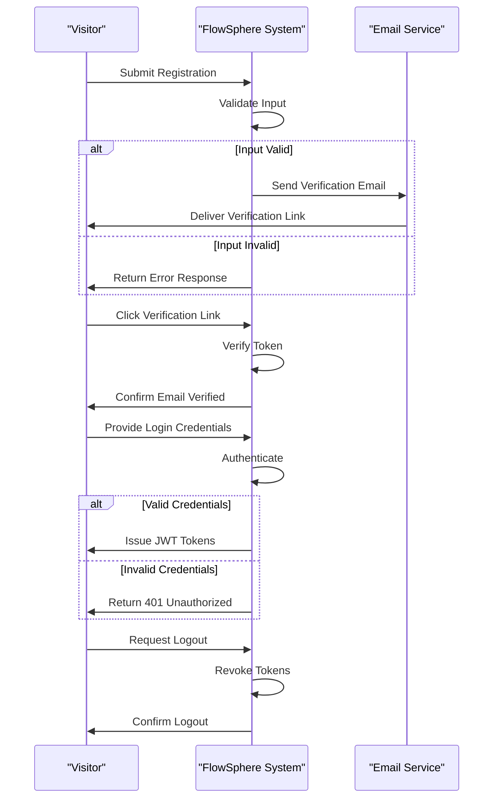

# FlowSphere User Roles, Authentication, and Permissions Specification

## 1. Introduction

FlowSphere requires a robust and secure access control system that supports various user roles with differentiated permissions. This specification details the business requirements for authenticating users, defining their roles, enforcing permissions, managing secure sessions, and handling tokens. It provides backend developers with clear instructions on WHAT the system must do to support secure, efficient, and role-based user management.

## 2. User Roles and Descriptions

FlowSphere shall support the following distinct user roles, each with specific access rights and responsibilities:

### 2.1 Guest
- WHEN a user visits the platform without authentication, THE system SHALL grant read-only access to public content.
- Guests SHALL NOT be permitted to create, modify, or delete any project data or settings.

### 2.2 Registered User
- WHEN a user registers and verifies their email, THE system SHALL allow creating and managing personal projects.
- Registered Users SHALL be able to participate in ideation sessions, document reviewing, and executing assigned tasks.
- Registered Users SHALL NOT manage teams or assign tasks beyond their responsibilities.

### 2.3 Project Manager
- WHEN assigned as Project Manager, THE user SHALL have permissions to create projects, invite team members, and assign tasks.
- Project Managers SHALL be able to generate, edit, and approve project documentation.
- Project Managers SHALL monitor project progress through dashboards.
- Project Managers SHALL be responsible for risk management and deadline adjustments.

### 2.4 Frontend Developer
- WHEN assigned the Frontend Developer role, THE user SHALL access frontend-specific tasks.
- Frontend Developers SHALL submit code and documentations related to UI components.
- They SHALL participate in code reviews and UI testing.

### 2.5 Backend Developer
- WHEN assigned, THE Backend Developer SHALL handle server-side logic, database schema discussions, API contracts, and related documentation.
- Backend Developers SHALL submit code and test cases relating to backend modules.

### 2.6 DevOps Engineer
- DevOps Engineers SHALL manage deployment pipelines, infrastructure as code, and monitor system health.
- THEY SHALL have permission to configure environments and rollback procedures.

### 2.7 QA Engineer
- QA Engineers SHALL create test plans, automate test suits, execute tests, and report bugs.
- THEY SHALL verify fixes and ensure quality standards.

### 2.8 UI/UX Designer
- UI/UX Designers SHALL produce design mockups, style guides, and accessibility compliance reports.
- THEY SHALL collaborate with frontend developers for implementation.

### 2.9 AI Specialist
- AI Specialists SHALL manage AI IDE integration, prompt engineering, and optimize AI context memory.
- THEY SHALL monitor AI usage and token costs.

### 2.10 Administrator
- Administrators SHALL have full system control, including user and role management.
- THEY SHALL audit system activity and respond to security incidents.

## 3. Authentication Flow Requirements

### 3.1 Registration
- WHEN a visitor submits a registration request, THE system SHALL validate the email and password according to policy (minimum length 12, complexity requirements).
- THE system SHALL send a verification email with a unique token.
- WHEN the user clicks the verification link, THE system SHALL mark the email as verified.
- UNVERIFIED accounts SHALL NOT be allowed to create or participate in projects.

### 3.2 Login
- WHEN a user submits login credentials, THE system SHALL authenticate the user.
- IF credentials are valid, THE system SHALL create a secure session and issue JWTs.
- IF credentials are invalid, THEN THE system SHALL respond with HTTP 401 Unauthorized and an error code AUTH_INVALID_CREDENTIALS.

### 3.3 Logout
- WHEN a logged-in user initiates logout, THE system SHALL revoke active tokens and terminate the session.

### 3.4 Session Management
- THE system SHALL use JWT tokens with access tokens valid for 15 minutes and refresh tokens valid for 14 days.
- THE system SHALL enforce token expiration and renewal workflows securely.

### 3.5 Password Reset
- WHEN a user requests password reset, THE system SHALL send a secure, time-limited reset link.
- The reset link SHALL expire after 15 minutes.
- THE system SHALL validate and update the password upon submission.

### 3.6 Token Revocation
- WHEN a user changes their password or logs out of all devices, THE system SHALL revoke all active tokens immediately.

## 4. Role Hierarchy and Permissions

- THE system SHALL define a clear hierarchy for roles where Administrator is the highest, followed by Project Manager, AI Specialist, DevOps Engineer, Backend Developer, Frontend Developer, QA Engineer, UI/UX Designer, Registered User, and Guest.
- THE system SHALL enforce least privilege, disallowing any user from performing actions beyond their role.

## 5. Token Management and JWT

- THE system SHALL issue JWT access tokens with embedded claims including userId, userRole, permissions array, issuedAt timestamp, and expiry timestamp.
- THE system SHALL implement rotating secret keys for signing JWTs with key rotation policies.
- THE system SHALL store tokens in secured HTTP-only cookies or secure local storage.

## 6. Permission Matrix

| Action | Guest | Registered User | Project Manager | Frontend Developer | Backend Developer | DevOps Engineer | QA Engineer | UI/UX Designer | AI Specialist | Administrator |
|-----------------------------|-------|-----------------|-----------------|--------------------|------------------|-----------------|-------------|---------------|---------------|---------------|
| View Public Content          | ✅    | ✅              | ✅              | ✅                 | ✅               | ✅              | ✅          | ✅            | ✅            | ✅            |
| Register/Login              | ✅    | ✅              | ✅              | ✅                 | ✅               | ✅              | ✅          | ✅            | ✅            | ✅            |
| Create Personal Project      | ❌    | ✅              | ✅              | ❌                 | ❌               | ❌              | ❌          | ❌            | ❌            | ✅            |
| Create Team Project           | ❌    | ❌              | ✅              | ❌                 | ❌               | ❌              | ❌          | ❌            | ❌            | ✅            |
| Assign Tasks                | ❌    | ❌              | ✅              | ❌                 | ❌               | ❌              | ❌          | ❌            | ❌            | ✅            |
| Access Assigned Frontend Tasks | ❌    | ❌              | ❌              | ✅                 | ❌               | ❌              | ❌          | ❌            | ❌            | ✅            |
| Access Assigned Backend Tasks  | ❌    | ❌              | ❌              | ❌                 | ✅               | ❌              | ❌          | ❌            | ❌            | ✅            |
| Manage CI/CD and Infrastructure | ❌    | ❌              | ❌              | ❌                 | ❌               | ✅              | ❌          | ❌            | ❌            | ✅            |
| Plan and Execute Tests          | ❌    | ❌              | ❌              | ❌                 | ❌               | ❌              | ✅          | ❌            | ❌            | ✅            |
| Create and Review UI Designs    | ❌    | ❌              | ❌              | ❌                 | ❌               | ❌              | ❌          | ✅            | ❌            | ✅            |
| Manage AI Prompts and Contexts  | ❌    | ❌              | ❌              | ❌                 | ❌               | ❌              | ❌          | ❌            | ✅            | ✅            |
| Full System Administration      | ❌    | ❌              | ❌              | ❌                 | ❌               | ❌              | ❌          | ❌            | ❌            | ✅            |

## 7. Error Handling Scenarios

- IF login fails due to invalid credentials, THEN THE system SHALL respond with HTTP 401 Unauthorized and log the event.
- IF a user attempts to perform an action without sufficient permission, THEN THE system SHALL respond with HTTP 403 Forbidden and a descriptive error message.
- IF tokens expire during a session, THEN THE system SHALL force re-authentication or token refresh workflows.

## 8. Security Considerations

- THE system SHALL enforce HTTPS at all endpoints.
- THE system SHALL log all authentication and authorization events with timestamps and user identifiers.
- THE system SHALL comply with industry best practices for password storage, token signing, and session management.

## 9. Mermaid Diagram: Authentication Flow

## 10. Summary

This specification provides comprehensive business requirements for user roles, authentication workflows, permissions management, token handling, error scenarios, and secure session controls. It enables backend developers to implement a secure, reliable, and scalable access control system that accommodates FlowSphere's diverse user base and role-specific responsibilities.

*This document specifies WHAT the system must do and leaves HOW to implement at the discretion of the development team.*
