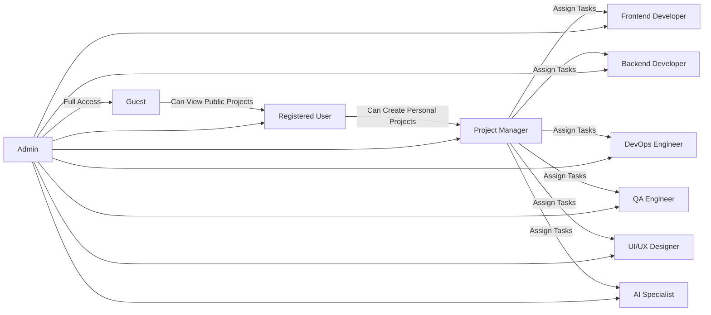

# FlowSphere Security and Compliance Requirements

## 1. Introduction

This document provides a comprehensive specification of the security and compliance requirements for the FlowSphere AI-native project management SaaS platform. It outlines the necessary standards for data privacy, authentication and authorization, role-based access control, regulatory compliance, audit logging, monitoring, and incident response. This specification is intended for backend developers and security architects to implement a robust, secure, and legally compliant system.

## 2. Data Privacy Requirements

### 2.1 Personal Data Handling

- WHEN a user submits personal data (including profile details, project information, or communication), THE FlowSphere system SHALL securely store it using encryption at rest.
- THE system SHALL encrypt all personal and sensitive data in transit using TLS 1.2 or higher.
- WHEN data is accessed, THE system SHALL enforce strict authorization checks before permitting data retrieval.

### 2.2 Data Encryption Standards

- THE system SHALL use AES-256 encryption for all data stored at rest.
- THE system SHALL use TLS 1.2 or higher for all data transmitted between clients and servers.

### 2.3 Data Retention and Deletion Policies

- WHEN a user requests account deletion, THE system SHALL permanently delete all user data within 30 calendar days.
- THE system SHALL maintain an automated data retention policy, purging inactive project and user data after 12 months of inactivity.

### 2.4 Data Access Auditability

- THE system SHALL log all access to personal data including user identity, timestamp, and accessed records.
- WHEN unauthorized access attempts occur, THE system SHALL trigger security alerts and log the incident details.

## 3. Authentication and Authorization

### 3.1 Authentication Mechanisms

- THE system SHALL provide secure user authentication using OAuth 2.0 providers (Google, GitHub) and email/password login.
- WHEN a login attempt occurs, THE system SHALL verify credentials and respond with success or failure within 2 seconds.

### 3.2 Password Policy and Reset

- THE system SHALL require passwords to be at least 12 characters with a mix of uppercase, lowercase, digits, and symbols.
- WHEN a user initiates password reset, THE system SHALL send a secure, time-limited reset link via registered email.
- THE reset link SHALL expire after 15 minutes.

### 3.3 Session Management

- THE system SHALL issue JWT tokens with a 30-minute expiration for access, and refresh tokens valid for 14 days.
- WHEN a user logs out, THE system SHALL invalidate active tokens immediately.

### 3.4 Multi-Factor Authentication (MFA)

- WHERE user opts-in for MFA, THE system SHALL enforce MFA using email or application-based OTP.

## 4. Role-Based Access Control (RBAC)

### 4.1 User Roles and Permissions

- THE system SHALL implement the following roles with specified capabilities:
  - **Guest**: View only public documentation and register/login.
  - **Registered User**: Create/manage personal projects, participate in ideation/task execution.
  - **Project Manager**: Manage projects, assign tasks, approve deliverables.
  - **Frontend Developer**: Execute frontend tasks.
  - **Backend Developer**: Execute backend tasks.
  - **DevOps Engineer**: Manage infrastructure and deployment.
  - **QA Engineer**: Manage testing and verification.
  - **UI/UX Designer**: Design user interface components and experience.
  - **AI Specialist**: Manage AI-related integration and prompt engineering.
  - **Admin**: Full system control, including user and role management.

### 4.2 Role Assignment

- WHEN a user is added to a project team, THE system SHALL assign roles explicitly and allow modification by project managers or admins.
- THE system SHALL enforce least privilege, permitting users only the actions their assigned roles allow.

### 4.3 Permission Matrix

| Action                          | Guest | Registered User | Project Manager | Frontend Dev | Backend Dev | DevOps | QA Engineer | UI/UX Designer | AI Specialist | Admin |
|--------------------------------|-------|-----------------|-----------------|--------------|-------------|--------|-------------|----------------|---------------|-------|
| View Public Projects            | ✅    | ✅              | ✅              | ✅           | ✅          | ✅     | ✅          | ✅             | ✅            | ✅    |
| Create Personal Project         | ❌    | ✅              | ✅              | ❌           | ❌          | ❌     | ❌          | ❌             | ❌            | ✅    |
| Assign Tasks                   | ❌    | ❌              | ✅              | ❌           | ❌          | ❌     | ❌          | ❌             | ❌            | ✅    |
| Complete Assigned Tasks         | ❌    | ✅              | ✅              | ✅           | ✅          | ✅     | ✅          | ✅             | ✅            | ✅    |
| Manage User Roles               | ❌    | ❌              | ❌              | ❌           | ❌          | ❌     | ❌          | ❌             | ❌            | ✅    |
| Access MCP Real-Time Integration| ❌    | ✅              | ✅              | ✅           | ✅          | ✅     | ✅          | ✅             | ✅            | ✅    |

### 4.4 Access Control Enforcement

- THE system SHALL enforce access control at API and data storage layers.
- WHEN unauthorized access is attempted, THE system SHALL respond with HTTP 403 Forbidden and a meaningful error.

## 5. Regulatory Compliance

### 5.1 Applicable Regulations

- THE system SHALL comply with GDPR for EU residents and CCPA for California residents.

### 5.2 User Consent Management

- WHEN collecting personal data, THE system SHALL obtain explicit user consent explaining data usage.
- THE system SHALL provide users with the ability to withdraw consent at any time.

### 5.3 Data Breach Notification

- WHEN a data breach occurs affecting personal data, THE system SHALL notify affected users within 72 hours per regulatory requirements.

## 6. Audit Logging and Monitoring

### 6.1 Action Logging

- THE system SHALL log all critical system actions including authentication events, data access, task assignments, document generation, and configuration changes.

### 6.2 Log Retention and Security

- Logged data SHALL be retained securely for a minimum of 1 year.
- Logs SHALL be protected against unauthorized tampering and access.

### 6.3 Monitoring and Alerting

- THE system SHALL implement continuous monitoring for anomalous activity.
- WHEN suspicious activity is detected, THE system SHALL generate real-time alerts to the security team.

## 7. Incident Response

### 7.1 Incident Detection

- THE system SHALL detect incidents based on automated log analysis and anomaly detection.

### 7.2 Response Procedure

- WHEN an incident is confirmed, THE security team SHALL follow predefined response steps including containment, investigation, and remediation.

### 7.3 Notifications

- THE system SHALL notify system administrators, affected users, and regulators as required.

## 8. Summary

This document defines business-level security, privacy, and compliance requirements critical to FlowSphere's trustworthy operation. All backend developers must implement these requirements strictly to safeguard user data, enforce role-based access, comply with regulations, and provide a secure, reliable platform.

---

> This document defines business requirements only. All technical implementation decisions including architecture, API design, and database schemata are at the full discretion of the development team. The document specifies WHAT FlowSphere must do to meet security and compliance objectives, not HOW to do it.

---

## Mermaid Diagram: Role-Based Access Control Overview

