# FlowSphere Backend Business Requirements Specification

## 1. Introduction
FlowSphere is an AI-powered 360° project management platform designed to automate the complete software project lifecycle—from idea inception, through detailed planning, to AI-augmented development and deployment. This specification provides comprehensive business requirements for backend system implementation, ensuring clarity on WHAT the system must do to fulfill its vision and business goals while empowering AI-assisted development processes.

## 2. Business Model
### Why FlowSphere Exists
The burgeoning demand for AI-augmented development tools is hindered by fragmented workflows, context loss in AI IDEs, and a lack of cohesive project memory. FlowSphere exists to unify these needs by providing persistent project memory, automated documentation, granular task management, AI IDE integration, and team-centric collaboration.

### Revenue and Growth
FlowSphere monetizes through subscription tiers tailored for freelancers, startups, and enterprise customers. Growth is fueled by continuous AI enhancement, seamless integrations, and strong community support. Success is measured by user adoption rates, token cost reductions, and project delivery speed improvements.

## 3. User Roles and Authentication
### Roles
FlowSphere supports multiple user roles, each with distinct permissions:
- Guest
- Registered User
- Project Manager
- Frontend Developer
- Backend Developer
- DevOps Engineer
- QA Engineer
- UI/UX Designer
- AI Specialist
- Administrator

### Authentication Flows
WHEN a user registers, THE system SHALL validate input and send verification emails.
WHEN a user logs in, THE system SHALL authenticate and issue JWT tokens.
WHEN a session expires or user logs out, THE system SHALL revoke tokens and end the session.
MFA SHALL be optional but supported.

### Permission Matrix
Each role is explicitly defined with allowed and forbidden actions, enforced system-wide with strict access control.

## 4. Functional Requirements
- Conversational ideation with iterative refinement
- Automated generation of 18+ project documents, with version control and export capabilities
- Multi-level task decomposition with role-based task assignment and AI prompt generation
- Real-time context synchronization with AI IDEs using MCP server protocol
- Persistent project memory with context compression and token usage optimization
- Role-aware team collaboration with workload balancing and notification systems

## 5. Project Management Workflows
- Project creation initializes project context and conversation history
- Ideation inputs drive blueprint and document generation
- Task breakdown to granularity from Epic to Atomic
- Automated task status updates triggered by AI IDE activity or manual input
- Dependency mapping with clear visualization

## 6. AI IDE Integration and MCP Server
- Support real-time synchronization of project state and task context
- Push optimized AI prompts per micro-task
- Auto-update progress and code quality via IDE signal feedback
- Support multiple AI IDEs like Cursor AI, Codeium, GitHub Copilot

## 7. Context Preservation and Token Optimization
- Maintain full conversational and project memory
- Compress older context while preserving key info to stay within token limits
- Cache AI responses and batch API calls for cost reduction
- Restore context after AI IDE interruptions

## 8. Team Collaboration and Role-Based Access
- Role-specific dashboards and task views
- Automated task assignments based on expertise
- Overload protection and manual reassignment facilities
- Automated daily standups and progress reporting

## 9. Error Handling and Recovery Scenarios
- Clear user messages on validation errors, service outages
- Automatic retries with exponential backoff for critical operations
- Offline mode support with queued updates and conflict resolution
- Audit logging for error and access tracking

## 10. Performance Requirements
- Initial page load under 2 seconds
- API response latency P95 under 200ms under normal load
- Document generation for full sets within 30 seconds
- Task breakdown within 15 seconds
- AI context processing under 3 seconds
- 99.9% uptime during business hours

## 11. Security and Compliance
- Data encryption at rest (AES-256) and in transit (TLS 1.2+)
- Role-based access control strictly enforced
- GDPR and CCPA compliance
- Audit logging, anomaly detection, and incident response protocols

## 12. External Integrations
- Integration with multiple AI providers (OpenAI, Anthropic, Google)
- MCP protocol compliance for IDE integration
- OAuth providers: Google, GitHub
- Notification services via email, in-app, webhooks
- Secure, scalable document and context storage

## 13. System Context and Business Rules
- Detailed data flow between users, projects, AI models, documents, tasks, and MCP server
- Event-driven architecture for state synchronization
- Business rules governing role permissions, project lifecycle, and error handling
- Environment constraints and scalability considerations

## 14. Summary
This specification provides the definitive business requirements for FlowSphere's backend platform. Developers should implement all requirements in a manner ensuring extensibility, robustness, security, and cost efficiency, enabling FlowSphere to achieve its vision as the premier AI-native project management environment.

---

## Mermaid Diagrams

```mermaid
graph LR
  A["User submits project idea"] --> B{"Is idea clear?"}
  B -->|"Yes"| C["Create project context and extract features"]
  B -->|"No"| D["Request additional info from user"]
  C --> E["Generate core documents and task breakdown"]
  E --> F["Assign tasks based on team roles"]
  F --> G["Sync context and tasks with AI IDEs via MCP"]
  G --> H["Track progress and auto-update statuses"]
  H --> I["Maintain persistent project memory and compress context"]
  I --> J["Provide dashboards and collaboration tools"]
  J --> K["Optimize token usage and performance"]
  K --> L["Handle errors and enforce security"]

  D --> B

  style A fill:#f9f,stroke:#333,stroke-width:2px
  style L fill:#bbf,stroke:#333,stroke-width:2px
```

---

> This document provides business requirements only. All technical implementation decisions belong to developers. Developers have full autonomy over architecture, APIs, and database design. The document describes WHAT the system should do, not HOW to build it.
