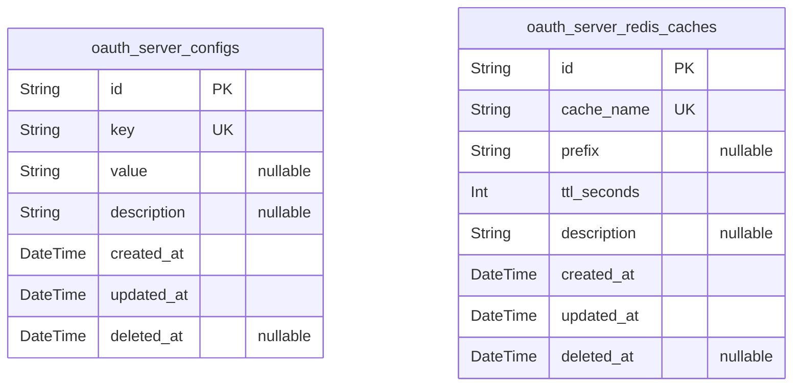
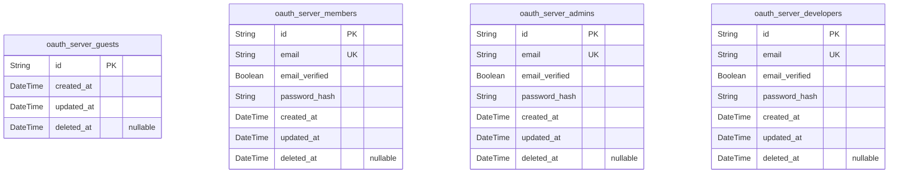
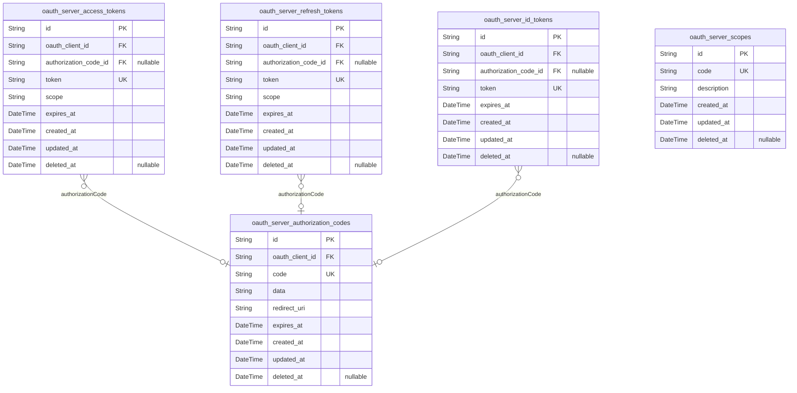
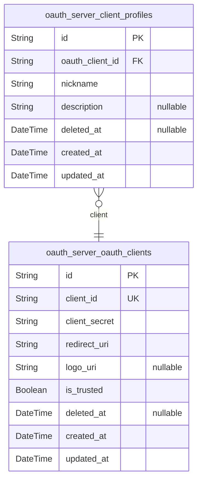
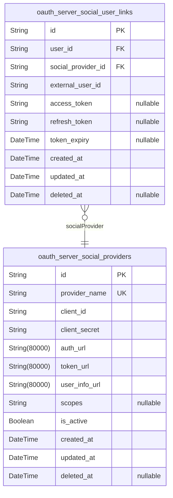
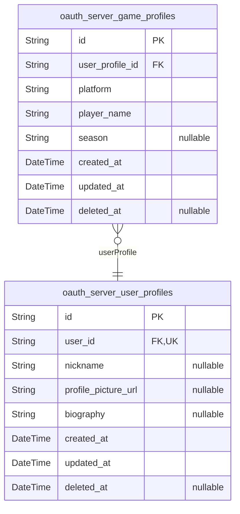
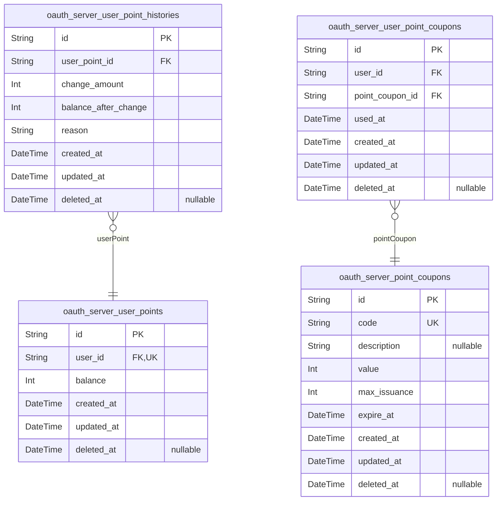
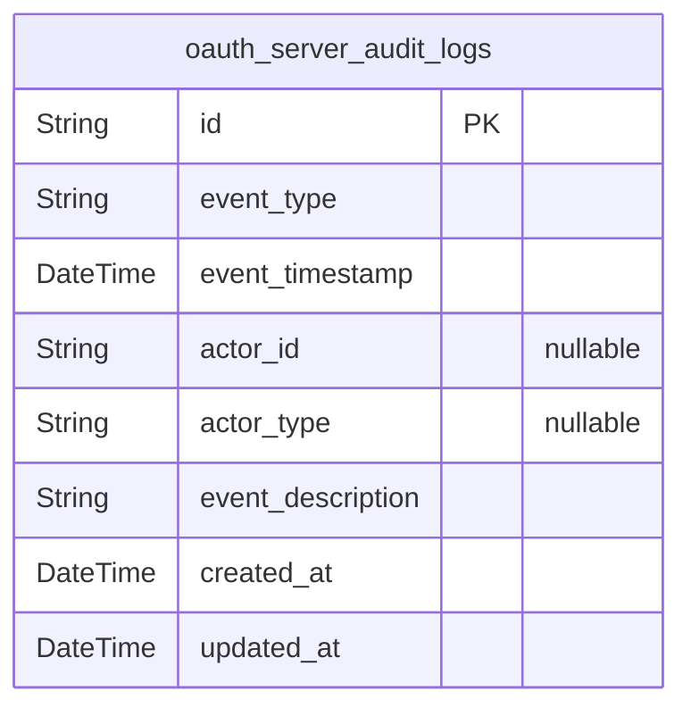
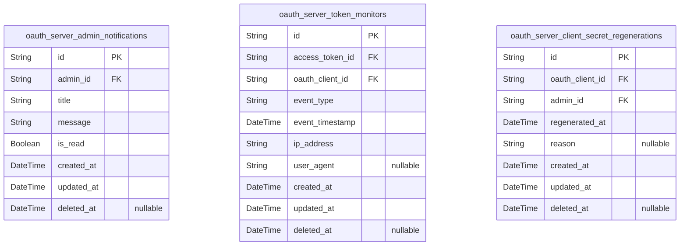

# Prisma Markdown

> Generated by [`prisma-markdown`](https://github.com/samchon/prisma-markdown)

- [Systematic](#systematic)
- [Actors](#actors)
- [Oauth](#oauth)
- [Clients](#clients)
- [SocialLogins](#sociallogins)
- [UserProfiles](#userprofiles)
- [PointsCoupons](#pointscoupons)
- [AuditLogs](#auditlogs)
- [Admin](#admin)

## Systematic

### `oauth_server_configs`

System configuration settings for the OAuth server including general
parameters and environment-specific options. This primary table holds
key-value pairs that control system behavior. It includes timestamps for
audit and a soft delete field.

Properties as follows:

- `id`: Primary Key.
- `key`: Unique configuration key identifying a system setting.
- `value`: Value of the configuration setting, stored as string.
- `description`: Detailed explanation of the configuration setting's purpose and usage.
- `created_at`: Timestamp when the record was created.
- `updated_at`: Timestamp when the record was last updated.
- `deleted_at`: Timestamp when the record was soft deleted; null if active.

### `oauth_server_redis_caches`

Caching metadata and configuration for Redis caches used by the OAuth
server, including cache type, TTL, and keys managed. This subsidiary
model supports performance optimization by managing Redis cache
configurations.

Properties as follows:

- `id`: Primary Key.
- `cache_name`: Name of the Redis cache configuration.
- `prefix`: Key prefix used for Redis keys in this cache.
- `ttl_seconds`: Time to live for cache entries, in seconds.
- `description`: Description of the cache purpose and usage.
- `created_at`: Timestamp when the cache configuration was created.
- `updated_at`: Timestamp when the cache configuration was last updated.
- `deleted_at`: Timestamp when the cache configuration was soft deleted; null if active.

## Actors

### `oauth_server_guests`

Guest user entity representing unauthenticated or anonymous users who can
initiate authentication processes or browse limited services. Contains
only auditing timestamps and soft delete support but no authentication
fields.

Properties as follows:

- `id`: Primary Key.
- `created_at`: Record creation timestamp.
- `updated_at`: Record last modification timestamp.
- `deleted_at`: Soft delete timestamp; null when active.

### `oauth_server_members`

Member user entity for registered users supporting local email/password
authentication and social authentication. Includes unique email, verified
flag, hashed password, and auditing timestamps with soft delete enabled.

Properties as follows:

- `id`: Primary Key.
- `email`: Email address for user authentication and communication; unique per user.
- `email_verified`: Flag indicating if the user's email address is verified.
- `password_hash`: Hashed password for authentication; plain passwords are never stored.
- `created_at`: Timestamp of record creation.
- `updated_at`: Timestamp of last record update.
- `deleted_at`: Timestamp of soft deletion if applicable.

### `oauth_server_admins`

Administrator user entity with elevated privileges for system management.
Stores unique email, verified flag, hashed password, with auditing and
soft delete timestamps.

Properties as follows:

- `id`: Primary Key.
- `email`: Administrator email address; unique for login and communication.
- `email_verified`: Indicates whether the administrator's email has been verified.
- `password_hash`: Hashed password for administrator authentication.
- `created_at`: Timestamp of account creation.
- `updated_at`: Timestamp of last account update.
- `deleted_at`: Timestamp representing soft deletion status.

### `oauth_server_developers`

Developer user entity representing OAuth client developers with
permissions to manage clients and SDKs. Includes unique email, email
verification flag, password hash, with auditing and soft delete
timestamps.

Properties as follows:

- `id`: Primary Key.
- `email`: Developer email address; unique for identification and communication.
- `email_verified`: Email verification status for developer accounts.
- `password_hash`: Hashed password for developer authentication.
- `created_at`: Record creation timestamp.
- `updated_at`: Record update timestamp.
- `deleted_at`: Timestamp marking soft deletion of the developer record.

## Oauth

### `oauth_server_authorization_codes`

OAuth authorization code records. Stores unique code strings, JSONB OAuth
request data for robust protocol compliance, and redirect URIs. Linked to
OAuth clients. Includes timestamps for creation, update, and soft
deletion to support revocation and audit trails.

Properties as follows:

- `id`: Primary Key.
- `oauth_client_id`
  > Reference to the OAuth client requesting authorization. {@link
  > oauth_server_oauth_clients.id}
- `code`: Unique authorization code string issued to client.
- `data`: OAuth request data as JSONB string for full protocol details.
- `redirect_uri`: Redirect URI used in the authorization flow.
- `expires_at`: Expiration datetime of the authorization code.
- `created_at`: Record creation timestamp.
- `updated_at`: Record update timestamp.
- `deleted_at`: Soft delete timestamp for revocation.

### `oauth_server_access_tokens`

Stores opaque OAuth access tokens with scopes, expiration, and
timestamps. Each token linked to an OAuth client and optionally the
authorization code used to grant it. Tokens are unique and managed with
creation/update timestamps and soft deletion.

Properties as follows:

- `id`: Primary Key.
- `oauth_client_id`
  > OAuth client owning this access token. {@link
  > oauth_server_oauth_clients.id}
- `authorization_code_id`
  > Authorization code related to this token, nullable if token is from other
  > grant types. [oauth_server_authorization_codes.id](#oauth_server_authorization_codes)
- `token`: Opaque access token string.
- `scope`: Space-separated scopes granted for this token.
- `expires_at`: Expiration datetime for the token.
- `created_at`: Token creation timestamp.
- `updated_at`: Token update timestamp.
- `deleted_at`: Soft delete timestamp for token revocation.

### `oauth_server_refresh_tokens`

Refresh tokens allowing clients to renew access tokens without
reauthorization. Stored with opaque token string, related client and
optionally authorization code, expiration, scopes, and auditing
timestamps with soft deletion support.

Properties as follows:

- `id`: Primary Key.
- `oauth_client_id`
  > OAuth client associated with this refresh token. {@link
  > oauth_server_oauth_clients.id}
- `authorization_code_id`
  > Optional authorization code granting this refresh token. {@link
  > oauth_server_authorization_codes.id}
- `token`: Opaque refresh token string.
- `scope`: Scopes granted by the refresh token, space-separated.
- `expires_at`: Expiration datetime of the refresh token.
- `created_at`: Creation timestamp of the refresh token.
- `updated_at`: Update timestamp of the refresh token.
- `deleted_at`: Soft delete timestamp for revocation.

### `oauth_server_id_tokens`

OpenID Connect ID tokens issued to clients for identity claims, linked to
OAuth clients and optionally authorization codes. Contains token strings,
expirations, timestamps, and soft deletion timestamps for lifecycle
management.

Properties as follows:

- `id`: Primary Key.
- `oauth_client_id`
  > OAuth client reference owning this ID token. {@link
  > oauth_server_oauth_clients.id}
- `authorization_code_id`
  > Related authorization code, nullable if not linked. {@link
  > oauth_server_authorization_codes.id}
- `token`: ID token string containing OIDC claims, normally a JWT or opaque token.
- `expires_at`: Expiration timestamp of the ID token.
- `created_at`: Timestamp when ID token was issued.
- `updated_at`: Timestamp when ID token was last updated.
- `deleted_at`: Soft delete timestamp for token revocation.

### `oauth_server_scopes`

Scope definitions for OAuth 2.0 authorization requests. Each scope has a
unique code and human-readable description specifying the permission
granted. Includes timestamps for auditing and soft delete support for
scope deactivation.

Properties as follows:

- `id`: Primary Key.
- `code`: Unique string code identifying the scope.
- `description`: Text description clarifying the scope's permissions.
- `created_at`: Timestamp when the scope was created.
- `updated_at`: Timestamp when the scope was last updated.
- `deleted_at`: Soft delete timestamp for scope removal, nullable if active.

## Clients

### `oauth_server_oauth_clients`

OAuth clients registered in the system, representing applications that
request OAuth authorization. Includes client credentials, redirect URIs,
trust flag, and metadata. This is the main entity for client management
in the OAuth server system.

Properties as follows:

- `id`: Primary Key.
- `client_id`: Unique client identifier used by OAuth clients.
- `client_secret`: Client secret used for authentication.
- `redirect_uri`: Redirect URI for OAuth response callbacks.
- `logo_uri`: URI to the client's logo image.
- `is_trusted`: Flag indicating whether the client is trusted, allowing automatic consent.
- `deleted_at`: Soft delete timestamp; records when the client was deleted.
- `created_at`: Record creation timestamp.
- `updated_at`: Record last update timestamp.

### `oauth_server_client_profiles`

Profile information related to OAuth clients, containing frequently
changing metadata such as nickname and description. Linked to the main
client entity to allow separation of frequently updated profile data.

Properties as follows:

- `id`: Primary Key.
- `oauth_client_id`: Belonged OAuth client [oauth_server_oauth_clients.id](#oauth_server_oauth_clients).
- `nickname`: Nickname of the OAuth client for display purposes.
- `description`: Detailed description of the OAuth client.
- `deleted_at`: Soft delete timestamp; records when the profile was deleted.
- `created_at`: Record creation timestamp.
- `updated_at`: Record last update timestamp.

## SocialLogins

### `oauth_server_social_providers`

Social login OAuth external providers information, managing client IDs,
secrets, and authorization endpoints. Provides configuration for
integrating external OAuth systems such as Naver, Google, Apple, and
others. Supports multi-tenancy and security management for social login
integrations.

Properties as follows:

- `id`: Primary Key.
- `provider_name`: Unique provider identifier name, e.g., 'naver', 'google', 'apple'.
- `client_id`: Client ID used in OAuth flows for this provider.
- `client_secret`: Client secret associated with the client ID.
- `auth_url`: OAuth authorization endpoint URL for the social provider.
- `token_url`: OAuth token endpoint URL for the social provider.
- `user_info_url`: User info API endpoint URL to fetch user details from social provider.
- `scopes`: OAuth scopes requested for this provider, space separated.
- `is_active`: Flag indicating if this social provider integration is active.
- `created_at`: Record creation timestamp.
- `updated_at`: Record last update timestamp.
- `deleted_at`: Soft delete timestamp.

### `oauth_server_social_user_links`

Association table linking internal users with external social login
accounts from various providers. Maintains unique external user IDs per
provider, enabling unified user identity management across multiple
social OAuth services.

Properties as follows:

- `id`: Primary Key.
- `user_id`: Internal user reference linked to oauth_server_members.id.
- `social_provider_id`
  > Social OAuth provider reference linked to
  > oauth_server_social_providers.id.
- `external_user_id`: Unique user identifier assigned by the social provider.
- `access_token`: OAuth access token for the user on the social provider.
- `refresh_token`: OAuth refresh token for the user on the social provider.
- `token_expiry`: Expiration datetime of the OAuth access token.
- `created_at`: Record creation timestamp.
- `updated_at`: Record last update timestamp.
- `deleted_at`: Soft delete timestamp.

## UserProfiles

### `oauth_server_user_profiles`

Stores volatile user profile information such as nicknames, profile
pictures, and biographies that frequently change, decoupled from core
user identity data to optimize update operations and API performance.

Properties as follows:

- `id`: Primary Key.
- `user_id`
  > Foreign key referencing the primary user in the oauth_server_members
  > table.
- `nickname`: User's display nickname which can be updated frequently.
- `profile_picture_url`: URL to the user's profile picture, which can be changed often.
- `biography`: A short personal biography or description.
- `created_at`: Timestamp when this record was created.
- `updated_at`: Timestamp when this record was last updated.
- `deleted_at`: Soft delete timestamp indicating logical deletion.

### `oauth_server_game_profiles`

Contains player names and identifiers for external games such as PUBG and
League of Legends, linked to user profiles for integration with official
game APIs.

Properties as follows:

- `id`: Primary Key.
- `user_profile_id`: Foreign key referencing the user profile in oauth_server_user_profiles.
- `platform`
  > Game platform identifier such as 'pubg', 'kakao_pubg', or
  > 'league_of_legends'.
- `player_name`: Player's in-game name or identifier.
- `season`: Season identifier to track season-specific stats.
- `created_at`: Timestamp when this record was created.
- `updated_at`: Timestamp when this record was last updated.
- `deleted_at`: Soft delete timestamp for logical deletion.

## PointsCoupons

### `oauth_server_user_points`

Current point balance record associated uniquely with each user in the
OAuth server for point-based transactions. Supports soft deletion and
includes audit timestamps.

Properties as follows:

- `id`: Primary Key.
- `user_id`: Associated user's [oauth_server_members.id](#oauth_server_members).
- `balance`: Current total points available for the user.
- `created_at`: Record creation timestamp.
- `updated_at`: Record last updated timestamp.
- `deleted_at`: Timestamp for soft deletion; null if active.

### `oauth_server_user_point_histories`

Transaction history records capturing increments and decrements to user
points for audit purposes, linked to the user_points record. Supports
soft deletion and audit timestamps.

Properties as follows:

- `id`: Primary Key.
- `user_point_id`: Related user points record [oauth_server_user_points.id](#oauth_server_user_points).
- `change_amount`: Amount of points added or subtracted in this transaction.
- `balance_after_change`: Point balance after this transaction update.
- `reason`: Description of the reason for the point change.
- `created_at`: Transaction record creation timestamp.
- `updated_at`
  > Timestamp of last update, usually same as created_at for historical
  > record.
- `deleted_at`: Timestamp for soft deletion; null if active.

### `oauth_server_point_coupons`

Coupon code definitions for granting points. Includes unique code,
description, point value, usage limits, expiration time, and soft
deletion. Enables controlled issuance and management of point coupons.

Properties as follows:

- `id`: Primary Key.
- `code`: Unique coupon code string used for redemption.
- `description`: Detailed explanation of the coupon usage and purpose.
- `value`: Points credited when coupon redeemed.
- `max_issuance`: Maximum number of times this coupon can be issued or redeemed overall.
- `expire_at`: Expiration datetime after which coupon is invalid and unusable.
- `created_at`: Coupon creation timestamp.
- `updated_at`: Timestamp of last update to the coupon record.
- `deleted_at`: Soft delete timestamp indicating coupon deactivation; null if active.

### `oauth_server_user_point_coupons`

Tracks which coupons have been used by users for point redemption,
linking users to coupons. Includes timestamps and soft delete support.
Enforces uniqueness on user-coupon pairs to prevent duplicate
redemptions.

Properties as follows:

- `id`: Primary Key.
- `user_id`: User who redeemed the coupon [oauth_server_members.id](#oauth_server_members).
- `point_coupon_id`: Coupon redeemed [oauth_server_point_coupons.id](#oauth_server_point_coupons).
- `used_at`: Datetime when the coupon was redeemed by the user.
- `created_at`: Record creation timestamp.
- `updated_at`: Record last updated timestamp.
- `deleted_at`: Soft delete timestamp for usage record; null if active.

## AuditLogs

### `oauth_server_audit_logs`

Audit logs capturing critical security and operational events including
authentication attempts, token issuance, client operations, and system
activities for compliance and traceability. This table is append-only
capturing immutable event data with timestamps to support audit trails.
Does not store sensitive data but records success and failure status with
context for monitoring and forensic analysis.

Properties as follows:

- `id`: Primary Key.
- `event_type`
  > Type of the audited event such as 'authentication_success',
  > 'authentication_failure', 'token_issued', 'client_registered', etc.
- `event_timestamp`: Timestamp when the event occurred, stored in ISO 8601 format.
- `actor_id`
  > Optional UUID identifying the user or client who triggered the event.
  > Nullable if event is system-generated.
- `actor_type`
  > Optional type of the actor triggering the event, e.g., 'user', 'client',
  > 'system'. Nullable when not applicable.
- `event_description`: Detailed description providing context or metadata about the event.
- `created_at`: Record creation timestamp for audit logs.
- `updated_at`
  > Record last update timestamp. Usually same as creation time since logs
  > are immutable.

## Admin

### `oauth_server_admin_notifications`

Stores administrative notifications for OAuth server admins. This
includes alert titles, messages, and read status, linked to the admin
user. Records creation, update, and soft deletion timestamps for audit
and operational purposes.

Properties as follows:

- `id`: Primary Key.
- `admin_id`
  > References the administrator user [oauth_server_admins.id](#oauth_server_admins) who
  > receives or is associated with the notification.
- `title`: Title of the notification message.
- `message`: Detailed notification content providing context to the admin.
- `is_read`: Indicates whether the notification has been read by the admin.
- `created_at`: Timestamp when the notification was initially created.
- `updated_at`: Timestamp of the last update to the notification.
- `deleted_at`: Timestamp when the notification was soft deleted; null if active.

### `oauth_server_token_monitors`

Records monitoring logs for OAuth access token events such as validation,
expiration, and revocation. Captures details about event type,
timestamps, client IP, user agent, linked access token, and associated
OAuth client for audit and security tracking purposes.

Properties as follows:

- `id`: Primary Key.
- `access_token_id`
  > Links to OAuth access token [oauth_server_access_tokens.id](#oauth_server_access_tokens) related
  > to the event.
- `oauth_client_id`
  > References the OAuth client [oauth_server_oauth_clients.id](#oauth_server_oauth_clients)
  > involved with the token event.
- `event_type`: Type of token event such as 'validation', 'expiration', or 'revocation'.
- `event_timestamp`: Exact timestamp when the token event occurred.
- `ip_address`: IP address from which the token event originated.
- `user_agent`: User agent string of the client environment; nullable if not available.
- `created_at`: Timestamp for log record creation.
- `updated_at`: Timestamp of the last update to the log record.
- `deleted_at`: Soft deletion timestamp; null if record is active.

### `oauth_server_client_secret_regenerations`

Historical record of client secret regeneration events for OAuth clients.
Tracks time of regeneration, reason for change, and references to admin
user and OAuth client. Includes audit timestamps and supports soft
deletion for compliance and operational transparency.

Properties as follows:

- `id`: Primary Key.
- `oauth_client_id`
  > References the OAuth client [oauth_server_oauth_clients.id](#oauth_server_oauth_clients) whose
  > secret was regenerated.
- `admin_id`
  > References the administrator [oauth_server_admins.id](#oauth_server_admins) who performed
  > the secret regeneration.
- `regenerated_at`: Timestamp when the client secret regeneration occurred.
- `reason`: Optional reason or notes explaining the secret regeneration.
- `created_at`: Timestamp when the record was created for audit.
- `updated_at`: Timestamp of last update to the record.
- `deleted_at`: Soft deletion timestamp; null indicates active record.
