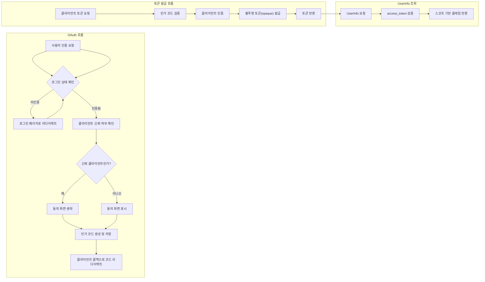

# OAuth 서버 전체 요구사항 분석 및 기능 정의

## 1. 서비스 개요 및 비즈니스 모델

본 서비스는 OAuth 2.0과 OpenID Connect Core 1.0 표준을 완벽히 준수하며, 네이버 수준의 간단한 연동 경험을 제공하는 OAuth 인증 서버를 구축하는 것이다. 개발자는 본 시스템을 통해 5분 이내에 OAuth 연동을 완료할 수 있으며, 단계별 기능 확장으로 보안과 편의성을 동시에 강화할 수 있다.

### 1.1 서비스 목표

- WHEN 개발자가 OAuth 연동을 시도할 때, THE 시스템 SHALL 5분 이내에 연동을 완료할 수 있도록 지원한다.
- THE 시스템 SHALL OAuth 2.0과 OpenID Connect Core 1.0 규격을 완전 준수한다.
- THE 시스템 SHALL 기본 기능부터 고급 보안 기능까지 단계적으로 확장 가능해야 한다.

### 1.2 비즈니스 모델

- OAuth 인증서버 부재로 인한 개발자의 연동 불편 해소를 위해 본 서비스를 제공한다.
-  외부 소셜 로그인과 자체 이메일/비밀번호 로그인을 통합하여 사용자 접근성을 최적화한다.
-  디지털 아이템 거래를 위한 포인트 및 쿠폰 시스템을 운영하여 수익화를 가능하게 한다.

### 1.3 사용자 역할

- Guest: 인증되지 않은 방문자, 로그인 및 가입 가능
- Member: 인증된 일반 사용자, 프로필 관리 및 리소스 접근 가능
- Admin: 전체 관리 권한 보유, 사용자와 클라이언트 관리
- Developer: OAuth 클라이언트 등록 및 API 사용 권한 보유

## 2. 주요 기능 요구사항

### 2.1 OAuth 인증 및 인가 플로우

- WHEN 클라이언트가 /oauth/authorize로 인가 요청 시,
  THE 시스템 SHALL 사용자의 로그인 상태를 확인하고 미인증 시 로그인 페이지로 리다이렉트해야 한다.
- THE 시스템 SHALL 신뢰된 클라이언트에 대해 동의 화면을 자동으로 처리한다.
- THE 시스템 SHALL 인가 코드를 발급하고 JSONB 컬럼을 활용해 관련 OAuth 정보를 저장한다.
- THE 시스템 SHALL access_token, id_token, refresh_token을 불투명 토큰(opaque token)으로 발급하며 UUID, CUID, ULID를 적절히 사용한다.

### 2.2 토큰 관리 및 캐싱

- THE 시스템 SHALL 토큰 정보를 데이터베이스에 기록하고 Redis 캐시를 통해 검증 성능을 최적화한다.
- THE 시스템 SHALL 토큰 만료, 폐기, 재발급 과정을 관리한다.

### 2.3 사용자 및 클라이언트 관리

- THE 시스템 SHALL 자체 이메일 로그인과 네이버, 다음, 애플, 구글 같은 소셜 로그인 통합을 지원한다.
- WHEN 소셜 로그인을 통한 가입 시 이메일이 기존 사용자와 동일하면 같은 계정으로 처리한다.
- THE 시스템 SHALL 프로필의 자주 변경하는 정보(닉네임, 프로필사진 등)를 별도 테이블로 관리한다.
- THE 시스템 SHALL 클라이언트 인증, 리다이렉트 URI, 스코프 등을 검증한다.

### 2.4 외부 OAuth 공급자 및 소셜 로그인

- THE 시스템 SHALL 네이버, 다음, 애플, 구글 등 주요 소셜 로그인 공급자 연동을 제공한다.
- THE 시스템 SHALL 개발자가 만든 자체 OAuth 서버를 외부 클라이언트로 등록하여 사용할 수 있게 한다.
- THE 시스템 SHALL 관리자 UI 나 환경변수를 통해 공급자별 클라이언트 ID와 시크릿을 관리할 수 있다.

### 2.5 프로필 및 게임 전적 연동

- THE 시스템 SHALL 사용자 프로필에 스팀 배틀그라운드, 카카오 배틀그라운드, 롤 플레이어명 등록 및 수정 기능을 제공한다.
- THE 시스템 SHALL 공식 API를 통해 시즌별 전적 데이터를 조회하며 Redis에 캐싱하여 성능을 최적화한다.

### 2.6 포인트 및 쿠폰 시스템

- THE 시스템 SHALL 아이콘 구매 등에 사용되는 포인트 잔액과 내역을 관리한다.
- THE 시스템 SHALL 쿠폰 코드를 통한 포인트 충전을 지원하며 쿠폰의 사용 이력과 유효성을 검증한다.

### 2.7 보안 및 감사

- THE 시스템 SHALL HTTPS 프로덕션 강제, PKCE, IP 및 클라이언트별 Rate Limiting 적용
- THE 시스템 SHALL 감사 로그를 통해 주요 이벤트를 기록하며 민감 정보 노출을 방지한다.

### 2.8 관리 및 운영

- THE 시스템 SHALL 클라이언트, 사용자, 토큰 관리 페이지 및 토큰 모니터링 기능을 제공한다.
- THE 시스템 SHALL 관리자 인증, 권한 관리, 감사 로그 조회 환경을 포함한다.

### 2.9 개발 환경 및 배포

- THE 시스템 SHALL Node.js 18+, PostgreSQL 13+, pnpm, Docker 지원
- THE 시스템 SHALL 환경변수 기반 설정과 관련 명령어를 지원한다.

### 2.10 개발자 도구 및 테스트

- THE 시스템 SHALL QUICK-START 가이드, API 테스터, SDK 자동생성 지원
- THE 시스템 SHALL Playwright 기반 프론트엔드 E2E 테스트 자동화 포함

## 3. 성공 기준

- WHEN 개발자가 OAuth 연동을 시도할 때, THE 시스템 SHALL 5분 이내에 정상 연동을 완료하게 한다.
- THE 시스템 SHALL OAuth 토큰 발급 응답을 100ms 미만으로 유지한다.
- THE 시스템 SHALL 100동시 요청 이상 처리 가능해야 한다.
- THE 시스템 SHALL 모든 에러 메시지는 한국어로 표시되고 문제 해결 안내를 포함한다.

---

## Mermaid 다이어그램

본 문서는 OAuth 서버 비즈니스 요구사항만을 정의하며, 모든 기술 구현 세부 사항은 개발자 재량에 맡긴다. 시스템에서 어떤 동작을 해야 하는지 명확히 기술하며, 어떻게 구현할지는 개발자가 결정한다.