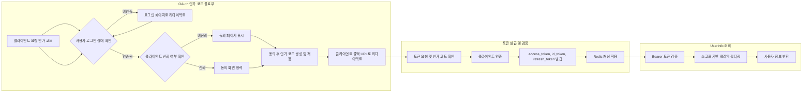

# OAuth 서버 전체 요구사항 분석 및 기능 정의

## 1. 서비스 비전 및 개요

OAuth 서버는 OAuth 2.0 및 OpenID Connect Core 1.0 표준을 완벽 준수하며, 개발자가 5분 내에 연동할 수 있는 네이버 수준의 간단함을 목표로 한다. 이를 위해 OAuth 2.0 Authorization Code Grant 플로우를 지원하고, 불투명 토큰 방식을 사용하여 보안성과 편의성을 동시에 확보한다.

## 2. 주요 사용자 및 역할

| 역할      | 설명                             | 권한 및 기능                               |
|-----------|--------------------------------|------------------------------------------|
| guest     | 비인증 사용자                   | 로그인, 회원가입, 오류 페이지 접근 가능   |
| member    | 인증된 사용자                   | 프로필 관리, OAuth 토큰 요청 및 갱신 가능 |
| admin     | 시스템 관리자                   | 사용자 및 클라이언트 관리, 감사 로그 조회  |
| developer | API 클라이언트 등록 및 관리     | 클라이언트 CRUD, SDK 관리                 |

## 3. 핵심 기능 요구사항

### 3.1 OAuth 인증 및 인가 플로우

- WHEN 사용자가 /oauth/authorize 엔드포인트에 접근하면 THE system SHALL 로그인 상태를 확인하여 미인증 시 로그인 페이지로 리다이렉트 한다.
- IF 클라이언트가 신뢰 클라이언트이면 THEN THE system SHALL 자동 동의 처리하여 동의 화면을 생략한다.
- WHEN 사용자가 동의를 하면 THE system SHALL 인가 코드를 생성 및 SimpleAuthCode 테이블에 JSONB 형태로 저장한다.
- WHEN 클라이언트가 /oauth/token에 토큰 요청 시 THE system SHALL 인가 코드와 클라이언트 인증을 검증 후 opaque access token, id_token, refresh token을 발급한다.

### 3.2 사용자 관리

- THE system SHALL 자체 이메일 및 비밀번호 로그인 지원과 소셜 로그인 (네이버, 다음, 애플, 구글)을 지원한다.
- WHEN 소셜 로그인 시 THE system SHALL 이메일이 동일한 경우 기존 사용자와 계정을 통합한다.
- THE system SHALL 프로필에 닉네임, 프로필사진, 스팀 배틀그라운드, 카카오 배틀그라운드, 롤 플레이어명을 등록하고 관리 가능하다.
- 빈번히 변경되는 프로필 정보는 별도 프로필 테이블로 분리하여 관리한다.

### 3.3 클라이언트 관리

- THE system SHALL 클라이언트 정보를 등록, 수정, 삭제할 수 있으며 soft delete 처리를 위해 deletedAt 컬럼을 가진다.
- THE system SHALL 리다이렉트 URI와 스코프를 검증한다.
- THE system SHALL 로고 URL과 신뢰 여부(is_trusted) 정보를 포함한다.

### 3.4 토큰 및 캐시 관리

- THE system SHALL Access token과 Refresh token은 불투명 토큰으로 발급하며 UUID, CUID, ULID 방식 중 적절한 것을 사용한다.
- THE system SHALL Redis를 이용한 캐싱 솔루션을 도입하여 토큰 검증, 사용자 정보, 클라이언트 정보, 게임 전적 API 결과 등을 캐싱하여 성능을 최적화한다.

### 3.5 포인트 및 쿠폰 시스템

- THE system SHALL 사용자별 포인트 잔액 및 사용 내역을 관리한다.
- THE system SHALL 쿠폰 시스템을 통해 사용자에게 포인트 지급이 가능하도록 지원하며 쿠폰 코드 등록, 검증 및 사용 이력을 관리한다.

### 3.6 외부 OAuth 연동 및 공급자 역할

- THE system SHALL 네이버, 다음, 애플, 구글 소셜 로그인을 지원한다.
- THE system SHALL 외부 서비스가 자기 서버를 OAuth 공급자로 등록하고 이용할 수 있도록 한다.
- THE system SHALL 관리자를 위해 각 공급자별 client_id, client_secret 관리 UI를 제공한다.

### 3.7 전적 검색 기능

- THE system SHALL 사용자 프로필에 스팀 배틀그라운드, 카카오 배틀그라운드, 롤 플레이어명을 등록한다.
- THE system SHALL 공식 API를 통해 시즌별 배틀그라운드, 롤 전적 데이터를 조회한다.
- THE system SHALL 전적 데이터 역시 Redis 캐싱 전략을 적용한다.

### 3.8 보안 및 감사

- THE system SHALL HTTPS 프로토콜 강제를 적용하며 production 환경에서 필수이다.
- THE system SHALL IP 및 클라이언트 단위 기본 Rate Limiting 정책을 적용한다.
- THE system SHALL PKCE(S256) 방식을 지원한다.
- THE system SHALL state 파라미터 검증을 수행한다.
- THE system SHALL 주요 인증 및 인가 이벤트에 대해 감사 로그를 기록한다.
- THE system SHALL 민감 정보를 로그에 저장하지 않는다.

### 3.9 운영 및 관리

- THE system SHALL 관리자용 클라이언트 및 사용자 관리 페이지를 제공한다.
- THE system SHALL 토큰 모니터링 및 최근 로그인 현황 확인 기능을 포함한다.

### 3.10 개발자 지원 도구 및 문서

- THE system SHALL QUICK-START 가이드와 API 테스트 도구, SDK 자동 생성을 제공한다.
- THE system SHALL Playwright 기반 프론트엔드 E2E 테스트를 지원한다.

## 4. 비즈니스 프로세스 및 워크플로우

